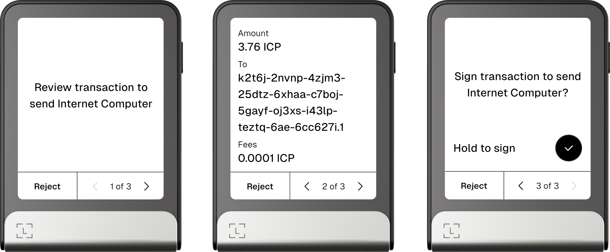

# ICRC-21: Canister Call Consent Message Examples

This folder contains various consent message examples for ICRC standards. These examples can be used as reference in
an ICRC-21 implementation. This document and the examples will be updated over time with best practices.

## Authenticated vs Anonymous

In most cases the ICRC-21 consent message request is made with the same caller that the request will be made with after
approval. But in some cases, particularly the cold signer flow, the ICRC-21 consent message request will be made
anonymously since the cold signer is not able to call the canister itself directly.

## Generic Display

This device spec renders Markdown messages, the example Markdown files available in this repo follow the below
guidelines.

#### Title

Always define a title `#`, but keep it a short intent (= action + subject) e.g. `Send Internet Computer`.

#### Explanation

After the title, use a paragraph to explain the request in more detail.

#### Sections

Avoid creating sections with headers, this keeps it as a short single readable message.

#### Values

Label values with `**label:**`. Add additional explanations where needed for each value and use a line break over an
empty lines (two spaces at the end of
the line).

#### Account address

Always
use [ICRC-1 textual encoding of accounts](https://internetcomputer.org/docs/current/references/icrc1-standard#textual-encoding-of-accounts)
if possible. Avoid separately mentioning the subaccount, instead use
the [non-default account](https://internetcomputer.org/docs/current/references/icrc1-standard#non-default-accounts)
syntax.

Wrap account addresses in `` `code` `` tags.

#### Token amounts

Show amounts with decimals followed by token symbol. Truncate trailing zeros e.g. `32.716 ICP` and wrap in `` `code` ``
tags

#### Date and time

As defined in
the [ICRC-21 spec](https://github.com/dfinity/wg-identity-authentication/blob/main/topics/ICRC-21/ICRC-21.did#L8),
render date and/or time in human-readable format based on received BCP-47 language, fallback to UTC if offset is not
defined.

#### Memo

Attempt to decode the memo as UFT-8 string else fallback to a hex string. Always wrap in `` `code` ``
tags.

## Fields Display

This device spec renders messages with fields, the example JSON files available in this repo follow the below
guidelines and inherits from the Generic Display guidelines.

_Example ICRC-1 transfer on a Ledger Flex thats renders from Fields Display spec_

#### Intent

Same as title in Generic Display, keep it a short intent (= action + subject) e.g. `Send Internet Computer`.
This intent might be used within a given context e.g. `Review transaction to Send Internet Computer` and
`Sign transaction to Send Internet Computer`.

#### Values

Since this device spec renders a list of fields with values, it's recommended to avoid explanations where possible and
rely on clear field naming and ordering instead. If an explanation is really necessary, always use a separate field for
this explanation.

## Using examples

Example templates are structured in the `en_US/method/type` folders. The files are named either `default` (all fields
have a value and/or are available) or `no_field1_field2_etc` (one or multiple fields have no value and/or are
unavailable).

If the `authenticated` type folder is missing, the files from the `anonymous` folder should be used for both anonymous
and authenticated consent message calls.

Both the Markdown and JSON files can be read as UTF-8 string and ``{{variable}}`` can be replaced with
actual values. The variable names within each method are consistent across Markdown and JSON files.

Some variables can be filled with the arguments from the request itself while other variables need to be read from the
canister state.