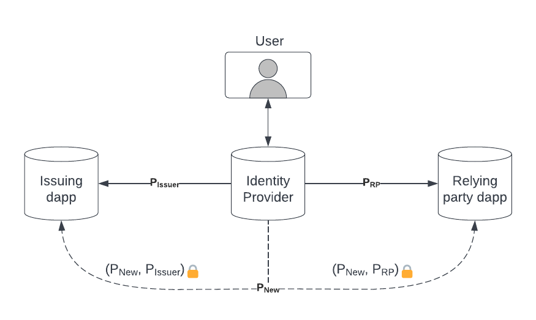
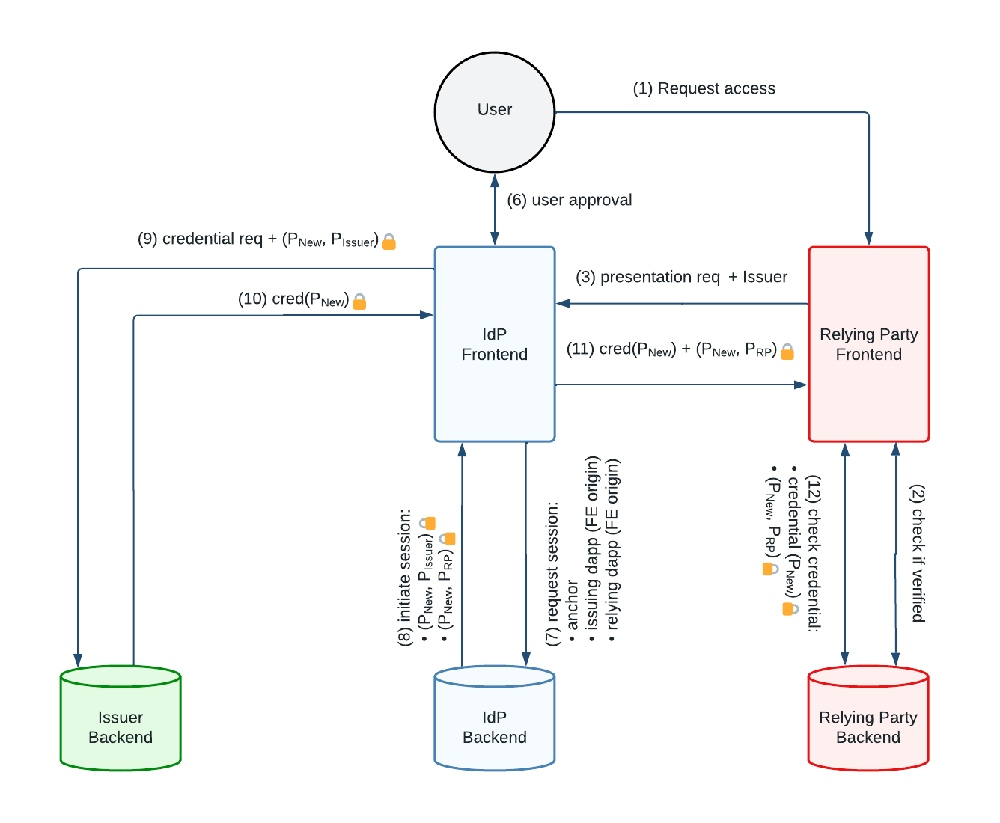

# Attribute Support on the Internet Computer

## Problem description

For identity providers such as the Internet Identity, the principal under which a user is known to a dapp is not only unique to that dapp but its value is also unpredictable. While this separation provides several security and privacy benefits, it makes it hard for dapps to share information about their users with one another, such as user attributes, since the same user will be known under a different identity for each dapp, as indicated in the figure below. Hence, the goal of this project is to provide means for third-party dapps (relying parties) to handle attributes issued by other dapps (issuers) in a privacy preserving manner.  

## Design options

In order to solve this problem, there are a few parameters that need to be specified in the architecture.
* Who can issue credentials
   - **Trusted identity providers**: In some architectures such as Concordium's blockchain [[Concordium][Concordium]], trusted identity providers are responsible for issuing and managing attributes to users.
  - **Any entity or user**: In other cases, such as in the W3C's verifiable credential standard [[VC-DATA-MODEL][VC]], any entity is allowed to be an issuer. In this case, it is up to relying party dapps to decide which issuers they are willing to trust during the verification process.
* Who decides which issuers to trust
  - **Off-chain**: In some architectures, such as Concordium's blockchain [[Concordium][Concordium]], there is a particular entity such as the Foundation who is responsible for managing the registration of identity providers
  - **RP - relying party**: In the W3C's verifiable credential standard [[VC-DATA-MODEL][VC]], the relying party is the one that decides which issuers can be trusted.
  - **NNS / SNS**: Another possibility is for Decentralized Autonomous Organizations (DAOs), such as the NNS or an SNS, to decide which issuers to trust.
* Who pays for the service
  - **Self-sovereign identity**: In this setting, the owner of identity would be responsible for paying for the service being provided by the issuer. This option potentially provides better privacy since the issuer in principle would not be aware of which relying party is verifying the user attributes.
  - **Relying party - RP**: In this setting, the relying party in charge of verifying a user's attribute would be responsible for paying for the service being provided by the issuer. This option is hard to implement securely because the identity provider needs to guarantee that the relying party gets charged correctly by the issuer without compromising the unlinkability among the principals in the RP and issuer dapps.
* Who defines the semantics for attributes 
  - **Application**: In this setting, the specification of attributes would be done at the application level and independently of the identity provider, which would only help pass this information between the RP and issuer dapps.
  - **Identity provider**: In this case, the semantics of attributes would be defined by the identity provider and applications would have to adhere to it.
* Who specifies the policy
  - **Each dapp**: this is the most general setting and would allow different dapps to specify their own policies.
  - **Replica / subnet**: this option is more restrictive but possibly simpler to implement.  
* How to handle revocation of credentials
  - **Query-based revocation**: In this setting, RP dapps need to query the issuer dapp to check the status of a credential. If this query relies solely on the principal id at the issuer dapp, then this query would need support from the identity provider.  Although query-based revocation provides up-to-date status information, it can potentially leak the user access pattern to the issuer. 
  - **Whitelist-based revocation**: In this setting, the issuer would maintain a public list with the current set of valid credentials. If the credential is associated with the principal at the issuer dapp, the RP dapp would need help from the identity provider to check this information. This solution has the disadvantage of unnecessarily leaking the list of valid credentials. 
  - **Blacklist-based revocation**: In this setting, the issuer would maintain a public list with the current set of revoked credentials. As for whitelists, the RP dapp would need help from the identity provider to check this information if credentials are associated with principals at the issuer dapp.
* Handling credentials from multiple issuers
  - Certain RP dapps may require the verification of credentials issued by multiple dapps and we need to consider how these credentials can be safely combined to provide a verifiable presentation which does not break the unlikability of principals.

## Design choices

Given the different options listed above, we propose the following design choices which are more consistent with the decentralized philosophy of the Internet Computer:
* Allow **any entity** to issue credentials
* Let **relying party dapps** decide which issuers to trust
* Let **applications** define the semantics for attributes
* Support for revocation lists and the handling of multiple credentials
* Support for both **self-sovereign identities** and **relying parties** to pay for the service 

In order to meet these requirements, we propose to first provide a solution focused on self-sovereign identities without any payment support and then to add payment support at a second step so that relying parties can pay for the issuance of credentials.

## Proposed solution: Intuition

In order to provide attribute support in a privacy-preserving manner, our proposed solution is for the identity provider to securely link user principals without revealing both principals to issuers and relying parties, so that attributes can be mapped from one principal to another, as indicated in the figure below. 

Let P<sub>Issuer</sub> and P<sub>RP</sub> be the identities under which a user is known to the issuing and relying party dapp canisters. In order to securely link these principals, our proposal is to let the identity provider create a joint identifier P<sub>New</sub> to be shared between these dapps and to provide separate signatures securely linking P<sub>New</sub> to P<sub>Issuer</sub> and P<sub>RP</sub> respectively. 

In order to preserve user privacy, the value of P<sub>New</sub> needs to be unpredictable. One way of achieving this is to choose a random new value for every session in which the relying party dapp needs to obtain attributes from an issuing dapp. However, for simplicity and efficiency reasons, we recommend to set the value of P<sub>New</sub> as a deterministic pseudorandom function [[PRF][PRF]] of the user anchors and the frontend origins at the issuing and relying party dapps.

## Proposal focused on self-sovereign identities

**NOTE:** *The flow described below is slightly outdated, an update is coming soon (in particular, after some simplifications, there is no need for an Issuer Frontend anymore).*

Following the intuition above, we now propose a specific flow focused on self-sovereign identities, which does __not__ provide payment support. 

This proposal has the following features:
* It provides user privacy via the establishment of a new joint identifier computed as a function of the issuer and the relying party frontend origins and the identities under which the user is known to these dapps. This is represented by steps (7) and (8).
* It allows relying parties and identity providers to agree on the user attributes that need to be included in the user credential via a presentation exchange. This protocol exchange can be based on the Presentation Exchange Specification [[DIF-Presentation-Exchange][DIF-PE]] by the Decentralized Identity Foundation (DIF). This is represented by steps (3) and (12).
* It allows issuers to specify the inputs that are required from a subject to process a request for credential issuance via the use of credential manifests [[DIF-Credential-Manifests][DIF-CM]]. This is represented by steps (4) and (5).
* Identity providers can use the credential manifest information to submit the credential application for the user. This is represented by step (11).
* If the issuer accepted the credential application by the user, it issues a credential using the new joint identifier for the user, as indicated in step (14).  The credential format can be based on the verifiable credentials data model [[VC-DATA-MODEL][VC]].
* It allows users to use different anchors with respect to the issuer and relying party dapps, as indicated in step (7).


## MVP as the first step towards the full support of attribute sharing.

In order to demonstrate how credentials can be supported in the IC, we're
working first on an MVP-version (Minimum Viable Product) of attribute sharing.  
Specifically, the MVP will reduce/postpone some requirements:  
* No billing support
* No system support for verifying credentials – a Rust library instead. 
* No manifest request/response, issuer credential types already known to Relying Party and Identity Provider



The basic setup for the MVP is as follows
* **Issuer**: Dummy backend providing two possible attributes for a given principal
* **Relying Party**: Dummy frontend and backend to request and verify credentials with a single attribute in it
* **Identity Provider**: frontend and backend support for bridging credentials

The development of the MVP happens in [vc-mvp](https://github.com/dfinity/internet-identity/tree/vc-mvp)-branch, which
is periodically synced with the main branch (to avoid significant discrepancies).

## Flow description

1. Sign up / login
   * User logins with the relying party (RP) or creates an account 
   * RP frontend checks whether user attributes have been verified
   * Generate key pair (RP<sub>SK</sub>,RP<sub>PK</sub>)
2. RP frontend opens the Identity Provider (IdP) frontend on a separate window, sending:
   * Presentation request (see [[DIF-Presentation-Exchange][DIF-PE]])
   * RP<sub>PK</sub>
   * Issuing dapp 
   * RP dapp
3. IdP frontend requests credential manifest from the issuer backend
   * Data format can be based on DIF's credential manifest [[DIF-Credential-Manifests][DIF-CM]]
   * This step may not be needed if the IdP has previously obtained the manifest. 
4. Issuer backend replies with the credential manifest
   * This step may not be needed if the IdP has previously obtained the manifest.
5. User logins with anchor<sub>RP</sub> and anchor<sub>Issuer</sub>
6. User is presented with an authorization request based on the presentation request from the RP and the credential manifest from the issuer  
   * User authorizes delegations to IdP<sub>1</sub> (anchor<sub>RP</sub>) and IdP<sub>2</sub> (anchor<sub>Issuer</sub>)
7. IdP frontend requests from backend a session to generate a credential, including 
   * anchor<sub>RP</sub> 
   * anchor<sub>Issuer</sub>
   * Issuing dapp frontend origin 
   * RP dapp frontend origin
8. IdP backend returns the following to the IdP frontend:
   * A signed pair (P<sub>New</sub>, P<sub>Issuer</sub>)<sub>🔒</sub>
   * A signed pair (P<sub>New</sub>, P<sub>RP</sub>)<sub>🔒</sub>
   * P<sub>New</sub> = PRF<sub>seed</sub>(anchor<sub>RP</sub>,anchor<sub>Issuer</sub>,RP<sub>orig</sub>,IS<sub>orig</sub>)
   * where PRF<sub>seed</sub> is a pseudorandom function [[PRF][PRF]] with secret key __seed__ 
9. IdP frontend opens the issuer frontend on a separate window, requesting session key
10. Issuer frontend generates session key and sends it to the IdP frontend
    * Generate key pair (IS<sub>SK</sub>,IS<sub>PK</sub>)
    * Send (IS<sub>PK</sub> + request reference)
11. IdP frontend requests credential for P<sub>Issuer</sub> under P<sub>New</sub>, including 
    * Credential application [[DIF-Credential-Manifests][DIF-CM]]
    * A signed pair (P<sub>New</sub>, P<sub>Issuer</sub>)<sub>🔒</sub>
    * IdP<sub>2</sub> delegation to P<sub>Issuer</sub> 
    * Request reference
12. Issuer frontend contacts its backend to verify attributes and request the credential 
    * This may require interaction with the user to verify the user's attributes
    * The frontend sends both  P<sub>Issuer</sub> and P<sub>New</sub> to the backend 
    * If the user passes the verification, the backend issues a credential for P<sub>New</sub> 
13. Issuer backend returns a signed credential for P<sub>New</sub>
14. Issuer frontend sends credential to the IdP frontend, including:
     * Credential for P<sub>New</sub> 
     * Request reference
15. IdP frontend forwards the credential to the RP frontend, including:
     * A signed pair (P<sub>New</sub>, P<sub>RP</sub>)<sub>🔒</sub>
     * IdP<sub>1</sub> delegation to P<sub>RP</sub> 
     * Credential for P<sub>New</sub>
16. RP frontend interacts with its backend to update the user status

## Message flow details

In this section, , we give examples of the following flows used in the proposal for attribute support:
* Presentation request
* Credential manifest request
* Credential manifest
* Credential application
* Credential response
* Presentation submission

These flows will take place between relying parties, the identity provider, and issuers. While the relying party will act as a verifier for the presentation, issuers will be responsible for generating the actual credentials that will be included in the presentation.


Credential manifests are also used during the interaction between the identity provider and the issuer to specify the inputs that a user must provide for the evaluation and issuance of a credential. This includes, for instance, the different attributes and algorithms supported by the issuer and the issuance requirements.

In the following, we describe these flows in more detail, using the examples and definitions given in the DIF presentation exchange [[DIF Presentation Exchange][DIF-PE]] and credential manifest [[DIF Credential Manifest][DIF-CM]] specifications.

### Presentation request

The main content of a presentation request is a presentation definition, which indicates what proofs a verifier requires.

Presentation definitions can have three fields [[DIF Presentation Exchange][DIF-PE]]:
* `id` (<u>mandatory</u>): MUST be a string, which SHOULD provide a unique ID for the desired context.
* `input_descriptors` (<u>mandatory</u>): MUST be an array of Input Descriptor Objects.
* `format` (<u>optional</u>): MUST be an object with one or more properties matching the registered Claim Format Designations (e.g., `jwt`, `jwt_vc`, `jwt_vp`, etc.). This object MUST include a format-specific property (i.e., `alg`, `proof_type`) that expresses which algorithms the Verifier supports for the format.

Example based on the [DIF Presentation Exchange][DIF-PE] specification:

```json
{
  // NOTE: VP, OIDC, DIDComm, or CHAPI outer wrapper properties would be here.
  "presentation_definition": {
    "id": "32f54163-7166-48f1-93d8-ff217bdb0653",
    "input_descriptors": [
      {
        "id": "wa_driver_license",
        "name": "Washington State Business License",
        "purpose": "We can only allow licensed Washington State business representatives into the WA Business Conference",
        "constraints": {
          "fields": [
            {
              "path": [
                "$.credentialSubject.dateOfBirth",
                "$.credentialSubject.dob",
                "$.vc.credentialSubject.dateOfBirth",
                "$.vc.credentialSubject.dob"
              ]
            }
          ]
        }
      }
    ]
    "format": {
      "jwt": {
        "alg": ["EdDSA", "ES256K", "ES384"]
      },
      "jwt_vc": {
        "alg": ["ES256K", "ES384"]
      },
      "jwt_vp": {
        "alg": ["EdDSA", "ES256K"]
      },
      "ldp_vc": {
        "proof_type": [
          "JsonWebSignature2020",
          "Ed25519Signature2018",
          "EcdsaSecp256k1Signature2019",
          "RsaSignature2018"
        ]
      },
      "ldp_vp": {
        "proof_type": ["Ed25519Signature2018"]
      },
      "ldp": {
        "proof_type": ["RsaSignature2018"]
      }
    }
  }
}
```

### Presentation submission

According to the DIF Presentation Exchange specification [DIF Presentation Exchange], Presentation Submissions are used to express how the inputs presented as proofs to a Verifier are provided in accordance with the requirements specified in a Presentation Definition.

Embedded Presentation Submission objects MUST be located within a target data format as the value of a `presentation_submission` property. The current specification lists four possible Embed targets: Verifiable Presentation [[VC-DATA-MODEL][VC]], Open ID Connect [[OIDC][OIDC]], CHAPI [[CHAPI][CHAPI]] and DIDcomm [[DIDComm][DIDComm]]. These are data formats used in messaging protocols that may be used to transport a Presentation Submission.

In the case of Verifiable Presentation [[VC-DATA-MODEL][VC]] and Open ID Connect [[OIDC][OIDC]], the `presentation_submission` object MUST be included at the top-level of the Embed Target.

The presentation_submission object MUST have the following fields [[DIF Presentation Exchange][DIF-PE]]:
* `id` (<u>mandatory</u>): MUST be a unique identifier, such as a UUID.
* `definition_id` (<u>mandatory</u>): MUST be the id value of a valid Presentation Definition.
* `descriptor_map` (<u>mandatory</u>): MUST be an array of Input Descriptor Mapping Objects, composed as follows:
   * `id`: MUST be a string that matches the id property of the Input Descriptor in the Presentation Definition to which this Presentation Submission is related.
   * `format`: denotes the data format of the Claim; MUST be a string that matches one of the Claim Format Designation (e.g., `jwt`, `jwt_vc`, `jwt_vp`, etc.).
   * `path`: MUST be a JSONPath string expression, indicating the Claim submitted in relation to the identified Input Descriptor.

[Example](https://identity.foundation/presentation-exchange/#basic-presentation-submission-object-2) without the outer wrapper properties of the Embed Target [[DIF Presentation Exchange][DIF-PE]]:

```json
{
  // NOTE: VP, OIDC, DIDComm, or CHAPI outer wrapper properties would be here.

  "presentation_submission": {
    "id": "a30e3b91-fb77-4d22-95fa-871689c322e2",
    "definition_id": "32f54163-7166-48f1-93d8-ff217bdb0653",
    "descriptor_map": [
      {
        "id": "banking_input_2",
        "format": "jwt_vc",
        "path": "$.verifiableCredential[0]"
      },
      {
        "id": "employment_input",
        "format": "ldp_vc",
        "path": "$.verifiableCredential[1]"
      },
      {
        "id": "citizenship_input_1",
        "format": "ldp_vc",
        "path": "$.verifiableCredential[2]"
      }
    ]
  }
}
```

[Example](https://identity.foundation/presentation-exchange/#presentation-submission---verifiable-presentation-2) using verifiable presentations [[VC-DATA-MODEL][VC]]:

```json
{
  "@context": [
    "https://www.w3.org/2018/credentials/v1",
    "https://identity.foundation/presentation-exchange/submission/v1"
  ],
  "type": [
    "VerifiablePresentation",
    "PresentationSubmission"
  ],
  "presentation_submission": {
    "id": "a30e3b91-fb77-4d22-95fa-871689c322e2",
    "definition_id": "32f54163-7166-48f1-93d8-ff217bdb0653",
    "descriptor_map": [
      {
        "id": "banking_input_2",
        "format": "jwt_vc",
        "path": "$.verifiableCredential[0]"
      },
      {
        "id": "employment_input",
        "format": "ldp_vc",
        "path": "$.verifiableCredential[1]"
      },
      {
        "id": "citizenship_input_1",
        "format": "ldp_vc",
        "path": "$.verifiableCredential[2]"
      }
    ]
  },
  "verifiableCredential": [
    {
      "comment": "IN REALWORLD VPs, THIS WILL BE A BIG UGLY OBJECT INSTEAD OF THE DECODED JWT PAYLOAD THAT FOLLOWS",
      "vc": {
        "@context": "https://www.w3.org/2018/credentials/v1",
        "id": "https://eu.com/claims/DriversLicense",
        "type": ["EUDriversLicense"],
        "issuer": "did:example:123",
        "issuanceDate": "2010-01-01T19:73:24Z",
        "credentialSubject": {
          "id": "did:example:ebfeb1f712ebc6f1c276e12ec21",
          "accounts": [
            {
              "id": "1234567890",
              "route": "DE-9876543210"
            },
            {
              "id": "2457913570",
              "route": "DE-0753197542"
            }
          ]
        }
      }
    },
    {
      "@context": "https://www.w3.org/2018/credentials/v1",
      "id": "https://business-standards.org/schemas/employment-history.json",
      "type": ["VerifiableCredential", "GenericEmploymentCredential"],
      "issuer": "did:foo:123",
      "issuanceDate": "2010-01-01T19:73:24Z",
      "credentialSubject": {
        "id": "did:example:ebfeb1f712ebc6f1c276e12ec21",
        "active": true
      },
      "proof": {
        "type": "EcdsaSecp256k1VerificationKey2019",
        "created": "2017-06-18T21:19:10Z",
        "proofPurpose": "assertionMethod",
        "verificationMethod": "https://example.edu/issuers/keys/1",
        "jws": "..."
      }
    },
    {
      "@context": "https://www.w3.org/2018/credentials/v1",
      "id": "https://eu.com/claims/DriversLicense",
      "type": ["EUDriversLicense"],
      "issuer": "did:foo:123",
      "issuanceDate": "2010-01-01T19:73:24Z",
      "credentialSubject": {
        "id": "did:example:ebfeb1f712ebc6f1c276e12ec21",
        "license": {
          "number": "34DGE352",
          "dob": "07/13/80"
        }
      },
      "proof": {
        "type": "RsaSignature2018",
        "created": "2017-06-18T21:19:10Z",
        "proofPurpose": "assertionMethod",
        "verificationMethod": "https://example.edu/issuers/keys/1",
        "jws": "..."
      }
    }
  ],
  "proof": {
    "type": "RsaSignature2018",
    "created": "2018-09-14T21:19:10Z",
    "proofPurpose": "authentication",
    "verificationMethod": "did:example:ebfeb1f712ebc6f1c276e12ec21#keys-1",
    "challenge": "1f44d55f-f161-4938-a659-f8026467f126",
    "domain": "4jt78h47fh47",
    "jws": "..."
  }
}
```

### Credential manifest request

This is just a protocol message to request a credential manifest from an issuer. There is no specific format requirement.

### Credential manifest

As stated above, Credential Manifests are a common data format for describing the inputs a Subject must provide to an Issuer for subsequent evaluation and issuance of a credential.

According to the specification [[DIF Credential Manifest][DIF-CM]], Credential Manifests are JSON objects composed as follows:
* `id` (<u>mandatory</u>): MUST be a string. The string SHOULD provide a unique ID for the desired context.
* `name` (<u>optional</u>):  MUST be a string that acts as a summarizing title for the Manifest in question.
* `description` (<u>optional</u>): MUST be a string that explains what the Manifest in question is generally offering in exchange for meeting its requirements.
* `issuer` (<u>mandatory</u>): MUST be an object composed as follows:
    * `id` (<u>mandatory</u>): MUST be a valid URI string that identifies the issuer.
    * `name` (<u>optional</u>):  MUST be a string that SHOULD reflect the human-readable name the Issuer wishes to be recognized by.
    * `styles` (<u>optional</u>): MUST be an object or URI, as defined by the DIF Entity Styles specification.
* `output_descriptors` (<u>mandatory</u>): MUST be an array of Output Descriptor Objects. They are used to describe the Claims an Issuer is offering to a Holder.
* `format` (<u>optional</u>): MUST be the same structure as Presentation Definition’s format property. This property informs the Holder of the Claim format the Issuer can issue in.
* `presentation_definition` (<u>optional</u>): MUST be a Presentation Definition object, as defined by the Presentation Exchange specification. 

> `presentation_definition` is intended to be used in the case where the issuer requires a different credential from the user in order to issue a credential.

[Example](https://identity.foundation/credential-manifest/#credential-manifest-format) of a credential manifest:

```json
{
  "credential_manifest": {
    "id": "WA-DL-CLASS-A",
    "name": "Washington State Class A Driver's License Application",
    "description": "This application is for the Washington State Class A Driver's License, which requires an applicant to be of at least 18 years of age and provide proof of CDL training completion.",
    "output_descriptors": [],
    "spec_version": "https://identity.foundation/credential-manifest/spec/v1.0.0/",
    "issuer": {
      "id": "did:example:123?linked-domains=3",
      "name": "Washington State Government",
      "styles": {
        "thumbnail": {
          "uri": "https://dol.wa.com/logo.png",
          "alt": "Washington State Seal"
        },
        "hero": {
          "uri": "https://dol.wa.com/people-working.png",
          "alt": "People working on serious things"
        },
        "background": {
          "color": "#ff0000"
        },
        "text": {
          "color": "#d4d400"
        }
      }
    },
    "format": {
      "jwt": {
        "alg": ["EdDSA", "ES256K", "ES384"]
      },
      "jwt_vc": {
        "alg": ["ES256K", "ES384"]
      },
      "jwt_vp": {
        "alg": ["EdDSA", "ES256K"]
      },
      "ldp_vc": {
        "proof_type": [
          "JsonWebSignature2020",
          "Ed25519Signature2018",
          "EcdsaSecp256k1Signature2019",
          "RsaSignature2018"
        ]
      },
      "ldp_vp": {
        "proof_type": ["Ed25519Signature2018"]
      },
      "ldp": {
        "proof_type": ["RsaSignature2018"]
      }
    }
  }
}
```

### Credential application

According to the specification [[DIF Credential Manifest][DIF-CM]], Credential Applications are objects embedded within target claim negotiation formats that pass information from the Holder to the Issuer.

Credential Applications are composed as follows:
* `id` (mandatory): MUST be a unique identifier, such as a UUID.
* `spec_version` (mandatory): MUST be a valid spec URI according to the rules set in the versioning section.
* `manifest_id` (mandatory): MUST be the id of a valid Credential Manifest.
* `format` (mandatory IF the related Credential Manifest specifies a `format` property): MUST be a subset of the format property in the Credential Manifest to which is related. This object informs the Issuer which formats the Holder wants to receive the Claims in.
* `presentation_submission` (mandatory IF the related Credential Manifest contains a `presentation_definition`): MUST be a valid Presentation Submission as defined in the Presentation Exchange specification.

[Example](https://identity.foundation/credential-manifest/#credential-application---simple-example):
```json
{
  "id": "9b1deb4d-3b7d-4bad-9bdd-2b0d7b3dcb6d",
  "spec_version": "https://identity.foundation/credential-manifest/spec/v1.0.0/",
  "manifest_id": "WA-DL-CLASS-A",
  "format": {
    "ldp_vc": {
      "proof_type": [
        "JsonWebSignature2020",
        "EcdsaSecp256k1Signature2019"
      ]
    }
  },
  "presentation_submission": {
    "id": "a30e3b91-fb77-4d22-95fa-871689c322e2",
    "definition_id": "32f54163-7166-48f1-93d8-ff217bdb0653",
    "descriptor_map": [
      {
        "id": "input_1",
        "format": "jwt_vc",
        "path": "$.verifiableCredential[0]"
      },
      {
        "id": "input_2",
        "format": "ldp_vc",
        "path": "$.verifiableCredential[1]"
      },
      {
        "id": "input_3",
        "format": "ldp_vc",
        "path": "$.verifiableCredential[2]"
      }
    ]
  }
}
```

### Credential response

Credential Responses encapsulate possible responses from a Credential Application, with two possible outcomes: fulfillment or denial. The outcome depends on whether a Credential Application is accepted or not.

As per the specification [[DIF Credential Manifest][DIF-CM]], Embedded Credential Response objects MUST be located within target data format as the value of a `credential_response` property.

As for credential applications, the `credential_response` property MUST be included at the top-level of an Embed Target in the case of verifiable presentations [[VC-DATA-MODEL][VC]] and OpenID Connect [[OIDC][OIDC]]. This property is composed as follows:

* `id` (<u>mandatory</u>): MUST be a unique identifier, such as a UUID.
* `spec_version` (<u>mandatory</u>): MUST be a valid spec URI according to the rules set in the versioning section.
* `manifest_id` (<u>mandatory</u>): MUST be the `id` value of a valid Credential Manifest.
* `application_id` (optional): If present, MUST be the `id` value of a valid Credential Application.
* `fulfillment` or `denial` (one of them MUST be present):
    * `fulfillment`: is composed as follows:
      * `descriptor_map` (<u>mandatory</u>): MUST be an array of Output Descriptor Mapping Objects.
    * `denial`: is composed as follows:
       * `reason` (<u>mandatory</u>): MUST be a string which states why the Credential Application was not successful
       * `input_descriptors` (<u>mandatory</u> IF the related Credential Application contains a `presentation_submission`): MUST be an array of `input_descriptor` string identifiers from the `descriptor_map` property of a Presentation Submission 

[Fulfillment example](https://identity.foundation/credential-manifest/#credential-response---fulfillment-example):
```json
{
  "id": "a30e3b91-fb77-4d22-95fa-871689c322e2",
  "spec_version": "https://identity.foundation/credential-manifest/spec/v1.0.0/",
  "manifest_id": "32f54163-7166-48f1-93d8-ff217bdb0653",
  "application_id": "b6385066-147c-49d0-9783-261a2154b1fd",
  "fulfillment": {
    "descriptor_map": [
      {
        "id": "banking_output_2",
        "format": "jwt_vc",
        "path": "$.verifiableCredential[0]"
      },
      {
        "id": "employment_output",
        "format": "ldp_vc",
        "path": "$.verifiableCredential[1]"
      },
      {
        "id": "citizenship_output_1",
        "format": "ldp_vc",
        "path": "$.verifiableCredential[2]"
      }
    ]
  }
}
```

## Proposal with payment support 
To be done at a later time.

## References

[[Concordium][Concordium]]
The Cordordium blockchain.
URL: https://concordium.com/

[[CHAPI][CHAPI]] W3C Credential Handler API 1.0 (https://w3c-ccg.github.io/credential-handler-api/). Dave Longley, Manu Sporny. 2021-6-23.  Status: Draft Community Group Report.

[[DIDComm][DIDComm]] DIF DIDComm Messaging (https://identity.foundation/didcomm-messaging/spec/v2.0/). Sam Curren, Tobias Looker, Oliver Terbu. Status: DIF-Ratified Specification.

[[OIDC][OIDC]] Open ID Connect (https://openid.net/specs/openid-connect-core-1_0.html). Jones, M., Bradley, J., and N. Sakimura. Status: Approved Specification.

[[DIF Credential Manifest][DIF-CM]] DIF Credential Manifests 0.0.1.
Daniel Buchner, Brent Zundel, Jace Hensley, Daniel McGrogan, Gabe Cohen. URL: https://identity.foundation/credential-manifest/  Status: Strawman

[[DIF Presentation Exchange][DIF-PE]]
Presentation Exchange 2.0.0.
Daniel Buchner, Brent Zundel, Martin Riedel, Kim Hamilton Duffy.
URL: https://identity.foundation/presentation-exchange/spec/v2.0.0/
Status: DIF Ratified Specification

[[PRF][PRF]]
Oded Goldreich, Shafi Goldwasser, Silvio Micali:
"How to Construct Random Functions". 
Journal of the ACM. 33 (4): 792–807. 
doi:10.1145/6490.6503.
Wiki: https://en.wikipedia.org/wiki/Pseudorandom_function_family

[[VC-DATA-MODEL][VC]] Verifiable Credentials Data Model 1.0 (https://www.w3.org/TR/vc-data-model/). Manu Sporny; Grant Noble; Dave Longley; Daniel Burnett; Brent Zundel; 2019-11-19. Status: REC.


[Concordium]: https://concordium.com/ "The Cordordium blockchain"

[DIF-CM]: https://identity.foundation/credential-manifest/ "DIF Credential Manifests"

[DIF-PE]: https://identity.foundation/presentation-exchange/spec/v2.0.0/ "DIF Presentation Exchange"

[VC]: https://www.w3.org/TR/vc-data-model/ "Verifiable Credentials Data Model v1.1"

[PRF]: https://en.wikipedia.org/wiki/Pseudorandom_function_family "Pseudorandom function families"

[OIDC]: https://openid.net/specs/openid-connect-core-1_0.html "Open ID Connect"

[CHAPI]: https://w3c-ccg.github.io/credential-handler-api/ "W3C Credential Handler API 1.0"

[DIDComm]: https://identity.foundation/didcomm-messaging/spec/v2.0/ "DIF DIDComm Messaging"