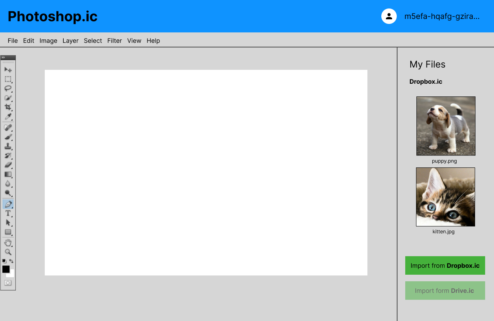

# ICRC-25 Criticism and ICRC-35 Rationale

*22 Jan 2024*

## Setting the goals right

Every project starts with clearly defined goals. In our scenario, it seems like our goal is **to enable interoperability of web-services on the IC**. So web-services could integrate with each other, build on top of each other extending the functionality available to the end user and reducing their own complexities. In other words, our goal is to enable the Open Internet Services vision, that was introduced by the Foundation years ago.

This is a great goal. You can clearly see what steps we could take to make it happen one day. And the moment the interoperability is possible does not seem too far from today. For example, ICRC-25 specification is a big step in that direction.

> So, if the goal is clear and the work has already started, why are you writing this article? What is the problem?

In order to see the problem, we have to try thinking beyond the mid-term horizon. Let's draw a picture of a perfect reality where Open Internet Services on the IC is a common thing.

## A perfect scenario

Alice is a digital artist. She creates hilarious meme images and then sells them as NFTs. Also Alice is a crypto-enthusiast and an IC maximalist, so she only uses IC-hosted software for her work. To make memes, she uses **photoshop.ic** - a web-based graphics editor, hosted 100% on-chain.


The world of Open Internet Services is modular. The majority of web-services don't build their functionality from scratch. Instead, these web-services are created as continuations of other web-services. This allows them to only focus on their business logic - on functionalities, which they actually sell to a customer.

**Photoshop.ic** is an image editor and it does the editing very well. It is the best editor in the world - they make a lot of revenue. This happened, because the team behind **photoshop.ic** was only focused on image editing functionality. They didn't implement any other functionality - they just outsourced it, by integrating with other web-services. This allowed them to offer an extremely low price for their product, and capture almost the whole market because of that price and cutting edge image editing algorithms.

For example, they have no cloud file storage. They don't store user files at all. Instead of hiring talent, implementing, deploying and maintaining a huge infrastructure to enable their users to just store edited images, they decided to integrate with another web-services, which provide cloud storage functionality for them. In our example they offer an integration with two cloud storage providers: **dropbox.ic** and **drive.ic**.

It is so happens, that Alice has a subscribtion to **dropbox.ic** and uses it to store her personal files.


**Dropbox.ic** also lives in the world of Open Internet Services and providing cloud file storage for other web-services is their business model. They make most of their money by making integration agreements with big cloud storage consumers (like **photoshop.ic**), which allows them to provide personal file storage services almost for free, which in return makes them very popular among regular people.

Back to Alice's work. Her daily work routine starts with thinking of a meme she wants to draw today. Once the idea is complete, she opens a browser tab with **photoshop.ic** and starts a new project.


Then she clicks on `Import from Dropbox.ic` button, which opens a new **dropbox.ic** browser tab with a special integration UI.


This UI allows her to share her files from **dropbox.ic** to her project on **photoshop.ic**.


Once she selects all the images she might need for today's editing session, she clicks on `Continue` button and gets redirected back to **photoshop.ic**.



Now Alice's files are available for her to edit. So she does her editing magic to make the meme idea real.


When she's done with the editing, she clicks on `Save to Dropbox.ic` button, and gets redirected to another **dropbox.ic** integration UI.


This UI offers her to store the meme file from **photoshop.ic** to her storage at **dropbox.ic**. Alice clicks on `Allow` button and the new file appears in her file list.


After that Alice creates an NFT from this image, lists it on her favorite marketplace, turns off the computer and goes to a store to buy groceries for another wonderful dinner in the world of Open Internet Services.

## Is this the real life? Is this just fantasy?

I've put this emphasis on "best service in the world", "less complexity" and "low prices" on purpose. The long-term goal of all the crypto-community is to **help Web3 reach global adoption**. This goal is simply impossible to achieve, without big players, with fascinating success stories, emerging in the ecosystem.

Big players will only emerge if they are able to gather huge communities around their projects. Big diverse communities are by definition impossible, if an app requires from its users a software security degree, in order to be utilized correctly and safely.

So, in other words, I believe, that the UX should come first. Because only the simpliest UX attracts masses. And this kind of UX, presented in the scenario above, is what I see as a satisfying experience for an average user. I can imagine my mother going though this flow and importing, editing and saving back to the cloud our family photos without a friction.

And this is the problem. Such a level of abstraction from technical details in the UX **can't happen** with the ICRC-25 route. Because it will never be possible for a wallet to know the internals of every web-service. The only way for wallets to catch up with all the dapps around is to keep things as generic as possible. But generalization inevitably exposes technical details. I can't imagine my mother receiving a wallet pop-up with content like:

```
Permissions request from [photoshop.ic]:

canister_call:
    ryjl3-tyaaa-aaaaa-aaaba-cai:
        integr_read_files_batch_noncertified
        integr_write_files_batch
        integr_commit_batch

[Cancel] [Approve]
```

and thinking `yes, it makes perfect sense for me, thank you. this website wants to be able to access my files at 'dropbox.ic'. but it seems like it will be able to access all of my files, so my passwords.txt file, where I store all passwords to not forget them, may leak, so I should be really careful with this website`. This is too hard.

<details>
<summary><b>One more thing about the perfect scenario above.</b></summary>
If you look at it a little bit more closely, it appears like a very interesting business model. Both services have their own retail clients. `dropbox.ic` also sells its services to corporate clients (by denying integration requests from non-whitelisted websites), which may allow them to charge the retail customers less. `photoshop.ic` only sells its services to retail clients, but since they don't have to deal with cloud storage at all, they also can charge their customers less. So it seems like the total price for the end client (like Alice) should be very compelling.

From Alice's perspective it is even more interesting. She has two absolutely separate products, which give her enough value by themselves. But, by integrating with each other, they offer even more value. This should make Alice extra-happy.

At the end we see a truly "perfect scenario". Alice pays for each product less, then she would pay if they were not integrated with each other. But on top of that she gets extra functionality, when using these products together.
</details>

</br>

Another problem is security and specifically scam protection:


Reddit is full of this kind of posts, where people, even presented with all kinds of warnings before committing an action in a Web3 environment, are still getting easily deceived. All of this happens because confirmation windows, shown by wallets, are not effective against greed and perfect scammy copies of legit websites.

The UX is not that important, if the software is vulnerable. Our mission is make the IC into **a safe place for regular people**. Things showed in the screenshots above should not happen so often. Scammers should not be able to do so much damage.

My belief is that ICRC-25 Consent Messages won't help with that. Imagine every dapp on the IC implements these consent messages. Users see these pop-ups 100 times a day every day, because on the IC people sign requests much more frequently. People tend to tire from this kind of stuff very quickly. After some time these messages will be perceived as white noise and users will ask for a 'Disable warnings checkbox' feature from their wallet providers.

One could say:

> Sure, but Web3 is about self-custodial way of doing things. Users are 100% responsible for their decisions. It is your own fault, if you did not read a consent message carefully and lost all your money to some scammy website.

To which I strongly disagree. If we want mass adoption, we can't think like that. We can't make regular people responsible for decisions they are not technically equipped to take. They don't know CS or software security. They won't compare similar domain names like `legit-site.com` and `legit-s1te.com` for each website they visit, trying to spot the scam. We should find a way to do it for them.

## We can change it, together

So, our goal of enabling dapps integration may actually be split into two tasks:

1. Come up with a way for two dapps to integrate, which offers best security/UX trade-offs. Implement protocols and easy-to-use libraries, which allow developers integrate with each other quickly and safely.
2. Instrument the ecosystem with scam-protection tools. Make these tools easily accessible. Enable dapps, which offer access to sensitive data or valuable assets through integration to spot scammy websites which try to integrate with them.

The first one is simple. The only thing we need is a secure and flexible protocol and an accessible transport, to execute this protocol over. We can cover all of this with a single ICRC - ICRC-35.

The second one is hard and at the current moment in time it is not clear, whether a solution to it is a requirement at all. Maybe ICRC-35 and the effect it may apply on the ecosystem is enough to solve this task, since this protocol allows web-service integration, while preserving identity scoping used in II, MSQ and other signers, which removes an ability of a scam website to steal a user's signature.

### ICRC-35 - Browser-based interoperability framework

There is no point in signers (wallets) participating in the integration process of two web-services. Signers should do what they are designed to do - store user's key pairs and sign messages with these key pairs, protecting user's privacy.

Dapps should integrate directly with one another. And ICRC-35 is the proposed standard way of doing this. It is a browser-based messaging protocol that allows two websites to establish secure and authorized connections and efficiently exchange messages.

It is agnostic to the signer used by each party - for example, a user may authorize using the Internet Identity on one website and integrate with a website where they authorize with OAuth. Moreover it is completely agnostic to what exactly are those parties - as long as they have a webpage, which implements ICRC-35, they can be anything (dapps, regular websites, browser extensions, even mobile apps in some cases) and can still be able to integrate with each other.

The integration process is represented as interaction between two parties: a **service provider** and a **service consumer**. The integration itself is not generic: a service provider explicitely chooses to expose some functionalities to be accessible for a service consumer, while not allowing other functionalities to be exposed. The integration follows the request-response model: a service consumer sends a request to a service provider, which interacts with the user and sends back the response with the result of this interaction.  

The ICRC-35 protocol is built on top of [postMessage](https://developer.mozilla.org/en-US/docs/Web/API/Window/postMessage) browser API. And in general resembles the way all dapps on the IC currently integrate with the Internet Identity. Thats right - Internet Identity is already almost compatible.

Roughly speaking, in the perspective of ICRC-35, the II provides other web-services with a functionality to deterministically and provably derive a random number (unique for each integrating party and a user), using WebAuthN. So internally, Internet Identity uses WebAuthN as a signer, while the integrating web-services use the random number, generated by the II, as a seed for self-hosted signer. No orchestration from signers (as in ICRC-25) needed for this interaction - each party authorizes its users locally and is able to sign canister requests by itself (II uses WebAuthN to sign a request).

In other words, ICRC-35 is nothing new in terms of technology. It is just a new perspective on something we already use for a while.

Here is the [draft specification](../README.md) for ICRC-35. And, more importantly, here is a [reference implementation](https://github.com/seniorjoinu/icrc35/tree/main) of this protocol, which is slightly documented and already [published](https://www.npmjs.com/package/icrc-35) to NPM. To see how you could use the implementation in the context of a real application, see the [example project](https://github.com/seniorjoinu/icrc35/tree/main/example).

*By the way, [MSQ](https://msq.tech) already implements ICRC-35. We provide two functions for other web-services: user authorization (similar to II, but with MetaMask magic) and ICRC-1 payments. Our use-case is a proof that ICRC-35 is truly party-agnostic. In our case, any other web-service is able to integrate with it, despite MSQ being an extension (a Snap) for another browser extension (MetaMask).*
