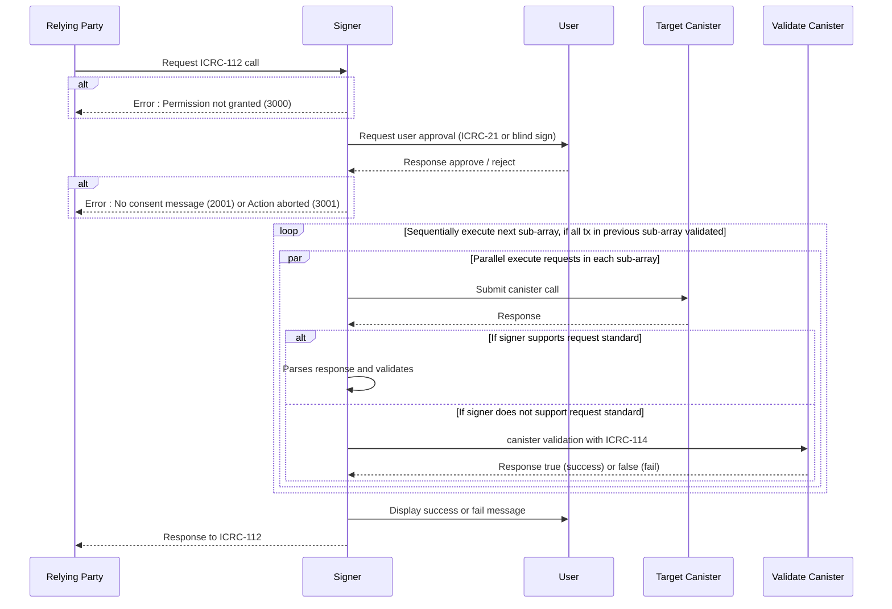

# ICRC-112: Batch Call Canister

![DRAFT] [![EXTENDS 25]](./icrc_25_signer_interaction_standard.md)

**Authors:** [Long Tran](https://github.com/baolongt), [Thomas Gladdines](https://github.com/sea-snake), [Mason](https://github.com/masonswj)

<!-- TOC -->

- [ICRC-112: Batch Call Canister](#icrc-112-batch-call-canister)
  - [Summary](#summary)
  - [Method](#method)
  - [Scope (according to the ICRC-25 standard)](#scope-according-to-the-icrc-25-standard)
    - [Example Permission Request](#example-permission-request)
  - [`icrc25_supported_standards`](#icrc25_supported_standards)
  - [Request Params](#request-params)
    - [Example RPC Request](#example-rpc-request)
  - [Result](#result)
    - [Example RPC Response](#example-rpc-response)
  - [Processing](#processing)
    - [Approval Message](#approval-message)
    - [Parallel and Sequential Execution](#parallel-and-sequential-execution)
    - [Validation](#validation)
    - [Diagram](#diagram)
  - [Errors](#errors)
    - [Existing Errors](#existing-errors)
    - [Additional Errors](#additional-errors)
      - [`1001` Too many requests](#1001-too-many-requests)
      - [`1002` Validation required](#1002-validation-required)
      - [`1003` Validation failed](#1003-validation-failed)
  - [Handling Partial Responses](#handling-partial-responses)
  - [Leveraging ICRC-25](#leveraging-icrc-25)

## Summary

`icrc112_batch_call_canister` method is used by the relying party to execute a batch of requests with one call to the signer. Signer must receive an approval from the user to execute the requests, but only one approval is needed for all of the requests in the batch. Furthermore, relying party can specify in ICRC-112 request whether requests in the batch should be executed in parallel or in certain sequences.

## Method

**Name:** `icrc112_batch_call_canister`

**Prerequisite:** Granted permission scope `icrc112_batch_call_canister`.

## Scope (according to the [ICRC-25 standard](./icrc_25_signer_interaction_standard.md))

**Scope:** `icrc112_batch_call_canister`

### Example Permission Request

```json
{
  "id": 1,
  "jsonrpc": "2.0",
  "method": "icrc25_request_permissions",
  "params": {
    "scopes": [
      {
        "method": "icrc112_batch_call_canister"
      }
    ]
  }
}
```

## `icrc25_supported_standards`

An ICRC-25 compliant signer must implement the [icrc25_supported_standards](./icrc_25_signer_interaction_standard.md#icrc25_supported_standards) method which returns the list of supported standards. Any signer implementing ICRC-112 must include a record with the name field equal to "ICRC-112" in that list.

## Request Params

**`sender` (`text`):** The principal (textual representation) requested to execute the call.

**`requests` (`array` of `array` of `record`):** A list of lists of requests with following fields:

- **`canisterId` (`text`):** The id of the canister on which the call should be executed.
- **`method` (`text`):** The name of the call method to be executed.
- **`arg` (`text`):** The arguments for the call.
- **`nonce` (`blob` optional):** Arbitrary data of length at most 32 bytes, typically randomly generated. This can be used to create distinct requests with otherwise identical fields.

**`validationCanister` (`text` optional):** The id of the canister which implements the [ICRC-114](./icrc_114_validate_batch_call.md) standard for validation. By default, the signer must call the `icrc_114_validate` method from this canister to validate the responses of unsupported standards.

### Example RPC Request

```json
{
  "id": 1,
  "jsonrpc": "2.0",
  "method": "icrc112_batch_call_canister",
  "params": {
    "sender": "b7gqo-ulk5n-2kpo7-oalt7-p2kyl-o4j5l-kiuwo-eeybr-dab4l-ur6up-pqe",
    "validationCanister": "zzzzz-fqaaa-aaaao-a2hlq-ca",
    "requests": [
      [
        {
          "canisterId": "eeddf-fqaaa-aaaao-a2hlq-ca",
          "method": "icrc2_approve",
          "arg": "RElETARte24AbAKzsNrDA2ithsqDBQFsA/vKAQKi3pTrBgHYo4yoDX0BAwEdV+ztKgq7E4l1ffuTuwEmw8AtYSjlrJ+WLO5ofQIAAMgB"
        },
        {
          "canisterId": "aaabb-fqaaa-aaaao-a2hlq-ca",
          "method": "icrc2_approve",
          "arg": "RElETARte24AbAKzsNrDA2ithsqDBQFsA/vKAQKi3pTrBgHYo4yoDX0BAwEdV+ztKgq7E4l1ffuTuwEmw8AtYSjlrJ+WLO5ofQIAAMgB"
        }
      ],
      [
        {
          "canisterId": "xyzzz-fqaaa-aaaao-a2hlq-ca",
          "method": "swap",
          "arg": "RElETARte24AbAKzsNrDA2ithsqDBQFsA/vKAQKi3pTrBgHYo4yoDX0BAwEdV+ztKgq7E4l1ffuTuwEmw8AtYSjlrJ+WLO5ofQIAAMgB"
        },
        {
          "canisterId": "xyzzz-fqaaa-aaaao-a2hlq-ca",
          "method": "swap",
          "arg": "RElETARte24AbAKzsNrDA2ithsqDBQFsA/vKAQKi3pTrBgHYo4yoDX0BAwEdV+ztKgq7E4l1ffuTuwEmw8AtYSjlrJ+WLO5ofQIAAMgB"
        }
      ],
      [
        {
          "canisterId": "bbbbb-fqaaa-aaaao-a2hlq-ca",
          "method": "bridge_to_eth",
          "arg": "RElETARte24AbAKzsNrDA2ithsqDBQFsA/vKAQKi3pTrBgHYo4yoDX0BAwEdV+ztKgq7E4l1ffuTuwEmw8AtYSjlrJ+WLO5ofQIAAMgB"
        }
      ]
    ]
  }
}
```

## Result

**`responses` (`array` of `array` of `record`):** A list of lists of responses with following fields:

- **`contentMap` (`blob`):** The CBOR-encoded content map of the actual request as specified [here](https://internetcomputer.org/docs/current/references/ic-interface-spec/#http-call).

- **`certificate` (`blob`):** The certificate returned by the `read_state` call as specified [here](https://internetcomputer.org/docs/current/references/ic-interface-spec/#certificate). The value is CBOR-encoded.

### Example RPC Response

```json
{
  "id": 1,
  "jsonrpc": "2.0",
  "result": {
    "responses": [
      [
        {
          "contentMap": "2dn3p2NhcmdYTkRJREwEbXtuAGwCs7DawwNorYbKgwUBbAP7ygECot6U6wYB2KOMqA19AQMBHVfs7SoKuxOJdX37k7sBJsPALWEo5ayflizuaH0CAADIAWtjYW5pc3Rlcl9pZEoAAAAAAcDR1wEBbmluZ3Jlc3NfZXhwaXJ5GxeNX/65y4YAa21ldGhvZF9uYW1laHRyYW5zZmVyZW5vbmNlUFF4+hAimFhoqkdUcIchz0xscmVxdWVzdF90eXBlZGNhbGxmc2VuZGVyWB1q63Snu+4C5/fpWFu4nq1IpZxCYDEYA8XSPqPfAg==",
          "certificate": "2dn3omR0cmVlgwGDAYIEWCAPzKZJY/emKhi2GGtBrnHh4cdttATd4+9GtJrNCBepb4MBgwJOcmVxdWVzdF9zdGF0dXODAYIEWCCCgynUaonrKCCywghWCSk9BeDqMoI4yf15nxyU/5JZv4MBggRYIDG7WdzQ9sGWI1MpxizUzxubsEBuNkTT94UOZ9USbzNvgwGCBFggawwbTHxnPUzBAUhWBRjk0nzPs2fPpJlaIYtj5AvcX+ODAYIEWCDiFLyaWuMWjtVurCQcSgny/cqfM8S6qrdihVq7nPz1FoMCWCD/8jdeccvqHVYf06Hw7qPXIDNimC1Uyf47VsvgqKpPiIMBgwJFcmVwbHmCA1RESURMAWsCvIoBfcX+0gFxAQAABIMCRnN0YXR1c4IDR3JlcGxpZWSCBFgg7qZngcNt2+B/RuF44W3LRsKWXG6QQg2L6GdZgJ6Nb3+DAYIEWCAx3tU/mhHfX+wDzF003eSJYN8Nebou8rTeGyxr/rUa1YMCRHRpbWWCA0nw9+r88fjXxhdpc2lnbmF0dXJlWDCXNshvwWG1jGViP7ELePGHCThBw9mts45FxIy4gZATkUEsPeJ6y+cjbn2REmB0Soo="
        },
        {
          "contentMap": "2dn3p2NhcmdYTkRJREwEbXtuAGwCs7DawwNorYbKgwUBbAP7ygECot6U6wYB2KOMqA19AQMBHVfs7SoKuxOJdX37k7sBJsPALWEo5ayflizuaH0CAADIAWtjYW5pc3Rlcl9pZEoAAAAAAcDR1wEBbmluZ3Jlc3NfZXhwaXJ5GxeNX/65y4YAa21ldGhvZF9uYW1laHRyYW5zZmVyZW5vbmNlUFF4+hAimFhoqkdUcIchz0xscmVxdWVzdF90eXBlZGNhbGxmc2VuZGVyWB1q63Snu+4C5/fpWFu4nq1IpZxCYDEYA8XSPqPfAg==",
          "certificate": "2dn3omR0cmVlgwGDAYIEWCAPzKZJY/emKhi2GGtBrnHh4cdttATd4+9GtJrNCBepb4MBgwJOcmVxdWVzdF9zdGF0dXODAYIEWCCCgynUaonrKCCywghWCSk9BeDqMoI4yf15nxyU/5JZv4MBggRYIDG7WdzQ9sGWI1MpxizUzxubsEBuNkTT94UOZ9USbzNvgwGCBFggawwbTHxnPUzBAUhWBRjk0nzPs2fPpJlaIYtj5AvcX+ODAYIEWCDiFLyaWuMWjtVurCQcSgny/cqfM8S6qrdihVq7nPz1FoMCWCD/8jdeccvqHVYf06Hw7qPXIDNimC1Uyf47VsvgqKpPiIMBgwJFcmVwbHmCA1RESURMAWsCvIoBfcX+0gFxAQAABIMCRnN0YXR1c4IDR3JlcGxpZWSCBFgg7qZngcNt2+B/RuF44W3LRsKWXG6QQg2L6GdZgJ6Nb3+DAYIEWCAx3tU/mhHfX+wDzF003eSJYN8Nebou8rTeGyxr/rUa1YMCRHRpbWWCA0nw9+r88fjXxhdpc2lnbmF0dXJlWDCXNshvwWG1jGViP7ELePGHCThBw9mts45FxIy4gZATkUEsPeJ6y+cjbn2REmB0Soo="
        }
      ],
      [
        {
          "contentMap": "2dn3p2NhcmdYTkRJREwEbXtuAGwCs7DawwNorYbKgwUBbAP7ygECot6U6wYB2KOMqA19AQMBHVfs7SoKuxOJdX37k7sBJsPALWEo5ayflizuaH0CAADIAWtjYW5pc3Rlcl9pZEoAAAAAAcDR1wEBbmluZ3Jlc3NfZXhwaXJ5GxeNX/65y4YAa21ldGhvZF9uYW1laHRyYW5zZmVyZW5vbmNlUFF4+hAimFhoqkdUcIchz0xscmVxdWVzdF90eXBlZGNhbGxmc2VuZGVyWB1q63Snu+4C5/fpWFu4nq1IpZxCYDEYA8XSPqPfAg==",
          "certificate": "2dn3omR0cmVlgwGDAYIEWCAPzKZJY/emKhi2GGtBrnHh4cdttATd4+9GtJrNCBepb4MBgwJOcmVxdWVzdF9zdGF0dXODAYIEWCCCgynUaonrKCCywghWCSk9BeDqMoI4yf15nxyU/5JZv4MBggRYIDG7WdzQ9sGWI1MpxizUzxubsEBuNkTT94UOZ9USbzNvgwGCBFggawwbTHxnPUzBAUhWBRjk0nzPs2fPpJlaIYtj5AvcX+ODAYIEWCDiFLyaWuMWjtVurCQcSgny/cqfM8S6qrdihVq7nPz1FoMCWCD/8jdeccvqHVYf06Hw7qPXIDNimC1Uyf47VsvgqKpPiIMBgwJFcmVwbHmCA1RESURMAWsCvIoBfcX+0gFxAQAABIMCRnN0YXR1c4IDR3JlcGxpZWSCBFgg7qZngcNt2+B/RuF44W3LRsKWXG6QQg2L6GdZgJ6Nb3+DAYIEWCAx3tU/mhHfX+wDzF003eSJYN8Nebou8rTeGyxr/rUa1YMCRHRpbWWCA0nw9+r88fjXxhdpc2lnbmF0dXJlWDCXNshvwWG1jGViP7ELePGHCThBw9mts45FxIy4gZATkUEsPeJ6y+cjbn2REmB0Soo="
        },
        {
          "contentMap": "2dn3p2NhcmdYTkRJREwEbXtuAGwCs7DawwNorYbKgwUBbAP7ygECot6U6wYB2KOMqA19AQMBHVfs7SoKuxOJdX37k7sBJsPALWEo5ayflizuaH0CAADIAWtjYW5pc3Rlcl9pZEoAAAAAAcDR1wEBbmluZ3Jlc3NfZXhwaXJ5GxeNX/65y4YAa21ldGhvZF9uYW1laHRyYW5zZmVyZW5vbmNlUFF4+hAimFhoqkdUcIchz0xscmVxdWVzdF90eXBlZGNhbGxmc2VuZGVyWB1q63Snu+4C5/fpWFu4nq1IpZxCYDEYA8XSPqPfAg==",
          "certificate": "2dn3omR0cmVlgwGDAYIEWCAPzKZJY/emKhi2GGtBrnHh4cdttATd4+9GtJrNCBepb4MBgwJOcmVxdWVzdF9zdGF0dXODAYIEWCCCgynUaonrKCCywghWCSk9BeDqMoI4yf15nxyU/5JZv4MBggRYIDG7WdzQ9sGWI1MpxizUzxubsEBuNkTT94UOZ9USbzNvgwGCBFggawwbTHxnPUzBAUhWBRjk0nzPs2fPpJlaIYtj5AvcX+ODAYIEWCDiFLyaWuMWjtVurCQcSgny/cqfM8S6qrdihVq7nPz1FoMCWCD/8jdeccvqHVYf06Hw7qPXIDNimC1Uyf47VsvgqKpPiIMBgwJFcmVwbHmCA1RESURMAWsCvIoBfcX+0gFxAQAABIMCRnN0YXR1c4IDR3JlcGxpZWSCBFgg7qZngcNt2+B/RuF44W3LRsKWXG6QQg2L6GdZgJ6Nb3+DAYIEWCAx3tU/mhHfX+wDzF003eSJYN8Nebou8rTeGyxr/rUa1YMCRHRpbWWCA0nw9+r88fjXxhdpc2lnbmF0dXJlWDCXNshvwWG1jGViP7ELePGHCThBw9mts45FxIy4gZATkUEsPeJ6y+cjbn2REmB0Soo="
        }
      ],
      [
        {
          "contentMap": "2dn3p2NhcmdYTkRJREwEbXtuAGwCs7DawwNorYbKgwUBbAP7ygECot6U6wYB2KOMqA19AQMBHVfs7SoKuxOJdX37k7sBJsPALWEo5ayflizuaH0CAADIAWtjYW5pc3Rlcl9pZEoAAAAAAcDR1wEBbmluZ3Jlc3NfZXhwaXJ5GxeNX/65y4YAa21ldGhvZF9uYW1laHRyYW5zZmVyZW5vbmNlUFF4+hAimFhoqkdUcIchz0xscmVxdWVzdF90eXBlZGNhbGxmc2VuZGVyWB1q63Snu+4C5/fpWFu4nq1IpZxCYDEYA8XSPqPfAg==",
          "certificate": "2dn3omR0cmVlgwGDAYIEWCAPzKZJY/emKhi2GGtBrnHh4cdttATd4+9GtJrNCBepb4MBgwJOcmVxdWVzdF9zdGF0dXODAYIEWCCCgynUaonrKCCywghWCSk9BeDqMoI4yf15nxyU/5JZv4MBggRYIDG7WdzQ9sGWI1MpxizUzxubsEBuNkTT94UOZ9USbzNvgwGCBFggawwbTHxnPUzBAUhWBRjk0nzPs2fPpJlaIYtj5AvcX+ODAYIEWCDiFLyaWuMWjtVurCQcSgny/cqfM8S6qrdihVq7nPz1FoMCWCD/8jdeccvqHVYf06Hw7qPXIDNimC1Uyf47VsvgqKpPiIMBgwJFcmVwbHmCA1RESURMAWsCvIoBfcX+0gFxAQAABIMCRnN0YXR1c4IDR3JlcGxpZWSCBFgg7qZngcNt2+B/RuF44W3LRsKWXG6QQg2L6GdZgJ6Nb3+DAYIEWCAx3tU/mhHfX+wDzF003eSJYN8Nebou8rTeGyxr/rUa1YMCRHRpbWWCA0nw9+r88fjXxhdpc2lnbmF0dXJlWDCXNshvwWG1jGViP7ELePGHCThBw9mts45FxIy4gZATkUEsPeJ6y+cjbn2REmB0Soo="
        }
      ]
    ]
  }
}
```

## Processing

This standard builds upon the canister call processing defined in [ICRC-49](https://github.com/dfinity/wg-identity-authentication/blob/main/topics/icrc_49_call_canister.md). Refer to ICRC-49 for details regarding canister call execution, processing, and verification on the relying party side. All requirements, recommendations, guidelines, and warnings in ICRC-49 should be strictly followed.

### Approval Message

Before executing the batch, the signer _must_ obtain a single user approval **for the entire batch of requests at once**, regardless of the individual consent mechanisms used for each request. The signer handles each request within the batch as follows:

1. **Supported ICRC Standard:** For requests using standards the signer supports (as declared via [ICRC-25](https://github.com/dfinity/wg-identity-authentication/blob/main/topics/icrc_25_signer_interaction_standard.md#icrc25_supported_standards)), the signer implements its own consent screen, tailored to the specific standard. This screen should clearly summarize the actions the user is authorizing **for that particular request**.
2. **ICRC-21 Consent Messages:** If a request uses a standard the signer does _not_ support, the signer attempts to retrieve a consent message from the target canister using the ICRC-21 standard. This allows the canister to provide a custom explanation of the requested action **for that particular request**.
3. **Blind Request Warning:** If a canister doesn't support ICRC-21 (and the signer doesn't natively support the standard), the signer _must_ display a warning to the user **for that particular request**. This warning _must_ include the canister ID, sender, method, and arguments. Arguments _should_ be decoded for clarity. If decoding is not possible, a stronger warning must be displayed. The warning must clearly indicate that the canister does not support ICRC-21 and that the user is authorizing an action without a detailed explanation from the target canister. The signer may also choose to return a `2001` ("Consent message missing") error, **aborting the entire batch operation**, instead of displaying the warning.

The signer **aggregates the consent information from all requests** (using the mechanisms above) into a single, clear prompt for the user to approve or reject the entire batch.

### Parallel and Sequential Execution

The `requests` parameter defines the execution order:

- Requests _within_ a sub-array are executed in **parallel**.
- Sub-arrays are executed **sequentially**. A sub-array is only executed after _all_ requests in the preceding sub-array have been successfully validated (see "Validation" below). The final sub-array is executed without validation, as there are no subsequent requests dependent on its outcome.

```json5
// Example execution order
{
  requests: [
    ["request1", "request2", "request3"], // Requests 1-3 execute in parallel
    ["request4", "request5"], // Requests 4-5 execute in parallel, after requests 1-3 are validated
    ["request6"], // Request 6 executes, after requests 4-5 are validated (request 6 itself is not validated)
  ],
}
```

The signer determines how to present parallel requests to the user for approval. Displaying some form of progress indicator after approval is recommended, especially for longer sequences.

### Validation

Before executing requests in a subsequent sub-array, the signer must validate the successful execution of all requests in the preceding sub-array.

Validation is handled as follows:

1. **Request Executed Check:** The signer first verifies that a request was executed by the canister. This includes confirming that:

   - The canister call could be made (no network errors).
   - A certificate is available for the canister call.
   - The certificate contains a reply from the canister.

   If any of these checks fail, the request is considered to have failed validation. The specific error code (e.g., network error) is included in the aggregated response.

2. **Successful Response Handling:** If a request executed and returned a certificate with a reply, the signer proceeds with validation based on its support for the underlying standard used by the request:

   - **Signer-Side Validation (Preferred):** For standards the signer supports (as declared via [ICRC-25](https://github.com/dfinity/wg-identity-authentication/blob/main/topics/icrc_25_signer_interaction_standard.md#icrc25_supported_standards)), the signer must perform validation internally. This involves parsing the response data (e.g., looking up the reply in the certificate, decoding the reply using the relevant Candid definition) to confirm successful execution according to the standard's requirements. For example, an ICRC-1 transfer would require confirming the inclusion of a valid block ID.
   - **Canister Validation (Fallback):** If the signer does not support the standard, it uses the validation canister specified in the request parameters. The signer calls the `icrc_114_validate` method on this canister. This validation canister is responsible for determining whether the request completed successfully.

   If something completed successfully or not should always be implemented abstractly, in most cases this means checking if there is either a result or error.

### Diagram



## Errors

### Existing Errors

Existing errors defined in [ICRC-25](./icrc_25_signer_interaction_standard.md#errors-3) might additionally return partial responses in the error details. A `null` value is returned for requests that weren't processed.

```json5
{
  id: 1,
  jsonrpc: "2.0",
  error: {
    code: 4000,
    message: "Network error",
    data: {
      partialResponses: [
        [
          {
            // Passed validation
            contentMap: "2dn3p2NhcmdYTkRJREwEbXtuAGwCs7DawwNorYbKgwUBbAP7ygECot6U6wYB2KOMqA19AQMBHVfs7SoKuxOJdX37k7sBJsPALWEo5ayflizuaH0CAADIAWtjYW5pc3Rlcl9pZEoAAAAAAcDR1wEBbmluZ3Jlc3NfZXhwaXJ5GxeNX/65y4YAa21ldGhvZF9uYW1laHRyYW5zZmVyZW5vbmNlUFF4+hAimFhoqkdUcIchz0xscmVxdWVzdF90eXBlZGNhbGxmc2VuZGVyWB1q63Snu+4C5/fpWFu4nq1IpZxCYDEYA8XSPqPfAg==",
            certificate: "2dn3omR0cmVlgwGDAYIEWCAPzKZJY/emKhi2GGtBrnHh4cdttATd4+9GtJrNCBepb4MBgwJOcmVxdWVzdF9zdGF0dXODAYIEWCCCgynUaonrKCCywghWCSk9BeDqMoI4yf15nxyU/5JZv4MBggRYIDG7WdzQ9sGWI1MpxizUzxubsEBuNkTT94UOZ9USbzNvgwGCBFggawwbTHxnPUzBAUhWBRjk0nzPs2fPpJlaIYtj5AvcX+ODAYIEWCDiFLyaWuMWjtVurCQcSgny/cqfM8S6qrdihVq7nPz1FoMCWCD/8jdeccvqHVYf06Hw7qPXIDNimC1Uyf47VsvgqKpPiIMBgwJFcmVwbHmCA1RESURMAWsCvIoBfcX+0gFxAQAABIMCRnN0YXR1c4IDR3JlcGxpZWSCBFgg7qZngcNt2+B/RuF44W3LRsKWXG6QQg2L6GdZgJ6Nb3+DAYIEWCAx3tU/mhHfX+wDzF003eSJYN8Nebou8rTeGyxr/rUa1YMCRHRpbWWCA0nw9+r88fjXxhdpc2lnbmF0dXJlWDCXNshvwWG1jGViP7ELePGHCThBw9mts45FxIy4gZATkUEsPeJ6y+cjbn2REmB0Soo=",
          },
          {
            // Passed validation
            contentMap: "2dn3p2NhcmdYTkRJREwEbXtuAGwCs7DawwNorYbKgwUBbAP7ygECot6U6wYB2KOMqA19AQMBHVfs7SoKuxOJdX37k7sBJsPALWEo5ayflizuaH0CAADIAWtjYW5pc3Rlcl9pZEoAAAAAAcDR1wEBbmluZ3Jlc3NfZXhwaXJ5GxeNX/65y4YAa21ldGhvZF9uYW1laHRyYW5zZmVyZW5vbmNlUFF4+hAimFhoqkdUcIchz0xscmVxdWVzdF90eXBlZGNhbGxmc2VuZGVyWB1q63Snu+4C5/fpWFu4nq1IpZxCYDEYA8XSPqPfAg==",
            certificate: "2dn3omR0cmVlgwGDAYIEWCAPzKZJY/emKhi2GGtBrnHh4cdttATd4+9GtJrNCBepb4MBgwJOcmVxdWVzdF9zdGF0dXODAYIEWCCCgynUaonrKCCywghWCSk9BeDqMoI4yf15nxyU/5JZv4MBggRYIDG7WdzQ9sGWI1MpxizUzxubsEBuNkTT94UOZ9USbzNvgwGCBFggawwbTHxnPUzBAUhWBRjk0nzPs2fPpJlaIYtj5AvcX+ODAYIEWCDiFLyaWuMWjtVurCQcSgny/cqfM8S6qrdihVq7nPz1FoMCWCD/8jdeccvqHVYf06Hw7qPXIDNimC1Uyf47VsvgqKpPiIMBgwJFcmVwbHmCA1RESURMAWsCvIoBfcX+0gFxAQAABIMCRnN0YXR1c4IDR3JlcGxpZWSCBFgg7qZngcNt2+B/RuF44W3LRsKWXG6QQg2L6GdZgJ6Nb3+DAYIEWCAx3tU/mhHfX+wDzF003eSJYN8Nebou8rTeGyxr/rUa1YMCRHRpbWWCA0nw9+r88fjXxhdpc2lnbmF0dXJlWDCXNshvwWG1jGViP7ELePGHCThBw9mts45FxIy4gZATkUEsPeJ6y+cjbn2REmB0Soo=",
          },
        ],
        [
          null, // Not processed
          {
            // Possibly not validated or failed validation
            contentMap: "2dn3p2NhcmdYTkRJREwEbXtuAGwCs7DawwNorYbKgwUBbAP7ygECot6U6wYB2KOMqA19AQMBHVfs7SoKuxOJdX37k7sBJsPALWEo5ayflizuaH0CAADIAWtjYW5pc3Rlcl9pZEoAAAAAAcDR1wEBbmluZ3Jlc3NfZXhwaXJ5GxeNX/65y4YAa21ldGhvZF9uYW1laHRyYW5zZmVyZW5vbmNlUFF4+hAimFhoqkdUcIchz0xscmVxdWVzdF90eXBlZGNhbGxmc2VuZGVyWB1q63Snu+4C5/fpWFu4nq1IpZxCYDEYA8XSPqPfAg==",
            certificate: "2dn3omR0cmVlgwGDAYIEWCAPzKZJY/emKhi2GGtBrnHh4cdttATd4+9GtJrNCBepb4MBgwJOcmVxdWVzdF9zdGF0dXODAYIEWCCCgynUaonrKCCywghWCSk9BeDqMoI4yf15nxyU/5JZv4MBggRYIDG7WdzQ9sGWI1MpxizUzxubsEBuNkTT94UOZ9USbzNvgwGCBFggawwbTHxnPUzBAUhWBRjk0nzPs2fPpJlaIYtj5AvcX+ODAYIEWCDiFLyaWuMWjtVurCQcSgny/cqfM8S6qrdihVq7nPz1FoMCWCD/8jdeccvqHVYf06Hw7qPXIDNimC1Uyf47VsvgqKpPiIMBgwJFcmVwbHmCA1RESURMAWsCvIoBfcX+0gFxAQAABIMCRnN0YXR1c4IDR3JlcGxpZWSCBFgg7qZngcNt2+B/RuF44W3LRsKWXG6QQg2L6GdZgJ6Nb3+DAYIEWCAx3tU/mhHfX+wDzF003eSJYN8Nebou8rTeGyxr/rUa1YMCRHRpbWWCA0nw9+r88fjXxhdpc2lnbmF0dXJlWDCXNshvwWG1jGViP7ELePGHCThBw9mts45FxIy4gZATkUEsPeJ6y+cjbn2REmB0Soo=",
          },
        ],
        [
          null, // Not processed
        ],
      ],
    },
  },
}
```

### Additional Errors

In addition to the errors defined in [ICRC-25](./icrc_25_signer_interaction_standard.md#errors-3) this standard defines the following errors.

#### `1001` Too many requests

The batch request was not executed, since the numbers of requests in the batch reached the limit defined by the signer. The signer may adjust this limit based on the types of calls being made.

```json
{
  "id": 1,
  "jsonrpc": "2.0",
  "error": {
    "code": 1001,
    "message": "Too many requests"
  }
}
```

#### `1002` Validation required

The batch request was not executed, since the signer does not support the standard used by one or more of the requests and a validation argument was not provided.

```json
{
  "id": 1,
  "jsonrpc": "2.0",
  "error": {
    "code": 1002,
    "message": "Validation required"
  }
}
```

#### `1003` Validation failed

The batch request was partially executed, since one or more requests did not pass validation. A `null` value is returned for requests that weren't processed.

```json5
{
  id: 1,
  jsonrpc: "2.0",
  error: {
    code: 1003,
    message: "Validation failed",
    data: {
      partialResponses: [
        [
          {
            // Possibly not validated or failed validation
            contentMap: "2dn3p2NhcmdYTkRJREwEbXtuAGwCs7DawwNorYbKgwUBbAP7ygECot6U6wYB2KOMqA19AQMBHVfs7SoKuxOJdX37k7sBJsPALWEo5ayflizuaH0CAADIAWtjYW5pc3Rlcl9pZEoAAAAAAcDR1wEBbmluZ3Jlc3NfZXhwaXJ5GxeNX/65y4YAa21ldGhvZF9uYW1laHRyYW5zZmVyZW5vbmNlUFF4+hAimFhoqkdUcIchz0xscmVxdWVzdF90eXBlZGNhbGxmc2VuZGVyWB1q63Snu+4C5/fpWFu4nq1IpZxCYDEYA8XSPqPfAg==",
            certificate: "2dn3omR0cmVlgwGDAYIEWCAPzKZJY/emKhi2GGtBrnHh4cdttATd4+9GtJrNCBepb4MBgwJOcmVxdWVzdF9zdGF0dXODAYIEWCCCgynUaonrKCCywghWCSk9BeDqMoI4yf15nxyU/5JZv4MBggRYIDG7WdzQ9sGWI1MpxizUzxubsEBuNkTT94UOZ9USbzNvgwGCBFggawwbTHxnPUzBAUhWBRjk0nzPs2fPpJlaIYtj5AvcX+ODAYIEWCDiFLyaWuMWjtVurCQcSgny/cqfM8S6qrdihVq7nPz1FoMCWCD/8jdeccvqHVYf06Hw7qPXIDNimC1Uyf47VsvgqKpPiIMBgwJFcmVwbHmCA1RESURMAWsCvIoBfcX+0gFxAQAABIMCRnN0YXR1c4IDR3JlcGxpZWSCBFgg7qZngcNt2+B/RuF44W3LRsKWXG6QQg2L6GdZgJ6Nb3+DAYIEWCAx3tU/mhHfX+wDzF003eSJYN8Nebou8rTeGyxr/rUa1YMCRHRpbWWCA0nw9+r88fjXxhdpc2lnbmF0dXJlWDCXNshvwWG1jGViP7ELePGHCThBw9mts45FxIy4gZATkUEsPeJ6y+cjbn2REmB0Soo=",
          },
          {
            // Possibly not validated or failed validation
            contentMap: "2dn3p2NhcmdYTkRJREwEbXtuAGwCs7DawwNorYbKgwUBbAP7ygECot6U6wYB2KOMqA19AQMBHVfs7SoKuxOJdX37k7sBJsPALWEo5ayflizuaH0CAADIAWtjYW5pc3Rlcl9pZEoAAAAAAcDR1wEBbmluZ3Jlc3NfZXhwaXJ5GxeNX/65y4YAa21ldGhvZF9uYW1laHRyYW5zZmVyZW5vbmNlUFF4+hAimFhoqkdUcIchz0xscmVxdWVzdF90eXBlZGNhbGxmc2VuZGVyWB1q63Snu+4C5/fpWFu4nq1IpZxCYDEYA8XSPqPfAg==",
            certificate: "2dn3omR0cmVlgwGDAYIEWCAPzKZJY/emKhi2GGtBrnHh4cdttATd4+9GtJrNCBepb4MBgwJOcmVxdWVzdF9zdGF0dXODAYIEWCCCgynUaonrKCCywghWCSk9BeDqMoI4yf15nxyU/5JZv4MBggRYIDG7WdzQ9sGWI1MpxizUzxubsEBuNkTT94UOZ9USbzNvgwGCBFggawwbTHxnPUzBAUhWBRjk0nzPs2fPpJlaIYtj5AvcX+ODAYIEWCDiFLyaWuMWjtVurCQcSgny/cqfM8S6qrdihVq7nPz1FoMCWCD/8jdeccvqHVYf06Hw7qPXIDNimC1Uyf47VsvgqKpPiIMBgwJFcmVwbHmCA1RESURMAWsCvIoBfcX+0gFxAQAABIMCRnN0YXR1c4IDR3JlcGxpZWSCBFgg7qZngcNt2+B/RuF44W3LRsKWXG6QQg2L6GdZgJ6Nb3+DAYIEWCAx3tU/mhHfX+wDzF003eSJYN8Nebou8rTeGyxr/rUa1YMCRHRpbWWCA0nw9+r88fjXxhdpc2lnbmF0dXJlWDCXNshvwWG1jGViP7ELePGHCThBw9mts45FxIy4gZATkUEsPeJ6y+cjbn2REmB0Soo=",
          },
        ],
        [
          null, // Not processed
          null, // Not processed
        ],
        [
          null, // Not processed
        ],
      ],
    },
  },
}
```

## Handling Partial Responses

In case of an error, the relying party might receive partial responses. This means that not all requests are processed and/or validated since the error stopped the signer from processing.

If a response is inside the last sub-array that contains processed responses, it might not have been validated yet or failed validation.

Recommended approach to recover from partial responses as relying party:

1. Check the last sub-array that contains processed responses:
   - Check if processed responses are valid by either validating the candid response directly or by calling the validation canister directly.
   - In case of using the validation canister, consider implementing and using an additional canister method that returns more than a boolean e.g. error message and instructions to show to user.
   - Resolve underlying issues that caused the error that resulted in partial responses e.g. not enough funds.
   - Inform the user of the error(s) and ask them to take certain actions where needed.
2. Re-submit the `icrc112_batch_call_canister` request with the successful canister call requests omitted.
3. If another error is returned, go back to step 1.

Additionally, it's recommended to consider rollback approaches in case the errors cannot be resolved and funds need to be returned.

## Leveraging ICRC-25

Before calling `icrc112_batch_call_canister`, the relying party can use ICRC-25 to determine which standards the signer supports.

Constructing the `icrc112_batch_call_canister` request using only standards the signer supports is the most efficient approach, as it avoids the need for external validation calls.

If using unsupported standards is unavoidable, providing a validation canister allows the signer to validate the request through an external call. This offers a more robust implementation, as it handles cases where the user's signer does not natively support all standards used in the batch. However, it adds latency due to the external validation call.

[DRAFT]: https://img.shields.io/badge/STATUS-DRAFT-f25a24.svg
[EXTENDS 25]: https://img.shields.io/badge/EXTENDS-ICRC--25-ed1e7a.svg
