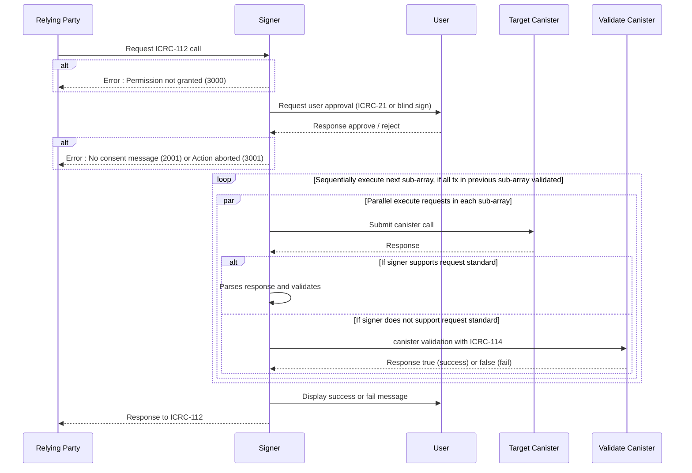

# ICRC-112: Batch Canister Call

![DRAFT] [![EXTENDS 25]](./icrc_25_signer_interaction_standard.md)

**Authors:** [Long Tran](https://github.com/baolongt), [Thomas Gladdines](https://github.com/sea-snake), [Mason](https://github.com/masonswj)

<!-- TOC -->

- [ICRC-112: Batch Canister Call](#icrc-112-batch-canister-call)
  - [Summary](#summary)
  - [Request Params](#request-params)
  - [Processing](#processing)
  - [Notes](#notes)
  - [Flow](#flow)
    - [Batch Call with Error](#batch-call-with-error)
  - [Errors](#errors)

## Summary

`icrc_112_batch_call_canister` method can be used by the relying party to request a batch call to a signer. To prevent misuses, the method requires that signer get approval from users to process the requests.

Key differentiators of this method are:

- It requires only one approval to execute all the requests in the batch.
- It can be specified whether requests in the batch should be executed in parallel or in certain sequences.

## Request Params

- **`sender` (`text`)** - The principal (textual representation) requested to execute the call.

- **`requests` (`record` `array`)** - A list of requests with following fields:

  - **`canisterId` (`text`)** - The id of the canister on which the call should be executed.
  - **`method` (`text`)** - The name of the call method to be executed.
  - **`arg` (`text`)** - The arguments for the call.
  - **`nonce` (`blob` `optional`)** - Arbitrary data of length at most 32 bytes, typically randomly generated. This can be used to create distinct requests with otherwise identical fields.

- **`validation` (`record` `optional`)** - Validation request with following fields:

  - **`canisterId` (`text`)** - The id of the canister on which the validation call should be executed.
  - **`method` (`text`)** - The name of the validation call method to be executed.

## Processing

This standard builds on top of the canister call processing defined in [ICRC-49](https://github.com/dfinity/wg-identity-authentication/blob/main/topics/icrc_49_call_canister.md). Go [here](https://github.com/dfinity/wg-identity-authentication/blob/main/topics/icrc_49_call_canister.md#message-processing) for details regarding canister call execution, processing, and verification on the relying party side. All requirements, recommendations, guidelines, warnings and other details in the ICRC-49 standard should be strictly followed.

**Approval message**

Before the signer executes the batch requests, the signer should receive approval from the user to execute the requests. There are two ways the signer can implement the consent message.

First way is to follow the ICRC-21 standard. Signer can follow the standard to query consent messages, for each of the ICRC-112 requests, from the canisters. Then the signer can display the constent messages together for the user to approve.

Second way is to implement the approval as a blind request. In this case, signer should display the warning with canister call details, such as canisterId, sender, method, and arg (more details on these fields below). The warning must inform the user that the canister does not support ICRC-21. The arguments should be decoded, otherwise a stronger warning must be displayed.

**Parallel & sequence logic**

Relying party can specify whether requests in ICRC-112 should be executed in parallel or in specified sequences. Below is how such logic is handled.

ICRC-112 is constructed as array & sub-array of requests, which behave in the following ways:

- The requests in the sub-array are executed in parallel.
- The requests in the next sub-array, if any, are executed only after all transactions in previous sub-array are validated. The requests in the last sub-array is not validated, since there are no further requests waiting for these to be successfully completed. Details on how validation is done is described in next section.

There is only one response from ICRC-112, not separate responses for individual requests. The final response aggregates and includes the results from individual request calls.

```js
// Example execution order
{
  "requests": [
    [request1, request2, request3],   // Requests 1-3 execute in parallel
    [request4, request5],             // Requests 4-5 execute in parallel, after request1-3 are validated
    [request6]                        // Requests 6 executes, after request4-5 are validated (request 6 itself is not validated)
  ]
}
```

**Validation**

All requests in a sub-array must be successfully validated before ICRC-112 executes the transactions in the next sub-array. Each request is validated in following ways.

First, if the response has an error, the request already failed the validation. 

If the response doesn’t have an error, the signer will handle the response differently, depending on whether the signer supports the standard used in the request:
- If the signer supports the standard used in the request, the signer will do a signer-side validation. 
- If the signer does not support the standard used in the request, the signer will call an external canister validation method provided by the relying party.

The signer must implement signer-side validation for all the standards it supports (declared on [ICRC-25](https://github.com/dfinity/wg-identity-authentication/blob/main/topics/icrc_25_signer_interaction_standard.md)). For example, with a ICRC-1 transfer request, the signer must look up the reply in the certificate, decode the reply using respective candid, and confirm that a block id is included. Similarly, with other supported standards, the signer must parse the response and validate the response in respective ways.

If the signer does not support a standard, signer must validate by calling the canister validation method ([ICRC-114](https://github.com/dfinity/wg-identity-authentication/blob/main/topics/icrc_114_validation_canister.md)) that the relying party provided. This method simply returns ‘true’ if the request was successfully completed and ‘false’ otherwise. It is encouraged for relying party to provide the canister validation method that signers can use as fallback, since not all wallets support all the standards.

Validation related errors can be the following:
- If a validation fails because the response includes an error, ICRC-112 will add the `returned error code` for the request in the aggregate response.
- If the signer was not able to attempt a validation for an unsupported standard because the relying party did not provide the validation method, error `1002` will be added.
- If the validation failed, either because of signer-side or canister validation fail, error `1003` will be added.
- If any of the requests in a sub-array fails validation, all the requests in the following sub-arrays will be marked with `1001` error.

[Code example](https://github.com/slide-computer/signer-js/blob/main/packages/signer-test/src/agentChannel.ts#L329)

**Using ICRC-25 with ICRC-112**

Not all signer support the same standards. Hence, prior to calling ICRC-112, it may be helpful to make an [ICRC-25](https://github.com/dfinity/wg-identity-authentication/blob/main/topics/icrc_25_signer_interaction_standard.md) request to check which standards the signer supports.

Best practice would be to construct ICRC-112 using only standards that the signer supports. This would be the fastest solution, since the signer would do any validation logic directly on the signer.

However, if it is unavoidable to use standards that the signer does not support, the relying party could include canisterValidation call as fallback. This solution would be a bit slower since there is an external validation call involved. But providing a fallback canisterValidation call would make the implementation more robust, in case the relying party encounters wallets that do not support certain standards thats used by the relying party ICRC-112 batch transactions.

## Notes

- The maximum number of requests is defined by the signer. For example, depending on the type of calls made, a signer can choose to raise or lower the limit. If too many requests are sent, the signer may respond with error code `1004` for `Too many requests`

- It's up to the signer how to display the sequence of parallel requests to the user for approval. But it's recommended to show some sort of progress indicator to the user after approval, particularly for longer sequences.

- The relying party handles any errors if any transactions failed. The responses of individual transactions are aggregated into the response of the batch call. It is up to the relying party to decide how to handle any errors in the response.

## Flow



Response

```json
{
  "id": 1,
  "jsonrpc": "2.0",
  "result": {
    "responses": [
      [
        {
          "result": {
            "contentMap": "2dn3p2NhcmdYTkRJREwEbXtuAGwCs7DawwNorYbKgwUBbAP7ygECot6U6wYB2KOMqA19AQMBHVfs7SoKuxOJdX37k7sBJsPALWEo5ayflizuaH0CAADIAWtjYW5pc3Rlcl9pZEoAAAAAAcDR1wEBbmluZ3Jlc3NfZXhwaXJ5GxeNX/65y4YAa21ldGhvZF9uYW1laHRyYW5zZmVyZW5vbmNlUFF4+hAimFhoqkdUcIchz0xscmVxdWVzdF90eXBlZGNhbGxmc2VuZGVyWB1q63Snu+4C5/fpWFu4nq1IpZxCYDEYA8XSPqPfAg==",
            "certificate": "2dn3omR0cmVlgwGDAYIEWCAPzKZJY/emKhi2GGtBrnHh4cdttATd4+9GtJrNCBepb4MBgwJOcmVxdWVzdF9zdGF0dXODAYIEWCCCgynUaonrKCCywghWCSk9BeDqMoI4yf15nxyU/5JZv4MBggRYIDG7WdzQ9sGWI1MpxizUzxubsEBuNkTT94UOZ9USbzNvgwGCBFggawwbTHxnPUzBAUhWBRjk0nzPs2fPpJlaIYtj5AvcX+ODAYIEWCDiFLyaWuMWjtVurCQcSgny/cqfM8S6qrdihVq7nPz1FoMCWCD/8jdeccvqHVYf06Hw7qPXIDNimC1Uyf47VsvgqKpPiIMBgwJFcmVwbHmCA1RESURMAWsCvIoBfcX+0gFxAQAABIMCRnN0YXR1c4IDR3JlcGxpZWSCBFgg7qZngcNt2+B/RuF44W3LRsKWXG6QQg2L6GdZgJ6Nb3+DAYIEWCAx3tU/mhHfX+wDzF003eSJYN8Nebou8rTeGyxr/rUa1YMCRHRpbWWCA0nw9+r88fjXxhdpc2lnbmF0dXJlWDCXNshvwWG1jGViP7ELePGHCThBw9mts45FxIy4gZATkUEsPeJ6y+cjbn2REmB0Soo="
          }
        },
        {
          "result": {
            "contentMap": "2dn3p2NhcmdYTkRJREwEbXtuAGwCs7DawwNorYbKgwUBbAP7ygECot6U6wYB2KOMqA19AQMBHVfs7SoKuxOJdX37k7sBJsPALWEo5ayflizuaH0CAADIAWtjYW5pc3Rlcl9pZEoAAAAAAcDR1wEBbmluZ3Jlc3NfZXhwaXJ5GxeNX/65y4YAa21ldGhvZF9uYW1laHRyYW5zZmVyZW5vbmNlUFF4+hAimFhoqkdUcIchz0xscmVxdWVzdF90eXBlZGNhbGxmc2VuZGVyWB1q63Snu+4C5/fpWFu4nq1IpZxCYDEYA8XSPqPfAg==",
            "certificate": "2dn3omR0cmVlgwGDAYIEWCAPzKZJY/emKhi2GGtBrnHh4cdttATd4+9GtJrNCBepb4MBgwJOcmVxdWVzdF9zdGF0dXODAYIEWCCCgynUaonrKCCywghWCSk9BeDqMoI4yf15nxyU/5JZv4MBggRYIDG7WdzQ9sGWI1MpxizUzxubsEBuNkTT94UOZ9USbzNvgwGCBFggawwbTHxnPUzBAUhWBRjk0nzPs2fPpJlaIYtj5AvcX+ODAYIEWCDiFLyaWuMWjtVurCQcSgny/cqfM8S6qrdihVq7nPz1FoMCWCD/8jdeccvqHVYf06Hw7qPXIDNimC1Uyf47VsvgqKpPiIMBgwJFcmVwbHmCA1RESURMAWsCvIoBfcX+0gFxAQAABIMCRnN0YXR1c4IDR3JlcGxpZWSCBFgg7qZngcNt2+B/RuF44W3LRsKWXG6QQg2L6GdZgJ6Nb3+DAYIEWCAx3tU/mhHfX+wDzF003eSJYN8Nebou8rTeGyxr/rUa1YMCRHRpbWWCA0nw9+r88fjXxhdpc2lnbmF0dXJlWDCXNshvwWG1jGViP7ELePGHCThBw9mts45FxIy4gZATkUEsPeJ6y+cjbn2REmB0Soo="
          }
        }
      ],
      [
        {
          "result": {
            "contentMap": "2dn3p2NhcmdYTkRJREwEbXtuAGwCs7DawwNorYbKgwUBbAP7ygECot6U6wYB2KOMqA19AQMBHVfs7SoKuxOJdX37k7sBJsPALWEo5ayflizuaH0CAADIAWtjYW5pc3Rlcl9pZEoAAAAAAcDR1wEBbmluZ3Jlc3NfZXhwaXJ5GxeNX/65y4YAa21ldGhvZF9uYW1laHRyYW5zZmVyZW5vbmNlUFF4+hAimFhoqkdUcIchz0xscmVxdWVzdF90eXBlZGNhbGxmc2VuZGVyWB1q63Snu+4C5/fpWFu4nq1IpZxCYDEYA8XSPqPfAg==",
            "certificate": "2dn3omR0cmVlgwGDAYIEWCAPzKZJY/emKhi2GGtBrnHh4cdttATd4+9GtJrNCBepb4MBgwJOcmVxdWVzdF9zdGF0dXODAYIEWCCCgynUaonrKCCywghWCSk9BeDqMoI4yf15nxyU/5JZv4MBggRYIDG7WdzQ9sGWI1MpxizUzxubsEBuNkTT94UOZ9USbzNvgwGCBFggawwbTHxnPUzBAUhWBRjk0nzPs2fPpJlaIYtj5AvcX+ODAYIEWCDiFLyaWuMWjtVurCQcSgny/cqfM8S6qrdihVq7nPz1FoMCWCD/8jdeccvqHVYf06Hw7qPXIDNimC1Uyf47VsvgqKpPiIMBgwJFcmVwbHmCA1RESURMAWsCvIoBfcX+0gFxAQAABIMCRnN0YXR1c4IDR3JlcGxpZWSCBFgg7qZngcNt2+B/RuF44W3LRsKWXG6QQg2L6GdZgJ6Nb3+DAYIEWCAx3tU/mhHfX+wDzF003eSJYN8Nebou8rTeGyxr/rUa1YMCRHRpbWWCA0nw9+r88fjXxhdpc2lnbmF0dXJlWDCXNshvwWG1jGViP7ELePGHCThBw9mts45FxIy4gZATkUEsPeJ6y+cjbn2REmB0Soo="
          }
        }
      ],
      [
        {
          "result": {
            "contentMap": "2dn3p2NhcmdYTkRJREwEbXtuAGwCs7DawwNorYbKgwUBbAP7ygECot6U6wYB2KOMqA19AQMBHVfs7SoKuxOJdX37k7sBJsPALWEo5ayflizuaH0CAADIAWtjYW5pc3Rlcl9pZEoAAAAAAcDR1wEBbmluZ3Jlc3NfZXhwaXJ5GxeNX/65y4YAa21ldGhvZF9uYW1laHRyYW5zZmVyZW5vbmNlUFF4+hAimFhoqkdUcIchz0xscmVxdWVzdF90eXBlZGNhbGxmc2VuZGVyWB1q63Snu+4C5/fpWFu4nq1IpZxCYDEYA8XSPqPfAg==",
            "certificate": "2dn3omR0cmVlgwGDAYIEWCAPzKZJY/emKhi2GGtBrnHh4cdttATd4+9GtJrNCBepb4MBgwJOcmVxdWVzdF9zdGF0dXODAYIEWCCCgynUaonrKCCywghWCSk9BeDqMoI4yf15nxyU/5JZv4MBggRYIDG7WdzQ9sGWI1MpxizUzxubsEBuNkTT94UOZ9USbzNvgwGCBFggawwbTHxnPUzBAUhWBRjk0nzPs2fPpJlaIYtj5AvcX+ODAYIEWCDiFLyaWuMWjtVurCQcSgny/cqfM8S6qrdihVq7nPz1FoMCWCD/8jdeccvqHVYf06Hw7qPXIDNimC1Uyf47VsvgqKpPiIMBgwJFcmVwbHmCA1RESURMAWsCvIoBfcX+0gFxAQAABIMCRnN0YXR1c4IDR3JlcGxpZWSCBFgg7qZngcNt2+B/RuF44W3LRsKWXG6QQg2L6GdZgJ6Nb3+DAYIEWCAx3tU/mhHfX+wDzF003eSJYN8Nebou8rTeGyxr/rUa1YMCRHRpbWWCA0nw9+r88fjXxhdpc2lnbmF0dXJlWDCXNshvwWG1jGViP7ELePGHCThBw9mts45FxIy4gZATkUEsPeJ6y+cjbn2REmB0Soo="
          }
        }
      ]
    ]
  }
}
```

#### Batch Call with Error

1. Request failed because network error

```json
{
  "id": 1,
  "jsonrpc": "2.0",
  "method": "icrc_112_batch_call_canisters",
  "params": {
    "sender": "b7gqo-ulk5n-2kpo7-oalt7-p2kyl-o4j5l-kiuwo-eeybr-dab4l-ur6up-pqe",
    "validation": {
      "canisterId": "zzzzz-fqaaa-aaaao-a2hlq-ca",
      "method": "validate_batch_approve_swap_bridge"
    },
    "requests": [
      [
        {
          "canisterId": "eeddf-fqaaa-aaaao-a2hlq-ca",
          "method": "icrc2_approve",
          "arg": "RElETARte24AbAKzsNrDA2ithsqDBQFsA/vKAQKi3pTrBgHYo4yoDX0BAwEdV+ztKgq7E4l1ffuTuwEmw8AtYSjlrJ+WLO5ofQIAAMgB"
        },
        {
          "canisterId": "aaabb-fqaaa-aaaao-a2hlq-ca",
          "method": "icrc2_approve",
          "arg": "RElETARte24AbAKzsNrDA2ithsqDBQFsA/vKAQKi3pTrBgHYo4yoDX0BAwEdV+ztKgq7E4l1ffuTuwEmw8AtYSjlrJ+WLO5ofQIAAMgB"
        }
      ],
      [
        {
          "canisterId": "xyzzz-fqaaa-aaaao-a2hlq-ca",
          "method": "swap",
          "arg": "RElETARte24AbAKzsNrDA2ithsqDBQFsA/vKAQKi3pTrBgHYo4yoDX0BAwEdV+ztKgq7E4l1ffuTuwEmw8AtYSjlrJ+WLO5ofQIAAMgB"
        }
      ],
      [
        {
          "canisterId": "bbbbb-fqaaa-aaaao-a2hlq-ca",
          "method": "bridge_to_eth",
          "arg": "RElETARte24AbAKzsNrDA2ithsqDBQFsA/vKAQKi3pTrBgHYo4yoDX0BAwEdV+ztKgq7E4l1ffuTuwEmw8AtYSjlrJ+WLO5ofQIAAMgB"
        }
      ]
    ]
  }
}
```

Response

```json
{
  "id": 1,
  "jsonrpc": "2.0",
  "result": {
    "responses": [
      [
        {
          "result": {
            "contentMap": "2dn3p2NhcmdYTkRJREwEbXtuAGwCs7DawwNorYbKgwUBbAP7ygECot6U6wYB2KOMqA19AQMBHVfs7SoKuxOJdX37k7sBJsPALWEo5ayflizuaH0CAADIAWtjYW5pc3Rlcl9pZEoAAAAAAcDR1wEBbmluZ3Jlc3NfZXhwaXJ5GxeNX/65y4YAa21ldGhvZF9uYW1laHRyYW5zZmVyZW5vbmNlUFF4+hAimFhoqkdUcIchz0xscmVxdWVzdF90eXBlZGNhbGxmc2VuZGVyWB1q63Snu+4C5/fpWFu4nq1IpZxCYDEYA8XSPqPfAg==",
            "certificate": "2dn3omR0cmVlgwGDAYIEWCAPzKZJY/emKhi2GGtBrnHh4cdttATd4+9GtJrNCBepb4MBgwJOcmVxdWVzdF9zdGF0dXODAYIEWCCCgynUaonrKCCywghWCSk9BeDqMoI4yf15nxyU/5JZv4MBggRYIDG7WdzQ9sGWI1MpxizUzxubsEBuNkTT94UOZ9USbzNvgwGCBFggawwbTHxnPUzBAUhWBRjk0nzPs2fPpJlaIYtj5AvcX+ODAYIEWCDiFLyaWuMWjtVurCQcSgny/cqfM8S6qrdihVq7nPz1FoMCWCD/8jdeccvqHVYf06Hw7qPXIDNimC1Uyf47VsvgqKpPiIMBgwJFcmVwbHmCA1RESURMAWsCvIoBfcX+0gFxAQAABIMCRnN0YXR1c4IDR3JlcGxpZWSCBFgg7qZngcNt2+B/RuF44W3LRsKWXG6QQg2L6GdZgJ6Nb3+DAYIEWCAx3tU/mhHfX+wDzF003eSJYN8Nebou8rTeGyxr/rUa1YMCRHRpbWWCA0nw9+r88fjXxhdpc2lnbmF0dXJlWDCXNshvwWG1jGViP7ELePGHCThBw9mts45FxIy4gZATkUEsPeJ6y+cjbn2REmB0Soo="
          }
        },
        {
          "result": {
            "contentMap": "2dn3p2NhcmdYTkRJREwEbXtuAGwCs7DawwNorYbKgwUBbAP7ygECot6U6wYB2KOMqA19AQMBHVfs7SoKuxOJdX37k7sBJsPALWEo5ayflizuaH0CAADIAWtjYW5pc3Rlcl9pZEoAAAAAAcDR1wEBbmluZ3Jlc3NfZXhwaXJ5GxeNX/65y4YAa21ldGhvZF9uYW1laHRyYW5zZmVyZW5vbmNlUFF4+hAimFhoqkdUcIchz0xscmVxdWVzdF90eXBlZGNhbGxmc2VuZGVyWB1q63Snu+4C5/fpWFu4nq1IpZxCYDEYA8XSPqPfAg==",
            "certificate": "2dn3omR0cmVlgwGDAYIEWCAPzKZJY/emKhi2GGtBrnHh4cdttATd4+9GtJrNCBepb4MBgwJOcmVxdWVzdF9zdGF0dXODAYIEWCCCgynUaonrKCCywghWCSk9BeDqMoI4yf15nxyU/5JZv4MBggRYIDG7WdzQ9sGWI1MpxizUzxubsEBuNkTT94UOZ9USbzNvgwGCBFggawwbTHxnPUzBAUhWBRjk0nzPs2fPpJlaIYtj5AvcX+ODAYIEWCDiFLyaWuMWjtVurCQcSgny/cqfM8S6qrdihVq7nPz1FoMCWCD/8jdeccvqHVYf06Hw7qPXIDNimC1Uyf47VsvgqKpPiIMBgwJFcmVwbHmCA1RESURMAWsCvIoBfcX+0gFxAQAABIMCRnN0YXR1c4IDR3JlcGxpZWSCBFgg7qZngcNt2+B/RuF44W3LRsKWXG6QQg2L6GdZgJ6Nb3+DAYIEWCAx3tU/mhHfX+wDzF003eSJYN8Nebou8rTeGyxr/rUa1YMCRHRpbWWCA0nw9+r88fjXxhdpc2lnbmF0dXJlWDCXNshvwWG1jGViP7ELePGHCThBw9mts45FxIy4gZATkUEsPeJ6y+cjbn2REmB0Soo="
          }
        }
      ],
      [
        {
          "error": {
            "code": 4000,
            "message": "Network error: The network call failed."
          }
        }
      ],
      [
        {
          "error": {
            "code": 1001,
            "message": "Not processed due to batch request failure"
          }
        }
      ]
    ]
  }
}
```

3. Request failed because validate error

```json
{
  "id": 1,
  "jsonrpc": "2.0",
  "method": "icrc_112_batch_call_canisters",
  "params": {
    "sender": "b7gqo-ulk5n-2kpo7-oalt7-p2kyl-o4j5l-kiuwo-eeybr-dab4l-ur6up-pqe",
    "validation": {
      "canisterId": "zzzzz-fqaaa-aaaao-a2hlq-ca",
      "method": "validate_batch_approve_swap_bridge"
    },
    "requests": [
      [
        {
          "canisterId": "eeddf-fqaaa-aaaao-a2hlq-ca",
          "method": "icrc2_approve",
          "arg": "RElETARte24AbAKzsNrDA2ithsqDBQFsA/vKAQKi3pTrBgHYo4yoDX0BAwEdV+ztKgq7E4l1ffuTuwEmw8AtYSjlrJ+WLO5ofQIAAMgB"
        },
        {
          "canisterId": "aaabb-fqaaa-aaaao-a2hlq-ca",
          "method": "icrc2_approve",
          "arg": "RElETARte24AbAKzsNrDA2ithsqDBQFsA/vKAQKi3pTrBgHYo4yoDX0BAwEdV+ztKgq7E4l1ffuTuwEmw8AtYSjlrJ+WLO5ofQIAAMgB"
        }
      ],
      [
        {
          "canisterId": "xyzzz-fqaaa-aaaao-a2hlq-ca",
          "method": "swap",
          "arg": "RElETARte24AbAKzsNrDA2ithsqDBQFsA/vKAQKi3pTrBgHYo4yoDX0BAwEdV+ztKgq7E4l1ffuTuwEmw8AtYSjlrJ+WLO5ofQIAAMgB"
        }
      ],
      [
        {
          "canisterId": "bbbbb-fqaaa-aaaao-a2hlq-ca",
          "method": "bridge_to_eth",
          "arg": "RElETARte24AbAKzsNrDA2ithsqDBQFsA/vKAQKi3pTrBgHYo4yoDX0BAwEdV+ztKgq7E4l1ffuTuwEmw8AtYSjlrJ+WLO5ofQIAAMgB"
        }
      ]
    ]
  }
}
```

Response

```json
{
  "id": 1,
  "jsonrpc": "2.0",
  "result": {
    "responses": [
      [
        {
          "result": {
            "contentMap": "2dn3p2NhcmdYTkRJREwEbXtuAGwCs7DawwNorYbKgwUBbAP7ygECot6U6wYB2KOMqA19AQMBHVfs7SoKuxOJdX37k7sBJsPALWEo5ayflizuaH0CAADIAWtjYW5pc3Rlcl9pZEoAAAAAAcDR1wEBbmluZ3Jlc3NfZXhwaXJ5GxeNX/65y4YAa21ldGhvZF9uYW1laHRyYW5zZmVyZW5vbmNlUFF4+hAimFhoqkdUcIchz0xscmVxdWVzdF90eXBlZGNhbGxmc2VuZGVyWB1q63Snu+4C5/fpWFu4nq1IpZxCYDEYA8XSPqPfAg==",
            "certificate": "2dn3omR0cmVlgwGDAYIEWCAPzKZJY/emKhi2GGtBrnHh4cdttATd4+9GtJrNCBepb4MBgwJOcmVxdWVzdF9zdGF0dXODAYIEWCCCgynUaonrKCCywghWCSk9BeDqMoI4yf15nxyU/5JZv4MBggRYIDG7WdzQ9sGWI1MpxizUzxubsEBuNkTT94UOZ9USbzNvgwGCBFggawwbTHxnPUzBAUhWBRjk0nzPs2fPpJlaIYtj5AvcX+ODAYIEWCDiFLyaWuMWjtVurCQcSgny/cqfM8S6qrdihVq7nPz1FoMCWCD/8jdeccvqHVYf06Hw7qPXIDNimC1Uyf47VsvgqKpPiIMBgwJFcmVwbHmCA1RESURMAWsCvIoBfcX+0gFxAQAABIMCRnN0YXR1c4IDR3JlcGxpZWSCBFgg7qZngcNt2+B/RuF44W3LRsKWXG6QQg2L6GdZgJ6Nb3+DAYIEWCAx3tU/mhHfX+wDzF003eSJYN8Nebou8rTeGyxr/rUa1YMCRHRpbWWCA0nw9+r88fjXxhdpc2lnbmF0dXJlWDCXNshvwWG1jGViP7ELePGHCThBw9mts45FxIy4gZATkUEsPeJ6y+cjbn2REmB0Soo="
          }
        },
        {
          "result": {
            "contentMap": "2dn3p2NhcmdYTkRJREwEbXtuAGwCs7DawwNorYbKgwUBbAP7ygECot6U6wYB2KOMqA19AQMBHVfs7SoKuxOJdX37k7sBJsPALWEo5ayflizuaH0CAADIAWtjYW5pc3Rlcl9pZEoAAAAAAcDR1wEBbmluZ3Jlc3NfZXhwaXJ5GxeNX/65y4YAa21ldGhvZF9uYW1laHRyYW5zZmVyZW5vbmNlUFF4+hAimFhoqkdUcIchz0xscmVxdWVzdF90eXBlZGNhbGxmc2VuZGVyWB1q63Snu+4C5/fpWFu4nq1IpZxCYDEYA8XSPqPfAg==",
            "certificate": "2dn3omR0cmVlgwGDAYIEWCAPzKZJY/emKhi2GGtBrnHh4cdttATd4+9GtJrNCBepb4MBgwJOcmVxdWVzdF9zdGF0dXODAYIEWCCCgynUaonrKCCywghWCSk9BeDqMoI4yf15nxyU/5JZv4MBggRYIDG7WdzQ9sGWI1MpxizUzxubsEBuNkTT94UOZ9USbzNvgwGCBFggawwbTHxnPUzBAUhWBRjk0nzPs2fPpJlaIYtj5AvcX+ODAYIEWCDiFLyaWuMWjtVurCQcSgny/cqfM8S6qrdihVq7nPz1FoMCWCD/8jdeccvqHVYf06Hw7qPXIDNimC1Uyf47VsvgqKpPiIMBgwJFcmVwbHmCA1RESURMAWsCvIoBfcX+0gFxAQAABIMCRnN0YXR1c4IDR3JlcGxpZWSCBFgg7qZngcNt2+B/RuF44W3LRsKWXG6QQg2L6GdZgJ6Nb3+DAYIEWCAx3tU/mhHfX+wDzF003eSJYN8Nebou8rTeGyxr/rUa1YMCRHRpbWWCA0nw9+r88fjXxhdpc2lnbmF0dXJlWDCXNshvwWG1jGViP7ELePGHCThBw9mts45FxIy4gZATkUEsPeJ6y+cjbn2REmB0Soo="
          }
        }
      ],
      [
        {
          "error": {
            "code": 1002,
            "message": "Validation failed",
            "contentMap": "2dn3p2NhcmdYTkRJREwEbXtuAGwCs7DawwNorYbKgwUBbAP7ygECot6U6wYB2KOMqA19AQMBHVfs7SoKuxOJdX37k7sBJsPALWEo5ayflizuaH0CAADIAWtjYW5pc3Rlcl9pZEoAAAAAAcDR1wEBbmluZ3Jlc3NfZXhwaXJ5GxeNX/65y4YAa21ldGhvZF9uYW1laHRyYW5zZmVyZW5vbmNlUFF4+hAimFhoqkdUcIchz0xscmVxdWVzdF90eXBlZGNhbGxmc2VuZGVyWB1q63Snu+4C5/fpWFu4nq1IpZxCYDEYA8XSPqPfAg==",
            "certificate": "2dn3omR0cmVlgwGDAYIEWCAPzKZJY/emKhi2GGtBrnHh4cdttATd4+9GtJrNCBepb4MBgwJOcmVxdWVzdF9zdGF0dXODAYIEWCCCgynUaonrKCCywghWCSk9BeDqMoI4yf15nxyU/5JZv4MBggRYIDG7WdzQ9sGWI1MpxizUzxubsEBuNkTT94UOZ9USbzNvgwGCBFggawwbTHxnPUzBAUhWBRjk0nzPs2fPpJlaIYtj5AvcX+ODAYIEWCDiFLyaWuMWjtVurCQcSgny/cqfM8S6qrdihVq7nPz1FoMCWCD/8jdeccvqHVYf06Hw7qPXIDNimC1Uyf47VsvgqKpPiIMBgwJFcmVwbHmCA1RESURMAWsCvIoBfcX+0gFxAQAABIMCRnN0YXR1c4IDR3JlcGxpZWSCBFgg7qZngcNt2+B/RuF44W3LRsKWXG6QQg2L6GdZgJ6Nb3+DAYIEWCAx3tU/mhHfX+wDzF003eSJYN8Nebou8rTeGyxr/rUa1YMCRHRpbWWCA0nw9+r88fjXxhdpc2lnbmF0dXJlWDCXNshvwWG1jGViP7ELePGHCThBw9mts45FxIy4gZATkUEsPeJ6y+cjbn2REmB0Soo="
          }
        }
      ],
      [
        {
          "error": {
            "code": 1001,
            "message": "Not processed due to batch request failure"
          }
        }
      ]
    ]
  }
}
```

## Errors

In addition to the errors defined in [ICRC-25](./icrc_25_signer_interaction_standard.md#errors-3) this standard defines the following errors. Please note that if ICRC-112 stops executing becausse it encounters an error, it will mark all remaining requests that were never executed with 1001.

| Code | Message               | Meaning                                                                                                                                                   | Data                                                                                |
| ---- | --------------------- | --------------------------------------------------------------------------------------------------------------------------------------------------------- | ----------------------------------------------------------------------------------- |
| 1001 | Request not processed | The request was not executed. ICRC-112 execution stopped because it encountered an error with one of the preceding requests.                              | (optional) Error details: <ul> <li>`message` (`text`, optional): message</li> </ul> |
| 1002 | Validation required   | The request was executed, but could not be validated. Signer does not support the standard used by the request, but validation argument was not provided. | (optional) Error details: <ul> <li>`message` (`text`, optional): message</li> </ul> |
| 1003 | Validation failed     | The request was executed, but validation call returned false response, indicating that the request was not successfully completed.                        | (optional) Error details: <ul> <li>`message` (`text`, optional): message</li> </ul> |
| 1004 | Too many requests     | The request was not executed. The request array reached the limit defined by the signer.                                                                  | (optional) Error details: <ul> <li>`message` (`text`, optional): message</li> </ul> |

[DRAFT]: https://img.shields.io/badge/STATUS-DRAFT-f25a24.svg
[EXTENDS 25]: https://img.shields.io/badge/EXTENDS-ICRC--25-ed1e7a.svg
