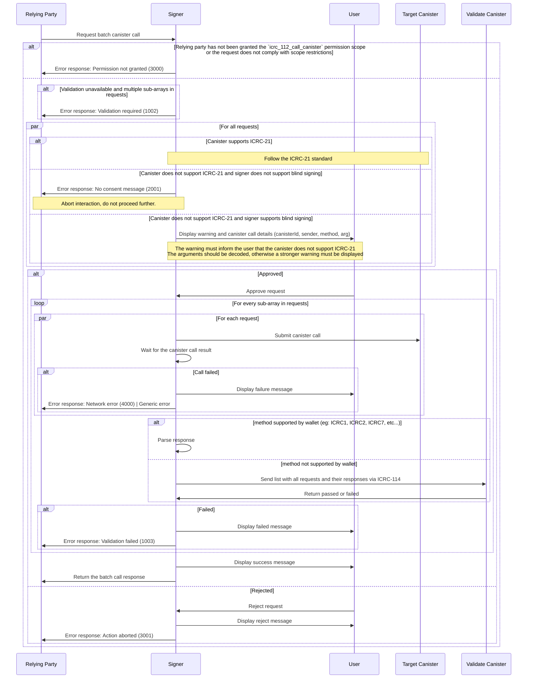

# ICRC-112: Batch Canister Call

![DRAFT] [![EXTENDS 25]](./icrc_25_signer_interaction_standard.md)

**Authors:** [Long Tran](https://github.com/baolongt), [Thomas Gladdines](https://github.com/sea-snake)

<!-- TOC -->

- [ICRC-112: Batch Canister Call](#icrc-112-batch-canister-call)
  - [Summary](#summary)
  - [Request Params](#request-params)
  - [Processing](#processing)
    - [Example Execution Order](#example-execution-order)
    - [Notes](#notes)
  - [Flow](#flow)
    - [Examples](#examples)
      - [Successful Batch Call](#successful-batch-call)
      - [Batch Call with Error](#batch-call-with-error)
  - [Errors](#errors)

## Summary

This method can be used by the relying party to request a batch call to 3rd party canister executed by the signer using the requested identity. To prevent misuses, `icrc_112_batch_call_canister` method requires that signer get approval from users to process the requests.

## Request Params

**`sender` (`text`):** The principal (textual representation) requested to execute the call.

`requests (`record` `array`)` : A list of requests

- **`canisterId` (`text`)`:** The id of the canister on which the call should be executed.
- **`method` (`text`)`:** The name of the call method to be executed.
- **`arg` (`text`)`:** The arguments for the call.
- **`nonce` (`blob` optional):** Arbitrary data of length at most 32 bytes, typically randomly generated. This can be used to create distinct requests with otherwise identical fields.

**`validation` (`record` optional)`:** Map with validation fields

- **`canisterId` (`text`):** Canister with validation method
- **`method` (`text`):** Method name to call for validation

## Processing

This standards builds on top of the canister call processing defined in [ICRC-49](https://github.com/dfinity/wg-identity-authentication/blob/main/topics/icrc_49_call_canister.md), go [here](https://github.com/dfinity/wg-identity-authentication/blob/main/topics/icrc_49_call_canister.md#message-processing) for details regarding canister call execution, processing and verification on the relying party side. All requirements, recommendations, guidelines, warnings and other details in the ICRC-49 standard should be strictly followed.

**Before execution**

It is best practice for a relying party to first call ICRC-25 to check which standards the signer supports. With ICRC-112, ICRC-25 can be useful in the following regard.

ICRC-112 can execute the transactions in the batch in parallel and in specfiiced sequences. If sequence logic included in the ICRC-112 request, the signer needs a way to validate whether a transaction was successful before executing the next transaction. Hence, when sequence logic is involved, it is recommended
- Relying party call `icrc25_request_permissions` to get list standard supported. Signers may recognize known standards such as ICRC-1, 2, 7, etc, but this is signer-specfic and not guaranteed. It is unlikely signers will recognize less known standards or custom canister calls.
- Based on the standards returned on ICRC-25, relying party only includes transactions that use standards that the signer supports to its ICRC-112 request. The signer validates success by simiply confirming that decoded certificate includes a block id. Signer doesn't interpret any other contexts of the response.
- If relying party needs to add to ICRC-112 transactions using standards that signer does not support, relying party should provide a fallback transaction status check, extra validateCanister call, that signer can use to validate transactions using standards that signer does not recognize.

Following are some of the errors, related to validation and sequences, that relying party can encounter
- `2000: Not supported` - if ICRC-112 request involves sequence logic, but there is a request that uses ICRC method that is not supported by the signer
- `1002: Validation required` - if ICRC-112 request involves sequence logic, but there is no validateCanister provide or all method is not supported by signer

**Execution**

1. The relying party submits a batch request with multiple calls grouped into sub-arrays.
2. Execution starts with the first sub-array, and calls within it run in parallel.  
3. Validation is required if there are multiple sub-arrays, but must be skipped for the last one.
   - After each request in a sub-array completes
     - If it is not an ICRC standard, its result is sent to the [ICRC-114](https://github.com/dfinity/wg-identity-authentication/pull/225) validation canister.
     - If it is in the [ICRC-25](https://github.com/dfinity/wg-identity-authentication/blob/main/topics/icrc_25_signer_interaction_standard.md) supported standard, wallet have ability to parse it. 
   - If validation fails for any request, execution stops with error code `1003` for `Validation failed`
   - If validation passes, execution continues with the next sub-array.
4. The final response is returned with the results of each call. For any requests not executed due to validation error or execution error, respond with error code `1001` for `Not processed due to batch request failure`

### Example Execution Order

```js
{
  "requests": [
    [request1, request2],   // These execute in parallel
    [request3],             // Executes only after request1 and request2 complete
    [request4]              // Executes only after request3 completes, no validation needed
  ]
}
```

### Notes

- The maximum number of requests is defined by the signer. For example, depending on the type of calls made, a signer can choose to raise or lower the limit. If too many requests are sent the signer may respond with error code `1004` for `Too many requests`

- It's up to the signer how to display the sequence of parallel requests to the user for approval. But it's recommended to show some sort of progress indicator to the user after approval, particularly for longer sequences.

- The relying party handles any errors if any transactions failed. The responses of individual transactions are aggregated into the response of the batch call. It is up to the relying party to decide how to handle any errors in the response.

## Flow



### Examples

#### Successful Batch Call

Parallel approve request, swap and then call bridge method

```json
{
  "id": 1,
  "jsonrpc": "2.0",
  "method": "icrc_112_batch_call_canisters",
  "params": {
    "sender": "b7gqo-ulk5n-2kpo7-oalt7-p2kyl-o4j5l-kiuwo-eeybr-dab4l-ur6up-pqe",
    "validation": {
      "canisterId": "zzzzz-fqaaa-aaaao-a2hlq-ca",
      "method": "validate_batch_approve_swap_bridge"
    },
    "requests": [
      [
        {
          "canisterId": "eeddf-fqaaa-aaaao-a2hlq-ca",
          "method": "icrc2_approve",
          "arg": "RElETARte24AbAKzsNrDA2ithsqDBQFsA/vKAQKi3pTrBgHYo4yoDX0BAwEdV+ztKgq7E4l1ffuTuwEmw8AtYSjlrJ+WLO5ofQIAAMgB"
        },
        {
          "canisterId": "aaabb-fqaaa-aaaao-a2hlq-ca",
          "method": "icrc2_approve",
          "arg": "RElETARte24AbAKzsNrDA2ithsqDBQFsA/vKAQKi3pTrBgHYo4yoDX0BAwEdV+ztKgq7E4l1ffuTuwEmw8AtYSjlrJ+WLO5ofQIAAMgB"
        }
      ],
      [
        {
          "canisterId": "xyzzz-fqaaa-aaaao-a2hlq-ca",
          "method": "swap",
          "arg": "RElETARte24AbAKzsNrDA2ithsqDBQFsA/vKAQKi3pTrBgHYo4yoDX0BAwEdV+ztKgq7E4l1ffuTuwEmw8AtYSjlrJ+WLO5ofQIAAMgB"
        }
      ],
      [
        {
          "canisterId": "bbbbb-fqaaa-aaaao-a2hlq-ca",
          "method": "bridge_to_eth",
          "arg": "RElETARte24AbAKzsNrDA2ithsqDBQFsA/vKAQKi3pTrBgHYo4yoDX0BAwEdV+ztKgq7E4l1ffuTuwEmw8AtYSjlrJ+WLO5ofQIAAMgB"
        }
      ]
    ]
  }
}
```

Response

```json
{
  "id": 1,
  "jsonrpc": "2.0",
  "result": {
    "responses": [
      [
        {
          "result": {
            "contentMap": "2dn3p2NhcmdYTkRJREwEbXtuAGwCs7DawwNorYbKgwUBbAP7ygECot6U6wYB2KOMqA19AQMBHVfs7SoKuxOJdX37k7sBJsPALWEo5ayflizuaH0CAADIAWtjYW5pc3Rlcl9pZEoAAAAAAcDR1wEBbmluZ3Jlc3NfZXhwaXJ5GxeNX/65y4YAa21ldGhvZF9uYW1laHRyYW5zZmVyZW5vbmNlUFF4+hAimFhoqkdUcIchz0xscmVxdWVzdF90eXBlZGNhbGxmc2VuZGVyWB1q63Snu+4C5/fpWFu4nq1IpZxCYDEYA8XSPqPfAg==",
            "certificate": "2dn3omR0cmVlgwGDAYIEWCAPzKZJY/emKhi2GGtBrnHh4cdttATd4+9GtJrNCBepb4MBgwJOcmVxdWVzdF9zdGF0dXODAYIEWCCCgynUaonrKCCywghWCSk9BeDqMoI4yf15nxyU/5JZv4MBggRYIDG7WdzQ9sGWI1MpxizUzxubsEBuNkTT94UOZ9USbzNvgwGCBFggawwbTHxnPUzBAUhWBRjk0nzPs2fPpJlaIYtj5AvcX+ODAYIEWCDiFLyaWuMWjtVurCQcSgny/cqfM8S6qrdihVq7nPz1FoMCWCD/8jdeccvqHVYf06Hw7qPXIDNimC1Uyf47VsvgqKpPiIMBgwJFcmVwbHmCA1RESURMAWsCvIoBfcX+0gFxAQAABIMCRnN0YXR1c4IDR3JlcGxpZWSCBFgg7qZngcNt2+B/RuF44W3LRsKWXG6QQg2L6GdZgJ6Nb3+DAYIEWCAx3tU/mhHfX+wDzF003eSJYN8Nebou8rTeGyxr/rUa1YMCRHRpbWWCA0nw9+r88fjXxhdpc2lnbmF0dXJlWDCXNshvwWG1jGViP7ELePGHCThBw9mts45FxIy4gZATkUEsPeJ6y+cjbn2REmB0Soo="
          }
        },
        {
          "result": {
            "contentMap": "2dn3p2NhcmdYTkRJREwEbXtuAGwCs7DawwNorYbKgwUBbAP7ygECot6U6wYB2KOMqA19AQMBHVfs7SoKuxOJdX37k7sBJsPALWEo5ayflizuaH0CAADIAWtjYW5pc3Rlcl9pZEoAAAAAAcDR1wEBbmluZ3Jlc3NfZXhwaXJ5GxeNX/65y4YAa21ldGhvZF9uYW1laHRyYW5zZmVyZW5vbmNlUFF4+hAimFhoqkdUcIchz0xscmVxdWVzdF90eXBlZGNhbGxmc2VuZGVyWB1q63Snu+4C5/fpWFu4nq1IpZxCYDEYA8XSPqPfAg==",
            "certificate": "2dn3omR0cmVlgwGDAYIEWCAPzKZJY/emKhi2GGtBrnHh4cdttATd4+9GtJrNCBepb4MBgwJOcmVxdWVzdF9zdGF0dXODAYIEWCCCgynUaonrKCCywghWCSk9BeDqMoI4yf15nxyU/5JZv4MBggRYIDG7WdzQ9sGWI1MpxizUzxubsEBuNkTT94UOZ9USbzNvgwGCBFggawwbTHxnPUzBAUhWBRjk0nzPs2fPpJlaIYtj5AvcX+ODAYIEWCDiFLyaWuMWjtVurCQcSgny/cqfM8S6qrdihVq7nPz1FoMCWCD/8jdeccvqHVYf06Hw7qPXIDNimC1Uyf47VsvgqKpPiIMBgwJFcmVwbHmCA1RESURMAWsCvIoBfcX+0gFxAQAABIMCRnN0YXR1c4IDR3JlcGxpZWSCBFgg7qZngcNt2+B/RuF44W3LRsKWXG6QQg2L6GdZgJ6Nb3+DAYIEWCAx3tU/mhHfX+wDzF003eSJYN8Nebou8rTeGyxr/rUa1YMCRHRpbWWCA0nw9+r88fjXxhdpc2lnbmF0dXJlWDCXNshvwWG1jGViP7ELePGHCThBw9mts45FxIy4gZATkUEsPeJ6y+cjbn2REmB0Soo="
          }
        }
      ],
      [
        {
          "result": {
            "contentMap": "2dn3p2NhcmdYTkRJREwEbXtuAGwCs7DawwNorYbKgwUBbAP7ygECot6U6wYB2KOMqA19AQMBHVfs7SoKuxOJdX37k7sBJsPALWEo5ayflizuaH0CAADIAWtjYW5pc3Rlcl9pZEoAAAAAAcDR1wEBbmluZ3Jlc3NfZXhwaXJ5GxeNX/65y4YAa21ldGhvZF9uYW1laHRyYW5zZmVyZW5vbmNlUFF4+hAimFhoqkdUcIchz0xscmVxdWVzdF90eXBlZGNhbGxmc2VuZGVyWB1q63Snu+4C5/fpWFu4nq1IpZxCYDEYA8XSPqPfAg==",
            "certificate": "2dn3omR0cmVlgwGDAYIEWCAPzKZJY/emKhi2GGtBrnHh4cdttATd4+9GtJrNCBepb4MBgwJOcmVxdWVzdF9zdGF0dXODAYIEWCCCgynUaonrKCCywghWCSk9BeDqMoI4yf15nxyU/5JZv4MBggRYIDG7WdzQ9sGWI1MpxizUzxubsEBuNkTT94UOZ9USbzNvgwGCBFggawwbTHxnPUzBAUhWBRjk0nzPs2fPpJlaIYtj5AvcX+ODAYIEWCDiFLyaWuMWjtVurCQcSgny/cqfM8S6qrdihVq7nPz1FoMCWCD/8jdeccvqHVYf06Hw7qPXIDNimC1Uyf47VsvgqKpPiIMBgwJFcmVwbHmCA1RESURMAWsCvIoBfcX+0gFxAQAABIMCRnN0YXR1c4IDR3JlcGxpZWSCBFgg7qZngcNt2+B/RuF44W3LRsKWXG6QQg2L6GdZgJ6Nb3+DAYIEWCAx3tU/mhHfX+wDzF003eSJYN8Nebou8rTeGyxr/rUa1YMCRHRpbWWCA0nw9+r88fjXxhdpc2lnbmF0dXJlWDCXNshvwWG1jGViP7ELePGHCThBw9mts45FxIy4gZATkUEsPeJ6y+cjbn2REmB0Soo="
          }
        }
      ],
      [
        {
          "result": {
            "contentMap": "2dn3p2NhcmdYTkRJREwEbXtuAGwCs7DawwNorYbKgwUBbAP7ygECot6U6wYB2KOMqA19AQMBHVfs7SoKuxOJdX37k7sBJsPALWEo5ayflizuaH0CAADIAWtjYW5pc3Rlcl9pZEoAAAAAAcDR1wEBbmluZ3Jlc3NfZXhwaXJ5GxeNX/65y4YAa21ldGhvZF9uYW1laHRyYW5zZmVyZW5vbmNlUFF4+hAimFhoqkdUcIchz0xscmVxdWVzdF90eXBlZGNhbGxmc2VuZGVyWB1q63Snu+4C5/fpWFu4nq1IpZxCYDEYA8XSPqPfAg==",
            "certificate": "2dn3omR0cmVlgwGDAYIEWCAPzKZJY/emKhi2GGtBrnHh4cdttATd4+9GtJrNCBepb4MBgwJOcmVxdWVzdF9zdGF0dXODAYIEWCCCgynUaonrKCCywghWCSk9BeDqMoI4yf15nxyU/5JZv4MBggRYIDG7WdzQ9sGWI1MpxizUzxubsEBuNkTT94UOZ9USbzNvgwGCBFggawwbTHxnPUzBAUhWBRjk0nzPs2fPpJlaIYtj5AvcX+ODAYIEWCDiFLyaWuMWjtVurCQcSgny/cqfM8S6qrdihVq7nPz1FoMCWCD/8jdeccvqHVYf06Hw7qPXIDNimC1Uyf47VsvgqKpPiIMBgwJFcmVwbHmCA1RESURMAWsCvIoBfcX+0gFxAQAABIMCRnN0YXR1c4IDR3JlcGxpZWSCBFgg7qZngcNt2+B/RuF44W3LRsKWXG6QQg2L6GdZgJ6Nb3+DAYIEWCAx3tU/mhHfX+wDzF003eSJYN8Nebou8rTeGyxr/rUa1YMCRHRpbWWCA0nw9+r88fjXxhdpc2lnbmF0dXJlWDCXNshvwWG1jGViP7ELePGHCThBw9mts45FxIy4gZATkUEsPeJ6y+cjbn2REmB0Soo="
          }
        }
      ]
    ]
  }
}
```

#### Batch Call with Error

1. Request failed because network error

```json
{
  "id": 1,
  "jsonrpc": "2.0",
  "method": "icrc_112_batch_call_canisters",
  "params": {
    "sender": "b7gqo-ulk5n-2kpo7-oalt7-p2kyl-o4j5l-kiuwo-eeybr-dab4l-ur6up-pqe",
    "validation": {
      "canisterId": "zzzzz-fqaaa-aaaao-a2hlq-ca",
      "method": "validate_batch_approve_swap_bridge"
    },
    "requests": [
      [
        {
          "canisterId": "eeddf-fqaaa-aaaao-a2hlq-ca",
          "method": "icrc2_approve",
          "arg": "RElETARte24AbAKzsNrDA2ithsqDBQFsA/vKAQKi3pTrBgHYo4yoDX0BAwEdV+ztKgq7E4l1ffuTuwEmw8AtYSjlrJ+WLO5ofQIAAMgB"
        },
        {
          "canisterId": "aaabb-fqaaa-aaaao-a2hlq-ca",
          "method": "icrc2_approve",
          "arg": "RElETARte24AbAKzsNrDA2ithsqDBQFsA/vKAQKi3pTrBgHYo4yoDX0BAwEdV+ztKgq7E4l1ffuTuwEmw8AtYSjlrJ+WLO5ofQIAAMgB"
        }
      ],
      [
        {
          "canisterId": "xyzzz-fqaaa-aaaao-a2hlq-ca",
          "method": "swap",
          "arg": "RElETARte24AbAKzsNrDA2ithsqDBQFsA/vKAQKi3pTrBgHYo4yoDX0BAwEdV+ztKgq7E4l1ffuTuwEmw8AtYSjlrJ+WLO5ofQIAAMgB"
        }
      ],
      [
        {
          "canisterId": "bbbbb-fqaaa-aaaao-a2hlq-ca",
          "method": "bridge_to_eth",
          "arg": "RElETARte24AbAKzsNrDA2ithsqDBQFsA/vKAQKi3pTrBgHYo4yoDX0BAwEdV+ztKgq7E4l1ffuTuwEmw8AtYSjlrJ+WLO5ofQIAAMgB"
        }
      ]
    ]
  }
}
```

Response

```json
{
  "id": 1,
  "jsonrpc": "2.0",
  "result": {
    "responses": [
      [
        {
          "result": {
            "contentMap": "2dn3p2NhcmdYTkRJREwEbXtuAGwCs7DawwNorYbKgwUBbAP7ygECot6U6wYB2KOMqA19AQMBHVfs7SoKuxOJdX37k7sBJsPALWEo5ayflizuaH0CAADIAWtjYW5pc3Rlcl9pZEoAAAAAAcDR1wEBbmluZ3Jlc3NfZXhwaXJ5GxeNX/65y4YAa21ldGhvZF9uYW1laHRyYW5zZmVyZW5vbmNlUFF4+hAimFhoqkdUcIchz0xscmVxdWVzdF90eXBlZGNhbGxmc2VuZGVyWB1q63Snu+4C5/fpWFu4nq1IpZxCYDEYA8XSPqPfAg==",
            "certificate": "2dn3omR0cmVlgwGDAYIEWCAPzKZJY/emKhi2GGtBrnHh4cdttATd4+9GtJrNCBepb4MBgwJOcmVxdWVzdF9zdGF0dXODAYIEWCCCgynUaonrKCCywghWCSk9BeDqMoI4yf15nxyU/5JZv4MBggRYIDG7WdzQ9sGWI1MpxizUzxubsEBuNkTT94UOZ9USbzNvgwGCBFggawwbTHxnPUzBAUhWBRjk0nzPs2fPpJlaIYtj5AvcX+ODAYIEWCDiFLyaWuMWjtVurCQcSgny/cqfM8S6qrdihVq7nPz1FoMCWCD/8jdeccvqHVYf06Hw7qPXIDNimC1Uyf47VsvgqKpPiIMBgwJFcmVwbHmCA1RESURMAWsCvIoBfcX+0gFxAQAABIMCRnN0YXR1c4IDR3JlcGxpZWSCBFgg7qZngcNt2+B/RuF44W3LRsKWXG6QQg2L6GdZgJ6Nb3+DAYIEWCAx3tU/mhHfX+wDzF003eSJYN8Nebou8rTeGyxr/rUa1YMCRHRpbWWCA0nw9+r88fjXxhdpc2lnbmF0dXJlWDCXNshvwWG1jGViP7ELePGHCThBw9mts45FxIy4gZATkUEsPeJ6y+cjbn2REmB0Soo="
          }
        },
        {
          "result": {
            "contentMap": "2dn3p2NhcmdYTkRJREwEbXtuAGwCs7DawwNorYbKgwUBbAP7ygECot6U6wYB2KOMqA19AQMBHVfs7SoKuxOJdX37k7sBJsPALWEo5ayflizuaH0CAADIAWtjYW5pc3Rlcl9pZEoAAAAAAcDR1wEBbmluZ3Jlc3NfZXhwaXJ5GxeNX/65y4YAa21ldGhvZF9uYW1laHRyYW5zZmVyZW5vbmNlUFF4+hAimFhoqkdUcIchz0xscmVxdWVzdF90eXBlZGNhbGxmc2VuZGVyWB1q63Snu+4C5/fpWFu4nq1IpZxCYDEYA8XSPqPfAg==",
            "certificate": "2dn3omR0cmVlgwGDAYIEWCAPzKZJY/emKhi2GGtBrnHh4cdttATd4+9GtJrNCBepb4MBgwJOcmVxdWVzdF9zdGF0dXODAYIEWCCCgynUaonrKCCywghWCSk9BeDqMoI4yf15nxyU/5JZv4MBggRYIDG7WdzQ9sGWI1MpxizUzxubsEBuNkTT94UOZ9USbzNvgwGCBFggawwbTHxnPUzBAUhWBRjk0nzPs2fPpJlaIYtj5AvcX+ODAYIEWCDiFLyaWuMWjtVurCQcSgny/cqfM8S6qrdihVq7nPz1FoMCWCD/8jdeccvqHVYf06Hw7qPXIDNimC1Uyf47VsvgqKpPiIMBgwJFcmVwbHmCA1RESURMAWsCvIoBfcX+0gFxAQAABIMCRnN0YXR1c4IDR3JlcGxpZWSCBFgg7qZngcNt2+B/RuF44W3LRsKWXG6QQg2L6GdZgJ6Nb3+DAYIEWCAx3tU/mhHfX+wDzF003eSJYN8Nebou8rTeGyxr/rUa1YMCRHRpbWWCA0nw9+r88fjXxhdpc2lnbmF0dXJlWDCXNshvwWG1jGViP7ELePGHCThBw9mts45FxIy4gZATkUEsPeJ6y+cjbn2REmB0Soo="
          }
        }
      ],
      [
        {
          "error": {
            "code": 4000,
            "message": "Network error: The network call failed."
          }
        }
      ],
      [
        {
          "error": {
            "code": 1001,
            "message": "Not processed due to batch request failure"
          }
        }
      ]
    ]
  }
}
```

3. Request failed because validate error

```json
{
  "id": 1,
  "jsonrpc": "2.0",
  "method": "icrc_112_batch_call_canisters",
  "params": {
    "sender": "b7gqo-ulk5n-2kpo7-oalt7-p2kyl-o4j5l-kiuwo-eeybr-dab4l-ur6up-pqe",
    "validation": {
      "canisterId": "zzzzz-fqaaa-aaaao-a2hlq-ca",
      "method": "validate_batch_approve_swap_bridge"
    },
    "requests": [
      [
        {
          "canisterId": "eeddf-fqaaa-aaaao-a2hlq-ca",
          "method": "icrc2_approve",
          "arg": "RElETARte24AbAKzsNrDA2ithsqDBQFsA/vKAQKi3pTrBgHYo4yoDX0BAwEdV+ztKgq7E4l1ffuTuwEmw8AtYSjlrJ+WLO5ofQIAAMgB"
        },
        {
          "canisterId": "aaabb-fqaaa-aaaao-a2hlq-ca",
          "method": "icrc2_approve",
          "arg": "RElETARte24AbAKzsNrDA2ithsqDBQFsA/vKAQKi3pTrBgHYo4yoDX0BAwEdV+ztKgq7E4l1ffuTuwEmw8AtYSjlrJ+WLO5ofQIAAMgB"
        }
      ],
      [
        {
          "canisterId": "xyzzz-fqaaa-aaaao-a2hlq-ca",
          "method": "swap",
          "arg": "RElETARte24AbAKzsNrDA2ithsqDBQFsA/vKAQKi3pTrBgHYo4yoDX0BAwEdV+ztKgq7E4l1ffuTuwEmw8AtYSjlrJ+WLO5ofQIAAMgB"
        }
      ],
      [
        {
          "canisterId": "bbbbb-fqaaa-aaaao-a2hlq-ca",
          "method": "bridge_to_eth",
          "arg": "RElETARte24AbAKzsNrDA2ithsqDBQFsA/vKAQKi3pTrBgHYo4yoDX0BAwEdV+ztKgq7E4l1ffuTuwEmw8AtYSjlrJ+WLO5ofQIAAMgB"
        }
      ]
    ]
  }
}
```

Response

```json
{
  "id": 1,
  "jsonrpc": "2.0",
  "result": {
    "responses": [
      [
        {
          "result": {
            "contentMap": "2dn3p2NhcmdYTkRJREwEbXtuAGwCs7DawwNorYbKgwUBbAP7ygECot6U6wYB2KOMqA19AQMBHVfs7SoKuxOJdX37k7sBJsPALWEo5ayflizuaH0CAADIAWtjYW5pc3Rlcl9pZEoAAAAAAcDR1wEBbmluZ3Jlc3NfZXhwaXJ5GxeNX/65y4YAa21ldGhvZF9uYW1laHRyYW5zZmVyZW5vbmNlUFF4+hAimFhoqkdUcIchz0xscmVxdWVzdF90eXBlZGNhbGxmc2VuZGVyWB1q63Snu+4C5/fpWFu4nq1IpZxCYDEYA8XSPqPfAg==",
            "certificate": "2dn3omR0cmVlgwGDAYIEWCAPzKZJY/emKhi2GGtBrnHh4cdttATd4+9GtJrNCBepb4MBgwJOcmVxdWVzdF9zdGF0dXODAYIEWCCCgynUaonrKCCywghWCSk9BeDqMoI4yf15nxyU/5JZv4MBggRYIDG7WdzQ9sGWI1MpxizUzxubsEBuNkTT94UOZ9USbzNvgwGCBFggawwbTHxnPUzBAUhWBRjk0nzPs2fPpJlaIYtj5AvcX+ODAYIEWCDiFLyaWuMWjtVurCQcSgny/cqfM8S6qrdihVq7nPz1FoMCWCD/8jdeccvqHVYf06Hw7qPXIDNimC1Uyf47VsvgqKpPiIMBgwJFcmVwbHmCA1RESURMAWsCvIoBfcX+0gFxAQAABIMCRnN0YXR1c4IDR3JlcGxpZWSCBFgg7qZngcNt2+B/RuF44W3LRsKWXG6QQg2L6GdZgJ6Nb3+DAYIEWCAx3tU/mhHfX+wDzF003eSJYN8Nebou8rTeGyxr/rUa1YMCRHRpbWWCA0nw9+r88fjXxhdpc2lnbmF0dXJlWDCXNshvwWG1jGViP7ELePGHCThBw9mts45FxIy4gZATkUEsPeJ6y+cjbn2REmB0Soo="
          }
        },
        {
          "result": {
            "contentMap": "2dn3p2NhcmdYTkRJREwEbXtuAGwCs7DawwNorYbKgwUBbAP7ygECot6U6wYB2KOMqA19AQMBHVfs7SoKuxOJdX37k7sBJsPALWEo5ayflizuaH0CAADIAWtjYW5pc3Rlcl9pZEoAAAAAAcDR1wEBbmluZ3Jlc3NfZXhwaXJ5GxeNX/65y4YAa21ldGhvZF9uYW1laHRyYW5zZmVyZW5vbmNlUFF4+hAimFhoqkdUcIchz0xscmVxdWVzdF90eXBlZGNhbGxmc2VuZGVyWB1q63Snu+4C5/fpWFu4nq1IpZxCYDEYA8XSPqPfAg==",
            "certificate": "2dn3omR0cmVlgwGDAYIEWCAPzKZJY/emKhi2GGtBrnHh4cdttATd4+9GtJrNCBepb4MBgwJOcmVxdWVzdF9zdGF0dXODAYIEWCCCgynUaonrKCCywghWCSk9BeDqMoI4yf15nxyU/5JZv4MBggRYIDG7WdzQ9sGWI1MpxizUzxubsEBuNkTT94UOZ9USbzNvgwGCBFggawwbTHxnPUzBAUhWBRjk0nzPs2fPpJlaIYtj5AvcX+ODAYIEWCDiFLyaWuMWjtVurCQcSgny/cqfM8S6qrdihVq7nPz1FoMCWCD/8jdeccvqHVYf06Hw7qPXIDNimC1Uyf47VsvgqKpPiIMBgwJFcmVwbHmCA1RESURMAWsCvIoBfcX+0gFxAQAABIMCRnN0YXR1c4IDR3JlcGxpZWSCBFgg7qZngcNt2+B/RuF44W3LRsKWXG6QQg2L6GdZgJ6Nb3+DAYIEWCAx3tU/mhHfX+wDzF003eSJYN8Nebou8rTeGyxr/rUa1YMCRHRpbWWCA0nw9+r88fjXxhdpc2lnbmF0dXJlWDCXNshvwWG1jGViP7ELePGHCThBw9mts45FxIy4gZATkUEsPeJ6y+cjbn2REmB0Soo="
          }
        }
      ],
      [
        {
          "error": {
            "code": 1002,
            "message": "Validation failed",
            "contentMap": "2dn3p2NhcmdYTkRJREwEbXtuAGwCs7DawwNorYbKgwUBbAP7ygECot6U6wYB2KOMqA19AQMBHVfs7SoKuxOJdX37k7sBJsPALWEo5ayflizuaH0CAADIAWtjYW5pc3Rlcl9pZEoAAAAAAcDR1wEBbmluZ3Jlc3NfZXhwaXJ5GxeNX/65y4YAa21ldGhvZF9uYW1laHRyYW5zZmVyZW5vbmNlUFF4+hAimFhoqkdUcIchz0xscmVxdWVzdF90eXBlZGNhbGxmc2VuZGVyWB1q63Snu+4C5/fpWFu4nq1IpZxCYDEYA8XSPqPfAg==",
            "certificate": "2dn3omR0cmVlgwGDAYIEWCAPzKZJY/emKhi2GGtBrnHh4cdttATd4+9GtJrNCBepb4MBgwJOcmVxdWVzdF9zdGF0dXODAYIEWCCCgynUaonrKCCywghWCSk9BeDqMoI4yf15nxyU/5JZv4MBggRYIDG7WdzQ9sGWI1MpxizUzxubsEBuNkTT94UOZ9USbzNvgwGCBFggawwbTHxnPUzBAUhWBRjk0nzPs2fPpJlaIYtj5AvcX+ODAYIEWCDiFLyaWuMWjtVurCQcSgny/cqfM8S6qrdihVq7nPz1FoMCWCD/8jdeccvqHVYf06Hw7qPXIDNimC1Uyf47VsvgqKpPiIMBgwJFcmVwbHmCA1RESURMAWsCvIoBfcX+0gFxAQAABIMCRnN0YXR1c4IDR3JlcGxpZWSCBFgg7qZngcNt2+B/RuF44W3LRsKWXG6QQg2L6GdZgJ6Nb3+DAYIEWCAx3tU/mhHfX+wDzF003eSJYN8Nebou8rTeGyxr/rUa1YMCRHRpbWWCA0nw9+r88fjXxhdpc2lnbmF0dXJlWDCXNshvwWG1jGViP7ELePGHCThBw9mts45FxIy4gZATkUEsPeJ6y+cjbn2REmB0Soo="
          }
        }
      ],
      [
        {
          "error": {
            "code": 1001,
            "message": "Not processed due to batch request failure"
          }
        }
      ]
    ]
  }
}
```

## Errors

In addition to the errors defined in [ICRC-25](./icrc_25_signer_interaction_standard.md#errors-3) this standard defines the following errors:

| Code | Message                                    | Meaning                                                                                          | Data                                                                                |
| ---- | ------------------------------------------ | ------------------------------------------------------------------------------------------------ | ----------------------------------------------------------------------------------- |
| 1001 | Not processed due to batch request failure | The message was not processed as one of the preceding request in the batch resulted in an error. | (optional) Error details: <ul> <li>`message` (`text`, optional): message</li> </ul> |
| 1002 | Validation required                        | Validation argument is missing but required for multiple sub-arrays of requests                  | (optional) Error details: <ul> <li>`message` (`text`, optional): message</li> </ul> |
| 1003 | Validation failed                          | The request is successfully called but the validate canister return false                        | (optional) Error details: <ul> <li>`message` (`text`, optional): message</li> </ul> |
| 1004 | Too many requests                          | The request array reached the limit, defined by the signer                                       | (optional) Error details: <ul> <li>`message` (`text`, optional): message</li> </ul> |

[DRAFT]: https://img.shields.io/badge/STATUS-DRAFT-f25a24.svg
[EXTENDS 25]: https://img.shields.io/badge/EXTENDS-ICRC--25-ed1e7a.svg
