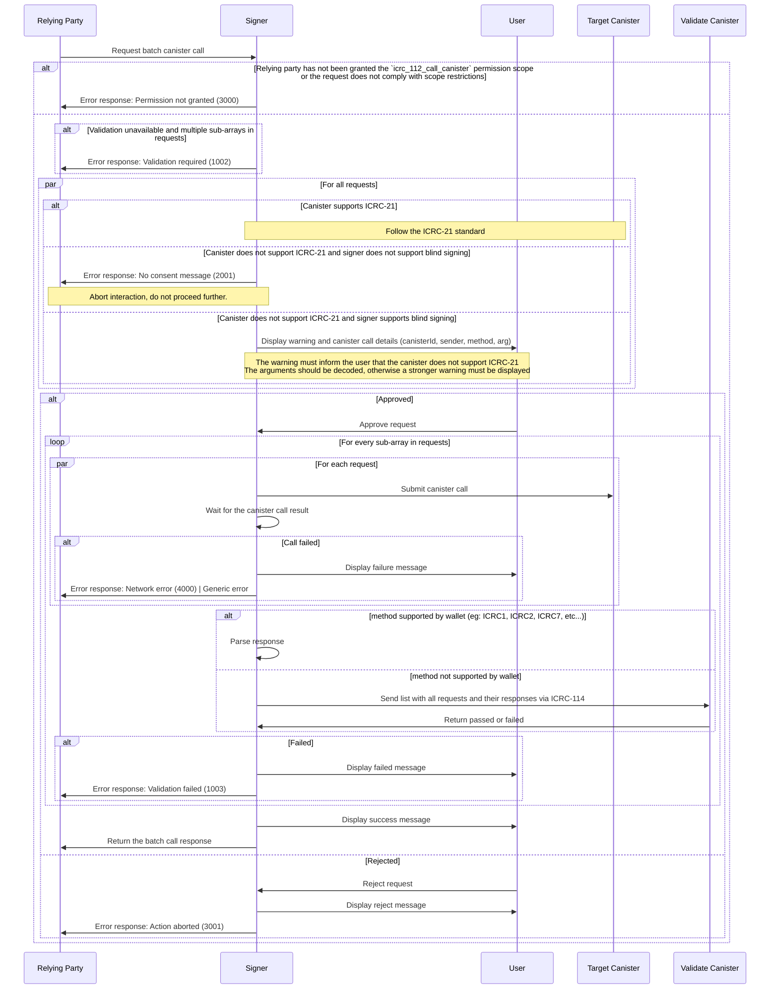

# ICRC-112: Batch Canister Call

![DRAFT] [![EXTENDS 25]](./icrc_25_signer_interaction_standard.md)

**Authors:** [Long Tran](https://github.com/baolongt), [Thomas Gladdines](https://github.com/sea-snake)

<!-- TOC -->

- [ICRC-112: Batch Canister Call](#icrc-112-batch-canister-call)
  - [Summary](#summary)
  - [Request Params](#request-params)
  - [Processing](#processing)
    - [Example Execution Order](#example-execution-order)
    - [Notes](#notes)
  - [Flow](#flow)
    - [Examples](#examples)
      - [Successful Batch Call](#successful-batch-call)
      - [Batch Call with Error](#batch-call-with-error)
  - [Errors](#errors)

## Summary

`icrc_112_batch_call_canister` method can be used by the relying party to request a batch call to a signer. To prevent misuses, the method requires that signer get approval from users to process the requests. 

Key differentiators of this method is that
- it requires only one approval for all the requets in the batch
- relying party can specify whether requests in the batch should be executed in parallel or in specfiiced sequences

## Request Params

**`sender` (`text`):** The principal (textual representation) requested to execute the call.

`requests (`record` `array`)` : A list of requests

- **`canisterId` (`text`)`:** The id of the canister on which the call should be executed.
- **`method` (`text`)`:** The name of the call method to be executed.
- **`arg` (`text`)`:** The arguments for the call.
- **`nonce` (`blob` optional):** Arbitrary data of length at most 32 bytes, typically randomly generated. This can be used to create distinct requests with otherwise identical fields.

**`validation` (`record` optional)`:** Map with validation fields

- **`canisterId` (`text`):** Canister with validation method
- **`method` (`text`):** Method name to call for validation

## Processing

This standards builds on top of the canister call processing defined in [ICRC-49](https://github.com/dfinity/wg-identity-authentication/blob/main/topics/icrc_49_call_canister.md), go [here](https://github.com/dfinity/wg-identity-authentication/blob/main/topics/icrc_49_call_canister.md#message-processing) for details regarding canister call execution, processing and verification on the relying party side. All requirements, recommendations, guidelines, warnings and other details in the ICRC-49 standard should be strictly followed.

 

**Parallel & sequence logic**

Relying party can specify whether requests in ICRC-112 should be executed in parallel or in specfiiced sequences. Below is how such logic is handled.

ICRC-112 is constructed as array & sub-array of requests. Please see example below.
- The requests in the sub-array are executed in parallel. 
- The requests in the next array (if any) are executed only after all transactions in previous array are validated (how validation is done is described in next section)

There is only one response from ICRC-112, which includes the results from individual request calls. 

```js
// Example execution order
{
  "requests": [
    [request1, request2, request3],   // These execute in parallel
    [request3, request4],             // Executes only after request1-3 are validated
    [request5]                        // Executes only after request3-4 are validated (request 5 itself is not validated)
  ]
}
```

**Validation**

If sequence logic is involved, the signer needs a way to validate whether a preceding request was successful before executing the next request. Because standards and canister calls vary, receiving a response is not sufficient to validate that the request was successfully complete. 

ICRC-112 defines validation success of a request in the following way:
- If there is no sequence logic, request call should have received response 
- If there is sequence logic, request call should have received response AND
  - If the signer supoprts the standard used by request, decoded certificate should have block id
  - If the signer does not support the standard used by request, canisterValidation call should return success

If the validation failed in any of the steps above, ICRC-112 will return a `1003` for `Validation failed` error.

When there is a sequence logic and the request uses a standard that the signer recognizes, the signer checks if decoded certificate includes a block id. Signer provides this check on the signer to enable speedy execution. But it keeps the validation process simple by just checking if there is a block id. It doesn't interpret any other contexts of the response. 

When there is a sequence logic but the request uses a standard that the signer does not recognize, the signer resorts to a fallback transaction status check (canisterValidation call) that the relying party provided with ICRC-112. If the relying party did not provide canisterValidation call info, signer will return a `1002: Validation required` error when it encounters requests that uses standards that it does not recognize. The canisterValidation is implmeented as a separate standard [ICRC-114](https://github.com/dfinity/wg-identity-authentication/pull/225).


**Using ICRC-25 wtih ICRC-112**

Not all signer support the same standards. Hence, prior to calling ICRC-112, it may be helpful to make an [ICRC-25](https://github.com/dfinity/wg-identity-authentication/blob/main/topics/icrc_25_signer_interaction_standard.md) request to check which standards the signer supports. 

Best practice would be to construct ICRC-112 using only standards that the signer supports. This would be the fastest solution, since the signer would do any validation logic directly on the signer.

However, if it is unavoidable to use standards that the signer does not support, the relying party could include canisterValidation call as fallback. This solution would be a bit slower since there is an external validation call involved. But providing a fallback canisterValidation call would make the implementation more robust, in case the relying party encounters wallets that do not support certain standards thats used by the relying party ICRC-112 batch transactions.

## Notes

- The maximum number of requests is defined by the signer. For example, depending on the type of calls made, a signer can choose to raise or lower the limit. If too many requests are sent the signer may respond with error code `1004` for `Too many requests`

- It's up to the signer how to display the sequence of parallel requests to the user for approval. But it's recommended to show some sort of progress indicator to the user after approval, particularly for longer sequences.

- The relying party handles any errors if any transactions failed. The responses of individual transactions are aggregated into the response of the batch call. It is up to the relying party to decide how to handle any errors in the response.

## Flow



### Examples

#### Successful Batch Call

Parallel approve request, swap and then call bridge method

```json
{
  "id": 1,
  "jsonrpc": "2.0",
  "method": "icrc_112_batch_call_canisters",
  "params": {
    "sender": "b7gqo-ulk5n-2kpo7-oalt7-p2kyl-o4j5l-kiuwo-eeybr-dab4l-ur6up-pqe",
    "validation": {
      "canisterId": "zzzzz-fqaaa-aaaao-a2hlq-ca",
      "method": "validate_batch_approve_swap_bridge"
    },
    "requests": [
      [
        {
          "canisterId": "eeddf-fqaaa-aaaao-a2hlq-ca",
          "method": "icrc2_approve",
          "arg": "RElETARte24AbAKzsNrDA2ithsqDBQFsA/vKAQKi3pTrBgHYo4yoDX0BAwEdV+ztKgq7E4l1ffuTuwEmw8AtYSjlrJ+WLO5ofQIAAMgB"
        },
        {
          "canisterId": "aaabb-fqaaa-aaaao-a2hlq-ca",
          "method": "icrc2_approve",
          "arg": "RElETARte24AbAKzsNrDA2ithsqDBQFsA/vKAQKi3pTrBgHYo4yoDX0BAwEdV+ztKgq7E4l1ffuTuwEmw8AtYSjlrJ+WLO5ofQIAAMgB"
        }
      ],
      [
        {
          "canisterId": "xyzzz-fqaaa-aaaao-a2hlq-ca",
          "method": "swap",
          "arg": "RElETARte24AbAKzsNrDA2ithsqDBQFsA/vKAQKi3pTrBgHYo4yoDX0BAwEdV+ztKgq7E4l1ffuTuwEmw8AtYSjlrJ+WLO5ofQIAAMgB"
        }
      ],
      [
        {
          "canisterId": "bbbbb-fqaaa-aaaao-a2hlq-ca",
          "method": "bridge_to_eth",
          "arg": "RElETARte24AbAKzsNrDA2ithsqDBQFsA/vKAQKi3pTrBgHYo4yoDX0BAwEdV+ztKgq7E4l1ffuTuwEmw8AtYSjlrJ+WLO5ofQIAAMgB"
        }
      ]
    ]
  }
}
```

Response

```json
{
  "id": 1,
  "jsonrpc": "2.0",
  "result": {
    "responses": [
      [
        {
          "result": {
            "contentMap": "2dn3p2NhcmdYTkRJREwEbXtuAGwCs7DawwNorYbKgwUBbAP7ygECot6U6wYB2KOMqA19AQMBHVfs7SoKuxOJdX37k7sBJsPALWEo5ayflizuaH0CAADIAWtjYW5pc3Rlcl9pZEoAAAAAAcDR1wEBbmluZ3Jlc3NfZXhwaXJ5GxeNX/65y4YAa21ldGhvZF9uYW1laHRyYW5zZmVyZW5vbmNlUFF4+hAimFhoqkdUcIchz0xscmVxdWVzdF90eXBlZGNhbGxmc2VuZGVyWB1q63Snu+4C5/fpWFu4nq1IpZxCYDEYA8XSPqPfAg==",
            "certificate": "2dn3omR0cmVlgwGDAYIEWCAPzKZJY/emKhi2GGtBrnHh4cdttATd4+9GtJrNCBepb4MBgwJOcmVxdWVzdF9zdGF0dXODAYIEWCCCgynUaonrKCCywghWCSk9BeDqMoI4yf15nxyU/5JZv4MBggRYIDG7WdzQ9sGWI1MpxizUzxubsEBuNkTT94UOZ9USbzNvgwGCBFggawwbTHxnPUzBAUhWBRjk0nzPs2fPpJlaIYtj5AvcX+ODAYIEWCDiFLyaWuMWjtVurCQcSgny/cqfM8S6qrdihVq7nPz1FoMCWCD/8jdeccvqHVYf06Hw7qPXIDNimC1Uyf47VsvgqKpPiIMBgwJFcmVwbHmCA1RESURMAWsCvIoBfcX+0gFxAQAABIMCRnN0YXR1c4IDR3JlcGxpZWSCBFgg7qZngcNt2+B/RuF44W3LRsKWXG6QQg2L6GdZgJ6Nb3+DAYIEWCAx3tU/mhHfX+wDzF003eSJYN8Nebou8rTeGyxr/rUa1YMCRHRpbWWCA0nw9+r88fjXxhdpc2lnbmF0dXJlWDCXNshvwWG1jGViP7ELePGHCThBw9mts45FxIy4gZATkUEsPeJ6y+cjbn2REmB0Soo="
          }
        },
        {
          "result": {
            "contentMap": "2dn3p2NhcmdYTkRJREwEbXtuAGwCs7DawwNorYbKgwUBbAP7ygECot6U6wYB2KOMqA19AQMBHVfs7SoKuxOJdX37k7sBJsPALWEo5ayflizuaH0CAADIAWtjYW5pc3Rlcl9pZEoAAAAAAcDR1wEBbmluZ3Jlc3NfZXhwaXJ5GxeNX/65y4YAa21ldGhvZF9uYW1laHRyYW5zZmVyZW5vbmNlUFF4+hAimFhoqkdUcIchz0xscmVxdWVzdF90eXBlZGNhbGxmc2VuZGVyWB1q63Snu+4C5/fpWFu4nq1IpZxCYDEYA8XSPqPfAg==",
            "certificate": "2dn3omR0cmVlgwGDAYIEWCAPzKZJY/emKhi2GGtBrnHh4cdttATd4+9GtJrNCBepb4MBgwJOcmVxdWVzdF9zdGF0dXODAYIEWCCCgynUaonrKCCywghWCSk9BeDqMoI4yf15nxyU/5JZv4MBggRYIDG7WdzQ9sGWI1MpxizUzxubsEBuNkTT94UOZ9USbzNvgwGCBFggawwbTHxnPUzBAUhWBRjk0nzPs2fPpJlaIYtj5AvcX+ODAYIEWCDiFLyaWuMWjtVurCQcSgny/cqfM8S6qrdihVq7nPz1FoMCWCD/8jdeccvqHVYf06Hw7qPXIDNimC1Uyf47VsvgqKpPiIMBgwJFcmVwbHmCA1RESURMAWsCvIoBfcX+0gFxAQAABIMCRnN0YXR1c4IDR3JlcGxpZWSCBFgg7qZngcNt2+B/RuF44W3LRsKWXG6QQg2L6GdZgJ6Nb3+DAYIEWCAx3tU/mhHfX+wDzF003eSJYN8Nebou8rTeGyxr/rUa1YMCRHRpbWWCA0nw9+r88fjXxhdpc2lnbmF0dXJlWDCXNshvwWG1jGViP7ELePGHCThBw9mts45FxIy4gZATkUEsPeJ6y+cjbn2REmB0Soo="
          }
        }
      ],
      [
        {
          "result": {
            "contentMap": "2dn3p2NhcmdYTkRJREwEbXtuAGwCs7DawwNorYbKgwUBbAP7ygECot6U6wYB2KOMqA19AQMBHVfs7SoKuxOJdX37k7sBJsPALWEo5ayflizuaH0CAADIAWtjYW5pc3Rlcl9pZEoAAAAAAcDR1wEBbmluZ3Jlc3NfZXhwaXJ5GxeNX/65y4YAa21ldGhvZF9uYW1laHRyYW5zZmVyZW5vbmNlUFF4+hAimFhoqkdUcIchz0xscmVxdWVzdF90eXBlZGNhbGxmc2VuZGVyWB1q63Snu+4C5/fpWFu4nq1IpZxCYDEYA8XSPqPfAg==",
            "certificate": "2dn3omR0cmVlgwGDAYIEWCAPzKZJY/emKhi2GGtBrnHh4cdttATd4+9GtJrNCBepb4MBgwJOcmVxdWVzdF9zdGF0dXODAYIEWCCCgynUaonrKCCywghWCSk9BeDqMoI4yf15nxyU/5JZv4MBggRYIDG7WdzQ9sGWI1MpxizUzxubsEBuNkTT94UOZ9USbzNvgwGCBFggawwbTHxnPUzBAUhWBRjk0nzPs2fPpJlaIYtj5AvcX+ODAYIEWCDiFLyaWuMWjtVurCQcSgny/cqfM8S6qrdihVq7nPz1FoMCWCD/8jdeccvqHVYf06Hw7qPXIDNimC1Uyf47VsvgqKpPiIMBgwJFcmVwbHmCA1RESURMAWsCvIoBfcX+0gFxAQAABIMCRnN0YXR1c4IDR3JlcGxpZWSCBFgg7qZngcNt2+B/RuF44W3LRsKWXG6QQg2L6GdZgJ6Nb3+DAYIEWCAx3tU/mhHfX+wDzF003eSJYN8Nebou8rTeGyxr/rUa1YMCRHRpbWWCA0nw9+r88fjXxhdpc2lnbmF0dXJlWDCXNshvwWG1jGViP7ELePGHCThBw9mts45FxIy4gZATkUEsPeJ6y+cjbn2REmB0Soo="
          }
        }
      ],
      [
        {
          "result": {
            "contentMap": "2dn3p2NhcmdYTkRJREwEbXtuAGwCs7DawwNorYbKgwUBbAP7ygECot6U6wYB2KOMqA19AQMBHVfs7SoKuxOJdX37k7sBJsPALWEo5ayflizuaH0CAADIAWtjYW5pc3Rlcl9pZEoAAAAAAcDR1wEBbmluZ3Jlc3NfZXhwaXJ5GxeNX/65y4YAa21ldGhvZF9uYW1laHRyYW5zZmVyZW5vbmNlUFF4+hAimFhoqkdUcIchz0xscmVxdWVzdF90eXBlZGNhbGxmc2VuZGVyWB1q63Snu+4C5/fpWFu4nq1IpZxCYDEYA8XSPqPfAg==",
            "certificate": "2dn3omR0cmVlgwGDAYIEWCAPzKZJY/emKhi2GGtBrnHh4cdttATd4+9GtJrNCBepb4MBgwJOcmVxdWVzdF9zdGF0dXODAYIEWCCCgynUaonrKCCywghWCSk9BeDqMoI4yf15nxyU/5JZv4MBggRYIDG7WdzQ9sGWI1MpxizUzxubsEBuNkTT94UOZ9USbzNvgwGCBFggawwbTHxnPUzBAUhWBRjk0nzPs2fPpJlaIYtj5AvcX+ODAYIEWCDiFLyaWuMWjtVurCQcSgny/cqfM8S6qrdihVq7nPz1FoMCWCD/8jdeccvqHVYf06Hw7qPXIDNimC1Uyf47VsvgqKpPiIMBgwJFcmVwbHmCA1RESURMAWsCvIoBfcX+0gFxAQAABIMCRnN0YXR1c4IDR3JlcGxpZWSCBFgg7qZngcNt2+B/RuF44W3LRsKWXG6QQg2L6GdZgJ6Nb3+DAYIEWCAx3tU/mhHfX+wDzF003eSJYN8Nebou8rTeGyxr/rUa1YMCRHRpbWWCA0nw9+r88fjXxhdpc2lnbmF0dXJlWDCXNshvwWG1jGViP7ELePGHCThBw9mts45FxIy4gZATkUEsPeJ6y+cjbn2REmB0Soo="
          }
        }
      ]
    ]
  }
}
```

#### Batch Call with Error

1. Request failed because network error

```json
{
  "id": 1,
  "jsonrpc": "2.0",
  "method": "icrc_112_batch_call_canisters",
  "params": {
    "sender": "b7gqo-ulk5n-2kpo7-oalt7-p2kyl-o4j5l-kiuwo-eeybr-dab4l-ur6up-pqe",
    "validation": {
      "canisterId": "zzzzz-fqaaa-aaaao-a2hlq-ca",
      "method": "validate_batch_approve_swap_bridge"
    },
    "requests": [
      [
        {
          "canisterId": "eeddf-fqaaa-aaaao-a2hlq-ca",
          "method": "icrc2_approve",
          "arg": "RElETARte24AbAKzsNrDA2ithsqDBQFsA/vKAQKi3pTrBgHYo4yoDX0BAwEdV+ztKgq7E4l1ffuTuwEmw8AtYSjlrJ+WLO5ofQIAAMgB"
        },
        {
          "canisterId": "aaabb-fqaaa-aaaao-a2hlq-ca",
          "method": "icrc2_approve",
          "arg": "RElETARte24AbAKzsNrDA2ithsqDBQFsA/vKAQKi3pTrBgHYo4yoDX0BAwEdV+ztKgq7E4l1ffuTuwEmw8AtYSjlrJ+WLO5ofQIAAMgB"
        }
      ],
      [
        {
          "canisterId": "xyzzz-fqaaa-aaaao-a2hlq-ca",
          "method": "swap",
          "arg": "RElETARte24AbAKzsNrDA2ithsqDBQFsA/vKAQKi3pTrBgHYo4yoDX0BAwEdV+ztKgq7E4l1ffuTuwEmw8AtYSjlrJ+WLO5ofQIAAMgB"
        }
      ],
      [
        {
          "canisterId": "bbbbb-fqaaa-aaaao-a2hlq-ca",
          "method": "bridge_to_eth",
          "arg": "RElETARte24AbAKzsNrDA2ithsqDBQFsA/vKAQKi3pTrBgHYo4yoDX0BAwEdV+ztKgq7E4l1ffuTuwEmw8AtYSjlrJ+WLO5ofQIAAMgB"
        }
      ]
    ]
  }
}
```

Response

```json
{
  "id": 1,
  "jsonrpc": "2.0",
  "result": {
    "responses": [
      [
        {
          "result": {
            "contentMap": "2dn3p2NhcmdYTkRJREwEbXtuAGwCs7DawwNorYbKgwUBbAP7ygECot6U6wYB2KOMqA19AQMBHVfs7SoKuxOJdX37k7sBJsPALWEo5ayflizuaH0CAADIAWtjYW5pc3Rlcl9pZEoAAAAAAcDR1wEBbmluZ3Jlc3NfZXhwaXJ5GxeNX/65y4YAa21ldGhvZF9uYW1laHRyYW5zZmVyZW5vbmNlUFF4+hAimFhoqkdUcIchz0xscmVxdWVzdF90eXBlZGNhbGxmc2VuZGVyWB1q63Snu+4C5/fpWFu4nq1IpZxCYDEYA8XSPqPfAg==",
            "certificate": "2dn3omR0cmVlgwGDAYIEWCAPzKZJY/emKhi2GGtBrnHh4cdttATd4+9GtJrNCBepb4MBgwJOcmVxdWVzdF9zdGF0dXODAYIEWCCCgynUaonrKCCywghWCSk9BeDqMoI4yf15nxyU/5JZv4MBggRYIDG7WdzQ9sGWI1MpxizUzxubsEBuNkTT94UOZ9USbzNvgwGCBFggawwbTHxnPUzBAUhWBRjk0nzPs2fPpJlaIYtj5AvcX+ODAYIEWCDiFLyaWuMWjtVurCQcSgny/cqfM8S6qrdihVq7nPz1FoMCWCD/8jdeccvqHVYf06Hw7qPXIDNimC1Uyf47VsvgqKpPiIMBgwJFcmVwbHmCA1RESURMAWsCvIoBfcX+0gFxAQAABIMCRnN0YXR1c4IDR3JlcGxpZWSCBFgg7qZngcNt2+B/RuF44W3LRsKWXG6QQg2L6GdZgJ6Nb3+DAYIEWCAx3tU/mhHfX+wDzF003eSJYN8Nebou8rTeGyxr/rUa1YMCRHRpbWWCA0nw9+r88fjXxhdpc2lnbmF0dXJlWDCXNshvwWG1jGViP7ELePGHCThBw9mts45FxIy4gZATkUEsPeJ6y+cjbn2REmB0Soo="
          }
        },
        {
          "result": {
            "contentMap": "2dn3p2NhcmdYTkRJREwEbXtuAGwCs7DawwNorYbKgwUBbAP7ygECot6U6wYB2KOMqA19AQMBHVfs7SoKuxOJdX37k7sBJsPALWEo5ayflizuaH0CAADIAWtjYW5pc3Rlcl9pZEoAAAAAAcDR1wEBbmluZ3Jlc3NfZXhwaXJ5GxeNX/65y4YAa21ldGhvZF9uYW1laHRyYW5zZmVyZW5vbmNlUFF4+hAimFhoqkdUcIchz0xscmVxdWVzdF90eXBlZGNhbGxmc2VuZGVyWB1q63Snu+4C5/fpWFu4nq1IpZxCYDEYA8XSPqPfAg==",
            "certificate": "2dn3omR0cmVlgwGDAYIEWCAPzKZJY/emKhi2GGtBrnHh4cdttATd4+9GtJrNCBepb4MBgwJOcmVxdWVzdF9zdGF0dXODAYIEWCCCgynUaonrKCCywghWCSk9BeDqMoI4yf15nxyU/5JZv4MBggRYIDG7WdzQ9sGWI1MpxizUzxubsEBuNkTT94UOZ9USbzNvgwGCBFggawwbTHxnPUzBAUhWBRjk0nzPs2fPpJlaIYtj5AvcX+ODAYIEWCDiFLyaWuMWjtVurCQcSgny/cqfM8S6qrdihVq7nPz1FoMCWCD/8jdeccvqHVYf06Hw7qPXIDNimC1Uyf47VsvgqKpPiIMBgwJFcmVwbHmCA1RESURMAWsCvIoBfcX+0gFxAQAABIMCRnN0YXR1c4IDR3JlcGxpZWSCBFgg7qZngcNt2+B/RuF44W3LRsKWXG6QQg2L6GdZgJ6Nb3+DAYIEWCAx3tU/mhHfX+wDzF003eSJYN8Nebou8rTeGyxr/rUa1YMCRHRpbWWCA0nw9+r88fjXxhdpc2lnbmF0dXJlWDCXNshvwWG1jGViP7ELePGHCThBw9mts45FxIy4gZATkUEsPeJ6y+cjbn2REmB0Soo="
          }
        }
      ],
      [
        {
          "error": {
            "code": 4000,
            "message": "Network error: The network call failed."
          }
        }
      ],
      [
        {
          "error": {
            "code": 1001,
            "message": "Not processed due to batch request failure"
          }
        }
      ]
    ]
  }
}
```

3. Request failed because validate error

```json
{
  "id": 1,
  "jsonrpc": "2.0",
  "method": "icrc_112_batch_call_canisters",
  "params": {
    "sender": "b7gqo-ulk5n-2kpo7-oalt7-p2kyl-o4j5l-kiuwo-eeybr-dab4l-ur6up-pqe",
    "validation": {
      "canisterId": "zzzzz-fqaaa-aaaao-a2hlq-ca",
      "method": "validate_batch_approve_swap_bridge"
    },
    "requests": [
      [
        {
          "canisterId": "eeddf-fqaaa-aaaao-a2hlq-ca",
          "method": "icrc2_approve",
          "arg": "RElETARte24AbAKzsNrDA2ithsqDBQFsA/vKAQKi3pTrBgHYo4yoDX0BAwEdV+ztKgq7E4l1ffuTuwEmw8AtYSjlrJ+WLO5ofQIAAMgB"
        },
        {
          "canisterId": "aaabb-fqaaa-aaaao-a2hlq-ca",
          "method": "icrc2_approve",
          "arg": "RElETARte24AbAKzsNrDA2ithsqDBQFsA/vKAQKi3pTrBgHYo4yoDX0BAwEdV+ztKgq7E4l1ffuTuwEmw8AtYSjlrJ+WLO5ofQIAAMgB"
        }
      ],
      [
        {
          "canisterId": "xyzzz-fqaaa-aaaao-a2hlq-ca",
          "method": "swap",
          "arg": "RElETARte24AbAKzsNrDA2ithsqDBQFsA/vKAQKi3pTrBgHYo4yoDX0BAwEdV+ztKgq7E4l1ffuTuwEmw8AtYSjlrJ+WLO5ofQIAAMgB"
        }
      ],
      [
        {
          "canisterId": "bbbbb-fqaaa-aaaao-a2hlq-ca",
          "method": "bridge_to_eth",
          "arg": "RElETARte24AbAKzsNrDA2ithsqDBQFsA/vKAQKi3pTrBgHYo4yoDX0BAwEdV+ztKgq7E4l1ffuTuwEmw8AtYSjlrJ+WLO5ofQIAAMgB"
        }
      ]
    ]
  }
}
```

Response

```json
{
  "id": 1,
  "jsonrpc": "2.0",
  "result": {
    "responses": [
      [
        {
          "result": {
            "contentMap": "2dn3p2NhcmdYTkRJREwEbXtuAGwCs7DawwNorYbKgwUBbAP7ygECot6U6wYB2KOMqA19AQMBHVfs7SoKuxOJdX37k7sBJsPALWEo5ayflizuaH0CAADIAWtjYW5pc3Rlcl9pZEoAAAAAAcDR1wEBbmluZ3Jlc3NfZXhwaXJ5GxeNX/65y4YAa21ldGhvZF9uYW1laHRyYW5zZmVyZW5vbmNlUFF4+hAimFhoqkdUcIchz0xscmVxdWVzdF90eXBlZGNhbGxmc2VuZGVyWB1q63Snu+4C5/fpWFu4nq1IpZxCYDEYA8XSPqPfAg==",
            "certificate": "2dn3omR0cmVlgwGDAYIEWCAPzKZJY/emKhi2GGtBrnHh4cdttATd4+9GtJrNCBepb4MBgwJOcmVxdWVzdF9zdGF0dXODAYIEWCCCgynUaonrKCCywghWCSk9BeDqMoI4yf15nxyU/5JZv4MBggRYIDG7WdzQ9sGWI1MpxizUzxubsEBuNkTT94UOZ9USbzNvgwGCBFggawwbTHxnPUzBAUhWBRjk0nzPs2fPpJlaIYtj5AvcX+ODAYIEWCDiFLyaWuMWjtVurCQcSgny/cqfM8S6qrdihVq7nPz1FoMCWCD/8jdeccvqHVYf06Hw7qPXIDNimC1Uyf47VsvgqKpPiIMBgwJFcmVwbHmCA1RESURMAWsCvIoBfcX+0gFxAQAABIMCRnN0YXR1c4IDR3JlcGxpZWSCBFgg7qZngcNt2+B/RuF44W3LRsKWXG6QQg2L6GdZgJ6Nb3+DAYIEWCAx3tU/mhHfX+wDzF003eSJYN8Nebou8rTeGyxr/rUa1YMCRHRpbWWCA0nw9+r88fjXxhdpc2lnbmF0dXJlWDCXNshvwWG1jGViP7ELePGHCThBw9mts45FxIy4gZATkUEsPeJ6y+cjbn2REmB0Soo="
          }
        },
        {
          "result": {
            "contentMap": "2dn3p2NhcmdYTkRJREwEbXtuAGwCs7DawwNorYbKgwUBbAP7ygECot6U6wYB2KOMqA19AQMBHVfs7SoKuxOJdX37k7sBJsPALWEo5ayflizuaH0CAADIAWtjYW5pc3Rlcl9pZEoAAAAAAcDR1wEBbmluZ3Jlc3NfZXhwaXJ5GxeNX/65y4YAa21ldGhvZF9uYW1laHRyYW5zZmVyZW5vbmNlUFF4+hAimFhoqkdUcIchz0xscmVxdWVzdF90eXBlZGNhbGxmc2VuZGVyWB1q63Snu+4C5/fpWFu4nq1IpZxCYDEYA8XSPqPfAg==",
            "certificate": "2dn3omR0cmVlgwGDAYIEWCAPzKZJY/emKhi2GGtBrnHh4cdttATd4+9GtJrNCBepb4MBgwJOcmVxdWVzdF9zdGF0dXODAYIEWCCCgynUaonrKCCywghWCSk9BeDqMoI4yf15nxyU/5JZv4MBggRYIDG7WdzQ9sGWI1MpxizUzxubsEBuNkTT94UOZ9USbzNvgwGCBFggawwbTHxnPUzBAUhWBRjk0nzPs2fPpJlaIYtj5AvcX+ODAYIEWCDiFLyaWuMWjtVurCQcSgny/cqfM8S6qrdihVq7nPz1FoMCWCD/8jdeccvqHVYf06Hw7qPXIDNimC1Uyf47VsvgqKpPiIMBgwJFcmVwbHmCA1RESURMAWsCvIoBfcX+0gFxAQAABIMCRnN0YXR1c4IDR3JlcGxpZWSCBFgg7qZngcNt2+B/RuF44W3LRsKWXG6QQg2L6GdZgJ6Nb3+DAYIEWCAx3tU/mhHfX+wDzF003eSJYN8Nebou8rTeGyxr/rUa1YMCRHRpbWWCA0nw9+r88fjXxhdpc2lnbmF0dXJlWDCXNshvwWG1jGViP7ELePGHCThBw9mts45FxIy4gZATkUEsPeJ6y+cjbn2REmB0Soo="
          }
        }
      ],
      [
        {
          "error": {
            "code": 1002,
            "message": "Validation failed",
            "contentMap": "2dn3p2NhcmdYTkRJREwEbXtuAGwCs7DawwNorYbKgwUBbAP7ygECot6U6wYB2KOMqA19AQMBHVfs7SoKuxOJdX37k7sBJsPALWEo5ayflizuaH0CAADIAWtjYW5pc3Rlcl9pZEoAAAAAAcDR1wEBbmluZ3Jlc3NfZXhwaXJ5GxeNX/65y4YAa21ldGhvZF9uYW1laHRyYW5zZmVyZW5vbmNlUFF4+hAimFhoqkdUcIchz0xscmVxdWVzdF90eXBlZGNhbGxmc2VuZGVyWB1q63Snu+4C5/fpWFu4nq1IpZxCYDEYA8XSPqPfAg==",
            "certificate": "2dn3omR0cmVlgwGDAYIEWCAPzKZJY/emKhi2GGtBrnHh4cdttATd4+9GtJrNCBepb4MBgwJOcmVxdWVzdF9zdGF0dXODAYIEWCCCgynUaonrKCCywghWCSk9BeDqMoI4yf15nxyU/5JZv4MBggRYIDG7WdzQ9sGWI1MpxizUzxubsEBuNkTT94UOZ9USbzNvgwGCBFggawwbTHxnPUzBAUhWBRjk0nzPs2fPpJlaIYtj5AvcX+ODAYIEWCDiFLyaWuMWjtVurCQcSgny/cqfM8S6qrdihVq7nPz1FoMCWCD/8jdeccvqHVYf06Hw7qPXIDNimC1Uyf47VsvgqKpPiIMBgwJFcmVwbHmCA1RESURMAWsCvIoBfcX+0gFxAQAABIMCRnN0YXR1c4IDR3JlcGxpZWSCBFgg7qZngcNt2+B/RuF44W3LRsKWXG6QQg2L6GdZgJ6Nb3+DAYIEWCAx3tU/mhHfX+wDzF003eSJYN8Nebou8rTeGyxr/rUa1YMCRHRpbWWCA0nw9+r88fjXxhdpc2lnbmF0dXJlWDCXNshvwWG1jGViP7ELePGHCThBw9mts45FxIy4gZATkUEsPeJ6y+cjbn2REmB0Soo="
          }
        }
      ],
      [
        {
          "error": {
            "code": 1001,
            "message": "Not processed due to batch request failure"
          }
        }
      ]
    ]
  }
}
```

## Errors

In addition to the errors defined in [ICRC-25](./icrc_25_signer_interaction_standard.md#errors-3) this standard defines the following errors. Please note that if ICRC-112 stops executing becausse it encounters an error, it will mark all remaining requests that were never executed with 1001.

| Code | Message                                    | Meaning                                                                                          | Data                                                                                |
| ---- | ------------------------------------------ | ------------------------------------------------------------------------------------------------ | ----------------------------------------------------------------------------------- |
| 1001 | Request not processed | The request was not executed. ICRC-112 execution stopped because it encountered an error with one of the preceding requests.  | (optional) Error details: <ul> <li>`message` (`text`, optional): message</li> </ul> |
| 1002 | Validation required                        | The request was executed, but could not be validated. Signer does not support the standard used by the request, but validation argument was not provided.                  | (optional) Error details: <ul> <li>`message` (`text`, optional): message</li> </ul> |
| 1003 | Validation failed                          | The request was executed, but validation failed.                          | (optional) Error details: <ul> <li>`message` (`text`, optional): message</li> </ul> |
| 1004 | Too many requests                          | The request was not executed. The request array reached the limit, defined by the signer                                       | (optional) Error details: <ul> <li>`message` (`text`, optional): message</li> </ul> |

[DRAFT]: https://img.shields.io/badge/STATUS-DRAFT-f25a24.svg
[EXTENDS 25]: https://img.shields.io/badge/EXTENDS-ICRC--25-ed1e7a.svg
