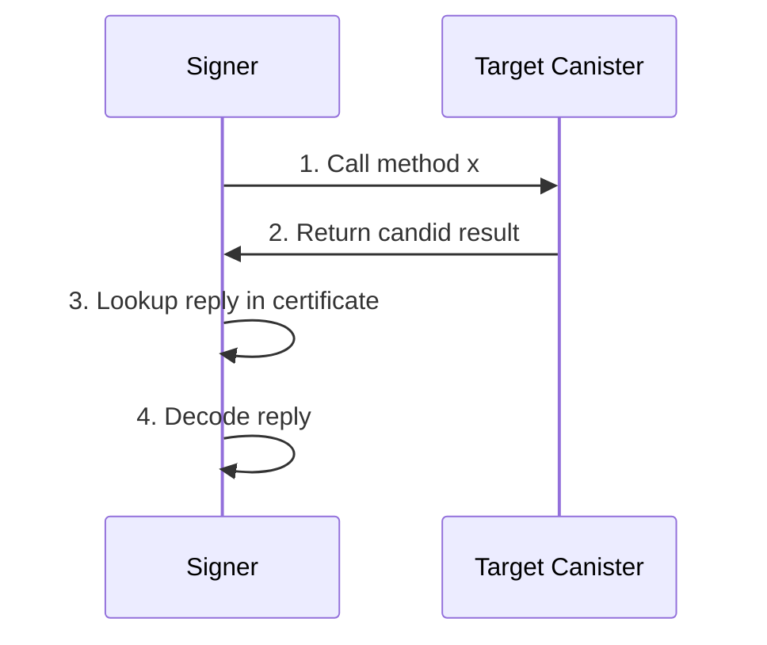
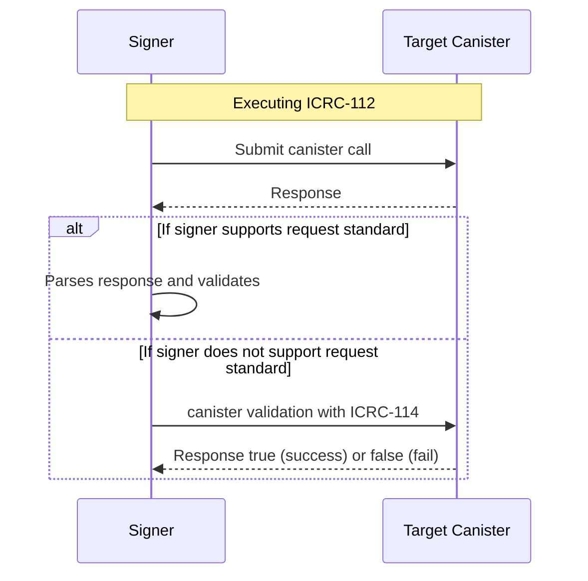

# ICRC-114: Validate batch response

![DRAFT] [![EXTENDS 25]](./icrc_25_signer_interaction_standard.md)

**Authors:** [Long Tran](https://github.com/baolongt), [Mason](https://github.com/masonswj)

<!-- TOC -->

- [ICRC-114: Validate batch response](#icrc-114-validate-batch-response)
  - [Summary](#summary)
  - [Motivation](#motivation)
  - [Assumptions](#assumptions)
  - [ICRC-114 Flow](#icrc-114-flow)
  - [Method](#method)
    - [icrc_114_validate](#icrc_114_validate)
  - [Notes](#notes)
  - [icrc10_supported_standards](#icrc10_supported_standards)
  - [Example](#example)

## Summary

ICRC-114 is a fallback for validating and contining the sequence of requests in [ICRC-112](https://github.com/dfinity/wg-identity-authentication/blob/main/topics/icrc_112_batch_canister_call.md). When execute ICRC-112, the request can be vary and not all of them is supported by signer to parse the response.

## Motivation

We introduced ICRC-112 enable a way to do batch canister transactions at one call for better UX. For signer implement the ICRC-112 there is need to validate the canister response

In the flow below, it show how a canister call was made and how the signer handle the reply from canister



In step 4 decoding need know the candid of the method and it cannot dynamically add in runtime of ICRC-112, there for only known standard in IC ecosystem can parse, eg: ICRC-1, ICRC-2, ICRC-7, ICRC-37.

So ICRC-114 exist to co-validate the sequence of ICRC-112, it is a key to decode signer non supported methods for dapp using ICRC-112

## Assumptions

- The signer support ICRC-112 or have polyfill for handling ICRC-112 (Internet Identity)
- The validate canister provided by relying party for enable ICRC-112
- The validate canister is trusted by the user. Interactions with malicious canisters are not covered by this specification. In particular, interacting with a malicious canister can produce arbitrary outcomes

## ICRC-114 Flow



## Method

### icrc_114_validate

**Candid**

```
type CanisterCall = record {
    canister_id: principal;
    method: text;
    nonce: optional blob;
    arg: blob;
    res: blob;
};
icrc114_validate : (CanisterCall) -> bool
```

## Notes

- It is not recommneded to make inter-canister call in ICRC-114 method.
- Signer should return supported standard for ICRC via [ICRC-25](https://github.com/dfinity/wg-identity-authentication/blob/main/topics/icrc_25_signer_interaction_standard.md). That where dapp know what they're supported

## icrc10_supported_standards

An ICRC-10 compliant canister must implement the [icrc10_supported_standards](https://github.com/dfinity/ICRC/blob/main/ICRCs/ICRC-10/ICRC-10.md) method which returns the list of supported standards.
Any canister implementing ICRC-114 must include a record with the name field equal to "ICRC-114" in that list.

## Example

Signer execute ICRC-112 request via JSON RPC. We assume Signer supported ICRC-2

```json
{
  "id": 1,
  "jsonrpc": "2.0",
  "method": "icrc_112_batch_call_canisters",
  "params": {
    "sender": "b7gqo-ulk5n-2kpo7-oalt7-p2kyl-o4j5l-kiuwo-eeybr-dab4l-ur6up-pqe",
    "validation": {
      "canisterId": "zzzzz-fqaaa-aaaao-a2hlq-ca",
      "method": "icrc_114_validate"
    },
    "requests": [
      [
        {
          "canisterId": "eeddf-fqaaa-aaaao-a2hlq-ca",
          "method": "icrc2_approve",
          "arg": "RElETARte24AbAKzsNrDA2ithsqDBQFsA/vKAQKi3pTrBgHYo4yoDX0BAwEdV+ztKgq7E4l1ffuTuwEmw8AtYSjlrJ+WLO5ofQIAAMgB"
        },
        {
          "canisterId": "aaabb-fqaaa-aaaao-a2hlq-ca",
          "method": "icrc2_approve",
          "arg": "RElETARte24AbAKzsNrDA2ithsqDBQFsA/vKAQKi3pTrBgHYo4yoDX0BAwEdV+ztKgq7E4l1ffuTuwEmw8AtYSjlrJ+WLO5ofQIAAMgB"
        }
      ],
      [
        {
          "canisterId": "xyzzz-fqaaa-aaaao-a2hlq-ca",
          "method": "swap",
          "arg": "RElETARte24AbAKzsNrDA2ithsqDBQFsA/vKAQKi3pTrBgHYo4yoDX0BAwEdV+ztKgq7E4l1ffuTuwEmw8AtYSjlrJ+WLO5ofQIAAMgB",
          "nonce": [1, 2, 3, 2, 31, 31, 312] // array of bytes
        }
      ],
      [
        {
          "canisterId": "bbbbb-fqaaa-aaaao-a2hlq-ca",
          "method": "bridge_to_eth",
          "arg": "RElETARte24AbAKzsNrDA2ithsqDBQFsA/vKAQKi3pTrBgHYo4yoDX0BAwEdV+ztKgq7E4l1ffuTuwEmw8AtYSjlrJ+WLO5ofQIAAMgB"
        }
      ]
    ]
  }
}
```

Execute order of ICRC-112:

1. Execute 2 `icrc2_approve` requests
2. Validate response for 2 requests
3. Execute swap
4. Validate response for swap request
5. Execute bridge_to_eth

For step 3 because it is not supported by signer there for it should be handle by ICRC-114.

Signer have to call `icrc_114_validate` of canister defined in JSON RPC. This is what the request look like in candid when we send to validate canister

```bash
record {
  canister_id = principal xyzzz-fqaaa-aaaao-a2hlq-ca;
  method = "swap"
  arg = blob <parse from arg base64 string in request>
  nonce = optional blob <get from arg nonce>
  res = blob <get from response when making canister call>
}
```

If signer received `true` then continue for step 5 or else stop execute and handle the error case - [defined in ICRC-112](https://github.com/dfinity/wg-identity-authentication/blob/main/topics/icrc_112_batch_canister_call.md#processing)

[Code example](https://github.com/slide-computer/signer-js/blob/main/packages/signer-test/src/agentChannel.ts#L351)

[DRAFT]: https://img.shields.io/badge/STATUS-DRAFT-f25a24.svg
[EXTENDS 25]: https://img.shields.io/badge/EXTENDS-ICRC--25-ed1e7a.svg
