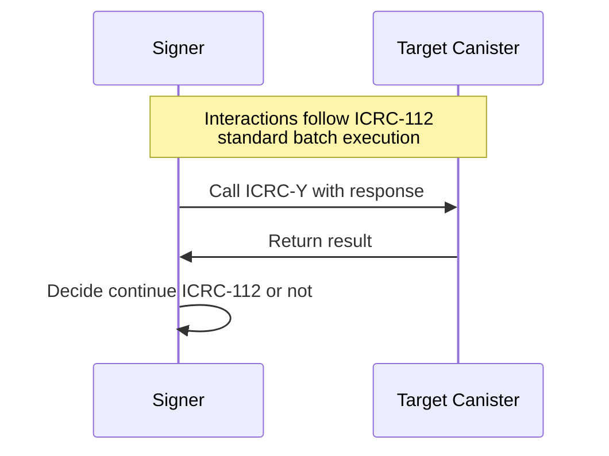

# ICRC-114: Validate batch response

![APPROVED] [![EXTENDS 25]](./icrc_25_signer_interaction_standard.md)

**Authors:** [Long Tran](https://github.com/baolongt)

<!-- TOC -->

- [ICRC-Y: Validate batch response](#icrc-y-validate-batch-response)
  - [Summary](#summary)
  - [Methods](#methods)
    - [icrcy_validate](#icrcy_validate)
    - [icrc25_supported_standards](#icrc25_supported_standards)
  - [Use-Cases](#use-cases)

## Summary

This standard is used by the signer to validate that a request was successfully complete. 

For example, this method is used by the signer when it executes a ICRC-112 batch request where requests need to be executed in certain sequence. In such cases, the signer needs to validate that preceding request was successfully complete, before executing the next. With known standards, signer can validate the requests by checking if there is a block id in the certificate. However, in cases where the request standard is unknown to the signer, the signer uses this method as a fallback to validate whether the request was successfully complete. The relying party provides this call when it constructs the ICRC-112 request. 


## Methods

### icrc114_validate

First the signer needs to have received a response for canister call it is trying to validate. The signer will then make an ICRC-114 call, and includes the response as a blob.

For exmaple, when the signer receives the response below, it will add the contentMap as a blob to the ICRC-114 call. ICRC-114 will return 
- true if the validation was successful (request was successfully completed)
- false if the validation failed (request was not successfully completed)

With Rust or Motoko, instead of boolean value, it can be `Ok` or `Err`.

```
// response of the canister call that signer is trying to validate
{
  "contentMap": "2dn3p2NhcmdYTkRscmVxdWVzdF90eXBlZGNhbGxmc2VuZGVyWB1q63Snu+4C5/fpWFu4nq1IpZxCYDEYA8XSPqPfAg==",
  "certificate": "..."
}
```


**Candid**

```
type CanisterCall = record {
    canister_id: principal;
    method: text;
    nonce: optional blob;
    arg: blob;
    res: blob;
};
icrc114_validate : (vec CanisterCall) -> bool
```

## icrc25_supported_standards

An ICRC-25 compliant signer must implement the [icrc25_supported_standards](icrc_25_signer_interaction_standard.md#icrc25_supported_standards) method which returns the list of supported standards. 
Any signer implementing ICRC-114 must include a record with the name field equal to "ICRC-114" in that list.

## Use-Cases

- Validate the results of batch transactions to ensure all requests were processed successfully.
- Provide a mechanism to check the success or failure of each individual request within a batch.


