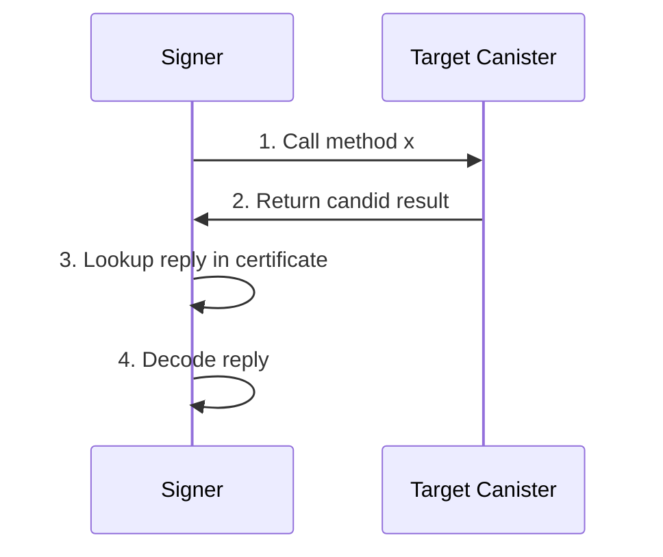
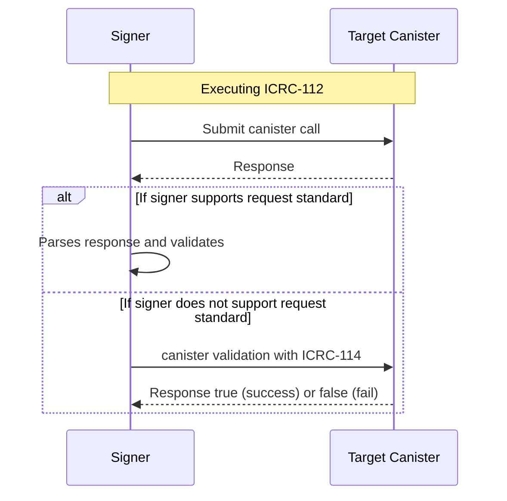

# ICRC-114: Validate batch response

![DRAFT] [![EXTENDS 25]](./icrc_25_signer_interaction_standard.md)

**Authors:** [Long Tran](https://github.com/baolongt), [Mason](https://github.com/masonswj)

<!-- TOC -->

- [ICRC-114: Validate batch response](#icrc-114-validate-batch-response)
  - [Summary](#summary)
  - [Motivation](#motivation)
  - [Assumptions](#assumptions)
  - [ICRC-114 Flow](#icrc-114-flow)
  - [Method](#method)
    - [icrc114_validate](#icrc114_validate)
    - [icrc10_supported_standards](#icrc10_supported_standards)
  - [Notes](#notes)
  - [Example](#example)

## Summary

ICRC-114 is a fallback validation method used in [ICRC-112](https://github.com/dfinity/wg-identity-authentication/blob/main/topics/icrc_112_batch_canister_call.md). When ICRC-112 executes a batch request with sequence logic, the signer must validate that requests are successfully completed before continuing to execute next requests in the sequence. Normally, the signer would do a signer-side validation. But if a request uses a standard that the signer does not support, the signer falls back to the method provided with ICRC-114 to validate the request response.

## Motivation

ICRC-112 was introduced to enable a way to initiate batch canister transactions with one call. Because there may be sequence logic in the batch transactions, signer implementing ICRC-112 must validate the canister response.

The flow below shows how a signer makes a request call in ICRC-112, and decodes the reply to validate the response signer-side. In step 4, the signer needs to know the candid of the method to decode the reply, but this could lead to issues that we will discuss below.



If the ICRC-112 batch request has request using a non-standard request (not ICRC-1, ICRC-2, ICRC-7, ICRC-37, etc), there is no way for the signer to know the candid during run time. Hence, it is not possible to validate non-standard requests signer-side.

In some cases, even if the request uses a known standard, the signer may not know how to interpret the decoded reply to validate the response.

ICRC-114 acts as a fallback validation for the two situations above.

## Assumptions

- The signer supports ICRC-112 or has polyfill for handling ICRC-112 (Internet Identity).
- The validate canister is provided by relying party requesting the ICRC-112 call.
- The validate canister is trusted by the user. Interactions with malicious canisters are not covered by this specification. In particular, interacting with a malicious canisters can produce arbitrary outcomes.

## ICRC-114 Flow



## Method

### icrc114_validate

**Candid**

```
type CanisterCall = record {
    canister_id: principal;
    method: text;
    nonce: optional blob;
    arg: blob;
    res: blob;
};
icrc114_validate : (CanisterCall) -> bool
```

### icrc10_supported_standards

An ICRC-10 compliant canister must implement the [icrc10_supported_standards](https://github.com/dfinity/ICRC/blob/main/ICRCs/ICRC-10/ICRC-10.md) method which returns the list of supported standards.
Any canister implementing ICRC-114 must include a record with the name field equal to "ICRC-114" in that list.

## Notes

- It is not recommneded to make inter-canister call in ICRC-114 method.
- Signer should return supported standard for ICRC via [ICRC-25](https://github.com/dfinity/wg-identity-authentication/blob/main/topics/icrc_25_signer_interaction_standard.md). That where dapp know what they're supported.

## Example

Signer executes ICRC-112 request via JSON RPC. We assume the signer supports ICRC-2.

```json
{
  "id": 1,
  "jsonrpc": "2.0",
  "method": "icrc_112_batch_call_canisters",
  "params": {
    "sender": "b7gqo-ulk5n-2kpo7-oalt7-p2kyl-o4j5l-kiuwo-eeybr-dab4l-ur6up-pqe",
    "validation": {
      "canisterId": "zzzzz-fqaaa-aaaao-a2hlq-ca",
      "method": "icrc114_validate"
    },
    "requests": [
      [
        {
          "canisterId": "eeddf-fqaaa-aaaao-a2hlq-ca",
          "method": "icrc2_approve",
          "arg": "RElETARte24AbAKzsNrDA2ithsqDBQFsA/vKAQKi3pTrBgHYo4yoDX0BAwEdV+ztKgq7E4l1ffuTuwEmw8AtYSjlrJ+WLO5ofQIAAMgB"
        },
        {
          "canisterId": "aaabb-fqaaa-aaaao-a2hlq-ca",
          "method": "icrc2_approve",
          "arg": "RElETARte24AbAKzsNrDA2ithsqDBQFsA/vKAQKi3pTrBgHYo4yoDX0BAwEdV+ztKgq7E4l1ffuTuwEmw8AtYSjlrJ+WLO5ofQIAAMgB"
        }
      ],
      [
        {
          "canisterId": "xyzzz-fqaaa-aaaao-a2hlq-ca",
          "method": "swap",
          "arg": "RElETARte24AbAKzsNrDA2ithsqDBQFsA/vKAQKi3pTrBgHYo4yoDX0BAwEdV+ztKgq7E4l1ffuTuwEmw8AtYSjlrJ+WLO5ofQIAAMgB",
          "nonce": [1, 2, 3, 2, 31, 31, 312] // array of bytes
        }
      ],
      [
        {
          "canisterId": "bbbbb-fqaaa-aaaao-a2hlq-ca",
          "method": "bridge_to_eth",
          "arg": "RElETARte24AbAKzsNrDA2ithsqDBQFsA/vKAQKi3pTrBgHYo4yoDX0BAwEdV+ztKgq7E4l1ffuTuwEmw8AtYSjlrJ+WLO5ofQIAAMgB"
        }
      ]
    ]
  }
}
```

Execute order of ICRC-112:

1. Execute 2 `icrc2_approve` requests.
2. Validate response of the 2 requests.
3. Execute swap.
4. Validate response of the swap request.
5. Execute bridge_to_eth.

On step 3, because the standard of swap request is not supported by signer, validation should be handle by ICRC-114.

Signer should call `icrc_114_validate` of canister defined in JSON RPC. This is what the request look like in candid when we send to validate canister:

```bash
record {
  canister_id = principal xyzzz-fqaaa-aaaao-a2hlq-ca;
  method = "swap"
  arg = blob <parse from arg base64 string in request>
  nonce = optional blob <get from arg nonce>
  res = blob <get from response when making canister call>
}
```

If signer receives `true`, then continue to step 5, or else stop execute and handle the error case. - [defined in ICRC-112](https://github.com/dfinity/wg-identity-authentication/blob/main/topics/icrc_112_batch_canister_call.md#processing)

[Code example](https://github.com/slide-computer/signer-js/blob/main/packages/signer-test/src/agentChannel.ts#L351) for handling parsing ICRC token and NFT

[DRAFT]: https://img.shields.io/badge/STATUS-DRAFT-f25a24.svg
[EXTENDS 25]: https://img.shields.io/badge/EXTENDS-ICRC--25-ed1e7a.svg
