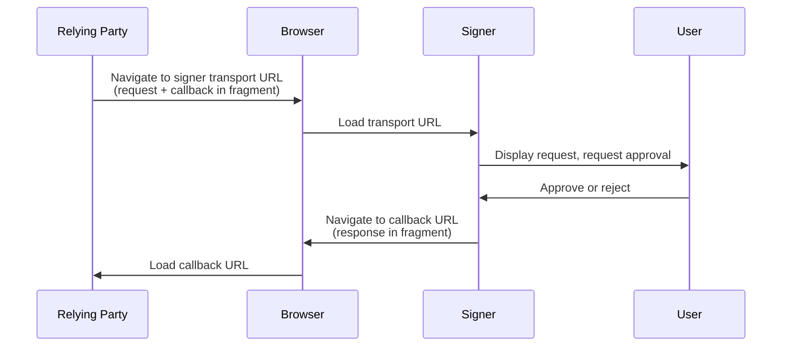

# ICRC-167: Browser URL Transport

![DRAFT] [![EXTENDS 25]](./icrc_25_signer_interaction_standard.md)

**Authors:** [Thomas Gladdines](https://github.com/sea-snake)

## Summary

This standard defines a transport channel to send [ICRC-25](https://github.com/dfinity/wg-identity-authentication/blob/main/topics/icrc_25_signer_interaction_standard.md) messages from a relying party to a signer. The transport channel is based on browser URL navigation: the relying party navigates the browser to the signer with a JSON-RPC request encoded in the URL, and the signer navigates the browser back to the relying party with the JSON-RPC response encoded in the URL.

Unlike [ICRC-29](./icrc_29_window_post_message_transport.md), this transport does not require the relying party and signer to share a live [window.postMessage](https://developer.mozilla.org/en-US/docs/Web/API/Window/postMessage) channel. It is therefore suitable for contexts where such a channel is unavailable or undesirable, such as top-level redirects between two web pages, or navigating to a signer that is a native or mobile application through a deep link.

The JSON-RPC messages are carried in the URL [hash fragment](https://developer.mozilla.org/en-US/docs/Web/API/URL/hash) rather than the path or query string. The fragment is not transmitted to the server as part of the HTTP request, so the message contents are not sent to, nor logged by, the relying party's or signer's backend.

## Terminology

* signer: A service that manages a user's keys and can sign and perform canister calls on their behalf.
* relying party: A service that wants to request calls on a specific canister.

## Trust Assumption

For this standard to represent an [ICRC-25](https://github.com/dfinity/wg-identity-authentication/blob/main/topics/icrc_25_signer_interaction_standard.md) compliant transport channel, the following assumptions must hold:
* The user's machine is not compromised. In particular, the browser must deliver navigations unchanged and represent the `origin` of the different parties correctly.
* DNS entries are not compromised. The user's machine must be able to resolve the domain names of the relying party and signer correctly.

Unlike [window.postMessage](https://developer.mozilla.org/en-US/docs/Web/API/Window/postMessage), URL navigation does not have the browser attach a verified `origin` to each message. Instead, origin authenticity in this transport is asserted through the URLs the parties navigate to:
* The relying party learns the signer origin from the signer URL it chose to navigate to.
* The signer learns the relying party origin from the `callback` URL it is asked to return the response to.

The [Relying Party](#relying-party) and [Signer](#signer) sections define the requirements that follow from this, most importantly that the signer must only ever return a response to the exact `callback` URL it received, so that a party can only ever receive responses intended for its own origin.

## Communication Channel

Both the request and the response are carried in the URL [hash fragment](https://developer.mozilla.org/en-US/docs/Web/API/URL/hash) (the part of the URL following `#`). The fragment is used because, unlike the path and query string, it is not transmitted to the server in the HTTP request and therefore does not leak the JSON-RPC message contents to the relying party's or signer's backend, nor to any intermediary that observes the request line.

The fragment is encoded as an [`application/x-www-form-urlencoded`](https://url.spec.whatwg.org/#application/x-www-form-urlencoded) string, i.e. the same encoding as a URL query string but without the leading `?`.

Each JSON-RPC request and its response are exchanged through a single navigation to the signer followed by a single navigation back to the relying party. There is no persistent channel and, unlike [ICRC-29](./icrc_29_window_post_message_transport.md), no heartbeat. Any state that must persist across messages, such as [ICRC-25 permission scopes](./icrc_25_signer_interaction_standard.md#permissions), is retained by the signer keyed by the relying party origin.

### Request

The relying party initiates a message by navigating the browser to the signer's transport URL with the following fragment parameters:

* `message` (required): the [JSON-RPC 2.0](https://www.jsonrpc.org/specification) request object, serialized as a JSON string.
* `callback` (required): an absolute URL the signer navigates to in order to return the response. Its origin is the relying party origin. The `callback` URL must not itself contain a fragment.

For example, navigating to the signer at `https://signer.example.com/icrc-167` with:

```json
{
    "jsonrpc": "2.0",
    "id": "1",
    "method": "icrc25_supported_standards"
}
```

and a `callback` of `https://relying.example.com/signer-callback` results in the URL:

```
https://signer.example.com/icrc-167#message=%7B%22jsonrpc%22%3A%222.0%22%2C%22id%22%3A%221%22%2C%22method%22%3A%22icrc25_supported_standards%22%7D&callback=https%3A%2F%2Frelying.example.com%2Fsigner-callback
```

### Response

Once the request has been processed, the signer returns the response by navigating the browser to the exact `callback` URL received in the request, setting the fragment to the following parameter:

* `message` (required): the [JSON-RPC 2.0](https://www.jsonrpc.org/specification) response object, serialized as a JSON string.

For example, returning:

```json
{
    "jsonrpc": "2.0",
    "id": "1",
    "result": {
        "supportedStandards": [
            {
                "name": "ICRC-25",
                "url": "https://github.com/dfinity/ICRC/blob/main/ICRCs/ICRC-25/ICRC-25.md"
            }
        ]
    }
}
```

results in a navigation to:

```
https://relying.example.com/signer-callback#message=%7B%22jsonrpc%22%3A%222.0%22%2C%22id%22%3A%221%22%2C%22result%22%3A%7B...%7D%7D
```

### Flow



### Deep Links

The signer's transport URL and/or the `callback` URL may use a platform-specific deep-link mechanism instead of an `https:` web URL, for example an [Android App Link](https://developer.android.com/training/app-links), an [iOS Universal Link](https://developer.apple.com/documentation/xcode/allowing-apps-and-websites-to-link-to-your-content), or a custom URI scheme. This allows a native or mobile application to act as the signer or the relying party. The same fragment encoding applies. For such links, the origin authenticity described in the [Trust Assumption](#trust-assumption) relies on the platform's app-association mechanism to bind a link to an application, rather than on a web origin.

### Message Size

Browsers and operating systems impose limits on URL length. Because the JSON-RPC message is carried in the URL, this transport is not suitable for messages whose serialized size approaches those limits. Relying parties and signers should account for this when choosing a transport for methods that can carry large payloads, such as canister call arguments or delegation chains.

## Relying Party

> The signer transport URL the relying party navigates to is mentioned below as `signerUrl`, and its origin as `signerOrigin`.

The relying party determines the `signerUrl` out of band, for example through user input, configuration, or a discovery mechanism.

Before navigating to the signer, the relying party must persist the pending request in storage that survives the navigation, such as [sessionStorage](https://developer.mozilla.org/en-US/docs/Web/API/Window/sessionStorage), because navigating away in the same window unloads the page. At minimum it must persist the `id` of each request it is awaiting a response for.

Requests are sent by navigating the browser to `signerUrl` with the `message` and `callback` fragment parameters set as described in [Request](#request). The relying party may perform this navigation by redirecting the current window, opening a new window, or following a deep link. The origin of the `callback` URL must be an origin the relying party controls, since the response is only ever delivered there.

Responses are received on load of the `callback` URL by reading the `message` fragment parameter. A received message is considered a valid response only if its `id` corresponds to a request that the relying party sent and is still awaiting; the relying party must ignore any other message. The relying party treats `signerOrigin` as the origin of the signer that produced the response.

The relying party should remove the fragment from the `callback` URL after reading it, for example using [history.replaceState](https://developer.mozilla.org/en-US/docs/Web/API/History/replaceState), to avoid leaking the message through subsequent navigations, bookmarks, or the referrer.

## Signer

> The `callback` URL received in the request is mentioned below as `callbackUrl`, and its origin as `callbackOrigin`.

Requests are received on load of the transport URL by reading the `message` and `callback` fragment parameters. The signer determines the relying party origin as `callbackOrigin`. All [ICRC-25](./icrc_25_signer_interaction_standard.md) state that is specific to a relying party, such as permission scopes, is keyed by this origin. Where available, the signer may cross-check `callbackOrigin` against the [document.referrer](https://developer.mozilla.org/en-US/docs/Web/API/Document/referrer).

Responses are sent by navigating the browser to `callbackUrl` with the `message` fragment parameter set as described in [Response](#response). The signer must only ever navigate to the exact `callbackUrl` it received and must not include the response anywhere other than the fragment. Delivering the response only to `callbackUrl` guarantees that a relying party can only ever receive responses intended for its own origin.

## Error Handling

### Aborted Request

If the user dismisses the request, or the signer is otherwise unable to complete it, the signer should still return to the relying party by navigating to `callbackUrl` with a JSON-RPC error response, such as [ICRC-25 error `3001` Action aborted](./icrc_25_signer_interaction_standard.md#errors-3), so that the relying party is not left waiting.

### Unreachable Signer or Relying Party

If the navigation to the signer fails, or the relying party regains control without a matching response within a reasonable timeframe, the relying party should treat this as a transport failure, for example [ICRC-25 error `4001` Transport channel closed](./icrc_25_signer_interaction_standard.md#errors-3).

### Invalid Messages

If either party receives malformed, unexpected, or otherwise invalid messages, it should ignore them.

[DRAFT]: https://img.shields.io/badge/STATUS-DRAFT-f25a24.svg

[EXTENDS 25]: https://img.shields.io/badge/EXTENDS-ICRC--25-ed1e7a.svg
