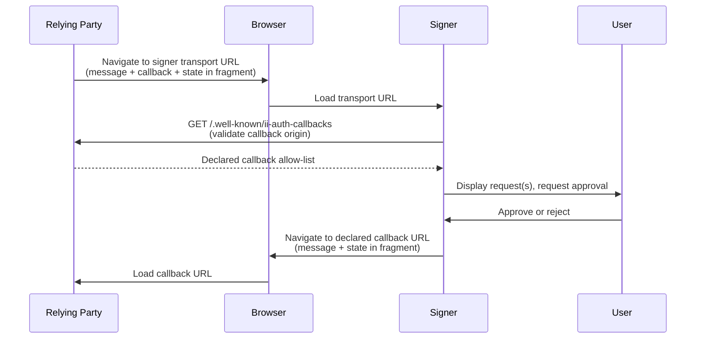
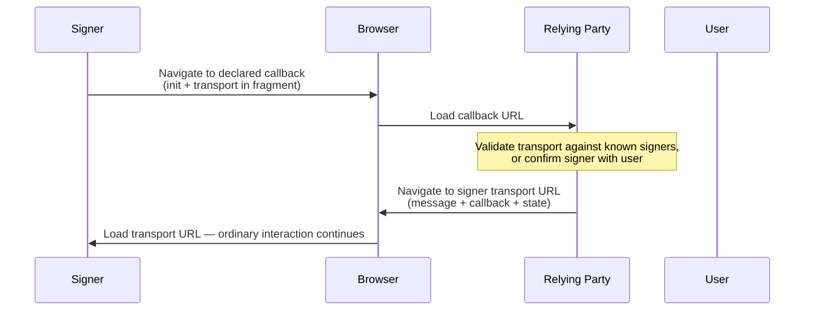

# ICRC-167: Browser URL Transport

![DRAFT] [![EXTENDS 25]](./icrc_25_signer_interaction_standard.md)

**Authors:** [Thomas Gladdines](https://github.com/sea-snake)

## Summary

This standard defines a transport channel to send [ICRC-25](https://github.com/dfinity/wg-identity-authentication/blob/main/topics/icrc_25_signer_interaction_standard.md) messages from a relying party to a signer. The transport channel is based on browser URL navigation: the relying party navigates the browser to the signer with one or more JSON-RPC requests encoded in the URL, and the signer navigates the browser back to the relying party with the JSON-RPC responses encoded in the URL.

Unlike [ICRC-29](./icrc_29_window_post_message_transport.md), this transport does not require the relying party and signer to share a live [window.postMessage](https://developer.mozilla.org/en-US/docs/Web/API/Window/postMessage) channel. It is therefore suitable for contexts where such a channel is unavailable or undesirable, such as top-level redirects between two web pages, or navigating to a signer that is a native or mobile application through a verified deep link.

The JSON-RPC messages are carried in the URL [hash fragment](https://developer.mozilla.org/en-US/docs/Web/API/URL/hash) rather than the path or query string. The fragment is not transmitted to the server as part of the HTTP request, so the message contents are not sent to, nor logged by, the relying party's or signer's backend.

Because a single round-trip carries the browser away from the relying party and back, the request may be a [JSON-RPC 2.0 batch](https://www.jsonrpc.org/specification#batch) so that several messages, for example a delegation request and an accounts or attribute request, are answered in one navigation rather than one context switch per message.

An interaction may also span several sequential round-trips, for when a later request depends on an earlier response, and either party may start an interaction: the relying party by navigating to the signer, or the signer by navigating to the relying party to initiate an authentication flow.

## Terminology

* signer: A service that manages a user's keys and can sign and perform canister calls on their behalf.
* relying party: A service that wants to request calls on a specific canister.

## Trust Assumption

For this standard to represent an [ICRC-25](https://github.com/dfinity/wg-identity-authentication/blob/main/topics/icrc_25_signer_interaction_standard.md) compliant transport channel, the following assumptions must hold:
* The user's machine is not compromised. In particular, the browser must deliver navigations unchanged and represent the `origin` of the different parties correctly.
* DNS entries are not compromised. The user's machine must be able to resolve the domain names of the relying party and signer correctly.

Unlike [window.postMessage](https://developer.mozilla.org/en-US/docs/Web/API/Window/postMessage), URL navigation does not have the browser attach a verified `origin` to each message. Instead, origin authenticity in this transport is established as follows:
* The relying party learns the signer origin from the signer URL it chose to navigate to.
* The signer learns the relying party origin from the origin of the `callback` URL it is asked to return the response to, and only returns the response to a `callback` the relying party has itself declared at that origin (see [Callback Allow-List](#callback-allow-list)). Because a JSON-RPC response may carry a delegation or other sensitive result, an unverified `callback` would let any page redirect that result to a destination the relying party never sanctioned; the allow-list closes this.

## Communication Channel

Both the request and the response are carried in the URL [hash fragment](https://developer.mozilla.org/en-US/docs/Web/API/URL/hash) (the part of the URL following `#`). The fragment is used because, unlike the path and query string, it is not transmitted to the server in the HTTP request and therefore does not leak the JSON-RPC message contents to the relying party's or signer's backend, nor to any intermediary that observes the request line.

The fragment is encoded as an [`application/x-www-form-urlencoded`](https://url.spec.whatwg.org/#application/x-www-form-urlencoded) string, i.e. the same encoding as a URL query string but without the leading `?`.

Each request and its response are exchanged through a single navigation to the signer followed by a single navigation back to the relying party. There is no persistent channel and, unlike [ICRC-29](./icrc_29_window_post_message_transport.md), no heartbeat. Any state that must persist across messages, such as [ICRC-25 permission scopes](./icrc_25_signer_interaction_standard.md#permissions), is retained by the signer keyed by the relying party origin.

### Request

The relying party initiates a message by navigating the browser to the signer's transport URL with the following fragment parameters:

* `message` (required): a single [JSON-RPC 2.0](https://www.jsonrpc.org/specification) request object, or an array of request objects (a [JSON-RPC 2.0 batch](https://www.jsonrpc.org/specification#batch)), serialized as a JSON string.
* `callback` (required): an absolute URL the signer navigates to in order to return the response. Its origin is the relying party origin. The `callback` URL must not itself contain a fragment, and must be declared by the relying party as described in [Callback Allow-List](#callback-allow-list).
* `state` (optional): an opaque value chosen by the relying party. The signer must return it unchanged alongside the response. Because the `callback` is fixed (it must match a declared entry), `state` is how the relying party carries per-attempt context across the round-trip and binds the response it receives to the request it initiated.

For example, navigating to the signer at `https://signer.example.com/icrc-167` with a batch requesting both a delegation and the user's accounts:

```json
[
    {
        "jsonrpc": "2.0",
        "id": "1",
        "method": "icrc34_delegation",
        "params": {
            "publicKey": "MFkwEwYHKoZIzj0CAQYIKoZIzj0DAQcDQgAE...",
            "maxTimeToLive": "28800000000000"
        }
    },
    {
        "jsonrpc": "2.0",
        "id": "2",
        "method": "icrc27_accounts"
    }
]
```

and a `callback` of `https://relying.example.com/signer-callback` results in the URL:

```
https://signer.example.com/icrc-167#message=%5B%7B%22jsonrpc%22%3A%222.0%22%2C%22id%22%3A%221%22%2C%22method%22%3A%22icrc34_delegation%22%2C...%7D%5D&callback=https%3A%2F%2Frelying.example.com%2Fsigner-callback&state=8f94a1c2
```

### Response

Once the request has been processed, the signer returns the response by navigating the browser to the exact `callback` URL received in the request, setting the fragment to the following parameters:

* `message` (required): the [JSON-RPC 2.0](https://www.jsonrpc.org/specification) response object, or, for a batch request, an array of response objects correlated to the requests by their `id`, serialized as a JSON string.
* `state` (required if present in the request): the `state` value from the request, returned unchanged.

For example, returning the responses to the batch above:

```json
[
    {
        "jsonrpc": "2.0",
        "id": "1",
        "result": {
            "publicKey": "MFkwEwYHKoZIzj0CAQYIKoZIzj0DAQcDQgAE...",
            "signerDelegation": [ { "delegation": { "pubkey": "...", "expiration": "1702683438614940079" }, "signature": "..." } ]
        }
    },
    {
        "jsonrpc": "2.0",
        "id": "2",
        "result": {
            "accounts": [ { "owner": "gyu2j-2ni7o-o6yjt-n7lyh-x3sxq-zh7hp-sjvqe-t7oul-4eehb-2gvtt-jae" } ]
        }
    }
]
```

results in a navigation to:

```
https://relying.example.com/signer-callback#message=%5B%7B%22jsonrpc%22%3A%222.0%22%2C%22id%22%3A%221%22%2C...%7D%5D&state=8f94a1c2
```

### Flow



### Callback Allow-List

The `callback` in a request is attacker-craftable: any page can navigate to the signer with a `callback` of its choosing. To ensure a response is only ever delivered to a destination the relying party sanctioned, the relying party declares the callbacks it accepts as an allow-list hosted at a fixed well-known path on its origin, and the signer honours a requested `callback` only when it exactly matches a declared entry. The link therefore only ever _selects_ among the relying party's declared callbacks; it never chooses the destination on its own.

This reuses the [`/.well-known/ii-auth-callbacks`](https://github.com/dfinity/internet-identity/blob/main/docs/mcp-server-guide.md) allow-list introduced by Internet Identity, which is deliberately not implementation-specific:

```
GET https://<relying-party-origin>/.well-known/ii-auth-callbacks

200 Content-Type: application/json
{ "callbacks": ["https://<relying-party-origin>/signer-callback"] }
```

The indirection is only as safe as its validation, so the signer's fetch and match must be strict and every failure must fail the flow (closed):

* The request must refuse redirects — an open redirect at the well-known path must not let a third party serve the list — carry no credentials, and not be cached (`no-store`), so the match is always against the relying party's current declaration.
* The response must be `application/json` and under a size cap (Internet Identity uses 8 KiB).
* Each declared entry must be an absolute URL that is same-origin with the `callback` origin, and must not carry a fragment (the response appends its own).
* The requested `callback` must equal a declared entry byte-for-byte, with no normalization.

The relying party must serve the document with CORS headers that let the signer read it (`Access-Control-Allow-Origin`). It should list only clean endpoints it fully controls — no reflecting routes, user-content paths, or anything that redirects — since any entry can receive JSON-RPC responses, including delegations.

The declared callbacks are the complete set of URLs a signer may navigate the browser to for a relying party. They serve both the [Response](#response) navigation and the [Signer-Initiated Interaction](#signer-initiated-interaction) navigation; the relying party distinguishes the two by which parameters are present.

### Multi-step Interactions

A logical interaction may consist of several sequential round-trips, for example when the content of a request depends on the response to an earlier one. Each round-trip is an independent navigation as described in [Request](#request) and [Response](#response); the relying party drives the sequence, navigating to the signer again after processing each response.

No re-establishment is required between round-trips. The signer retains [ICRC-25 permission scopes](./icrc_25_signer_interaction_standard.md#permissions) keyed by the relying party origin, so a scope that is already `granted` is not prompted for again, and the relying party carries its own progress across each navigation using `state` and the persisted pending-request store.

### Signer-Initiated Interaction

An interaction is usually initiated by the relying party, but a signer may also initiate one, for example to start an authentication (delegation) flow with a relying party on the user's behalf. This mirrors [OpenID Connect third-party-initiated login](https://openid.net/specs/openid-connect-core-1_0.html#ThirdPartyInitiatedLogin).

To initiate, the signer navigates the browser to one of the relying party's declared [callbacks](#callback-allow-list) with the following fragment parameters in place of a `message`:

* `init` (required): a hint of the interaction the signer suggests the relying party start, such as the JSON-RPC method name (e.g. `icrc34_delegation`). It may be empty if the signer has no specific suggestion.
* `transport` (required): the signer's transport URL the relying party should send its subsequent request to.

On receiving an `init` navigation, the relying party begins an ordinary relying-party-initiated interaction (see [Request](#request)) against `transport`, guided by the `init` hint. Because `init` carries no secret result, it does not require the [Callback Allow-List](#callback-allow-list) to protect a delivery; landing on a declared callback merely ensures the signer can only navigate the user to a relying-party-sanctioned page.

The relying party must not treat `transport` as trusted. Before navigating to it, the relying party must validate it against the signers it knows or is configured with, or confirm the signer with the user. Otherwise a malicious `init` navigation could lure the user to an attacker-controlled signer.



### Deep Links

The signer's transport URL and/or the `callback` URL may use a platform deep link instead of an `https:` web URL, allowing a native or mobile application to act as the signer or the relying party. Only **domain-verified** deep links may be used: [Android App Links](https://developer.android.com/training/app-links) and [iOS Universal Links](https://developer.apple.com/documentation/xcode/allowing-apps-and-websites-to-link-to-your-content), which the operating system binds to an application only after verifying ownership of the associated domain through `/.well-known/assetlinks.json` and `/.well-known/apple-app-site-association` respectively.

Custom URI schemes (for example `mysigner://`) must not be used to deliver a response. Their registration is not verified by the operating system, so any installed application can claim the same scheme and intercept a response, which may contain a delegation or other sensitive result. A verified deep link resolves to a real `https` origin, so the [Callback Allow-List](#callback-allow-list) applies to it unchanged; a custom scheme has no such origin and cannot be validated.

### Message Size

Browsers and operating systems impose limits on URL length. Because the JSON-RPC message is carried in the URL, this transport is not suitable for messages whose serialized size approaches those limits. Relying parties and signers should account for this when choosing a transport for methods that can carry large payloads, such as canister call arguments or delegation chains.

## Relying Party

> The signer transport URL the relying party navigates to is mentioned below as `signerUrl`, and its origin as `signerOrigin`.

The relying party determines the `signerUrl` out of band, for example through user input, configuration, or a discovery mechanism.

The relying party must declare every `callback` it uses in its [`/.well-known/ii-auth-callbacks`](#callback-allow-list) allow-list, served from the origin of that `callback`.

Before navigating to the signer, the relying party must persist the pending request in storage that survives the navigation, such as [sessionStorage](https://developer.mozilla.org/en-US/docs/Web/API/Window/sessionStorage), because navigating away in the same window unloads the page. At minimum it must persist the `state` it generated and the `id` of each request it is awaiting a response for.

Requests are sent by navigating the browser to `signerUrl` with the `message`, `callback`, and optional `state` fragment parameters set as described in [Request](#request). The relying party may perform this navigation by redirecting the current window, opening a new window, or following a verified deep link.

Responses are received on load of the `callback` URL by reading the `message` and `state` fragment parameters. A received message is considered a valid response only if its `state` matches the `state` the relying party generated for a request it is still awaiting, and each response `id` corresponds to a request in that batch; the relying party must ignore any other message. The relying party treats `signerOrigin` as the origin of the signer that produced the response.

A navigation to a `callback` that carries `init` in place of `message` is a [signer-initiated interaction](#signer-initiated-interaction). The relying party must validate the accompanying `transport` before starting an ordinary interaction against it, as described in that section.

The relying party should remove the fragment from the `callback` URL after reading it, for example using [history.replaceState](https://developer.mozilla.org/en-US/docs/Web/API/History/replaceState), to avoid leaking the message through subsequent navigations, bookmarks, or the referrer.

## Signer

> The `callback` URL received in the request is mentioned below as `callbackUrl`, and its origin as `callbackOrigin`.

Requests are received on load of the transport URL by reading the `message`, `callback`, and optional `state` fragment parameters. The signer determines the relying party origin as `callbackOrigin`. All [ICRC-25](./icrc_25_signer_interaction_standard.md) state that is specific to a relying party, such as permission scopes, is keyed by this origin.

Before returning any response, the signer must validate `callbackUrl` against the relying party's declared [Callback Allow-List](#callback-allow-list), fetched from `callbackOrigin`, and abort the flow if the fetch or the exact match fails.

Responses are sent by navigating the browser to `callbackUrl` with the `message` fragment parameter, and the `state` parameter if one was received, set as described in [Response](#response). The signer must only ever navigate to a validated `callbackUrl` and must not include the response anywhere other than the fragment. This guarantees that a relying party can only ever receive responses delivered to a callback it declared for its own origin.

The signer may also initiate an interaction by navigating the browser to one of the relying party's declared callbacks with `init` and `transport` in place of a `message`, as described in [Signer-Initiated Interaction](#signer-initiated-interaction). The same [Callback Allow-List](#callback-allow-list) validation applies to the callback it navigates to.

## Error Handling

### Aborted Request

If the user dismisses the request, or the signer is otherwise unable to complete it, the signer should still return to the relying party by navigating to `callbackUrl` with a JSON-RPC error response, such as [ICRC-25 error `3001` Action aborted](./icrc_25_signer_interaction_standard.md#errors-3), so that the relying party is not left waiting.

### Invalid Callback

If the signer cannot fetch the relying party's [Callback Allow-List](#callback-allow-list), or `callbackUrl` does not exactly match a declared entry, the signer must abort without returning a response. It must not navigate to an unvalidated `callbackUrl`, since doing so could deliver a response to a destination the relying party did not sanction.

### Untrusted Initiating Signer

On a [signer-initiated interaction](#signer-initiated-interaction), if the relying party cannot validate the received `transport` against a signer it knows or is configured with, and the user does not confirm it, the relying party must not navigate to it and should abort the interaction.

### Unreachable Signer or Relying Party

If the navigation to the signer fails, or the relying party regains control without a matching response within a reasonable timeframe, the relying party should treat this as a transport failure, for example [ICRC-25 error `4001` Transport channel closed](./icrc_25_signer_interaction_standard.md#errors-3).

### Invalid Messages

If either party receives malformed, unexpected, or otherwise invalid messages, it should ignore them.

[DRAFT]: https://img.shields.io/badge/STATUS-DRAFT-f25a24.svg

[EXTENDS 25]: https://img.shields.io/badge/EXTENDS-ICRC--25-ed1e7a.svg
