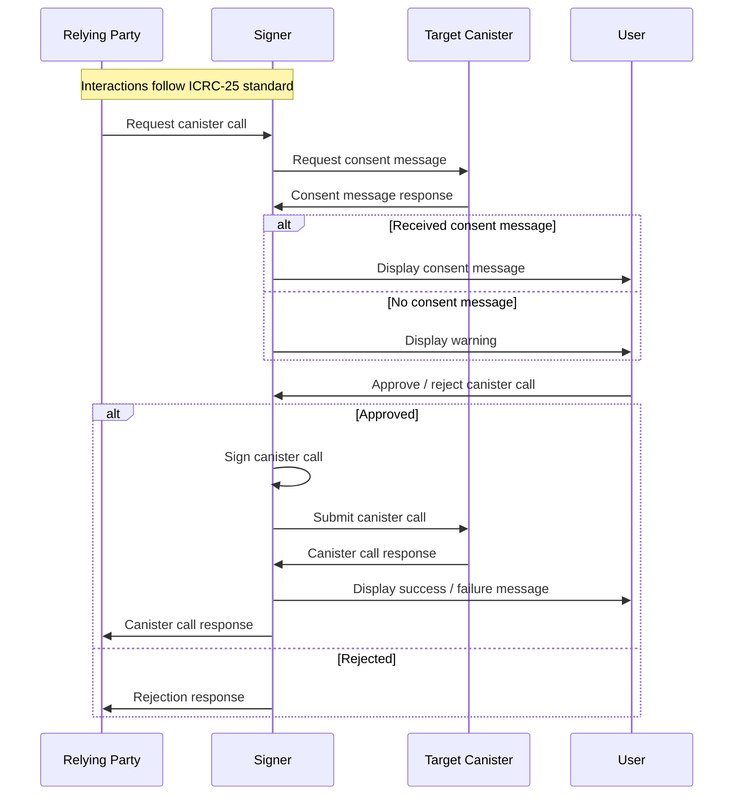
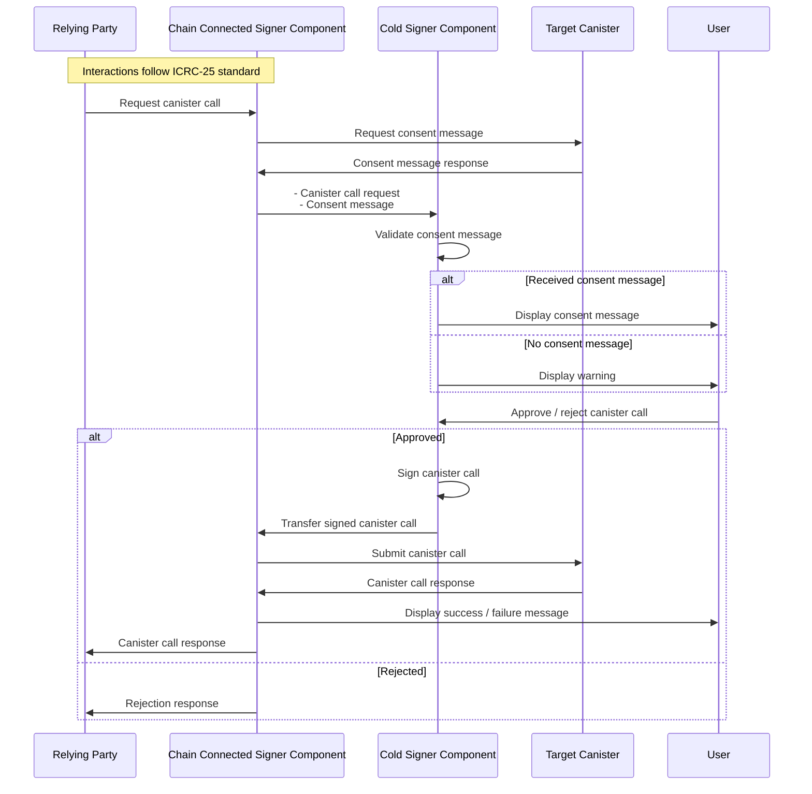

# ICRC-21: Canister Call Consent Messages


| Status |
|:------:|
| Draft  |


## Summary
This specification describes a protocol for obtaining human-readable consent messages for canister calls. These messages are intended to be shown to users to help them make informed decisions about whether to approve a canister call / sign a transaction.

The protocol is designed in such a way that it can be used interactively (e.g. in a browser-based signer) or non-interactively (e.g. in a cold signer).

## Terminology

* signer: a service that manages the keys of a user and can sign canister calls on their behalf. This component displays the consent message to the user. The signer may be split in a hot (with connection to the IC) and cold (offline) component.
* relying party: the service that requests a signature on a specific canister call.
* target canister: the canister that is the target of the canister call.

## Motivation

Interactions with canisters can have significant consequences. For example, a canister might transfer funds or provide access to sensitive information. At the same time interactions with canisters are often technical and require a deep understanding of the canister's implementation to accurately assess the consequences of a specific canister call. This makes it very difficult for users to make informed decisions about whether to sign a canister call.

The mechanisms described in this specification ease the technical burden and empower users to make informed decisions before signing canister calls.

## Assumptions
* The signer is trusted by the user.
* The relying party is _not_ trusted and might be malicious.
* The target canister is trusted by the user. Interactions with malicious canisters are not covered by this specification. In particular, interacting with a malicious canister can produce arbitrary outcomes regardless of how user consent was collected.

## Canister Call Consent Message Interface

The following interface must be implemented to support canister call consent messages:

```
type icrc21_consent_preferences = record {
    // Same semantics as HTTP Accept-Language header
    language: text;

};

type icrc21_consent_message_request = record {
    // Method name of the canister call.
    method: text;
    // Argument of the canister call.
    arg: blob;
    // User preferences with regards to the consent message presented to the end-user.
    consent_preferences: icrc21_consent_preferences;
};

type icrc21_consent_info = record {
    // Consent message describing in a human-readable format what the call will do.
    // Markdown formatting can be used. No external resources (e.g. images) are allowed.
    //
    // The message should be in the language specified in the consent_preferences.
    // If the message is not available in the specified language, a fall back
    // language may be used. The language of the message must be indicated using
    // the language field.
    //
    // The message should be short and concise.
    // It should only contain information that is:
    // * relevant to the user
    // * relevant given the canister call argument
    //
    // The message must fit the following context shown to
    // the user on the signer UI:
    // ┌─────────────────────────────────┐
    // │  Approve the following action?  │
    // │  ┌───────────────────────────┐  │
    // │  │    <consent_message>      │  │
    // │  └───────────────────────────┘  │
    // │  ┌───────────┐   ┌───────────┐  │
    // │  │  Reject   │   │  Approve  │  │
    // │  └───────────┘   └───────────┘  │
    // └─────────────────────────────────┘
    consent_message: text;
    // Same semantics as HTTP lang attribute
    language: text;
};

type icrc21_error_info = record {
    // Machine parsable error. Can be chosen by the target canister but should indicate the error category.
    error_code: nat;
    // Human readable technical description of the error intended for developers, not the end-user.
    description: text;
};

type icrc21_error = variant {
    // The canister does not support this call (i.e. it will lead to a rejection or error response).
    // Reasons might be (non-exhaustive list):
    // * the canister call is malformed (e.g. wrong method name, argument cannot be decoded)
    // * the arguments exceed certain bounds
    UnsupportedCanisterCall: icrc21_error_info;

    // The canister cannot produce a consent message for this call.
    // Reasons might be (non-exhaustive list):
    // * it is an internal call not intended for end-users
    // * the canister developer has not yet implemented a consent message for this call
    ConsentMessageUnavailable: icrc21_error_info;
    
    // Any error not covered by the above variants.
    GenericError: icrc21_error_info;
};

type icrc21_consent_message_response = variant {
    // The call is ok, consent message is provided.
    Ok: icrc21_consent_info;
    // The call is not ok, error is provided.
    Err: icrc21_error;
};

service : {
    // Returns a human-readable consent message for the given canister call.
    // The return type is `opt` to allow future extension of the consent_message_response variant.
    // (see recommendation here: https://internetcomputer.org/docs/current/references/candid-ref#type-variant--n--t--)
    // This call must not require authentication (i.e. must be available for the anonymous sender).
    // If the call is made with a non-anonymous identity, the response may be tailored to the identity.
    //
    // This is currently an update call. As soon as secure (replicated) query calls are available, this will be changed to such a replicated query call.
    icrc21_canister_call_consent_message: (icrc21_consent_message_request) -> (opt icrc21_consent_message_response);

    // Returns a list of supported standards related to consent messages that this canister implements.
    // The result should always have at least one entry: record { name = "ICRC-21"; url = "https://github.com/dfinity/wg-identity-authentication" }
    // This query call must not require authentication.
    icrc21_supported_standards : () -> (vec record { name : text; url : text }) query;
}
```

In addition to implementing the above interface, it is recommended that the canister also provides its full candid interface in the public `candid:service` metadata section, as discussed [here](https://forum.dfinity.org/t/rfc-canister-metadata-standard). This is required to properly decode the arguments if the signer also wants to display technical information about the canister call.

### Authentication

The signer may send the `icrc21_consent_message` call using the same identity as it would for the actual canister call for which the consent message was issued.

Any canister implementing the `icrc21_consent_message` interface must not require authentication for this call.
However, canisters may add additional or different information if a non-anonymous `sender` is used.

For example, a canister might include private information in the consent message, if the call is made by the owner of that information. 

The canister must ensure that if the actual call is made with a different identity than the `icrc21_consent_message` then either:
* the call fails with an error and without side effects
* the call succeeds and the previously issued consent message (for a different identity) still accurately describes the outcome of the call

> **_WARNING:_**  Canister developers must take care to not rely on the current state of the canister / identity attached data when issuing the consent message. There might be a significant time delay (depending on the signer used) between retrieving the consent message and submitting the canister call. The consent message must accurately describe all possible outcomes of the canister call, accounting for that time delay.

> **_NOTE:_** The `icrc21_consent_message` method is currently declared as an `update` call, due to the necessity
> of supporting dynamic data in a secure way. As soon as secure (replicated) query calls are available, this will be changed to such a replicated query call.

## Use-Cases

The canister call is designed to be used with both cold and hot signers. In addition to the signer use-cases it can also be used to enhance the documentation on generic canister interfaces.

### Hot Signer Use-Case

This section describes the interactions between the signer and the relying party for _hot_ signers:



1. The relying party connects to the signer and requests a signature on a canister call.
2. The signer fetches the consent message from the target canister and validates the response:
   * `icrc21_consent_message_request.method` must match the canister call method.
   * `icrc21_consent_message_request.arg` must match the canister call argument.
   * The `icrc21_consent_message` canister call must be made to the target canister.
   * The response to the `icrc21_consent_message` canister call (fetched using `read_state`) must be delivered in a valid certificate (see [Certification](https://internetcomputer.org/docs/current/references/ic-interface-spec#certification)).
   * The decoded response must not be `null` and match the `icrc21_consent_message_response.valid` variant.
3. The consent message is presented to the user.
4. User approval:
   * If the user approves the canister call, continue with step 5.
   * If the user rejects the canister call (or does not respond within a certain time frame), the signer returns an error to the relying party. No further steps are executed.
5. The request is signed, submitted to the IC.
6. The certified response is retrieved using read state requests
7. A message should be displayed to the user that indicates whether the canister call was successful or not.
8. The response returned to the relying party.

### Cold Signer Use-Case

This section describes the interactions between the signer and the relying party for signers that have a _cold_ component:
* the cold signer component is not able to interact with canisters
* the cold signer component has no knowledge of time



1. The relying party connects to the signer and requests a signature on a canister call.
2. The signer fetches the consent message from the target canister:
3. The canister call and the consent message request as well as the certified response are transferred to the cold signer component.
4. The cold signer component validates the consent message:
   1. The consent message request must match the canister call:
      * `icrc21_consent_message_request.method` must match the canister call method.
      * `icrc21_consent_message_request.arg` must match the canister call argument.
      * The `icrc21_consent_message` request `canister_id` must match the target canister id.
   2. The consent message response must be certified and valid:
      * The response to the `icrc21_consent_message` canister call must be provided in a valid certificate (see [Certification](https://internetcomputer.org/docs/current/references/ic-interface-spec#certification)).
      * The decoded response must not be `null` and match the `icrc21_consent_message_response.valid` variant.
   3. The consent message response certificate `time` must be recent with respect to the `ingress_expiry` of the canister call.
   4. The consent message user preferences must match the user preferences of the signer. In particular, the consent message must be in a language understood by the user.
5. If validation is successful, the consent message is presented to the user.
   * Otherwise, the signer must abort the signing process and display an error message to the user. No further steps are executed.
6. User approval:
   * If the user approves the canister call, continue with step 7.
   * If the user rejects the canister call (or does not respond within a certain time frame), the signer returns an error to the relying party (via the chain connected component). No further steps are executed.
7. The request is signed and transferred to the chain connected component.
8. The request is submitted to the IC.
9. The certified response is retrieved using read state requests
10. A message should be displayed to the user that indicates whether the canister call was successful or not.
11. The response returned to the relying party.

## Example

The following is a non-normative example of how the canister call consent message interface could be used for the ledger transfer method.

### Consent Message Request

Argument for the ledger canister call to `transfer`:

```
(
  record {
    to = blob "ed2182...";
    fee = record { e8s = 10_000 : nat64 };
    memo = 123 : nat64;
    from_subaccount = null;
    created_at_time = null;
    amount = record { e8s = 789_123_000 : nat64 };
  },
)
```

Argument for the ledger canister call to `icrc21_consent_message`:

```
(
   record {
      method = "transfer";
      arg = blob "4449..."; // candid encoded argument
      consent_preferences = record {
        language = "en-US"
      }
   }
)
```

### Consent Message Response

```
(
   variant {
      Ok = record {
         consent_message = "Transfer 7.89 ICP to account ed2182..., include memo: 123. Fee: 0.0001 ICP.";
         language = "en-US"
      }
   }
)
```
### Signer UI Approval Screen

The message will then be shown to the user in the following context:

```
┌─────────────────────────────────┐
│  Approve the following action?  │
│  ┌───────────────────────────┐  │
│  │ Transfer 7.89 ICP to      │  │
│  │ account ed2182...,        │  │
│  │ include memo: 123.        │  │
│  │ Fee: 0.0001 ICP.          │  │
│  └───────────────────────────┘  │
│  ┌───────────┐   ┌───────────┐  │
│  │  Reject   │   │  Approve  │  │
│  └───────────┘   └───────────┘  │
└─────────────────────────────────┘
```