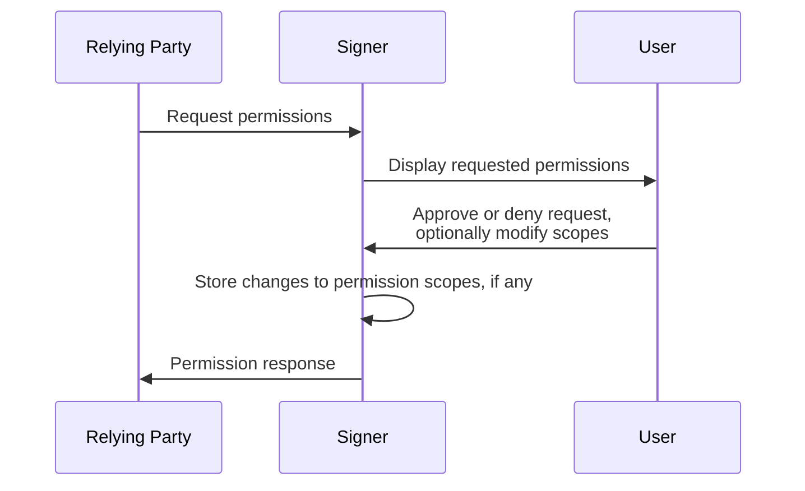
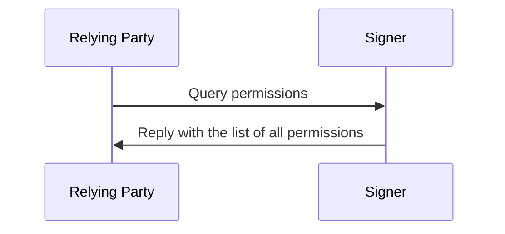
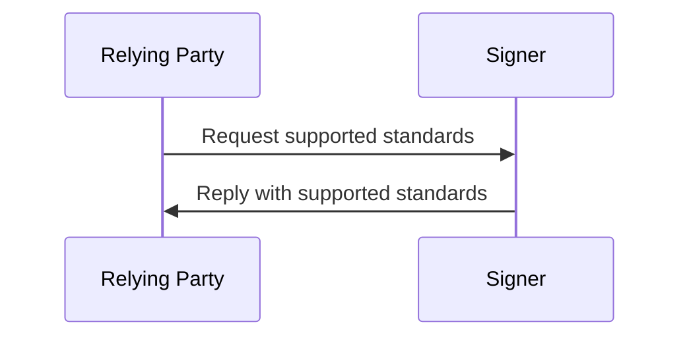

# ICRC-25: Signer Interaction Standard

[](https://github.com/orgs/dfinity/projects/31)

<!-- TOC -->
* [ICRC-25: Signer Interaction Standard](#icrc-25-signer-interaction-standard)
  * [Summary](#summary)
  * [Terminology](#terminology)
  * [Types](#types)
  * [Transport Channel Requirements](#transport-channel-requirements)
  * [Permissions](#permissions)
    * [Permissions States](#permissions-states)
    * [Requesting Permissions](#requesting-permissions)
    * [Scope Objects](#scope-objects)
      * [Extension Properties](#extension-properties)
  * [Extensions](#extensions)
  * [Methods](#methods)
    * [`icrc25_request_permissions`](#icrc25_request_permissions)
      * [Prerequisites](#prerequisites)
      * [Request Params](#request-params)
      * [Result](#result)
      * [Errors](#errors)
      * [Message Processing](#message-processing)
      * [Example](#example)
    * [`icrc25_permissions`](#icrc25_permissions)
      * [Prerequisites](#prerequisites-1)
      * [Request Params](#request-params-1)
      * [Result](#result-1)
      * [Errors](#errors-1)
      * [Message Processing](#message-processing-1)
      * [Example](#example-1)
    * [`icrc25_supported_standards`](#icrc25_supported_standards)
      * [Prerequisites](#prerequisites-2)
      * [Request Params](#request-params-2)
      * [Result](#result-2)
      * [Errors](#errors-2)
      * [Message Processing](#message-processing-2)
      * [Example](#example-2)
  * [Errors](#errors-3)
    * [Example](#example-3)
<!-- TOC -->

## Summary

This specification describes a communication protocol between dapps (decentralized applications) and signers. It defines messages that both sides should use to interact with each other and provides guidelines on how to process them.

## Terminology

* signer: A service that manages a user's keys and can sign and perform canister calls on their behalf.
* relying party: A service that wants to request calls on a specific canister.

## Types

- `text`: A plain `string` value.
- `blob`: A `string` value describing binary data encoded in base64.
- `int`: An integer value.

## Transport Channel Requirements

This standard is agnostic to the transport channel used to send the messages, as long as it provides authenticity and integrity: this means that the communicating parties know the other participant and can be sure that the messages they receive are sent by the party they expect and that the messages have not been tampered with.

The transport channel is not required to provide confidentiality.

## Permissions

ICRC-25 defines a permission system that allows the relying party to request permission to perform specific actions on the signer.

Permissions are split into scopes, where a scope is the permission for a _specific_ relying party to invoke a _specific_ JSON-RPC 2.0 method on the signer. A scope is identified by the `method` property which matches the `method` name of the JSON-RPC 2.0 call it relates to.

Scope requirements are defined alongside the method definition in the respective (extension) standard. None of the methods defined in this standard require a scope.

### Permissions States

Permission scopes are in one of three states:
- `granted`: The signer has granted the scope to the relying party. The relying party is allowed to invoke the associated method.
- `denied`: The signer has denied the scope to the relying party. The relying party is not allowed to invoke the associated method. All attempts must result in an error response from the signer with error code `3000`.
- `ask_on_use`: The signer will prompt the user to grant the permission scope when the relying party invokes the associated method. If granted, the method invocation will be processed further. Otherwise, it must result in an error response from the signer with error code `3000`.
  - Depending on the signer's policy, the user may be asked to grant the permission on every use, or only once (after which its state is set to `granted`).

The initial state of each supported permission scope, before any interaction with a specific relying party, is subject to the signer's policy. The signer may also change the state of a permission scope at any time (e.g. resetting `granted` permission scopes to `ask_on_use` on long inactivity).

The signer may provide users the option to review and manage the permission scopes.

### Requesting Permissions

A relying party may
- explicitly request one or many permission scopes to be set to `granted` by sending a [`icrc25_request_permissions`](#icrc25_request_permissions) message to the signer.
- implicitly request a specific permission scope by invoking the corresponding method on the signer for which the scope is in the state `ask_on_use`.
    - After a successful method invocation with an implicit scope request, the signer may set the scope to `granted` based on its policy.

### Scope Objects

Scopes are represented in JSON-RPC 2.0 messages as JSON objects with the following properties:
- `method` (`text`): JSON-RPC 2.0 method the scope is associated with.

#### Extension Properties

Extensions to this standard may define additional properties on scope objects. These additional properties may be used
to further restrict the scope, for example, by specifying the canister ID or the method arguments the scope applies to.

## Extensions

This standard is the signer interaction _base_ standard. As such it intentionally excludes all methods that could be handled by an extension, for example:

- Getting accounts: [ICRC-27](./icrc_27_accounts.md)
- Canister calls: [ICRC-49](./icrc_49_call_canister.md)

This allows signer developers to choose which extensions they want to support and only implement those.

The standard defines the `icrc25_supported_standards` endpoint to accommodate these and other future extensions.
This endpoint returns names of all specifications (e.g., `"ICRC-27"`) implemented by the signer.

## Methods

### `icrc25_request_permissions`

The purpose of the `icrc25_request_permissions` method is for the relying party to request the state of the specified [permission scopes](#permissions) to be set to `granted`.

#### Prerequisites

None

#### Request Params

`scopes`: Array of permission [scope objects](#scope-objects) the relying party requires. If the signer does not support a requested scope, it should ignore that particular scope and proceed as if the `scopes` array did not include that object.

#### Result

`scopes`: Array of all [permission scopes](#permissions) supported by the signer and their state with respect to the relying party. If a permission scope supports [extension properties](#extension-properties) the permission scope must be repeated for each set of additional restrictions with different state.
- `scope` (`object`): permission [scope objects](#scope-objects) that the signer supports. Additionally, scope restrictions must be the same or more restrictive than the ones requested by the relying party.
- `state` (`text`): The state of the scope after processing the request. Possible values are `granted`, `denied`, or `ask_on_use`.

#### Errors

While processing the request from the relying party, the signer can cancel it at any time by sending an [error](#errors) in response. In addition to the pre-defined JSON-RPC 2.0 errors ([-32600 to -32603 and -32700](https://www.jsonrpc.org/specification#error_object)), the following values are applicable:
- `1000 Generic error`
- `3000 Permission not granted`

#### Message Processing

1. The relying party sends a `icrc25_request_permissions` message to the signer.
2. The signer removes any unrecognized scopes from the array of requested scopes.
3. The signer displays the requested scopes to the user and ask the user to confirm or reject the scope state changes. The user may be allowed to only confirm a subset of the requested changes and make further (or different) modifications to the suggested ones (including adding restrictions to scopes with [extension properties](#extension-properties)).
    - If all requested scopes have already been granted, the signer may skip the user interaction.
    - If, by signer policy, the requested changes cannot be granted (e.g. because the signer enforces `ask_on_use` for specific permission scopes), the signer may skip the user interaction. 
4. The signer saves the changes to the permission scopes (if any), including modifications made by the user. 
5. The signer replies with the state of all [permission scopes](#permissions) for the specific relying party.



#### Example

Request
```json
{
    "id": 1,
    "jsonrpc": "2.0",
    "method": "icrc25_request_permissions",
    "params": {
        "scopes": [
            {
                "method": "icrc27_accounts"
            },
            {
                "method": "icrc49_call_canister"
            }
        ]
    }
}
```

Response
```json
{
    "id": 1,
    "jsonrpc": "2.0",
    "result": {
        "scopes": [
            {
                "scope": {
                    "method": "icrc27_accounts"
                },
                "state": "granted"
            },
            {
                "scope": {
                    "method": "icrc49_call_canister"
                },
                "state": "ask_on_use"
            }
        ]
    }
}
```

### `icrc25_permissions`

The purpose of the `icrc25_permissions` method is for the relying party to query the state of all [permission scopes](#permissions) supported by the signer.

#### Prerequisites

None

#### Request Params

None

#### Result

`scopes`: Array of all [permission scopes](#permissions) supported by the signer and their state with respect to the relying party. If a permission scope supports [extension properties](#extension-properties) the permission scope must be repeated for each set of additional restrictions with different state.
- `scope` (`object`): [scope object](#scope-objects) of a specific permission. 
- `state` (`text`): The current state of the scope. Possible values are `granted`, `denied`, or `ask_on_use`.

#### Errors

While processing the request from the relying party, the signer can cancel it at any time by sending an [error](#errors) in response. In addition to the pre-defined JSON-RPC 2.0 errors ([-32600 to -32603 and -32700](https://www.jsonrpc.org/specification#error_object)), the following values are applicable:
- `1000 Generic error`

#### Message Processing

1. The relying party sends a `icrc25_permissions` message to the signer.
2. The signer replies with the state of all [permission scopes](#permissions) for the specific relying party.



#### Example

Request
```json
{
    "id": 1,
    "jsonrpc": "2.0",
    "method": "icrc25_permissions"
}
```

Response

```json
{
    "id": 1,
    "jsonrpc": "2.0",
    "result": {
        "scopes": [
            {
                "scope": {
                    "method": "icrc27_accounts"
                },
                "state": "granted"
            },
            {
                "scope": {
                    "method": "icrc49_call_canister"
                },
                "state": "ask_on_use"
            }
        ]
    }
}
```

### `icrc25_supported_standards`

The relying party can query the list of standards supported by the signer.

#### Prerequisites

None

#### Request Params

None

#### Result

`suportedStandards`: Array of standards the signer implements.
  - `name` (`text`): The name of the standard.
  - `url` (`text`): Link to the standard.

#### Errors

While processing the request from the relying party, the signer can cancel it at any time by sending an [error](#errors) in response. In addition to the pre-defined JSON-RPC 2.0 errors ([-32600 to -32603 and -32700](https://www.jsonrpc.org/specification#error_object)), the following values are applicable:
- `1000 Generic error`

#### Message Processing

1. The relying party sends a `icrc25_supported_standards` request to the signer.
2. The signer sends a response back to the relying party with the list of supported standards.
   - The list must always at least include ICRC-25.



#### Example

Request
```json
{
    "id": 1,
    "jsonrpc": "2.0",
    "method": "icrc25_supported_standards"
}
```

Response
```json
{
  "id": 1,
  "jsonrpc": "2.0",
  "result": {
    "supportedStandards": [
      {
        "name": "ICRC-25",
        "url": "https://github.com/dfinity/ICRC/blob/main/ICRCs/ICRC-25/ICRC-25.md"
      },
      {
        "name": "ICRC-27",
        "url": "https://github.com/dfinity/ICRC/blob/main/ICRCs/ICRC-27/ICRC-27.md"
      }
    ]
  }
}
```

## Errors

The error is an object comprising the `code`, `message` and optional `data` fields as described in the [JSON-RPC 2.0 Specification](https://www.jsonrpc.org/specification#error_object). In addition to the pre-defined errors, the following values are defined applying to all methods (including extension standards):

- General (**code: `1xxx`**)

| Code | Message       | Meaning                                                          | Data                                                       |
|------|---------------|------------------------------------------------------------------|------------------------------------------------------------|
| 1000 | Generic error | Generic error not fitting another, more specific error category. | (`text`): description of the error intended for developers |

- Not supported (**code: `2xxx`**)

| Code | Message       | Meaning                                       | Data                                                       |
|------|---------------|-----------------------------------------------|------------------------------------------------------------|
| 2000 | Not supported | The operation is not supported by the signer. | (`text`): description of the error intended for developers |

- User action (**code: `3xxx`**)

| Code | Message                | Meaning                                                              | Data |
|------|------------------------|----------------------------------------------------------------------|------|
| 3000 | Permission not granted | The signer has rejected the request due to insufficient permissions. | N/A  |
| 3001 | Action aborted         | The user has canceled the action.                                    | N/A  |

- Transport Channel (**code: `4xxx`**)

| Code | Message                  | Meaning                                       | Data                                                                                                                            |
|------|--------------------------|-----------------------------------------------|---------------------------------------------------------------------------------------------------------------------------------|
| 4000 | Network error            | The network call failed.                      | (optional) Error details: <ul> <li>`status` (`int`): HTTP status code</li> <li>`message` (`text`, optional): message</li> </ul> |
| 4001 | Transport channel closed | The transport channel was closed unexpectedly. | (`text`): description of the error intended for developers                                                                      |

### Example

```json
{
    "id": 1,
    "jsonrpc": "2.0",
    "error": {
        "code": 1000,
        "message": "Generic error",
        "description": "The signer has encountered an internal error while processing the request."
    }
}
```
