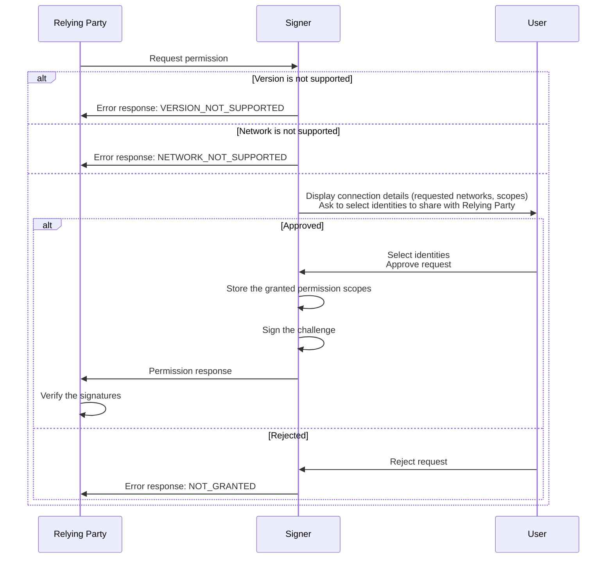
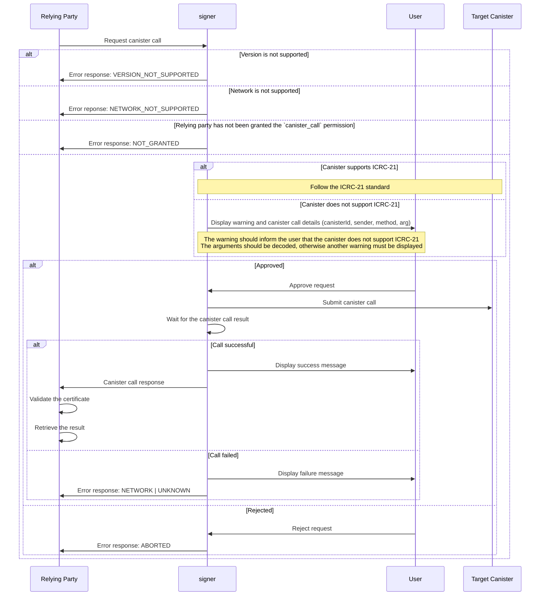
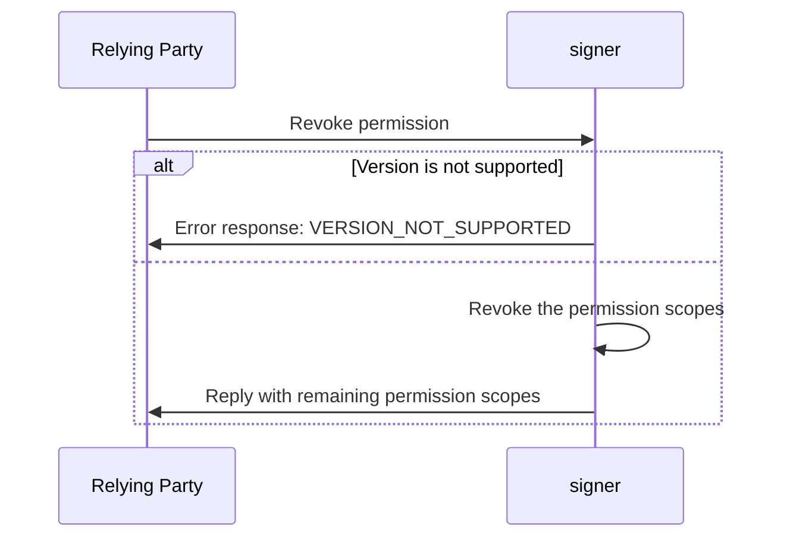

# ICRC-25: Signer Interaction Standard

| Status |
|:------:|
| Draft  |

## Summary

This specification describes a communication protocol between dapps (decentralized applications) and signers. It defines messages that both sides should use to interact with each other and provides guidelines on how to process them.

## Terminology

* signer: A service that manages a user's keys and can sign and perform canister calls on their behalf.
* relying party: A service that wants to request calls on a specific canister.


## Transport Requirements

This standard is agnostic to the transport channel used to send the messages, as long as it provides authenticity and integrity: this means that the communicating parties know the other participant and can be sure that the messages they receive are sent by the party they expect and that the messages have not been tampered with.

The transport channel is not required to provide confidentiality.

## Sessions

ICRC-25 uses sessions to determine the lifetime of granted permissions. Permission scopes (see [`permission` message](#permission)) are granted for the duration of a single session only. 

A session is established when the first permission request is granted. A session can be revoked by the relying party at any time by sending a [`revoke_permission` message](#revokepermission) to the signer. The signer can also terminate the session at any time and should offer the user a method to do so.

A session must be terminated automatically after a certain period of inactivity. The session might be extended automatically if the interaction between the relying party and the signer is still _actively_ ongoing when the default session timeout is reached. There must be a maximum session duration (regardless of activity).

## Messages

### `permission`

The purpose of the `permission` messages is to grant the relying party access to public parts of the user's identity and define the scope of actions the relying part is allowed to perform.

#### Types

- `text`: A plain `string` value.
- `blob`: A `string` value describing binary data encoded in base64.

#### Request

`version` (`text`): The version of the standard used. If the signer does not support the version of the request, it must send the `"VERSION_NOT_SUPPORTED"` error in response.

`networks`: A list of networks on which the relying party plans to operate.
- `chainId`(`text`): The chain id of the network as described in the [CAIP-2](https://github.com/icvc/icp-namespace/blob/caip2/caip2.md) standard.
- `name` (`text`, optional): An optional user-friendly name of the network.
- `rpcUrl` (`text`, optional): An optional custom RPC URL associated with the network.

`scopes`: A list of permission scope objects the relying party requires. If the signer does not support a requested scope, it should ignore that particular scope and proceed as if the `scopes` list did not include that object. Permission scope properties:
- `scopeId` (`text`): Currently only the value `"canister_call"` is supported.

`challenge` (`blob`): A challenge used for the signer to sign in order to prove its access to the identity. The challenge should be an array of 32 cryptographically random bytes generated from a secure random source by the sender of the request.

#### Response

`version` (`text`): The version of the standard used. It must match the `version` from the request.

`networks`: A list of networks on which the user has agreed the relying party can operate. This should be a subset of the `networks` from the original request.
- `chainId` (`text`): The chain id of the network as described in the [CAIP-2](https://github.com/icvc/icp-namespace/blob/caip2/caip2.md) standard.
- `name` (`text`, optional): An optional user-friendly name of the network.
- `rpcUrl` (`text`, optional): An optional custom RPC URL associated with the network.

`scopes`: A list of permission scope objects that the signer supports and the user has agreed the relying party can be granted. This must be a subset of the `scopes` field from the original request. Permission scope properties:
- `scopeId` (`text`): Currently only the value `"canister_call"` is supported.

`identities`: A list of identities the user has selected to share with the relying party.
- `publicKey` (`blob`): The DER-encoded public key associated with the identity, derived in accordance with one of [the signature algorithms supported by the IC](https://internetcomputer.org/docs/current/references/ic-interface-spec/#signatures). The public key can be used to [derive a self-authenticating principal](https://internetcomputer.org/docs/current/references/ic-interface-spec/#principal).
- `signature` (`blob`): The signature produced by signing the concatenation of the domain separator `\x13ic-signer-challenge` (UTF-8 encoded) and the challenge with the private key associated with the identity.

#### Error

While processing the request from the relying party, the signer can cancel it at any time by sending an error in response.

`errorType` (`text`): The reason behind the cancellation. Possible values:
- `"VERSION_NOT_SUPPORTED`: The version of the standard is not supported by the signer.
- `"NETWORK_NOT_SUPPORTED"`: The network on which the action was requested is not supported by the signer.
- `"NOT_GRANTED"`: The signer has not granted permission to perform the action.
- `"UNKNOWN"`: The reason is unknown.

`description` (`text`, optional): An optional description of the error.

#### Use-Case

1. The relying party sends a `permission` request to the signer.
2. Upon receiving the message, the signer first checks if it can process the message.
    - If the request version is not supported by the signer, the signer sends a response with an error back to the relying party.
    - If none of the requested networks is supported by the signer, the signer sends a response with an error back to the relying party.
3. Next, the signer presents the details of the to-be-established connection to the user and asks the user to select identities that will be paired in response. If the user has never interacted with this relying party before, the signer should display information explaining that the user is about to establish a connection with a new relying party.
    > **Note:** The signer should maintain a list of relying parties that are trusted by the user. It is recommended that signers
    assist users when deciding to grant permissions to new relying parties, e.g. by maintaining a list of well-known relying parties
    and displaying additional information about the relying party, such as its name, logo, etc., or in the case of an unknown relying
    party, by displaying a warning. 
    - If the user approves the request, the signer saves information about the granted permission scopes and sends a successful response back to the relying party.
    - If the user rejects the request, the signer sends a response with an error back to the relying party.
4. After receiving a successful response, the relying party verifies that the signer has access to the private key associated with the provided identities:
    - The relying party retrieves the `publicKey` from each `identities` value, determines the `signature` scheme and verifies whether it was generated by signing the concatenation of the domain separator `\x13ic-signer-challenge` (UTF-8 encoded) and the `challenge` from the request with the private key associated with the `publicKey`.
        - If the signature verification succeeds for all `identities`, the relying party accepts the connection.
        - If the signature verification fails for any `identities` value, the relying party rejects the connection.



#### Example

```json
// Request
{
    "id": 1,
    "jsonrpc": "2.0",
    "method": "permission",
    "params": {
        "version": "1",
        "networks": [{
            "chainId": "icp:737ba355e855bd4b61279056603e0550"
        }],
        "scopes": [{
          "scopeId": "canister_call"
        }],
        "challenge": "UjwgsORvEzp98TmB1cAIseNOoD9+GLyN/1DzJ5+jxZM="
    }
}

// Response
{
    "id": 1,
    "jsonrpc": "2.0",
    "result": {
        "version": "1",
        "networks": [{
            "chainId": "icp:737ba355e855bd4b61279056603e0550"
        }],
        "scopes": [{
          "scopeId": "canister_call"
        }],
        "identities": [
            {
                "publicKey": "MFYwEAYHKoZIzj0CAQYFK4EEAAoDQgAEOTdHYwpFTr/oPXOfLQcteymk8AQE41VwPQ1W7Xpm0Zt1AY4+5aOnMAbAIjXEchxPuGbPWqPqwntXMPs3w4rOaA==", /* principal: 2mdal-aedsb-hlpnv-qu3zl-ae6on-72bt5-fwha5-xzs74-5dkaz-dfywi-aqe */
                "signature": "bldf7qn7DC5NzTyX5kp4GpZHaEncE5/6n/Y8av3xjEwIVFAwmhyW0uM+WBXRTj4QbScot04dfaBXUOcSWF0IjQ=="
            }
        ]
    }
}

// Error
{
    "id": 1,
    "jsonrpc": "2.0",
    "error": {
        "version": "1",
        "errorType": "NOT_GRANTED",
        "description": "The user has rejected the permission."
    }
}
```

### `canister_call`

Once the connection between the relying party and the signer is established, and the relying party has been granted the permission scope with `scopeId` `canister_call`, the relying party can request the signer to execute canister calls.

#### Types

- `text`: A plain `string` value.
- `blob`: A `string` value describing binary data encoded in base64.
- `nat`: A `string` value of an unsigned 64-bit integer.

#### Request

`version` (`text`): The version of the standard used. If the signer does not support the version of the request, it must send the `"VERSION_NOT_SUPPORTED"` error in response.

`network`: Network details on which the call should be executed.
- `chainId` (`text`) - The chain id of the network as described in the [CAIP-2](https://github.com/icvc/icp-namespace/blob/caip2/caip2.md) standard.
- `name` (`text`, optional): An optional user-friendly name of the network.
- `rpcUrl` (`text`, optional): An optional custom RPC URL associated with the network.

`canisterId` (`text`): The id of the canister on which the call should be executed.

`sender` (`text`): The principal requested to execute the call. Must be associated with one of the `identities` that the user has previously shared with the relying party in the `permission` response, granting it `canister_call` permission scope at the same time.

`method` (`text`): The name of the call method to be executed.

`arg` (`blob`): The arguments for the call.


#### Response

`version` (`text`): The version of the standard used. It must match the `version` from the request.

`network`: Network details on which the call was executed.
- `chainId` (`text`): The chain id of the network as described in the [CAIP-2](https://github.com/icvc/icp-namespace/blob/caip2/caip2.md) standard.
- `name` (`text`, optional): An optional user-friendly name of the network.
- `rpcUrl` (`text`, optional): An optional custom RPC URL associated with the network.

`contentMap`: The actual request content as specified [here](https://internetcomputer.org/docs/current/references/ic-interface-spec/#http-call).
- `request_type` (`text`)
- `sender` (`blob`)
- `nonce` (`blob`, optional)
- `ingress_expiry` (`nat`)
- `canister_id` (`blob`)
- `method_name` (`text`)
- `arg` (`blob`)

`certificate` (`blob`): The certificate returned by the `read_state` call as specified [here](https://internetcomputer.org/docs/current/references/ic-interface-spec/#certificate). The value is CBOR-encoded.

#### Error

While processing the request from the relying party, the signer can cancel it at any time by sending an error in response.

`errorType` (`text`): The reason behind the cancellation. Possible values:
- `"ABORTED"`: The user has canceled the action.
- `"VERSION_NOT_SUPPORTED`: The version of the standard is not supported by the signer.
- `"NETWORK_NOT_SUPPORTED"`: The network on which the action was requested is not supported by the signer.
- `"NOT_GRANTED"`: The signer has not granted permission to perform the action.
- `"NETWORK"`: The network call failed.
- `"UNKNOWN"`: The reason is unknown.

`description` (`text`, optional): An optional description of the error.

#### Use-Case

1. The relying party sends a `canister_call` request to the signer.
2. Upon receiving the request, the signer validates whether it can process the message.
    - If the request version is not supported by the signer, the signer sends a response with an error back to the relying party.
    - If the network is not supported by the signer, the signer sends a response with an error back to the relying party.
    - If the relying party has not been granted the permission to request the action, the signer sends a response with an error back to the relying party.
3. Next, the signer processes the message following the [ICRC-21](https://github.com/dfinity/wg-identity-authentication/blob/main/topics/consent-msg.md) specification. If the target canister does not support ICRC-21, the signer should display a warning, try to decode the arguments by itself and display raw canister call details. If the arguments cannot be decoded, a proper warning must be displayed.
    - If the user approves the request:
        - The signer sends the call to the IC (in order to get a certified results, all calls, including queries, should be sent as `update` calls), retrieves its [content map](https://internetcomputer.org/docs/current/references/ic-interface-spec/#http-call) and [calculates a request id](https://internetcomputer.org/docs/current/references/ic-interface-spec/#request-id) based on it.
        - The signer continues to call `read_state` for the calculated request id until [the status of the call](https://internetcomputer.org/docs/current/references/ic-interface-spec/#state-tree-request-status) indicates that the call has been processed (succesfully or not).
            - If the status of the call is `replied`, the signer retrieves the CBOR-encoded [certificate](https://internetcomputer.org/docs/current/references/ic-interface-spec/#certificate) from [the `read_state` response](https://internetcomputer.org/docs/current/references/ic-interface-spec/#http-read-state) and sends it together with the content map in response back to the relying party.
            - If the status of the call indicates the call failed, the signer sends a response with an error back to the relying party.
    - If the user rejects the request or if the signer fails to complete the requested action for any reason, the signer sends a response with an error back to the relying party.
3. If the response is successful, the relying party verifies whether the call performed by the signer was genuine and retrieves the result:
    - The relying party retrieves the `contentMap` from the response, verifies that its values match the expectations and uses it to [calculate a request id](https://internetcomputer.org/docs/current/references/ic-interface-spec/#request-id).
    - The relying party retrieves the CBOR-encoded [`certificate`](https://internetcomputer.org/docs/current/references/ic-interface-spec/#certificate) from the response, decodes it and validates its authenticity with regard to [the root of trust](https://internetcomputer.org/docs/current/references/ic-interface-spec/#root-of-trust).
        - If the validation process fails, the relying party rejects the response.
    - The relying party uses the calculated request id to retrieve [the `reply` blob](https://internetcomputer.org/docs/current/references/ic-interface-spec/#state-tree-request-status) from the `certificate`'s state tree.
        - If the `reply` blob is not present, the relying party rejects the response.



#### Example

```json
// Request
{
    "id": 1,
    "jsonrpc": "2.0",
    "method": "canister_call",
    "params": {
        "version": "1",
        "network": {
            "chainId": "icp:737ba355e855bd4b61279056603e0550",
        },
        "canisterId": "bkyz2-fmaaa-aaaaa-qaaaq-cai",
        "sender": "2mdal-aedsb-hlpnv-qu3zl-ae6on-72bt5-fwha5-xzs74-5dkaz-dfywi-aqe",
        "method": "transfer",
        "arg": "RElETARte24AbAKzsNrDA2ithsqDBQFsA/vKAQKi3pTrBgHYo4yoDX0BAwEdrH2v4C9riZI1Ss2DBLYdFDnt53DN2OUDJIiEgQIAAOgH"
    }
}

// Response
{
    "id": 1,
    "jsonrpc": "2.0",
    "result": {
        "version": "1",
        "network": {
            "chainId": "icp:737ba355e855bd4b61279056603e0550",
        },
        "contentMap": {
            "request_type": "call",
            "sender": "g5BOt7awpvKwE85v9Bn0tjg7fMv86NQMjLiyAQI=",
            "nonce": "AAABihipQ2wfDXuJIT9dtQ==",
            "ingress_expiry": "1692631100652000000",
            "canister_id": "gAAAAAAQAAEBAQ==",
            "method_name": "transfer",
            "arg": "RElETARte24AbAKzsNrDA2ithsqDBQFsA/vKAQKi3pTrBgHYo4yoDX0BAwEdrH2v4C9riZI1Ss2DBLYdFDnt53DN2OUDJIiEgQIAAOgH"
        },
        "certificate": "2dn3omR0cmVlgwGDAYIEWCDbGqoAWNjUIoTvYJXJ1d7kXYQxwJNfo38JT65LLVkZsoMBgwJOcmVxdWVzdF9zdGF0dXODAlgg7MfguoW+I0iJuMBdVigbtth22JBuAAqm0C39alKLmsqDAYMCRXJlcGx5ggNYq0RJREwBawK8igF9xf7SAXEBAAGWAUlDUkMtMiBBZ2VudCBlcnJvcjogKENhbmlzdGVyRXJyb3IsICJJQzA1MDM6IENhbmlzdGVyIHJ5amwzLXR5YWFhLWFhYWFhLWFhYWJhLWNhaSB0cmFwcGVkIGV4cGxpY2l0bHk6IElDUkMtMiBmZWF0dXJlcyBhcmUgbm90IGVuYWJsZWQgb24gdGhlIGxlZGdlci4iKYMCRnN0YXR1c4IDR3JlcGxpZWSCBFggD/rb0QsMZPXgOy0VFGgeQnUXoSwtK/M+hgO2pueq7UuDAYIEWCCPaMYe2OYoqQnR7mpSR6h2WzzA8byWm8yQKz1K6Y835IMCRHRpbWWCA0mgnuioz9nbvhdpc2lnbmF0dXJlWDCEOhywYNqcVJD3I1ZcEAfCw2FkwECK6qHzyPDuXetUHVLlRrezmD7iGK2eOP8krMw="
    }
}

// Error
{
    "id": 1,
    "jsonrpc": "2.0",
    "error": {
        "version": "1",
        "errorType": "ABORTED",
        "description": "The user has rejected the action."
    }
}
```

### `revoke_permission`

Once the relying party has been granted some permission scopes, the relying party can request to revoke all or a subset of the previously granted permission scopes. If all granted permissions are revoked, the session is terminated.

#### Types

- `text`: A plain `string` value.
- `blob`: A `string` value describing binary data encoded in base64.

#### Request

`version` (`text`): The version of the standard used. If the signer does not support the version of the request, it must send the `"VERSION_NOT_SUPPORTED"` error in response.

`scopes` (optional): A list of permission scope objects the relying party wants to revoke. If this list is empty, or undefined, the signer revokes all granted permission scopes and terminates the session. If the signer does not recognize a provided scope, or if it has not been granted on the current session, it should ignore that particular scope and proceed as if the `scopes` list did not include that object. Permission scope properties:
- `scopeId` (`text`): Currently only the value `"canister_call"` is supported.

#### Response

`version` (`text`): The version of the standard used. It must match the `version` from the request.

`scopes`: The list of permission scope objects that remain granted on the current session after applying the revocation. This list may be empty. Permission scope properties:
- `scopeId` (`text`): Currently only the value `"canister_call"` is supported.

#### Error

While processing the request from the relying party, the signer can cancel it at any time by sending an error in response.

`errorType` (`text`): The reason behind the cancellation. Possible values:
- `"VERSION_NOT_SUPPORTED`: The version of the standard is not supported by the signer.
- `"UNKNOWN"`: The reason is unknown.

`description` (`text`, optional): An optional description of the error.

#### Use-Case

1. The relying party sends a `revoke_permission` request to the signer.
2. Upon receiving the request, the signer validates whether it can process the message.
    - If the request version is not supported by the signer, the signer sends a response with an error back to the relying party.
3. Next, the signer revokes the requested permission scopes. If no scopes are provided, the signer revokes all granted permission scopes.
4. The signer sends a response back to the relying party with the list of remaining permission scopes. If no scopes remain granted, the signer terminates the session.



#### Example

```json
// Request
{
    "id": 1,
    "jsonrpc": "2.0",
    "method": "revoke_permission",
    "params": {
        "version": "1",
        "scopes": [{
          "scopeId": "canister_call"
        }]
    }
}

// Response
{
    "id": 1,
    "jsonrpc": "2.0",
    "result": {
        "version": "1",
        "scopes": []
    }
}

// Error
{
    "id": 1,
    "jsonrpc": "2.0",
    "error": {
        "version": "1",
        "errorType": "UNKNOWN"
    }
}
```