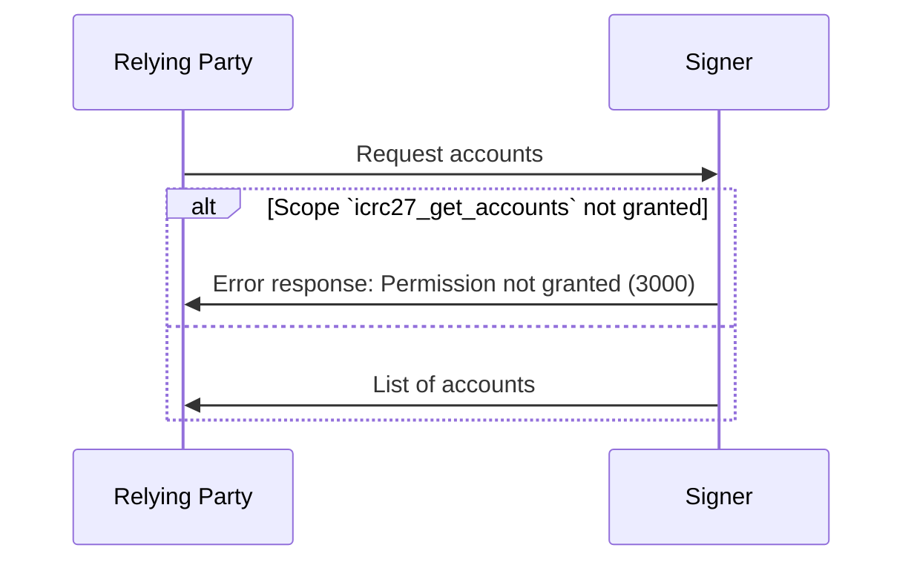

# ICRC-27: Get Accounts

[](https://github.com/orgs/dfinity/projects/31)
[](./icrc_25_signer_interaction_standard.md)

<!-- TOC -->
* [ICRC-27: Get Accounts](#icrc-27-get-accounts)
  * [Summary](#summary)
  * [Method](#method)
  * [Scope (according to the ICRC-25 standard)](#scope-according-to-the-icrc-25-standard)
    * [Example Permission Request](#example-permission-request)
  * [`icrc25_supported_standards`](#icrc25_supported_standards)
  * [Request Params](#request-params)
    * [Example RPC Request](#example-rpc-request)
  * [Result](#result)
    * [Example RPC Response](#example-rpc-response)
  * [Message Processing](#message-processing)
  * [Errors](#errors)
  * [Supported token standards](#supported-token-standards)
<!-- TOC -->

## Summary

The purpose of the `icrc27_get_accounts` message is for the relying party to receive information about the identities
managed by the signer.

## Method

**Name:** `icrc27_get_accounts`

**Prerequisite:** Active session with granted permission scope `icrc27_get_accounts`.

## Scope (according to the [ICRC-25 standard](./icrc_25_signer_interaction_standard.md))

**Scope:** `icrc27_get_accounts`

### Example Permission Request

```json
{
  "id": 1,
  "jsonrpc": "2.0",
  "method": "icrc25_request_permissions",
  "params": {
    "scopes": [
      {
        "method": "icrc27_get_accounts"
      }
    ]
  }
}
```

## `icrc25_supported_standards`

An ICRC-25 compliant signer must implement
the [icrc25_supported_standards](./icrc_25_signer_interaction_standard.md#icrc25_supported_standards) method which
returns the list of supported standards. Any signer implementing ICRC-27 must include a record with the name field equal
to "ICRC-27" in that list.

## Request Params

None

### Example RPC Request

```json
{
  "id": 1,
  "jsonrpc": "2.0",
  "method": "icrc27_get_accounts"
}
```

## Result

**`accounts` (`vec`):** List of accounts.

- `principal` (`text`): Principal (textual representation) used to derive the account identity.
- `subaccount` (`blob`) (Optional): Subaccount bytes used to derive the account identity, this is 32 bytes as defined in
  the ICRC-1 ledger standard.

### Example RPC Response

```json
{
  "id": 1,
  "jsonrpc": "2.0",
  "result": {
    "accounts": [
      {
        "principal": "gyu2j-2ni7o-o6yjt-n7lyh-x3sxq-zh7hp-sjvqe-t7oul-4eehb-2gvtt-jae",
        "subaccount": "0000000000000000000000000000000000000000000000000000000000e73f5c"
      }
    ]
  }
}
```

## Message Processing

1. The relying party sends a `icrc27_get_accounts` request to the signer.
2. Upon receiving the message, the signer first checks if it can process the message.
    - If the relying party has not been granted the permission to invoke the method,
      the signer sends a response with an error back to the relying party.
3. The signer MAY prompt the user to select which accounts to share.
    - If the signer prompts the user, it SHOULD do so for each request so that the
      relying party can offer the user the option to update / change the selection.
4. The signer sends a response to the relying party with the list of accounts selected by the user.



## Errors

This standard does not define additional errors. See [ICRC-25](./icrc_25_signer_interaction_standard.md#errors-3) for a
list of errors that can be returned by all methods.

## Supported token standards

To get a list of the token standards that the signer supports see the `icrc25_supported_standards` method
in [ICRC-25](./icrc_25_signer_interaction_standard.md#errors-3).

If a token standard is not returned in the `icrc25_supported_standards` method, the relying party SHOULD assume that the
signer does not have the capability to show and transfer tokens of this token standard.

A relying party MAY only transfer unsupported tokens to a signer account if the relying party is at least able to offer
the capability to show and transfer the tokens held by the signer account itself.