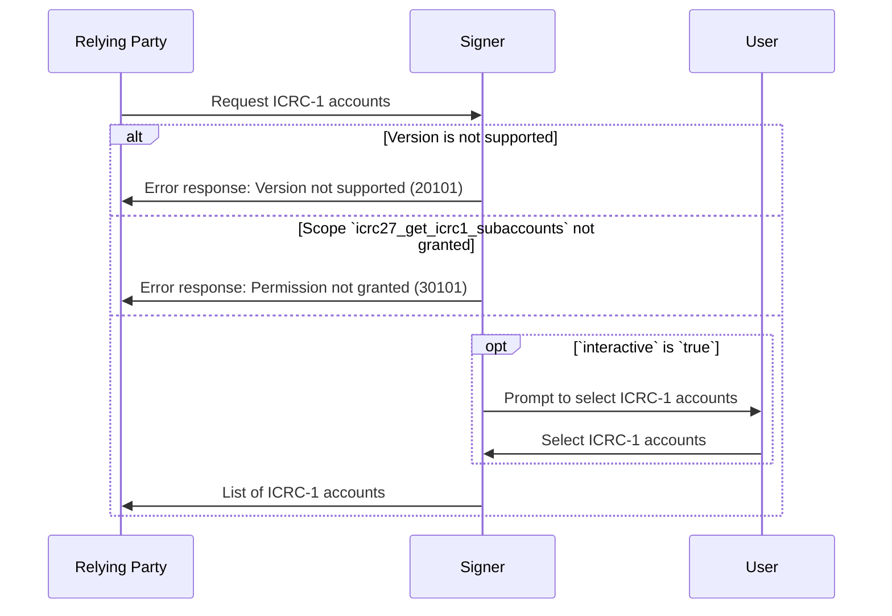

# ICRC-27: Get ICRC-1 Accounts

[](https://github.com/orgs/dfinity/projects/31)
[](./icrc_25_signer_interaction_standard.md)

<!-- TOC -->
* [ICRC-27: Get ICRC-1 Accounts](#icrc-27-get-icrc-1-accounts)
  * [Summary](#summary)
  * [Use-Case](#use-case)
  * [Method](#method)
  * [Scope (according to the ICRC-25 standard)](#scope-according-to-the-icrc-25-standard)
    * [Example Permission Request](#example-permission-request)
  * [`icrc25_supported_standards`](#icrc25_supported_standards)
  * [Request](#request)
    * [Example RPC Request](#example-rpc-request)
  * [Response](#response)
    * [Example RPC Response](#example-rpc-response)
  * [Message Processing](#message-processing)
  * [Errors](#errors)
  * [Ledger index canister accounts](#ledger-index-canister-accounts)
  * [Default subaccount](#default-subaccount)
  * [Other ledger standards](#other-ledger-standards)
<!-- TOC -->

## Summary

The purpose of the `icrc27_get_icrc1_accounts` message is for the relying party to receive ICRC-1 accounts managed by
the signer.

There are many types of signers:

- Signers that support many different standards
- Signers that keep a list of accounts per ledger
- Signers that keep a list of accounts used across all ledgers

The scope of this spec is limited to `ICRC-1` standard ledgers, the accounts returned in this spec contain additional
optional information `name` and `canisterIds` to indicate with which ledgers the accounts are meant to be used.

## Use-Case

The relying party can use this information to manage funds held by these accounts.

Example usages:

- Relying party needs to know which account to request a transfer of ICP tokens to make a payment.
- Relying party needs to know all accounts to create tax reports.
- Relying party needs to know the ckBTC accounts to make a ckBTC payment.
- Relying party needs to know all accounts to show all tokens the user holds and is able to swap on the dex.

## Method

**Name:** `icrc27_get_icrc1_accounts`

**Prerequisite:** Active session with granted permission scope `icrc27_get_icrc1_accounts` or `*`.

## Scope (according to the [ICRC-25 standard](./icrc_25_signer_interaction_standard.md))

**Scope:** `icrc27_get_icrc1_accounts`

### Example Permission Request

```json
{
  "id": 1,
  "jsonrpc": "2.0",
  "method": "icrc25_request_permissions",
  "params": {
    "version": "1",
    "scopes": [
      {
        "method": "icrc27_get_icrc1_accounts"
      }
    ]
  }
}
```

## `icrc25_supported_standards`

An ICRC-25 compliant signer must implement
the [icrc25_supported_standards](./icrc_25_signer_interaction_standard.md#icrc25_supported_standards) method which
returns the list of supported standards. Any signer implementing ICRC-27 must include a record with the name field equal
to "ICRC-27" in that list.

## Request

**`version` (`text`):** The version of the standard used. If the signer does not support the version of the request, it
must send the `"VERSION_NOT_SUPPORTED"` error in response.

**`interactive` (`bool`):**

- `true` request user to (re-)select list of ICRC-1 accounts to share with relying party.
- `false` request list of previously selected ICRC-1 accounts without user interaction. If a user did not previously
  select any ICRC-1 accounts, an empty list should be returned since user interaction in the ledger should be avoided.

Signers MUST support interactive `false` and MAY support interactive `true`, since some signers might not support user
interaction and e.g. always return a default list of ICRC-1 accounts. The relying party is able to non interactively
refresh the list of ICRC-1 accounts to keep it up to date with the signer e.g. the accounts could change over time.

### Example RPC Request

```json
{
  "id": 1,
  "jsonrpc": "2.0",
  "method": "icrc27_get_icrc1_accounts",
  "params": {
    "version": "1"
  }
}
```

## Response

**`version` (`text`):** The version of the standard used. It must match the `version` from the request.

**`accounts` (`vec`):** List of ICRC-1 accounts.

- `subaccount` (`blob`): Subaccount bytes used to derive the account identity, this is 32 bytes as defined in
  the ICRC-1 ledger standard.
- `canisterIds` (`opt vec principal`): Optional list of ledger canister ids for this account, account is
  assumed to be for any `ICRC-1` ledger canister if undefined.
- `name` (`opt text`): Optional name for this account.

### Example RPC Response

```json
{
  "id": 1,
  "jsonrpc": "2.0",
  "result": {
    "version": "1",
    "accounts": [
      {
        "subaccount": "0000000000000000000000000000000000000000000000000000000000e73f5c",
        "canisterIds": [
          "ryjl3-tyaaa-aaaaa-aaaba-cai"
        ],
        "name": "Account 3"
      }
    ]
  }
}
```

## Message Processing

1. The relying party sends a `icrc27_get_icrc1_accounts` request to the signer.
2. Upon receiving the message, the signer first checks if it can process the message.
    - If the request version is not supported by the signer, the signer sends a response with an error back to the
      relying party.
    - If the relying party has not been granted the permission to invoke the method for the specified principal, the
      signer sends a response with an error back to the relying party.
3. The signer may ask the user to select which ICRC-1 accounts to share with the relying party
    - This step may be skipped if the accounts have been selected before on the active session.
4. The signer sends a response to the relying party with the list of accounts selected by the user.



## Errors

This standard does not define additional errors. See [ICRC-25](./icrc_25_signer_interaction_standard.md#errors-3) for a
list of errors that can be returned by all methods.

## Ledger index canister accounts

Since the ICRC-1 ledger index canister is able to return all subaccounts for a given principal one could argue that the
ICRC-27 standard can be replaced by requesting the principals with the [ICRC-31](./icrc_31_get_principals.md) standard and using the index canister to
look up the subaccounts.

But, this is not recommended for relying parties in most use cases for the following reasons:

- There's no way of knowing about new unused accounts within the ledger
- The user might not want to use some of these accounts
- The principals returned by [ICRC-31](./icrc_31_get_principals.md) might not be the same principals that the signer uses for ICRC-1 accounts
- The signer might not control the ICRC-1 accounts directly but indirectly has access to a limited set of subaccounts in
  e.g. a canister that holds funds for multiple users sharing the same principal.

The ICRC-27 standard guarantees that the ICRC-1 accounts shared by the signer and received by the relying party, are
accessible and under (in)direct control of the signer.

## Default subaccount

The default ICRC-1 account must always be explicitly defined in the `accounts` response when available. The relying
party should not assume the default ICRC-1 account based on the principal and zeroed subaccount itself. Some wallets
might not return an ICRC-1 account with a zeroed subaccount because they don't use and/or support it.

## Other ledger standards

Other ledger standards, for example `ICRC-7` can also extend the `ICRC-25` standard by creating a new standard based on
the `ICRC-27` standard.

Signers should not return accounts for other ledger standards besides `ICRC-1` in the `ICRC-27` standard, doing so
would put relying parties at risk of sending tokens to unsupported ledgers.