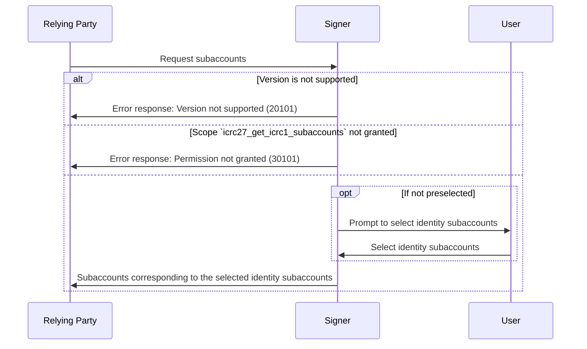

# ICRC-27: Get ICRC-1 Subaccounts

[](https://github.com/orgs/dfinity/projects/31)
[](./icrc_25_signer_interaction_standard.md)

<!-- TOC -->
* [ICRC-27: Get ICRC-1 Subaccounts](#icrc-27-get-icrc-1-subaccounts)
  * [Summary](#summary)
  * [Use-Case](#use-case)
  * [Method](#method)
  * [Scope (according to the ICRC-25 standard)](#scope-according-to-the-icrc-25-standard)
    * [Example Permission Request](#example-permission-request)
  * [`icrc25_supported_standards`](#icrc25_supported_standards)
  * [Request](#request)
    * [Example RPC Request](#example-rpc-request)
  * [Response](#response)
    * [Example RPC Response](#example-rpc-response)
  * [Message Processing](#message-processing)
  * [Errors](#errors)
  * [Default subaccount](#default-subaccount)
  * [Other ledger standards](#other-ledger-standards)
<!-- TOC -->

## Summary

The purpose of the `icrc27_get_icrc1_subaccounts` message is for the relying party to receive subaccounts for a given identity
managed by the signer.

There are many types of signers:

- Signers that support many different standards
- Signers that keep a list of subaccounts per ledger
- Signers that keep a list of subaccounts used across all ledgers

The scope of this spec is limited to `ICRC-1` standard ledgers, the subaccounts returned in this spec contain additional
optional information `name` and `canisterIds` to indicate with which ledgers the subaccounts are meant to be used.

## Use-Case

The relying party can use the subaccounts in the ledger information to manage funds and assets held by these
subaccounts.

Example usages:

- Relying party needs to know which subaccount to request a transfer of ICP tokens to
  make a payment.
- Relying party needs to know all subaccounts to create tax reports.
- Relying party needs to know the ckBTC subaccounts to make a ckBTC payment.
- Relying party needs to know all subaccounts for the ICRC-1 standard to show all tokens the user holds and is able to
  swap on the dex.

## Method

**Name:** `icrc27_get_icrc1_subaccounts`

**Prerequisite:** Active session with granted permission scope `icrc27_get_icrc1_subaccounts` and `icrc31_get_principals`, or `*`.

* This scope may be restricted to specific principals.

## Scope (according to the [ICRC-25 standard](./icrc_25_signer_interaction_standard.md))

**Scope:** `icrc27_get_icrc1_subaccounts`

**Optional Properties:**

- `principals` (`text` array): A list of principals (textual representation) the scope is restricted to. If the list is
  not present, the scope applies to all principals the relying party has access to in the `ICRC-31` standard.

### Example Permission Request

```json
{
  "id": 1,
  "jsonrpc": "2.0",
  "method": "icrc25_request_permissions",
  "params": {
    "version": "1",
    "scopes": [
      {
        "method": "icrc27_get_icrc1_subaccounts",
        "principals": [
          "btbdd-ob3pe-dz6kv-7n4gh-k2xtm-xjthz-kcvpk-fwbnv-w5qbk-iqjm4-4qe",
          "b7gqo-ulk5n-2kpo7-oalt7-p2kyl-o4j5l-kiuwo-eeybr-dab4l-ur6up-pqe"
        ]
      }
    ]
  }
}
```

## `icrc25_supported_standards`

An ICRC-25 compliant signer must implement
the [icrc25_supported_standards](./icrc_25_signer_interaction_standard.md#icrc25_supported_standards) method which
returns the list of supported standards. Any signer implementing ICRC-27 must include a record with the name field equal
to "ICRC-27" in that list.

## Request

**`version` (`text`):** The version of the standard used. If the signer does not support the version of the request, it
must send the `"VERSION_NOT_SUPPORTED"` error in response.
**`principal` (`text`):** The principal (textual representation) the relying party is requesting the ICRC-1 subaccounts
for.

### Example RPC Request

```json
{
  "id": 1,
  "jsonrpc": "2.0",
  "method": "icrc27_get_icrc1_subaccounts",
  "params": {
    "version": "1",
    "principal": "btbdd-ob3pe-dz6kv-7n4gh-k2xtm-xjthz-kcvpk-fwbnv-w5qbk-iqjm4-4qe"
  }
}
```

## Response

**`version` (`text`):** The version of the standard used. It must match the `version` from the request.

**`subaccounts` (`vec`):** List of ICRC-1 subaccounts.

- `bytes` (`blob`): Subaccount bytes used to derive the subaccount identity, this is 32 bytes as defined in
  the ICRC-1 ledger standard.
- `canisterIds` (`opt vec principal`): Optional list of ledger canister ids for this subaccount, subaccount is
  assumed to be for any `ICRC-1` ledger canister if undefined.
- `name` (`opt text`): Optional name for this subaccount.

### Example RPC Response

```json
{
  "id": 1,
  "jsonrpc": "2.0",
  "result": {
    "version": "1",
    "subaccounts": [
      {
        "bytes": "0000000000000000000000000000000000000000000000000000000000e73f5c",
        "canisterIds": [
          "ryjl3-tyaaa-aaaaa-aaaba-cai"
        ],
        "name": "Account 3"
      }
    ]
  }
}
```

## Message Processing

1. The relying party sends a `icrc27_get_icrc1_subaccounts` request to the signer.
2. Upon receiving the message, the signer first checks if it can process the message.
    - If the request version is not supported by the signer, the signer sends a response with an error back to the
      relying party.
    - If the relying party has not been granted the permission to invoke the method for the specified principal, the
      signer sends a response with an error back to the relying party.
3. The signer may ask the user to select which identity subaccounts to share with the relying party
    - This step may be skipped if the identities have been selected before on the active session.
4. The signer sends a response to the relying party with the list of subaccounts corresponding to the selected identity
   subaccounts.



## Errors

This standard does not define additional errors. See [ICRC-25](./icrc_25_signer_interaction_standard.md#errors-3) for a
list of errors that can be returned by all methods.

## Default subaccount

The default subaccount must always be explicitly defined in the `subaccounts` response when available. The relying party
should not assume the default subaccount based on the principal itself. Some wallets might not return the default
subaccount because they don't use and/or support it.

## Other ledger standards

Other ledger standards, for example `ICRC-7` can also extend the `ICRC-25` standard by creating a new standard based on
the `ICRC-27` standard.

Signers should not return subaccounts for other ledger standards besides `ICRC-1` in the `ICRC-27` standard, doing so
would put relying parties at risk of sending tokens to unsupported ledgers.