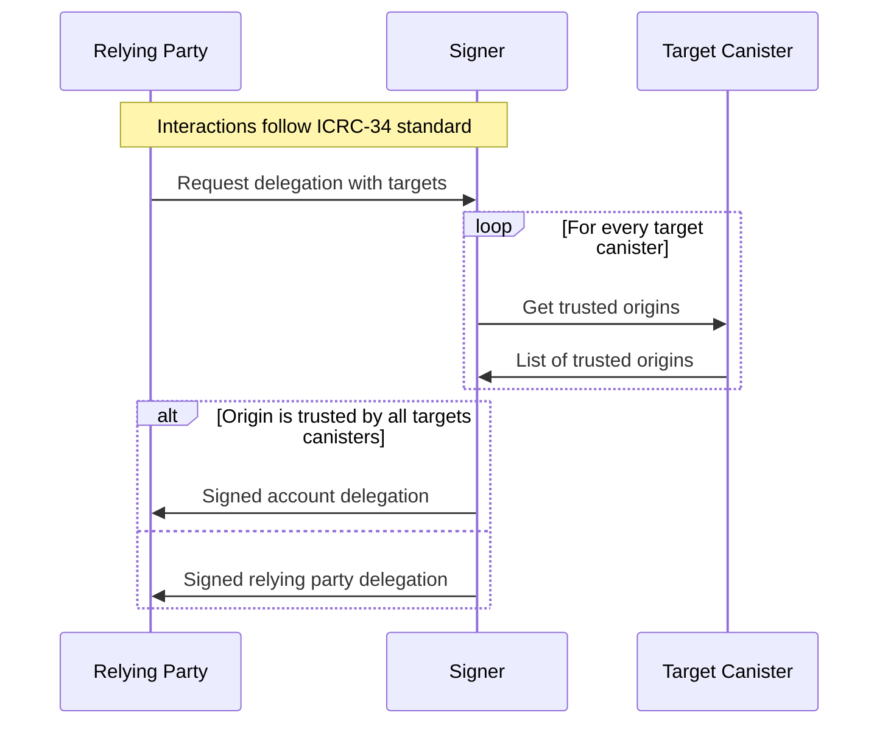

# ICRC-28: Trusted Origins

[](https://github.com/orgs/dfinity/projects/31)
[](https://github.com/dfinity/wg-identity-authentication/issues/115)

<!-- TOC -->
* [ICRC-28: Trusted Origins](#icrc-28-trusted-origins)
  * [Summary](#summary)
  * [Method](#method)
    * [icrc28_trusted_origins](#icrc28_trusted_origins)
  * [Use-Cases](#use-cases)
    * [Account Delegation Use-Case](#account-delegation-use-case)
<!-- TOC -->

## Summary

This standard describes how a canister can indicate that a relying party (an entity that relies on the canister for certain functions or services) is trusted.

Asset or other canisters that are meant to be composed upon by many parties in the ecosystem, such as ICRC-1 or ICRC-7 asset canisters, 
**MUST** not implement ICRC-28 because it would privilege certain parties in a context where privilege should not exist.

A trusted relying party carries certain privileges, like for example the ability to request Account Delegations as per ICRC-34.

This standard assumes dapp developer responsibility for how a canister should:
- Ensure that all entries are free from malicious intent.
- Handle entries that become malicious over time.

## Method

### icrc28_trusted_origins

Returns the canister's list of whitelisted origins.

```
icrc28_trusted_origins : () -> (record { trusted_origins : vec text });
```

## Use-Cases

There are several reasons why signers might want to get a list of frontend URLs a canister trusts, with one in 
particular related to removing the user signer's party approval prompts because Account Delegations created
with icrc28-conforming canisters can call those canisters without user approval.


### Account Delegation Use-Case

[ICRC-34](./icrc_34_delegation.md) applies when a user returns a delegation to a relying party that 
can be used to make authenticated calls on the user's behalf (i.e. without displaying wallet approval prompts). 
To do this safely for the user's wallet address in a way that prevents malicious actors from having access to 
assets, the wallet needs to confirm that each canister listed as a `target` can be safely entrusted with the 
relying party:



1. The relying party connects to the signer and requests a delegation with a list of target canisters.
2. For every target canister the signer:
    1. Gets the list of trusted origins using the `icrc28_trusted_origins` method.
    2. The trusted origins response must be certified and valid:
        * The responses must be provided in a valid certificate (
          see [Certification](https://internetcomputer.org/docs/current/references/ic-interface-spec#certification))
        * The decoded response must not be `null` and match `vec text`.
3. The signer verifies that relying party origin is within the trusted origin list of all targets.
    * If the origin is trusted by all targets, continue with step 4a.
    * If the origin is not trusted by all targets, continue with step 4b.
4. The signed wallet delegation is returned to the relying party.