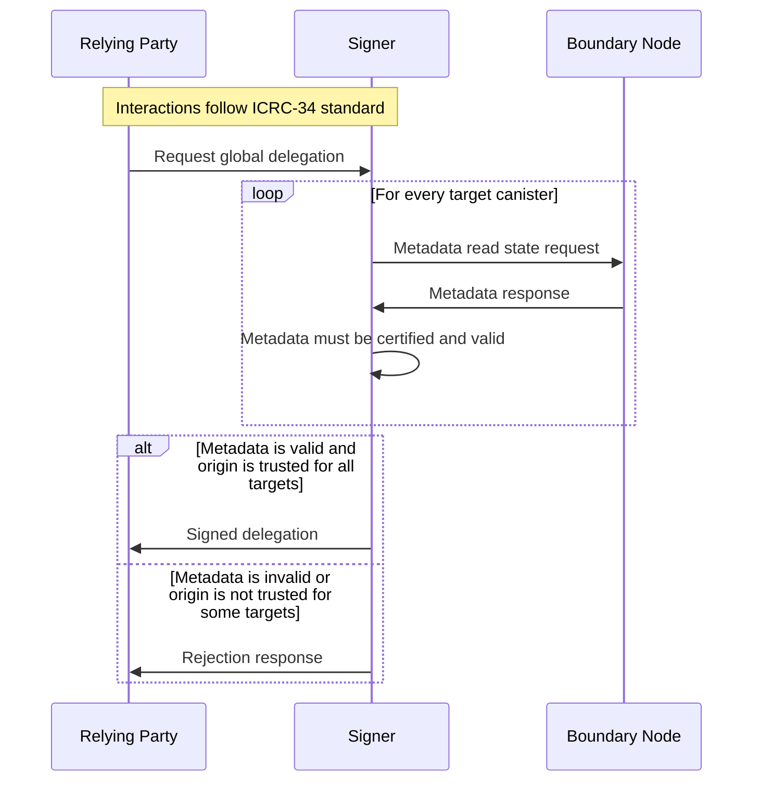
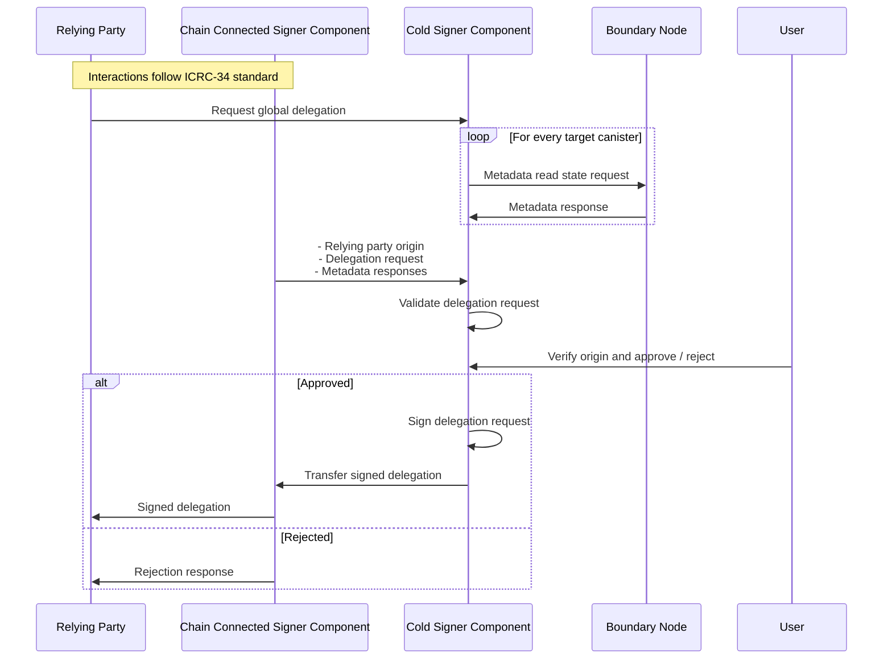

# ICRC-28: Trusted Origins

[](https://github.com/orgs/dfinity/projects/31)
[](https://github.com/dfinity/wg-identity-authentication/issues/115)

<!-- TOC -->
* [ICRC-28: Trusted Origins](#icrc-28-trusted-origins)
  * [Summary](#summary)
  * [Identify](#identify)
  * [Verify](#verify)
    * [icrc28_get_trusted_origins](#icrc28_get_trusted_origins)
  * [Use-Cases](#use-cases)
    * [Hot Signer Use-Case](#hot-signer-use-case)
    * [Cold Signer Use-Case](#cold-signer-use-case)
<!-- TOC -->

## Summary

When a relying party wants to authenticate as a user, it uses a session key (e.g., Ed25519 or ECDSA), and by way of the
authentication flow ([ICRC-34](./icrc_34_get_global_delegation.md) or [ICRC-57](./icrc_57_get_session_delegation.md))
obtains a delegation chain that allows the session key to sign for the user's global or session identity.

In case the global authentication flow ([ICRC-34](./icrc_34_get_global_delegation.md)) is used, a delegation chain for
the user's global identity is obtained. Since a global identity is not scoped per relying party, canisters from other
relying parties can be called on behalf of the user without user approval unless the delegation chain is restricted.

Therefore, a signer **MUST** restrict the delegation chain for the user's global identity to a set of canister
targets that trust the relying party that requested the delegation chain. This standard describes how a canister can
indicate that a relying party is trusted.

For canisters that don't trust the relying party, [ICRC-49](./icrc_49_call_canister.md) can still be used to make
canister calls that require user approval.

Since canisters from one relying party will not trust another relying party to make calls on behalf of the user without
approval, a delegation chain for a global identity is as a result always restricted to a relying party's own canisters.

It's recommended to use a user's session identity ([ICRC-34](./icrc_34_get_global_delegation.md)) for most use cases
instead. Since it does not require to be trusted by canisters of other relying parties to make calls on behalf of the
user without approval. Also, since it's not restricted by a list of canister targets, it's compatible with multi
canister architectures like e.g. OpenChat which has a per-user canister. Lastly, since the session identity is scoped
per relying party, the user is anonymous between different relying parties.

**Examples**

1. Relying party obtains a delegation chain for a session identity to call its own or other relying party's canisters.
2. Relying party obtains a delegation chain for a global identity to call its own canisters.
3. Relying party wants the user to transfer tokens, so it requests the user's approval in a signer prompt.

## Identify

The window origin (as defined in https://developer.mozilla.org/en-US/docs/Glossary/Origin) is used to identify one
relying party from another.

> The origin is the concatenation of the protocol and "://", the host name if one exists, and ":" followed by a port
> number if a port is present and differs from the default port for the given protocol. Examples of typical origins
> are https://example.org (implying port 443), http://example.net (implying port 80), and http://example.com:8080.

The origin can't be trusted with some transport layers. It's up to the signer to implement a trustable way to identify
the origin of the relying party.

The origin **MUST** be identified in a trustable way by the signer for example through `postMessage`.

## Verify

When the signer receives a delegation chain request for a global identity, it must verify that the canisters targets
trust the relying party making the request. The signer can use the following method to get a list of trusted origins for
each canister target and then verify if the relying party is within each list.

### icrc28_get_trusted_origins

Returns a list of origins trusted by the canister.

```
icrc28_get_trusted_origins : () -> (vec text);
```

## Use-Cases

The `icp:public icrc28_trusted_origins` metadata is designed to be used with both cold and hot signers.

### Hot Signer Use-Case

This section describes the interactions between the signer and the relying party for _hot_ signers:



1. The relying party connects to the signer and requests a global delegation for a given principal and list of target
   canisters.
2. For every target canister the signer:
    1. Gets the `icp:public trusted_origins` metadata using read state request
    2. The metadata response must be certified and valid:
        * The `icp:public trusted_origins` metadata must be provided in a valid certificate (
          see [Certification](https://internetcomputer.org/docs/current/references/ic-interface-spec#certification)).
        * The `icp:public trusted_origins` metadata must not be `null` and match `vec text`.
3. The signer verifies that relying party origin is within the `icp:public trusted_origins` metadata for all targets.
    * If the origin is trusted by all targets, continue with step 4.
    * If the origin is not trusted by all targets, the signer returns an error to the relying party. No further steps
      are executed.
4. The global delegation returned to the relying party.

### Cold Signer Use-Case

This section describes the interactions between the signer and the relying party for _cold_ signers:



1. The relying party connects to the signer and requests a global delegation for a given principal and list of target
   canisters.
2. For every target canister the signer gets the `icp:public trusted_origins` metadata using read state request
3. The relying party origin and global delegation request as well as the certified metadata responses are transferred to
   the cold signer component.
4. The cold signer component validates the delegation request:
    1. The metadata responses must match the delegation request targets:
    2. The metadata responses must be certified and valid:
        * The `icp:public trusted_origins` metadata must be provided in a valid certificate (
          see [Certification](https://internetcomputer.org/docs/current/references/ic-interface-spec#certification)).
        * The time of all metadata responses must all be within the same reasonable time range.
        * The `icp:public trusted_origins` metadata must not be `null` and match `vec text`.
    3. The relying party origin must be within the `icp:public trusted_origins` of all metadata responses.
5. If validation is successful, the origin is presented to the user.
    * If the user recognizes the origin and approves, continue with step 6.
    * If the user rejects (or does not respond within a certain time frame), the signer returns an error to the relying
      party (via the chain connected component). No further steps are executed.
6. The delegation request is signed and transferred to the chain connected component.
    * The expiry of the delegation request is set to the most recent time within the metadata responses plus a
      reasonable session length that is less than or equal to the maxTimeToLive value in the delegation request.
7. The delegation is returned to the relying party.

> It's recommended to have the Chain Connected Signer Component verify the delegation request beforehand as described in
> above _hot_ signer interaction use-case. To reject invalid requests early before interacting with the cold signer.
