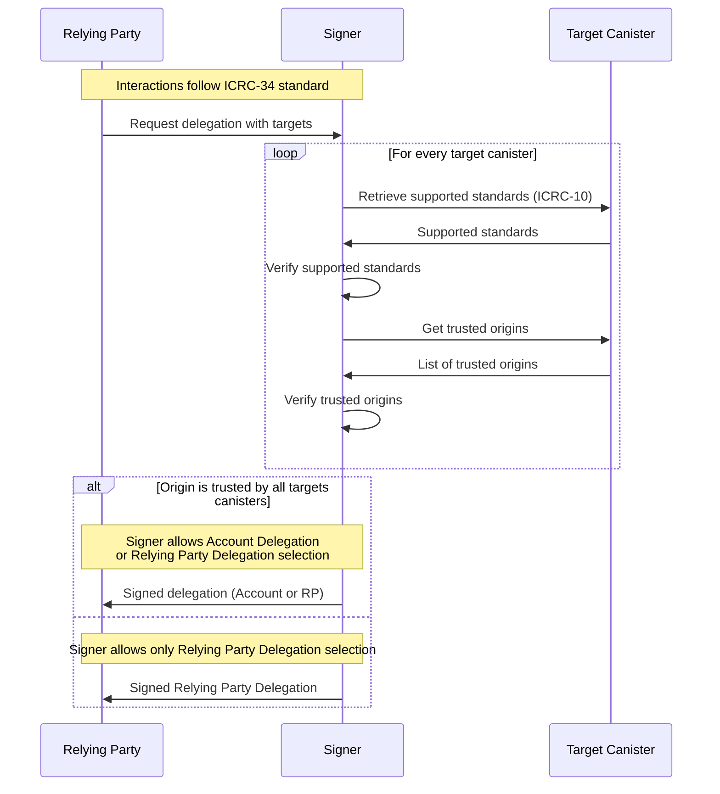

# ICRC-28: Trusted Origins

![APPROVED]

**Authors:** [Dan Ostrovsky](https://github.com/dostro)

<!-- TOC -->
* [ICRC-28: Trusted Origins](#icrc-28-trusted-origins)
  * [Summary](#summary)
  * [Methods](#methods)
    * [icrc28_trusted_origins](#icrc28_trusted_origins)
    * [icrc10_supported_standards](#icrc10_supported_standards)
  * [Use-Cases](#use-cases)
    * [Account Delegation Use-Case](#account-delegation-use-case)
<!-- TOC -->

## Summary

This standard describes how a canister can indicate that a relying party (an entity that relies on the canister for certain functions or services) is trusted.

Canisters that manage tradable assets or are otherwise meant to be composed upon by distinct parties in the ecosystem (e.g. ICRC-1 or ICRC-7 canisters), 
**MUST NOT** implement ICRC-28: ICRC-28 privileges the listed entities to potentially act independently on behalf of the signer, which is a security risk in the context of tradable assets and shared infrastructure.

> **Note:** If an entity is required to act independently on behalf of the signer in the context of tradable assets it is recommended to use an approval flow as specified in [ICRC-2](https://github.com/dfinity/ICRC-1/blob/main/standards/ICRC-2/README.md) or https://github.com/dfinity/ICRC/blob/main/ICRCs/ICRC-37/ICRC-37.md.

A trusted relying party carries certain privileges, like for example the ability to request Account Delegations as per [ICRC-34](./icrc_34_delegation.md).

This standard assumes dapp developer responsibility for how a canister should:
- Ensure that all entries are free from malicious intent.
- Handle entries of entities that become malicious over time.

## Methods

### icrc28_trusted_origins

Returns the canister's list of trusted origins, meaning each front-end listed will not act maliciously with respect to this canister.

```
icrc28_trusted_origins : () -> (record { trusted_origins : vec text });
```

### icrc10_supported_standards

An implementation of ICRC-28 MUST implement the method icrc10_supported_standards as put forth in 
[ICRC-10](https://github.com/dfinity/ICRC/ICRCs/ICRC-10).

The result of the call MUST always have at least the following entries:

```
record { name = "ICRC-28"; url = "https://github.com/dfinity/ICRC/tree/main/ICRCs/ICRC-28/ICRC-28.md"; }
record { name = "ICRC-10"; url = "https://github.com/dfinity/ICRC/blob/main/ICRCs/ICRC-10/ICRC-10.md"; }
```

## Use-Cases

There are several reasons why signers might want to get a list of frontend URLs a canister trusts, with one in 
particular related to removing the user signer's party approval prompts because Account Delegations created
with icrc28-conforming canisters can call those canisters without user approval.


### Account Delegation Use-Case

[ICRC-34](./icrc_34_delegation.md) applies when a user returns a delegation to a relying party that 
can be used to make authenticated calls on the user's behalf (i.e. without displaying wallet approval prompts).
These delegations come in two forms:
1. **Account Delegation**: an identity that has restricted access to the signers identity, such that it is 
stable across many relying parties but cannot be used to operate on tradable assets and shared infrastructure.
2. **Relying Party Delegation**: an identity designed exclusively for the relying party (Relying Party Delegation).

To return an Account Delegation in a way that prevents malicious actors from having access to 
assets, the wallet needs to confirm that each canister listed as a `target` can be safely entrusted with the 
relying party:

1. The relying party connects to the signer and requests a delegation with a list of target canisters.
2. For every target canister the signer:
   1. Verifies that the target canister trusts the relying party origin.
       1. Gets the list of trusted origins using the `icrc28_trusted_origins` method.
       2. The trusted origins response must be certified and valid:
           * The responses must be provided in a valid certificate (
             see [Certification](https://internetcomputer.org/docs/current/references/ic-interface-spec#certification))
           * The decoded response must not be `null` and match `vec text`.
   2. Verifies that the target canister does _not_ support standards supporting tradable assets or shared infrastructure.
       1. Gets the list of supported standards using the `icrc10_supported_standards` method (and executing it in a replicated fashion).
       2. The supported standards response must be certified and valid:
           * The responses must be provided in a valid certificate (
             see [Certification](https://internetcomputer.org/docs/current/references/ic-interface-spec#certification))
           * The listed standards must not include standards supporting tradable assets. In particular, it must not include [ICRC-1](https://github.com/dfinity/ICRC-1/blob/main/standards/ICRC-1/README.md), [ICRC-2](https://github.com/dfinity/ICRC-1/blob/main/standards/ICRC-2/README.md), [ICRC-7](https://github.com/dfinity/ICRC/blob/main/ICRCs/ICRC-7/ICRC-7.md) and [ICRC-37](https://github.com/dfinity/ICRC/blob/main/ICRCs/ICRC-37/ICRC-37.md).
3. The signer verifies that relying party origin is within the trusted origin list of all targets.
    * If the origin is trusted by all targets, continue with step 4a.
    * If the origin is not trusted by all targets, continue with step 4b.
4.  * a) The signed account or relying party delegation (may depend on user choice) is returned to the relying party. 
    * b) The signed relying party delegation is returned to the relying party.



[APPROVED]: https://img.shields.io/badge/STATUS-APPROVED-ed1e7a.svg