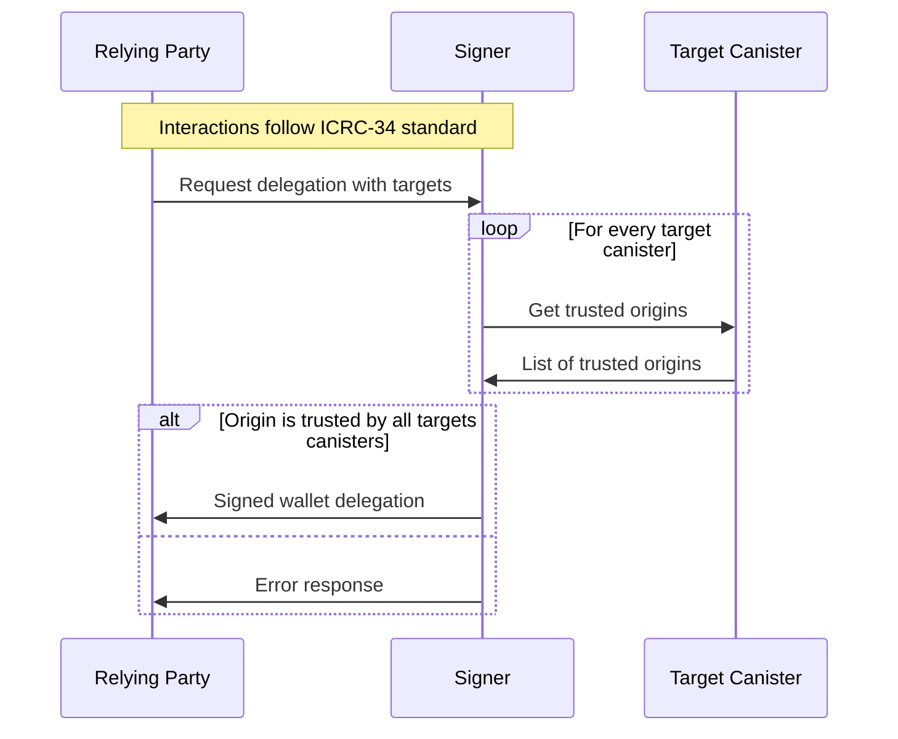

# ICRC-28: Trusted Origins

[](https://github.com/orgs/dfinity/projects/31)
[](https://github.com/dfinity/wg-identity-authentication/issues/115)

<!-- TOC -->
* [ICRC-28: Trusted Origins](#icrc-28-trusted-origins)
  * [Summary](#summary)
  * [Methods](#methods)
    * [icrc28_trusted_origins](#icrc28_trusted_origins)
  * [Use-Cases](#use-cases)
    * [Wallet Delegation Use-Case](#wallet-delegation-use-case)
    * [Cold Signer Use-Case](#cold-signer-use-case)
<!-- TOC -->

## Summary

This standard describes how a canister can indicate that a relying party is trusted.

## Methods

### icrc28_trusted_origins

Returns a list of origins trusted by the canister.

```
icrc28_trusted_origins : () -> (record { trusted_origins : vec text });
```

## Use-Cases

There are several reasons why signers might want to get a list of frontend URLs a canister trusts, with one in 
particular related to removing wallet approval prompts for a user's wallet address.


### Wallet Delegation Use-Case

[ICRC-34](./icrc_34_get_delegation.md) applies when a user returns a delegation to a relying party that 
can be used to make authenticated calls on the user's behalf (i.e. without displaying wallet approval prompts). 
To do this safely for the user's wallet address in a way that prevents malicious actors from having access to 
assets, the wallet needs to confirm that each canister listed as a `target` can be safely entrusted with the 
relying party:



1. The relying party connects to the signer and requests a delegation for a given principal with list of target
   canisters.
2. For every target canister the signer:
    1. Gets the list of trusted origins using the `icrc28_trusted_origins` method.
    2. The trusted origins response must be certified and valid:
        * The responses must be provided in a valid certificate (
          see [Certification](https://internetcomputer.org/docs/current/references/ic-interface-spec#certification))
        * The decoded response must not be `null` and match `vec text`.
3. The signer verifies that relying party origin is within the trusted origin list of all targets.
    * If the origin is trusted by all targets, continue with step 4.
    * If the origin is not trusted by all targets, the signer returns an error to the relying party. No further steps
      are executed.
4. The signed wallet delegation is returned to the relying party.