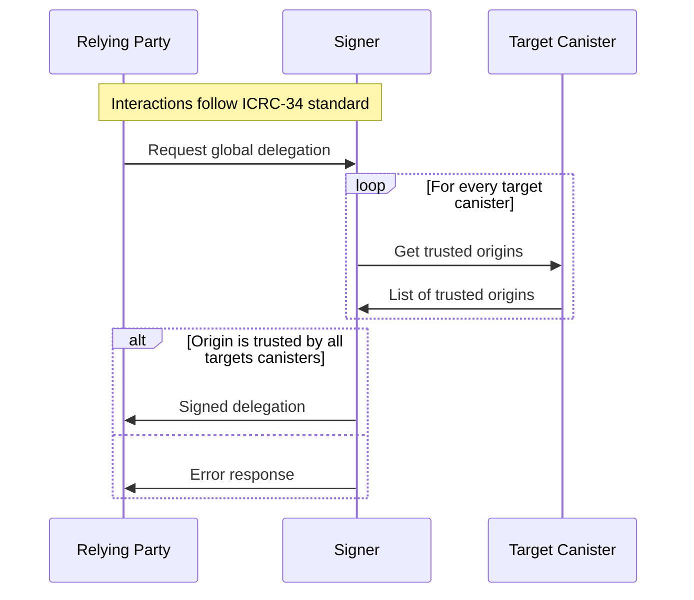
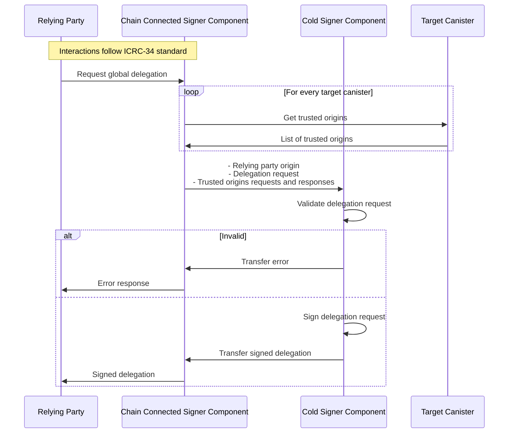

# ICRC-28: Trusted Origins

[](https://github.com/orgs/dfinity/projects/31)
[](https://github.com/dfinity/wg-identity-authentication/issues/115)

<!-- TOC -->
* [ICRC-28: Trusted Origins](#icrc-28-trusted-origins)
  * [Summary](#summary)
  * [Extensions](#extensions)
  * [Identify](#identify)
  * [Verify](#verify)
    * [icrc28_get_trusted_origins](#icrc28_get_trusted_origins)
  * [Use-Cases](#use-cases)
    * [Hot Signer Use-Case](#hot-signer-use-case)
    * [Cold Signer Use-Case](#cold-signer-use-case)
<!-- TOC -->

## Summary

ICRC-28 defines a standard method to provide global delegations to relying parties while ensuring that malicious actors 
cannot gain permission to manage user data in arbitrary canisters (i.e. drain a user's wallet of its assets).

When a relying party wants to authenticate as a user, it uses
a [session key](https://internetcomputer.org/docs/current/references/ic-interface-spec/#signatures), and by way of the
authentication flow ([ICRC-34](./icrc_34_get_global_delegation.md) or [ICRC-57](./icrc_57_get_session_delegation.md))
obtains a delegation chain that allows the session key to sign for the user's global or session identity.

In case the global authentication flow ([ICRC-34](./icrc_34_get_global_delegation.md)) is used, a delegation chain for
the user's global identity is obtained. Since a global identity is not scoped per relying party, canisters from other
relying parties can be called on behalf of the user without user approval unless the delegation chain is restricted.

Therefore, a signer **MUST** restrict the delegation chain for the user's global identity to a set of canister
targets that trust the relying party that requested the delegation chain. This standard describes how a canister can
indicate that a relying party is trusted.

## Extensions

[ICRC-58](https://github.com/dfinity/ICRC/issues/81): A method for relying parties to request arbitrary canisters as targets.

[ICRC-59](https://github.com/dfinity/ICRC/issues/82): A list of asset canisters meant to be shared by the ecosystem that 
signers can choose to reject as canister targets even if the relying party controls them.

## Identify

The window origin (as defined in https://developer.mozilla.org/en-US/docs/Glossary/Origin) is used to identify one
relying party from another.

> The origin is the concatenation of the protocol and "://", the host name if one exists, and ":" followed by a port
> number if a port is present and differs from the default port for the given protocol. Examples of typical origins
> are https://example.org (implying port 443), http://example.net (implying port 80), and http://example.com:8080.

When the signer obtains the origin of the relying party, it **MUST** make sure that it's genuine. Which means that the
transport channel used between the relying party and signer, must return a origin that can be trusted to be genuine
e.g. [ICRC-29](./icrc_29_window_post_message_transport.md).

## Verify

When the signer receives a delegation chain request for a global identity, it must verify that the canister targets
trust the relying party making the request. The signer can use the below method to get a list of trusted origins for
each canister target and then verify if the relying party is within each list.

### icrc28_get_trusted_origins

Returns a list of origins trusted by the canister.

```
icrc28_get_trusted_origins : () -> (record { trusted_origins : vec text });
```

## Use-Cases

The `icrc28_get_trusted_origins` method is designed to be used with both cold and hot signers.

### Hot Signer Use-Case

This section describes the interactions between the signer and the relying party for _hot_ signers:



1. The relying party connects to the signer and requests a global delegation for a given principal and list of target
   canisters.
2. For every target canister the signer:
    1. Gets the list of trusted origins using the `icrc28_get_trusted_origins` method.
    2. The trusted origins response must be certified and valid:
        * The responses must be provided in a valid certificate (
          see [Certification](https://internetcomputer.org/docs/current/references/ic-interface-spec#certification))
        * The decoded response must not be `null` and match `vec text`.
3. The signer verifies that relying party origin is within the trusted origin list of all targets.
    * If the origin is trusted by all targets, continue with step 4.
    * If the origin is not trusted by all targets, the signer returns an error to the relying party. No further steps
      are executed.
4. The signed delegation is returned to the relying party.

### Cold Signer Use-Case

This section describes the interactions between the signer and the relying party for _cold_ signers:



1. The relying party connects to the chain connected signer component and requests a global delegation for a given
   principal and list of target canisters.
2. For every target canister the signer gets the list of trusted origins using the `icrc28_get_trusted_origins` method.
3. The relying party origin and global delegation request as well as the trusted origins requests and responses are
   transferred to the cold signer component.
4. The cold signer component validates the delegation request:
    1. The trusted origins requests must match the delegation request targets:
        * The request method must match `icrc28_get_trusted_origins`.
        * The `icrc28_get_trusted_origins` request `canister_id` must match the delegation target canister id.
    2. The trusted origins responses must be certified and valid:
        * The responses must be provided in a valid certificate (
          see [Certification](https://internetcomputer.org/docs/current/references/ic-interface-spec#certification))
        * The response certificate `time` must be recent with respect to the `ingress_expiry` of the canister call.
        * The response certificate `time` must all be within the same reasonable time range.
        * The decoded response must not be `null` and match `vec text`.
    3. The relying party origin must be within all decoded trusted origins responses.
5. The delegation request is signed and transferred to the chain connected component.
    * The expiry of the delegation request is set to the most recent response certificate `time` within the trusted
      origins responses plus a reasonable session length that is less than or equal to the maxTimeToLive value in the
      delegation request.
6. The signed delegation is returned to the relying party.

> It's recommended to have the Chain Connected Signer Component verify the delegation request beforehand as described in
> above _hot_ signer interaction use-case. To reject invalid requests early before interacting with the cold signer.
