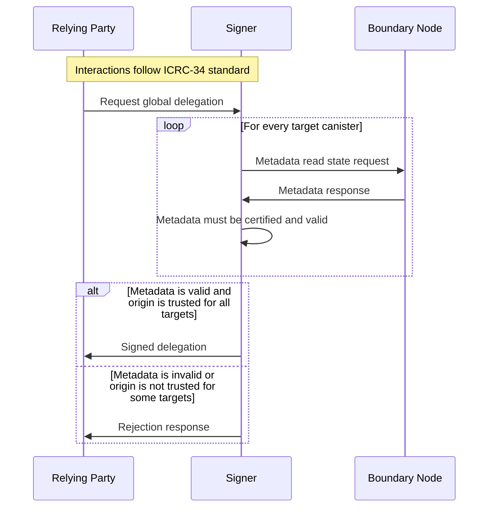
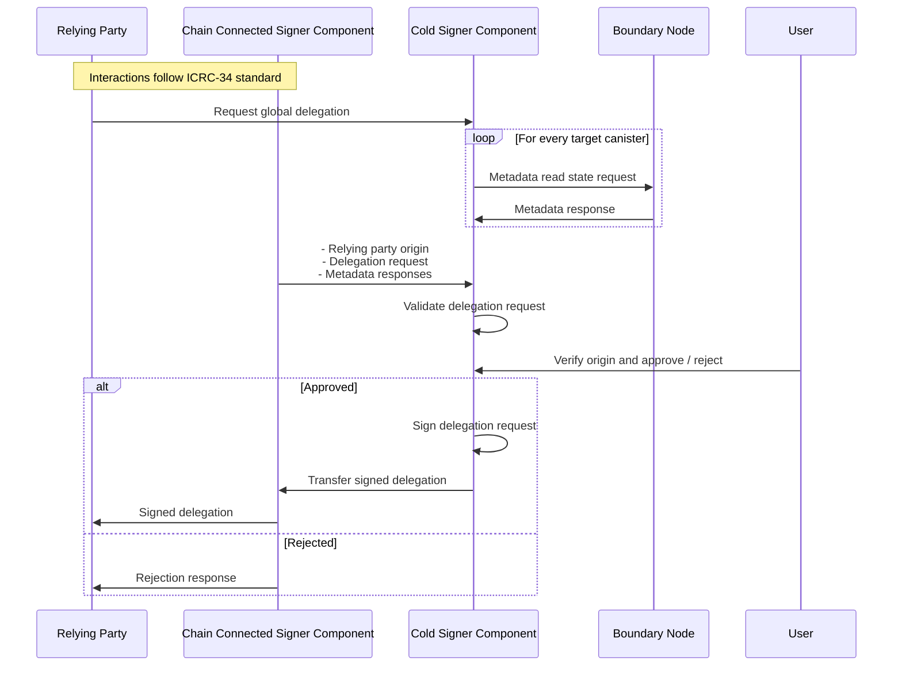

# ICRC-28: Trusted Origins

[](https://github.com/orgs/dfinity/projects/31)
[](https://github.com/dfinity/wg-identity-authentication/issues/115)

<!-- TOC -->
* [ICRC-28: Trusted Origins](#icrc-28-trusted-origins)
  * [Summary](#summary)
  * [Origin](#origin)
  * [Get trusted origins](#get-trusted-origins)
    * [Canister metadata](#canister-metadata)
    * [Canister method](#canister-method)
  * [Use-Cases](#use-cases)
    * [Hot Signer Use-Case](#hot-signer-use-case)
    * [Cold Signer Use-Case](#cold-signer-use-case)
<!-- TOC -->

## Summary

Relying parties wants to request delegations from signers that can make authenticated calls to their own canisters,
while at the same time still requiring user approval to make authenticated calls to canisters it doesn't own.

**Example**

- DSCVR requests a delegation that can make authenticated calls to its own canisters: dscvr_can_1 and dscvr_can_2
- When DSCVR wants the user to transfer tokens, it will need to request the user's approval in a signer prompt

For a signer to verify if a relying party should receive a delegation for a given list of canister targets,
it will need to check for each canister target if the relying party is trusted.

## Origin

The window origin (as defined in https://developer.mozilla.org/en-US/docs/Glossary/Origin) is used to identify one
relying party from another.

> The origin is the concatenation of the protocol and "://", the host name if one exists, and ":" followed by a port
> number if a port is present and differs from the default port for the given protocol. Examples of typical origins
> are https://example.org (implying port 443), http://example.net (implying port 80), and http://example.com:8080.

The origin can't be trusted with some transport layers. It's up to the signer to implement a trustable way to identify
the origin of the relying party.

The origin **MUST** be identified in a trustable way by the signer for example through `postMessage`.

## Get trusted origins

A canister **MUST** make both a metadata entry and a canister method available, both **MUST** return the same list of
trusted origins.

### Canister metadata

Allows for tooling to pull the list of trusted origins out of the state tree from metadata
section `icp:public icrc28_trusted_origins`.

This is the recommended approach for signers since it does not require a canister call to each delegation target
canister.
Instead, it can get the trusted origins from the metadata section and verify the certificate.

### Canister method

Returns list of trusted origins.

This an alternative approach for canisters that want to get the list of trusted origins.

```
icrc28_get_trusted_origins : () -> (vec text);
```

## Use-Cases

The `icp:public icrc28_trusted_origins` metadata is designed to be used with both cold and hot signers.

### Hot Signer Use-Case

This section describes the interactions between the signer and the relying party for _hot_ signers:



1. The relying party connects to the signer and requests a global delegation for a given principal and list of target
   canisters.
2. For every target canister the signer:
    1. Gets the `icp:public trusted_origins` metadata using read state request
    2. The metadata response must be certified and valid:
        * The `icp:public trusted_origins` metadata must be provided in a valid certificate (
          see [Certification](https://internetcomputer.org/docs/current/references/ic-interface-spec#certification)).
        * The `icp:public trusted_origins` metadata must not be `null` and match `vec text`.
3. The signer verifies that relying party origin is within the `icp:public trusted_origins` metadata for all targets.
    * If the origin is trusted by all targets, continue with step 4.
    * If the origin is not trusted by all targets, the signer returns an error to the relying party. No further steps
      are executed.
4. The global delegation returned to the relying party.

### Cold Signer Use-Case

This section describes the interactions between the signer and the relying party for _cold_ signers:



1. The relying party connects to the signer and requests a global delegation for a given principal and list of target
   canisters.
2. For every target canister the signer gets the `icp:public trusted_origins` metadata using read state request
3. The relying party origin and global delegation request as well as the certified metadata responses are transferred to
   the cold signer component.
4. The cold signer component validates the delegation request:
    1. The metadata responses must match the delegation request targets:
    2. The metadata responses must be certified and valid:
        * The `icp:public trusted_origins` metadata must be provided in a valid certificate (see [Certification](https://internetcomputer.org/docs/current/references/ic-interface-spec#certification)).
        * The time of all metadata responses must all be within the same reasonable time range.
        * The `icp:public trusted_origins` metadata must not be `null` and match `vec text`.
    3. The relying party origin must be within the `icp:public trusted_origins` of all metadata responses.
5. If validation is successful, the origin is presented to the user.
    * If the user recognizes the origin and approves, continue with step 6.
    * If the user rejects (or does not respond within a certain time frame), the signer returns an error to the relying
      party (via the chain connected component). No further steps are executed.
6. The delegation request is signed and transferred to the chain connected component.
    * The expiry of the delegation request is set to the most recent time within the metadata responses plus a
      reasonable session length that is less than or equal to the maxTimeToLive value in the delegation request.
7. The delegation is returned to the relying party.

> It's recommended to have the Chain Connected Signer Component verify the delegation request beforehand as described in
> above _hot_ signer interaction use-case. To reject invalid requests early before interacting with the cold signer.
