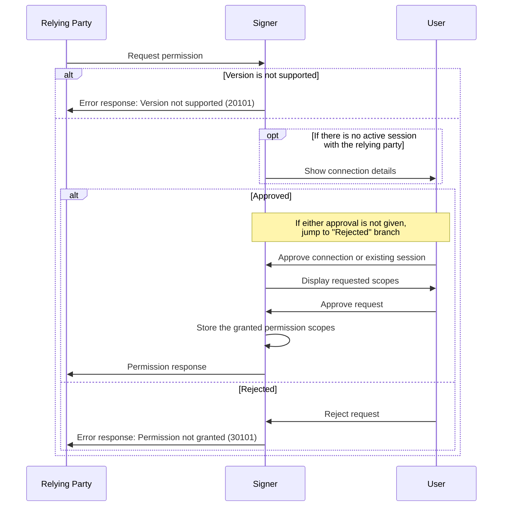
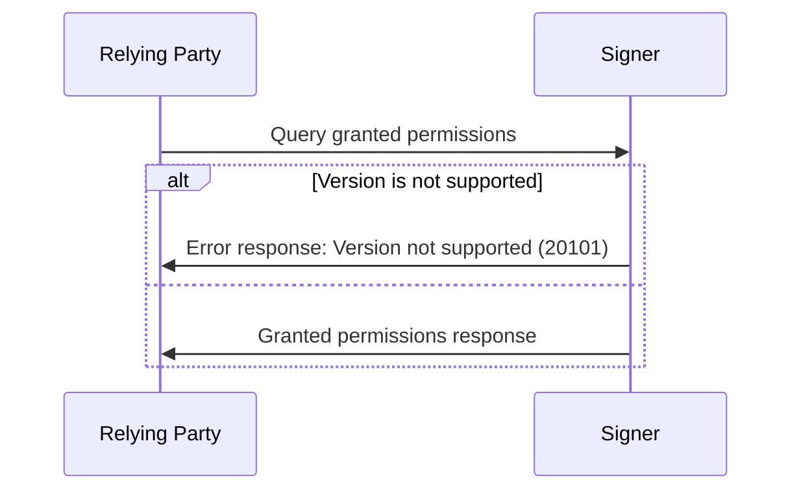
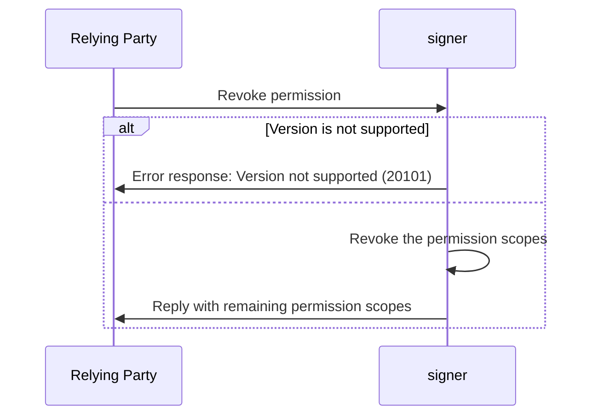

# ICRC-2X: Wallet Permissions

| Status |
| :----: |
| Draft  |

<!-- TOC -->

- [ICRC-2X: Wallet Permissions](#icrc-25-signer-interaction-standard)
  - [Summary](#summary)
  - [Terminology](#terminology)
  - [Types](#types)
  - [Sessions](#sessions)
  - [Messages](#messages)
    - [`icrc25_request_permissions`](#icrc25_request_permissions)
      - [Prerequisites](#prerequisites)
      - [Request](#request)
      - [Response](#response)
      - [Errors](#errors)
      - [Message Processing](#message-processing)
      - [Example](#example)
    - [`icrc25_granted_permissions`](#icrc25_granted_permissions)
      - [Prerequisites](#prerequisites-1)
      - [Request](#request-1)
      - [Response](#response-1)
      - [Errors](#errors-1)
      - [Message Processing](#message-processing-1)
      - [Example](#example-1)
    - [`icrc25_revoke_permissions`](#icrc25_revoke_permissions)
      - [Prerequisites](#prerequisites-4)
      - [Request](#request-4)
      - [Response](#response-4)
      - [Errors](#errors-4)
      - [Message Processing](#message-processing-4)
      - [Example](#example-4)

## Summary

This standard defines a set of messages that allow a relying party to request permissions to call methods on a signer. It is an extention of the [ICRC_25 Signer Interaction Standard](./icrc_25_signer_interaction_standard.md).

## Terminology

## Types

## Sessions

ICRC-2X uses sessions to determine the lifetime of granted permission [scopes](#scopes). Permission scopes (see [`icrc25_request_permissions` message](#icrc25requestpermissions)) are granted for the duration of a single session only.

A session is established when the first permission request is granted. A session can be revoked by the relying party at any time by sending a [`icrc2X_revoke_permissions` message](#icrc25revokepermissions) to the signer. The signer can also terminate the session at any time and should offer the user a method to do so.

A session must be terminated automatically after a certain period of inactivity. The session might be extended automatically if the interaction between the relying party and the signer is still _actively_ ongoing when the default session timeout is reached. There must be a maximum session duration (regardless of activity).

## Methods

### `icrc25_request_permissions`

The purpose of the `icrc25_request_permissions` message is for the relying party to request [permission scopes](#scopes) to perform further actions. If the set of granted scopes is not empty and there was no session before, a new [session](#sessions) is created.

#### Prerequisites

None

#### Request

`version` (`text`): The version of the standard used. If the signer does not support the version of the request, it must send the `"VERSION_NOT_SUPPORTED"` error in response.

`scopes`: A list of permission [scope objects](#scope-objects) the relying party requires. If the signer does not support a requested scope, it should ignore that particular scope and proceed as if the `scopes` list did not include that object.

#### Response

`version` (`text`): The version of the standard used. It must match the `version` from the request.

`scopes`: A list of permission [scope objects](#scope-objects) that the signer supports and the user has granted the relying party. This must be a subset of the `scopes` field from the original request. Additionally, scope restrictions must be the same or more restrictive than the ones requested by the relying party.

#### Errors

While processing the request from the relying party, the signer can cancel it at any time by sending an [error](#errors) in response. In addition to the pre-defined JSON-RPC 2.0 errors ([-32600 to -32603 and -32700](https://www.jsonrpc.org/specification#error_object)), the following values are applicable:

- `10001 Unknown error`
- `20101 Version not supported`
- `30101 Permission not granted`

#### Message Processing

1. The relying party sends a `icrc25_request_permissions` message to the signer.
2. Upon receiving the message, the signer first checks if it can process the message.
   - If the request version is not supported by the signer, the signer sends a response with an error back to the relying party.
3. The signer removes any unrecognized scopes from the list of requested scopes.
4. Depending on the session state the signer either skips or displays the details of the to-be-established connection to the user:

   - If there is an active session with the relying party, skip to the next step, otherwise:

     - the signer presents the details of the to-be-established connection to the user. If the user has never interacted with this relying party before, the signer should display information explaining that the user is about to establish a connection with a new relying party.
     - If the user approves the connection, the signer creates a new session for the relying party.
       - Otherwise, the signer sends a response with an error back to the relying party and step 5 is skipped.

     > **Note:** The signer should maintain a list of relying parties that are trusted by the user. It is recommended that signers assist users when deciding to grant permissions to new relying parties, e.g. by maintaining a list of well-known relying parties and displaying additional information about the relying party, such as its name, logo, etc., or in the case of an unknown relying party, by displaying a warning.

5. The signer displays the list of requested scopes to the user and asks the user to approve or reject the request. The user should also be allowed to approve only a subset of the requested scopes or add additional restrictions (see [optional scope restrictions](#optional-properties)).
   - If all requested scopes have already been granted, the signer may skip the user interaction and reply with the list of granted scopes immediately.
   - If the user approves the request, the signer saves information about the granted permission scopes on the current session. Then the signer sends a successful response back to the relying party with the list of granted scopes.
   - If the user rejects the request, the signer sends a response with an error back to the relying party.
6. After receiving a response, the relying party may send additional messages depending on the granted scopes.



#### Example

Request

```json
{
  "id": 1,
  "jsonrpc": "2.0",
  "method": "icrc25_request_permissions",
  "params": {
    "version": "1",
    "scopes": [
      {
        "method": "icrc25_managed_identities"
      },
      {
        "method": "icrc25_canister_call",
        "targets": ["ryjl3-tyaaa-aaaaa-aaaba-cai"]
      }
    ]
  }
}
```

Response

```json
{
  "id": 1,
  "jsonrpc": "2.0",
  "result": {
    "version": "1",
    "scopes": [
      {
        "method": "icrc25_managed_identities"
      },
      {
        "method": "icrc25_canister_call",
        "targets": ["ryjl3-tyaaa-aaaaa-aaaba-cai"],
        "senders": [
          "btbdd-ob3pe-dz6kv-7n4gh-k2xtm-xjthz-kcvpk-fwbnv-w5qbk-iqjm4-4qe"
        ]
      }
    ]
  }
}
```

### `icrc25_granted_permissions`

The purpose of the `icrc25_granted_permissions` message is for the relying party to query the granted [permission scopes](#scopes) on the active session.

#### Prerequisites

None

#### Request

`version` (`text`): The version of the standard used. If the signer does not support the version of the request, it must send the `"VERSION_NOT_SUPPORTED"` error in response.

#### Response

`version` (`text`): The version of the standard used. It must match the `version` from the request.

`scopes`: A list of permission [scope objects](#scope-objects) that the signer supports and the user has previously granted to the relying party during the active session.

#### Errors

While processing the request from the relying party, the signer can cancel it at any time by sending an [error](#errors) in response. In addition to the pre-defined JSON-RPC 2.0 errors ([-32600 to -32603 and -32700](https://www.jsonrpc.org/specification#error_object)), the following values are applicable:

- `10001 Unknown error`
- `20101 Version not supported`

#### Message Processing

1. The relying party sends a `icrc25_granted_permissions` message to the signer.
2. Upon receiving the message, the signer first checks if it can process the message.
   - If the request version is not supported by the signer, the signer sends a response with an error back to the relying party.
3. The signer reply with the list of granted [permission scopes](#scopes) that are active on the current session, if any.



#### Example

Request

```json
{
  "id": 1,
  "jsonrpc": "2.0",
  "method": "icrc25_granted_permissions",
  "params": {
    "version": "1"
  }
}
```

Response

```json
{
  "id": 1,
  "jsonrpc": "2.0",
  "result": {
    "version": "1",
    "scopes": [
      {
        "method": "icrc25_get_identities"
      },
      {
        "method": "icrc25_canister_call",
        "targets": ["ryjl3-tyaaa-aaaaa-aaaba-cai"],
        "senders": [
          "btbdd-ob3pe-dz6kv-7n4gh-k2xtm-xjthz-kcvpk-fwbnv-w5qbk-iqjm4-4qe"
        ]
      }
    ]
  }
}
```

### `icrc25_revoke_permissions`

The relying party can request to revoke all or a subset of the previously granted permission [scopes](#scopes). If all granted permission scopes are revoked, the session (if any) is terminated.

#### Prerequisites

None

#### Request

`version` (`text`): The version of the standard used. If the signer does not support the version of the request, it must send the `"VERSION_NOT_SUPPORTED"` error in response.

`scopes` (optional): A list of permission [scope objects](#scope-objects) the relying party wants to revoke. If this list is empty, or undefined, the signer revokes all granted permission scopes and terminates the session. If the signer does not recognize a provided scope, or if it has not been granted on the current session, it should ignore that particular scope and proceed as if the `scopes` list did not include that object.

#### Response

`version` (`text`): The version of the standard used. It must match the `version` from the request.

`scopes`: The list of [scope objects](#scope-objects) that remain granted on the current session (if any) after applying the revocation. This list may be empty.

#### Errors

While processing the request from the relying party, the signer can cancel it at any time by sending an [error](#errors) in response. In addition to the pre-defined JSON-RPC 2.0 errors, the following values are applicable:

- `10001 Unknown Error`
- `20101 Version not supported`

#### Message Processing

1. The relying party sends a `icrc25_revoke_permissions` request to the signer.
2. Upon receiving the request, the signer validates whether it can process the message.
   - If the request version is not supported by the signer, the signer sends a response with an error back to the relying party.
3. Next, the signer revokes the requested permission scopes. If no scopes are provided, the signer revokes all granted permission scopes.
4. The signer sends a response back to the relying party with the list of remaining permission scopes. If no scopes remain granted, the signer terminates the session.



#### Example

Request

```json
{
  "id": 1,
  "jsonrpc": "2.0",
  "method": "icrc25_revoke_permissions",
  "params": {
    "version": "1",
    "scopes": [
      {
        "method": "icrc25_canister_call"
      }
    ]
  }
}
```

Response

```json
{
  "id": 1,
  "jsonrpc": "2.0",
  "result": {
    "version": "1",
    "scopes": []
  }
}
```

gg
