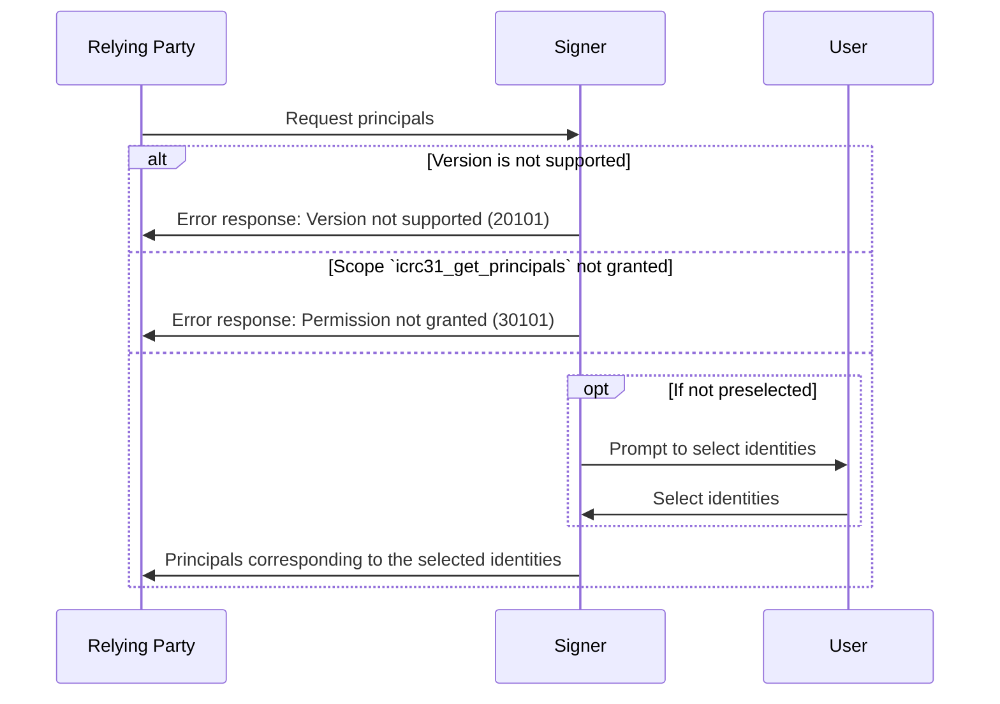

# ICRC-31: Get Principals

[](https://github.com/orgs/dfinity/projects/31)
[](./icrc_25_signer_interaction_standard.md)

<!-- TOC -->
* [ICRC-31: Get Principals](#icrc-31-get-principals)
  * [Summary](#summary)
  * [Method](#method)
  * [Scope (according to the ICRC-25 standard)](#scope-according-to-the-icrc-25-standard)
    * [Example RPC Request ](#example-rpc-request-permission)
  * [Request](#request)
    * [Example RPC Request](#example-rpc-request)
  * [Response](#response)
    * [Example RPC Response](#example-rpc-response)
  * [Message Processing](#message-processing)
  * [Errors](#errors)
<!-- TOC -->
## Summary

The purpose of the `icrc31_get_principals` message is for the relying party to receive information about the identities managed by the signer.

## Method

**Name and Scope:** `icrc31_get_principals`

**Prerequisite:** Active session with granted permission scope `icrc31_get_principals` or `*`.

## Scope (according to the [ICRC-25 standard](./icrc_25_signer_interaction_standard.md))

**Scope:** `icrc31_get_principals` 

### Example RPC Request Permission
```json
{
    "id": 1,
    "jsonrpc": "2.0",
    "method": "icrc25_request_permissions",
    "params": {
        "version": "1",
        "scopes": [
            {
                "method": "icrc31_get_principals",
            }
        ]
    }
}
```

## Request

**`version` (`text`):** The version of the standard used. If the signer does not support the version of the request, it must send the `"VERSION_NOT_SUPPORTED"` error in response.

### Example RPC Request

```json
{
  "id": 1,
  "jsonrpc": "2.0",
  "method": "icrc31_get_principals",
  "params": {
    "version": "1"
  }
}
```

## Response

`version` (`text`): The version of the standard used. It must match the `version` from the request.

`principals` (`text` array): A list of principals (textual representation) the user has selected to share with the relying party.

### Example RPC Response

```json
{
  "id": 1,
  "jsonrpc": "2.0",
  "result": {
    "version": "1",
    "principals": [
      "gyu2j-2ni7o-o6yjt-n7lyh-x3sxq-zh7hp-sjvqe-t7oul-4eehb-2gvtt-jae",
      "fwpnd-r2y37-lv4ue-vyo3g-4u7zt-f5ncq-2ytan-zjs7b-2ioqf-n7j6u-gqe",
      "xnxbw-3qubw-pc2f7-6uu6l-sy7xq-ghk7l-mpxib-3ttyv-uw2x7-vfdhf-2ae"
    ]
  }
}
```

## Message Processing

1. The relying party sends a `icrc31_get_principals` request to the signer.
2. Upon receiving the message, the signer first checks if it can process the message.
    - If the request version is not supported by the signer, the signer sends a response with an error back to the relying party.
    - If the relying party has not been granted the permission to invoke the method for the specified principal, the signer sends a response with an error back to the relying party.
3. The signer may ask the user to select which identities to share with the relying party
    - This step may be skipped if the identities have been selected before on the active session.
4. The signer sends a response to the relying party with the list of principals corresponding to the selected identities.



## Errors

This standard does not define additional errors. See [ICRC-25](./icrc_25_signer_interaction_standard.md#errors-3) for a list of errors that can be returned by all methods.