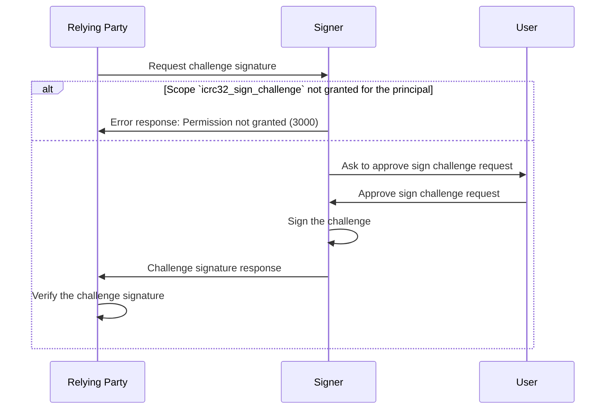

# ICRC-32: Sign Challenge

[](https://github.com/orgs/dfinity/projects/31)
[](./icrc_25_signer_interaction_standard.md)

<!-- TOC -->
* [ICRC-32: Sign Challenge](#icrc-32-sign-challenge)
  * [Summary](#summary)
  * [Method](#method)
  * [Scope (according to the ICRC-25 standard)](#scope-according-to-the-icrc-25-standard)
    * [Example Permission Requests](#example-permission-requests)
  * [`icrc25_supported_standards`](#icrc25_supported_standards)
  * [Request Params](#request-params)
  * [Result](#result)
  * [Message Processing](#message-processing)
  * [Errors](#errors)
  * [Examples](#examples)
    * [Without Delegation](#without-delegation)
    * [With Delegation](#with-delegation)
<!-- TOC -->
## Summary

The purpose of the `icrc32_sign_challenge` method is for the relying party to receive a cryptographic proof of ownership for the users identities.

## Method

**Name:** `icrc32_sign_challenge`

**Prerequisite:** Active session with granted permission scope `icrc32_sign_challenge` or `*`.
* This scope may be restricted to specific principals.

## Scope (according to the [ICRC-25 standard](./icrc_25_signer_interaction_standard.md))

**Scope:** `icrc32_sign_challenge`

**Optional Properties:**
- `principals` (`text` array): A list of principals (textual representation) the scope is restricted to. If the list is not present, the scope applies to all senders (i.e. the permission is not restricted).

### Example Permission Requests

No restriction:
```json
{
    "id": 1,
    "jsonrpc": "2.0",
    "method": "icrc25_request_permissions",
    "params": {
        "scopes": [
            {
                "method": "icrc32_sign_challenge"
            }
        ]
    }
}
```
With restriction:
```json
{
    "id": 1,
    "jsonrpc": "2.0",
    "method": "icrc25_request_permissions",
    "params": {
        "scopes": [
            {
                "method": "icrc32_sign_challenge",
                "principals": [
                    "btbdd-ob3pe-dz6kv-7n4gh-k2xtm-xjthz-kcvpk-fwbnv-w5qbk-iqjm4-4qe",
                    "b7gqo-ulk5n-2kpo7-oalt7-p2kyl-o4j5l-kiuwo-eeybr-dab4l-ur6up-pqe"
                ]
            }
        ]
    }
}
```

## `icrc25_supported_standards`

An ICRC-25 compliant signer must implement the [icrc25_supported_standards](./icrc_25_signer_interaction_standard.md#icrc25_supported_standards) method which returns the list of supported standards. Any signer implementing ICRC-32 must include a record with the name field equal to "ICRC-32" in that list.

## Request Params

**`principal` (`text`):** Principal (textual representation) corresponding to the identity that the signer should provide the challenge signature for.

**`challenge` (`blob`):** A challenge used for the signer to sign in order to prove its access to the identity. The challenge should be an array of 32 cryptographically random bytes generated from a secure random source by the sender of the request.

## Result

**`publicKey` (`blob`):** The DER-encoded public key associated with the identity, derived in accordance with one of [the signature algorithms supported by the IC](https://internetcomputer.org/docs/current/references/ic-interface-spec/#signatures). The public key can be used to [derive a self-authenticating principal](https://internetcomputer.org/docs/current/references/ic-interface-spec/#principal).

**`signature` (`blob`):** The signature produced by signing the concatenation of the domain separator `\x13ic-signer-challenge` (UTF-8 encoded) and the challenge with the private key associated with the identity.

**`signer_delegation` (optional):** An array of delegations (as defined by the [IC interface specification, authentication section](https://internetcomputer.org/docs/current/references/ic-interface-spec/#authentication)) delegating from the signer identity to the identity used to sign the challenge:
  - object with the following properties:
    - `delegation` (`record`): Map with fields
      - `pubkey` (`blob`): Public key as described in the [IC interface specification, signatures section](https://internetcomputer.org/docs/current/references/ic-interface-spec/#signatures).
      - `expiration` (`text`): Expiration of the delegation, in nanoseconds since 1970-01-01, as a base-10 string.
      - `targets` (`text` array): A list of target canister ids (textual representation) the delegation is restricted to making canister calls to. If the list is not present, the delegation applies to all canisters (i.e. it is not restricted).
    - `signature` (`blob`): Signature on the 32-byte representation-independent hash of the map contained in the `delegation` field as described in [IC interface specification, signatures section](https://internetcomputer.org/docs/current/references/ic-interface-spec/#signatures), using the 27 bytes `\x1Aic-request-auth-delegation` as the domain separator.

## Message Processing

1. The relying party sends a `icrc32_sign_challenge` request to the signer.
2. Upon receiving the message, the signer first checks if it can process the message.
    - If the relying party has not been granted the permission to invoke the method for the specified principal, the signer sends a response with an error back to the relying party.
3. The signer may ask the user to approve the request.
    - If the user does not approve the request, the signer sends a response with an error back to the relying party.
4. The signer signs the challenge with the private keys associated with the identity corresponding to the given principal and sends a successful response with the signature (and optionally the associated `signer_delegation`) back to the relying party.
5. After receiving a successful response, the relying party verifies that the signer is able to create signatures on behalf of the identity associated with the principal provided in the request:
    - The relying party validates that the self-authenticating principal derived from the `publicKey` in the `result` is equal to the principal provided in the request. If this check fails, the relying party rejects the response.
    - Determine the public key for verifying the signature of the challenge:
      - If `signer_delegation` is present and non-empty:
        - If the `signer_delegation` array contains more than 20 elements, the relying party rejects the response.
        - The relying party validates that all delegations are not expired according to their respective `expiration` timestamp.
        - The relying party validates all `signature` values of all delegations in the `signer_delegation` list. For the first delegation in the array, this signature must be valid with respect to the public key corresponding to the `publicKey` field of the identity, all subsequent delegations are signed with the key corresponding to the public key contained in the preceding delegation. The key to validate the challenge signature is the public key contained in the last delegation in the array.
      - Otherwise, the key to validate the challenge signature with is the public key contained in the `publicKey` field of the identity.
    - The relying party retrieves the public key to verify the challenge according to the previous step, determines the `signature` scheme and verifies whether it was generated by signing the concatenation of the domain separator `\x13ic-signer-challenge` (UTF-8 encoded) and the `challenge` from the request with the private key associated with that public key.
        - If the signature verification succeeds, the relying party accepts the response.
        - If the signature verification fails, the relying party rejects the response.



## Errors

This standard does not define additional errors. See [ICRC-25](./icrc_25_signer_interaction_standard.md#errors-3) for a list of errors that can be returned by all methods.

## Examples

### Without Delegation

Request
```json
{
    "id": 1,
    "jsonrpc": "2.0",
    "method": "icrc32_sign_challenge",
    "params": {
        "principal": "2mdal-aedsb-hlpnv-qu3zl-ae6on-72bt5-fwha5-xzs74-5dkaz-dfywi-aqe",
        "challenge": "UjwgsORvEzp98TmB1cAIseNOoD9+GLyN/1DzJ5+jxZM="
    }
}
```

Response
```json
{
    "id": 1,
    "jsonrpc": "2.0",
    "result": {
        "publicKey": "MFYwEAYHKoZIzj0CAQYFK4EEAAoDQgAEOTdHYwpFTr/oPXOfLQcteymk8AQE41VwPQ1W7Xpm0Zt1AY4+5aOnMAbAIjXEchxPuGbPWqPqwntXMPs3w4rOaA==",
        "signature": "bldf7qn7DC5NzTyX5kp4GpZHaEncE5/6n/Y8av3xjEwIVFAwmhyW0uM+WBXRTj4QbScot04dfaBXUOcSWF0IjQ=="
    }
}
```

### With Delegation

Request

```json
{
    "id": 1,
    "jsonrpc": "2.0",
    "method": "icrc32_sign_challenge",
    "params": {
        "principal": "77gyu-q2pqz-jgkwl-qtuq2-eylzf-fws5i-376hh-ra3eo-sgj65-6vod4-wae",
        "challenge": "sP4kjfTOHor/i6yENH3jMvznV56NW4oOmsCa9oV0CKQ="
    }
}
```

Response
```json
{
    "id": 1,
    "jsonrpc": "2.0",
    "result": {
        "publicKey": "MDwwDAYKKwYBBAGDuEMBAgMsAAoAAAAAAGAAJwEB9YN/ErQ8yN+14qewhrU0Hm2rZZ77SrydLsSMRYHoNxM=",
        "signature": "0NE21SrrwbLO2SBDyHcqgOpJkEFB9Kbb2ERaBMUZ7vJXzK4WDVmKiMHEeeq1IBfPTfuO/4mF+zaFmo/3n+HXFA==",
        "signer_delegation": [
            {
                "delegation": {
                    "pubkey": "MFkwEwYHKoZIzj0CAQYIKoZIzj0DAQcDQgAEvHD28SXwRW2i6bgiqmel2fDV7/CDNyxkMwGh8BvmTVI+5DBSBMHJeyFZwbJEyj8Pc7rJv6XWOW+x4lsdEI4bdg==",
                    "expiration": "1702683438614940079"
                },
                "signature": "2dn3omtjZXJ0aWZpY2F0ZVkFR9nZ96NkdHJlZYMBgwGDAYMCSGNhbmlzdGVygwGDAYMBgwGDAYMBggRYIGQMSEWHMb6GjHUCQwZjEvTgayv95IMJo8/QYX7jyPNEgwGCBFggQEL7KETbIG4XJKJI7vOT9csdIigPKY2Uj8GOCkCFM0ODAYIEWCCNPbxbGsgH608xO5FxLblP30pQBoIHcZ8cujd3GyrI74MCSgAAAAAAYAAnAQGDAYMBgwJOY2VydGlmaWVkX2RhdGGCA1ggeD0/xQd42q9xciZZTb1pN52IAPye6S/kg6jpZdBqclmCBFggbM1rsxpUdh1KVunP2MujhNW4+0cYToyhPLcOBPIgms6CBFggdupn1qzaMUyZJTmGjlsaOHadwTHt/KpfEZvU6AtIsI6CBFggPeeB3ggR9ahGkWbFlPlDPZZvaG9PQGWtk5XjC/rBU+KCBFggyyqUBXAErjNvtSujkRfPkKqt7+At3+kgW8wTyPYVCgKCBFggvB+bTFT2brj8JTgekGQa5Z74fFkBhjVRYqUstIdSQsuCBFgglWeLQibPLUmNuV15R2nZ+bcBbozatDN+vL6bdHwVd6OCBFggKyt0ehAYDvkduhMP9NRBFv798A9hgRGLWw7JNAjeyKCCBFggq+kUfTfBtw6jjssoWdzVORhgjG1bIi1wnh6pRk5wAHqCBFggKsAg4MVsLKYodaOzWZAy1J8IZqiz80CZANuc7o8i9yODAYIEWCDKCPjWRprZOkS0YuyR8f3ecbbF8cZV8gQcEPRV/GmBM4MCRHRpbWWCA0n7k4S9+uvC0Bdpc2lnbmF0dXJlWDCr6WuvcRG12U2TCmsyKlM3PDIQ8aE1Sbkqt4bvPd6pqchMgvX92WC4pRTzIN2q3KhqZGVsZWdhdGlvbqJpc3VibmV0X2lkWB0sVbNH7PJobIN4HWxZ0bQ+e0y6jetsGzdhB/LNAmtjZXJ0aWZpY2F0ZVkCbtnZ96JkdHJlZYMBggRYIMb7MhQtNYSR3xisLIXqFKL4vaVCAQSFQ6fs7z0EBu16gwGDAkZzdWJuZXSDAYMBgwGDAYIEWCA1vCByZqofmhtO6jk+/pGuM+1M53Bp7Y6IHYZxat97a4MBggRYIPjD6uA3fuAIWSI78cYgL1iFxNzcj9E7HUjDyDhoiRm8gwGDAlgdLFWzR+zyaGyDeB1sWdG0PntMuo3rbBs3YQfyzQKDAYMCT2NhbmlzdGVyX3Jhbmdlc4IDWDLZ2feCgkoAAAAAAGAAAAEBSgAAAAAAYACuAQGCSgAAAAAAYACwAQFKAAAAAABv//8BAYMCSnB1YmxpY19rZXmCA1iFMIGCMB0GDSsGAQQBgtx8BQMBAgEGDCsGAQQBgtx8BQMCAQNhAJAHUSB3jrIaUwoCvMdj5/ShkpM1BpZq97VMEKTSsk3mqGsgDjRAuuYme/TEiNmhHQRyw4wbYiEZj5jk5ogro4paTjqlr86Jm3+CXtla36EmKWiAc1VvJ0dSchPo1z5AzoIEWCA2880lfZD7OOQll/GTpeAx29WFtiknk7sE20eUgDzgboIEWCACj8Xl9whoJU5yFef8Yw29Ke78NhmvF84jGQnh+vl+lYIEWCDviZXEEO1AVzHJuRP2eHnjtqa01lnSdG25prR9fnDT1YIEWCCu6rJq/kx+dkZh4N/YVkSg36UF1eIRhcFGUDBJohx4h4MCRHRpbWWCA0nErvLr7tfzzxdpc2lnbmF0dXJlWDCLPfmASgvrSN33lW6cbrU6MlvB5DoHKdP5IZV3qEbhYqKiG0FzXCtGTqk23LgIbVFkdHJlZYMBggRYIAHqRxd5i88M2z5nEO5XYddgYM7PfRwG3SO3bdKRgxB7gwJDc2lngwJYIF/Mj8qI50bwx7MJmZjxPnozy74e7q6UbbjSODnd119OgwJYIADMDx/qPEkHlzQnBKxKKfLpCN38F1j8tzhh6DZXH2H7ggNA"
            }
        ]
    }
}
```
