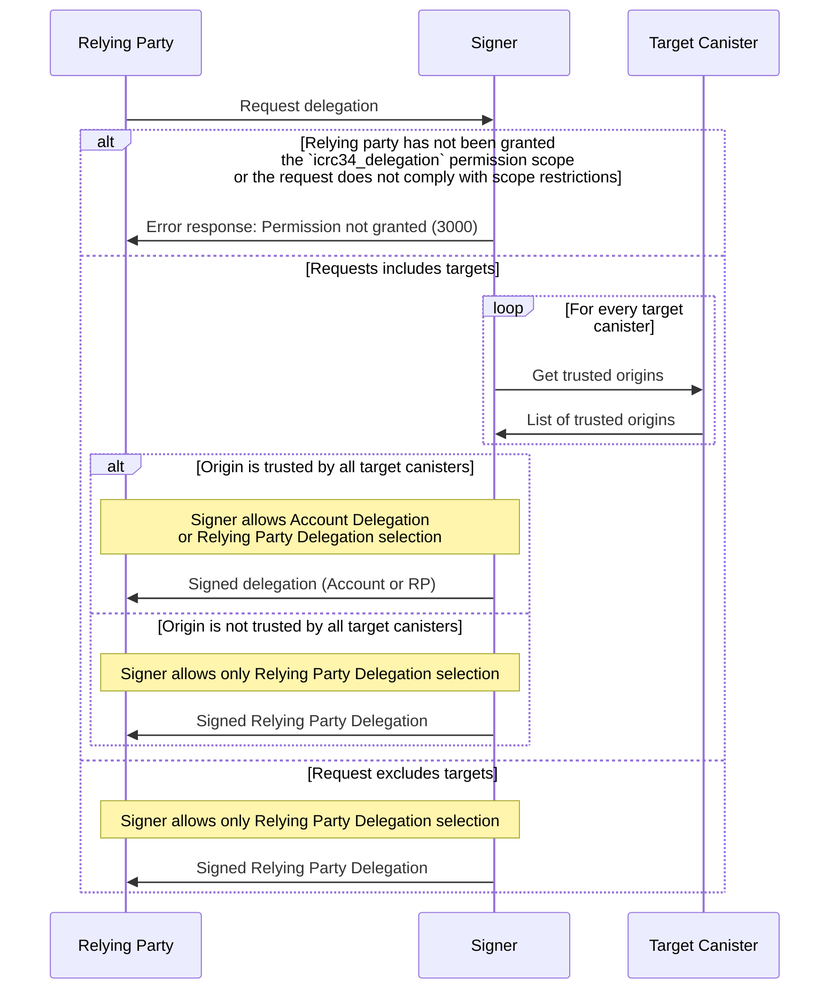

# ICRC-34: Delegation

[](https://github.com/orgs/dfinity/projects/31)
[](./icrc_25_signer_interaction_standard.md)
[](https://github.com/dfinity/wg-identity-authentication/issues/115)

<!-- TOC -->
* [ICRC-34: Delegation](#icrc-34-delegation)
  * [Summary](#summary)
  * [Method](#method)
  * [Scope (according to the ICRC-25 standard)](#scope-according-to-the-icrc-25-standard)
    * [Example RPC Permission Request](#example-rpc-permission-request)
  * [icrc25_supported_standards](#icrc25_supported_standards)
  * [Request params](#request-params)
    * [Example RPC Delegation Request](#example-rpc-delegation-request)
  * [Result](#result)
    * [Example RPC Delegation Response](#example-rpc-delegation-response)
  * [Message Processing](#message-processing)
  * [Errors](#errors)
<!-- TOC -->

## Summary

When a relying party wants to avoid going through the signer and user approval for each individual call, it can use the icrc34_delegation method described below. 

This method generates a delegation chain, an object with a stable identifier, allowing the relying party to independently sign transactions on behalf of the user. This also means the signer does not need to stay connected to the signer to make calls on behalf of the user.

The delegation chain's stable identifier can be either: 
1. **Account Delegation**: an identity that has restricted access to the signers identity, such that it is 
stable across many relying parties but cannot be used to operate on tradable assets and shared infrastructure.
2. **Relying Party Delegation**: an identity created exclusively for the relying party (Relying Party Delegation).

Example use cases of a Relying Party Delegation:
- Signer could give the user a choice to stay anonymous with a service.
- Differentiate between calls made with user approval (Account identifier) and without user approval (Relying Party Delegation identifier), allowing for fine grained security levels per identifier.
- Exclusive identifier within the Relying Party platform to stay isolated from identifiers of other Relying Party platforms.

If a relying party wants to receive an Account Delegation, the `icrc34_delegation` request **MUST** include canisters it
controls as `targets` where each canister **MUST** implement the `icrc28_trusted_origins` endpoint as per the 
[ICRC-28](./icrc_28_trusted_origins.md) standard.

Relying Party Delegations **MUST** be for identities exclusive to each individual relying party. This property **MUST** be enforced by the signer.

Signers **MAY** give users the choice to authenticate with their relying party specific identifier instead of accounts (if available).

Relying parties must not include `targets` in the request if they want to be guaranteed to receive a Relying Party delegation.

## Method

**Name:** `icrc34_delegation`

**Prerequisite:** Granted permission scope `icrc34_delegation`.

## Scope (according to the [ICRC-25 standard](./icrc_25_signer_interaction_standard.md))

**Scope:** `icrc34_delegation`

### Example RPC Permission Request

```json
{
  "id": 1,
  "jsonrpc": "2.0",
  "method": "icrc25_request_permissions",
  "params": {
    "scopes": [
      {
        "method": "icrc34_delegation"
      }
    ]
  }
}
```

## icrc25_supported_standards

An ICRC-25 compliant signer must implement the [icrc25_supported_standards](icrc_25_signer_interaction_standard.md#icrc25_supported_standards) method which returns the list of supported standards. 
Any signer implementing ICRC-34 must include a record with the name field equal to "ICRC-34" in that list.

## Request params

- `publicKey` (`text`): A DER encoded public key of a supported signature scheme, as described [here](https://internetcomputer.org/docs/current/references/ic-interface-spec/#signatures).
- `targets` (`text` `array` optional): A list of target canister ids (textual representation) Account Delegations can execute transactions
for on behalf of the user.
- `maxTimeToLive` (`text` optional): Expiration of the delegation in nanoseconds, though signer can still choose to
return a delegation with a shorter expiration.

### Example RPC Delegation Request

Requests for a delegation can optionally include `targets`, enabling signers to verify the security of returning an Account 
Delegation (via ICRC-28). If the array of `targets` is set to an empty array, signers **SHOULD** only offer users the option to connect 
with a Relying Party Delegation.

```json
{
  "id": 1,
  "jsonrpc": "2.0",
  "method": "icrc34_delegation",
  "params": {
    "publicKey": "MDwwDAYKKwYBBAGDuEMBAgMsAAoAAAAAAGAAJwEB9YN/ErQ8yN+14qewhrU0Hm2rZZ77SrydLsSMRYHoNxM=",
    "targets": [
      "xhy27-fqaaa-aaaao-a2hlq-cai"
    ],
    "maxTimeToLive": "28800000000000"
  }
}
```

## Result

`publicKey`: Public key of delegation identity as described in
the [IC interface specification, signatures section](https://internetcomputer.org/docs/current/references/ic-interface-spec/#signatures).  
`signerDelegation`: An array of delegations (as defined by
the [IC interface specification, authentication section](https://internetcomputer.org/docs/current/references/ic-interface-spec/#authentication)):
- `delegation` (`record`): Map with fields
    - `pubkey` (`blob`): Public key as described in
      the [IC interface specification, signatures section](https://internetcomputer.org/docs/current/references/ic-interface-spec/#signatures).
    - `expiration` (`text`): Expiration of the delegation, in nanoseconds since 1970-01-01, as a base-10 string.
    - `targets` (`text` array): A list of target canister ids (textual representation) an Account Delegation is restricted to
      making canister calls to. If the list is not present, the delegation is a Relying Party delegation that applies to all canisters (i.e. it is not
      restricted).
- `signature` (`blob`):  Signature on the 32-byte representation-independent hash of the map contained in
  the `delegation` field as described
  in [IC interface specification, signatures section](https://internetcomputer.org/docs/current/references/ic-interface-spec/#signatures),
  using the 27 bytes `\x1Aic-request-auth-delegation` as the domain separator.


### Example RPC Delegation Response

```json
{
  "id": 1,
  "jsonrpc": "2.0",
  "result": {
    "publicKey": "MFkwEwYHKoZIzj0CAQYIKoZIzj0DAQcDQgAEvHD28SXwRW2i6bgiqmel2fDV7/CDNyxkMwGh8BvmTVI+5DBSBMHJeyFZwbJEyj8Pc7rJv6XWOW+x4lsdEI4bdg==",
    "signerDelegation": [
      {
        "delegation": {
          "pubkey": "MDwwDAYKKwYBBAGDuEMBAgMsAAoAAAAAAGAAJwEB9YN/ErQ8yN+14qewhrU0Hm2rZZ77SrydLsSMRYHoNxM=",
          "expiration": "1702683438614940079",
          "targets": [
            "xhy27-fqaaa-aaaao-a2hlq-cai"
          ]
        },
        "signature": "2dn3omtjZXJ0aWZpY2F0ZVkFR9nZ96NkdHJlZYMBgwGDAYMCSGNhbmlzdGVygwGDAYMBgwGDAYMBggRYIGQMSEWHMb6GjHUCQwZjEvTgayv95IMJo8/QYX7jyPNEgwGCBFggQEL7KETbIG4XJKJI7vOT9csdIigPKY2Uj8GOCkCFM0ODAYIEWCCNPbxbGsgH608xO5FxLblP30pQBoIHcZ8cujd3GyrI74MCSgAAAAAAYAAnAQGDAYMBgwJOY2VydGlmaWVkX2RhdGGCA1ggeD0/xQd42q9xciZZTb1pN52IAPye6S/kg6jpZdBqclmCBFggbM1rsxpUdh1KVunP2MujhNW4+0cYToyhPLcOBPIgms6CBFggdupn1qzaMUyZJTmGjlsaOHadwTHt/KpfEZvU6AtIsI6CBFggPeeB3ggR9ahGkWbFlPlDPZZvaG9PQGWtk5XjC/rBU+KCBFggyyqUBXAErjNvtSujkRfPkKqt7+At3+kgW8wTyPYVCgKCBFggvB+bTFT2brj8JTgekGQa5Z74fFkBhjVRYqUstIdSQsuCBFgglWeLQibPLUmNuV15R2nZ+bcBbozatDN+vL6bdHwVd6OCBFggKyt0ehAYDvkduhMP9NRBFv798A9hgRGLWw7JNAjeyKCCBFggq+kUfTfBtw6jjssoWdzVORhgjG1bIi1wnh6pRk5wAHqCBFggKsAg4MVsLKYodaOzWZAy1J8IZqiz80CZANuc7o8i9yODAYIEWCDKCPjWRprZOkS0YuyR8f3ecbbF8cZV8gQcEPRV/GmBM4MCRHRpbWWCA0n7k4S9+uvC0Bdpc2lnbmF0dXJlWDCr6WuvcRG12U2TCmsyKlM3PDIQ8aE1Sbkqt4bvPd6pqchMgvX92WC4pRTzIN2q3KhqZGVsZWdhdGlvbqJpc3VibmV0X2lkWB0sVbNH7PJobIN4HWxZ0bQ+e0y6jetsGzdhB/LNAmtjZXJ0aWZpY2F0ZVkCbtnZ96JkdHJlZYMBggRYIMb7MhQtNYSR3xisLIXqFKL4vaVCAQSFQ6fs7z0EBu16gwGDAkZzdWJuZXSDAYMBgwGDAYIEWCA1vCByZqofmhtO6jk+/pGuM+1M53Bp7Y6IHYZxat97a4MBggRYIPjD6uA3fuAIWSI78cYgL1iFxNzcj9E7HUjDyDhoiRm8gwGDAlgdLFWzR+zyaGyDeB1sWdG0PntMuo3rbBs3YQfyzQKDAYMCT2NhbmlzdGVyX3Jhbmdlc4IDWDLZ2feCgkoAAAAAAGAAAAEBSgAAAAAAYACuAQGCSgAAAAAAYACwAQFKAAAAAABv//8BAYMCSnB1YmxpY19rZXmCA1iFMIGCMB0GDSsGAQQBgtx8BQMBAgEGDCsGAQQBgtx8BQMCAQNhAJAHUSB3jrIaUwoCvMdj5/ShkpM1BpZq97VMEKTSsk3mqGsgDjRAuuYme/TEiNmhHQRyw4wbYiEZj5jk5ogro4paTjqlr86Jm3+CXtla36EmKWiAc1VvJ0dSchPo1z5AzoIEWCA2880lfZD7OOQll/GTpeAx29WFtiknk7sE20eUgDzgboIEWCACj8Xl9whoJU5yFef8Yw29Ke78NhmvF84jGQnh+vl+lYIEWCDviZXEEO1AVzHJuRP2eHnjtqa01lnSdG25prR9fnDT1YIEWCCu6rJq/kx+dkZh4N/YVkSg36UF1eIRhcFGUDBJohx4h4MCRHRpbWWCA0nErvLr7tfzzxdpc2lnbmF0dXJlWDCLPfmASgvrSN33lW6cbrU6MlvB5DoHKdP5IZV3qEbhYqKiG0FzXCtGTqk23LgIbVFkdHJlZYMBggRYIAHqRxd5i88M2z5nEO5XYddgYM7PfRwG3SO3bdKRgxB7gwJDc2lngwJYIF/Mj8qI50bwx7MJmZjxPnozy74e7q6UbbjSODnd119OgwJYIADMDx/qPEkHlzQnBKxKKfLpCN38F1j8tzhh6DZXH2H7ggNA"
      }
    ]
  }
}

```

## Message Processing

1. The relying party sends a `icrc34_delegation` request to the signer.
2. Upon receiving the request, the signer validates whether it can process the message.
    * If the relying party has not been granted the permission to request the action, the signer sends a response with
      an error back to the relying party.
    * The relying party must make sure that the request complies with scope targets restriction.
3. If the request includes targets, the signer **MAY** offer issuing an account delegation. If it does, it **MUST** retrieve and verify the trusted origins according to the [ICRC-28](icrc_28_trusted_origins.md) specification.
    * If the trusted origins cannot be retrieved for any of the given delegations targets or the relying party origin is
      not within any of the trusted origin lists, the signer does not give users the ability to continue with the Account Delegation.
4. The signer **MAY** display all the available delegations the user can continue with, in which case a user would select one.
5. The signer returns the signed delegation to the relying party.



## Errors

This standard does not define additional errors. See [ICRC-25](./icrc_25_signer_interaction_standard.md#errors-3) for a
list of errors that can be returned by all methods.
