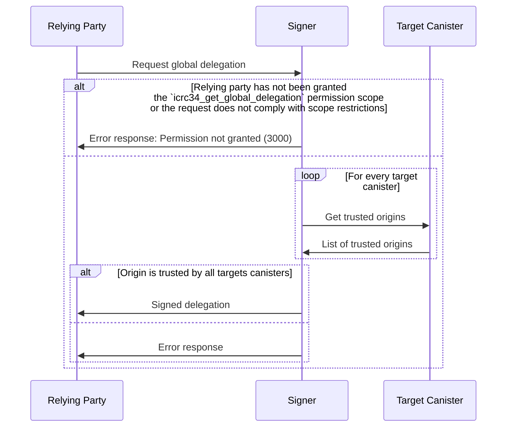

# ICRC-34: Get Global Delegation

[](https://github.com/orgs/dfinity/projects/31)
[](./icrc_25_signer_interaction_standard.md)
[](https://github.com/dfinity/wg-identity-authentication/issues/115)

<!-- TOC -->
* [ICRC-34: Get Global Delegation](#icrc-34-get-global-delegation)
  * [Summary](#summary)
  * [Method](#method)
  * [Scope (according to the ICRC-25 standard)](#scope-according-to-the-icrc-25-standard)
    * [Example RPC Request Permission](#example-rpc-request-permission)
  * [Request](#request)
    * [Example RPC Request](#example-rpc-request)
    * [Response](#response)
    * [Example RPC Response](#example-rpc-response)
  * [Message Processing](#message-processing)
  * [Errors](#errors)
<!-- TOC -->

## Summary

When a relying party wants to authenticate as a user, it uses
a [session key](https://internetcomputer.org/docs/current/references/ic-interface-spec/#signatures), and
below `icrc34_get_global_delegation` method to obtain a delegation chain that allows the session key to sign for the
user's global identity. The obtained delegation chain **MUST** be restricted by the signer to canister targets that
trust the relying party following the [ICRC-28](./icrc_28_trusted_origins.md) standard.

- Due to the canister target restriction, only the relying party its own canisters can be called on behalf of the user.
- A new delegation chain must be obtained for every new canister created by the relying party.
- The identity is the same across all relying parties, the user is not anonymous between different relying parties.

## Method

**Name and Scope:** `icrc34_get_global_delegation`

**Prerequisite:** Active session with granted permission scope `icrc34_get_global_delegation` or `*`.

## Scope (according to the [ICRC-25 standard](./icrc_25_signer_interaction_standard.md))

**Scope:** `icrc34_get_global_delegation`

**Required Properties:**

- `targets` (`text` array): A list of target canister ids (textual representation) the scope is restricted to.

### Example RPC Request Permission

```json
{
  "id": 1,
  "jsonrpc": "2.0",
  "method": "icrc25_request_permissions",
  "params": {
    "scopes": [
      {
        "method": "icrc34_get_global_delegation",
        "targets": [
          "xhy27-fqaaa-aaaao-a2hlq-cai"
        ]
      }
    ]
  }
}
```

## Request

**`principal` (`text`):** Principal that the global delegation is requested for.  
**`publicKey` (`blob`):** Public key that receives the global delegation as described in
the [IC interface specification, signatures section](https://internetcomputer.org/docs/current/references/ic-interface-spec/#signatures).  
**`targets` (`text` array):** A list of target canister ids (textual representation) the scope is restricted to.  
**`maxTimeToLive` (`text` array):** (Optional) Expiration of the delegation in nanoseconds, signer can still choose to
return a delegation with a shorter expiration.

### Example RPC Request

```json
{
  "id": 1,
  "jsonrpc": "2.0",
  "method": "icrc34_get_global_delegation",
  "params": {
    "principal": "gyu2j-2ni7o-o6yjt-n7lyh-x3sxq-zh7hp-sjvqe-t7oul-4eehb-2gvtt-jae",
    "publicKey": "MDwwDAYKKwYBBAGDuEMBAgMsAAoAAAAAAGAAJwEB9YN/ErQ8yN+14qewhrU0Hm2rZZ77SrydLsSMRYHoNxM=",
    "targets": [
      "xhy27-fqaaa-aaaao-a2hlq-cai"
    ],
    "maxTimeToLive": "28800000000000"
  }
}
```

### Response

`publicKey`: Public key of global identity as described in
the [IC interface specification, signatures section](https://internetcomputer.org/docs/current/references/ic-interface-spec/#signatures).  
`global_delegation`: An array of delegations (as defined by
the [IC interface specification, authentication section](https://internetcomputer.org/docs/current/references/ic-interface-spec/#authentication)):
- `delegation` (`record`): Map with fields
    - `pubkey` (`blob`): Public key as described in
      the [IC interface specification, signatures section](https://internetcomputer.org/docs/current/references/ic-interface-spec/#signatures).
    - `expiration` (`text`): Expiration of the delegation, in nanoseconds since 1970-01-01, as a base-10 string.
    - `targets` (`text` array): A list of target canister ids (textual representation) the delegation is restricted to
      making canister calls to. If the list is not present, the delegation applies to all canisters (i.e. it is not
      restricted).
- `signature` (`blob`):  Signature on the 32-byte representation-independent hash of the map contained in
  the `delegation` field as described
  in [IC interface specification, signatures section](https://internetcomputer.org/docs/current/references/ic-interface-spec/#signatures),
  using the 27 bytes `\x1Aic-request-auth-delegation` as the domain separator.

### Example RPC Response

```json
{
  "id": 1,
  "jsonrpc": "2.0",
  "result": {
    "publicKey": "MFkwEwYHKoZIzj0CAQYIKoZIzj0DAQcDQgAEvHD28SXwRW2i6bgiqmel2fDV7/CDNyxkMwGh8BvmTVI+5DBSBMHJeyFZwbJEyj8Pc7rJv6XWOW+x4lsdEI4bdg==",
    "global_delegation": [
      {
        "delegation": {
          "pubkey": "MDwwDAYKKwYBBAGDuEMBAgMsAAoAAAAAAGAAJwEB9YN/ErQ8yN+14qewhrU0Hm2rZZ77SrydLsSMRYHoNxM=",
          "expiration": "1702683438614940079",
          "targets": [
            "xhy27-fqaaa-aaaao-a2hlq-cai"
          ]
        },
        "signature": "2dn3omtjZXJ0aWZpY2F0ZVkFR9nZ96NkdHJlZYMBgwGDAYMCSGNhbmlzdGVygwGDAYMBgwGDAYMBggRYIGQMSEWHMb6GjHUCQwZjEvTgayv95IMJo8/QYX7jyPNEgwGCBFggQEL7KETbIG4XJKJI7vOT9csdIigPKY2Uj8GOCkCFM0ODAYIEWCCNPbxbGsgH608xO5FxLblP30pQBoIHcZ8cujd3GyrI74MCSgAAAAAAYAAnAQGDAYMBgwJOY2VydGlmaWVkX2RhdGGCA1ggeD0/xQd42q9xciZZTb1pN52IAPye6S/kg6jpZdBqclmCBFggbM1rsxpUdh1KVunP2MujhNW4+0cYToyhPLcOBPIgms6CBFggdupn1qzaMUyZJTmGjlsaOHadwTHt/KpfEZvU6AtIsI6CBFggPeeB3ggR9ahGkWbFlPlDPZZvaG9PQGWtk5XjC/rBU+KCBFggyyqUBXAErjNvtSujkRfPkKqt7+At3+kgW8wTyPYVCgKCBFggvB+bTFT2brj8JTgekGQa5Z74fFkBhjVRYqUstIdSQsuCBFgglWeLQibPLUmNuV15R2nZ+bcBbozatDN+vL6bdHwVd6OCBFggKyt0ehAYDvkduhMP9NRBFv798A9hgRGLWw7JNAjeyKCCBFggq+kUfTfBtw6jjssoWdzVORhgjG1bIi1wnh6pRk5wAHqCBFggKsAg4MVsLKYodaOzWZAy1J8IZqiz80CZANuc7o8i9yODAYIEWCDKCPjWRprZOkS0YuyR8f3ecbbF8cZV8gQcEPRV/GmBM4MCRHRpbWWCA0n7k4S9+uvC0Bdpc2lnbmF0dXJlWDCr6WuvcRG12U2TCmsyKlM3PDIQ8aE1Sbkqt4bvPd6pqchMgvX92WC4pRTzIN2q3KhqZGVsZWdhdGlvbqJpc3VibmV0X2lkWB0sVbNH7PJobIN4HWxZ0bQ+e0y6jetsGzdhB/LNAmtjZXJ0aWZpY2F0ZVkCbtnZ96JkdHJlZYMBggRYIMb7MhQtNYSR3xisLIXqFKL4vaVCAQSFQ6fs7z0EBu16gwGDAkZzdWJuZXSDAYMBgwGDAYIEWCA1vCByZqofmhtO6jk+/pGuM+1M53Bp7Y6IHYZxat97a4MBggRYIPjD6uA3fuAIWSI78cYgL1iFxNzcj9E7HUjDyDhoiRm8gwGDAlgdLFWzR+zyaGyDeB1sWdG0PntMuo3rbBs3YQfyzQKDAYMCT2NhbmlzdGVyX3Jhbmdlc4IDWDLZ2feCgkoAAAAAAGAAAAEBSgAAAAAAYACuAQGCSgAAAAAAYACwAQFKAAAAAABv//8BAYMCSnB1YmxpY19rZXmCA1iFMIGCMB0GDSsGAQQBgtx8BQMBAgEGDCsGAQQBgtx8BQMCAQNhAJAHUSB3jrIaUwoCvMdj5/ShkpM1BpZq97VMEKTSsk3mqGsgDjRAuuYme/TEiNmhHQRyw4wbYiEZj5jk5ogro4paTjqlr86Jm3+CXtla36EmKWiAc1VvJ0dSchPo1z5AzoIEWCA2880lfZD7OOQll/GTpeAx29WFtiknk7sE20eUgDzgboIEWCACj8Xl9whoJU5yFef8Yw29Ke78NhmvF84jGQnh+vl+lYIEWCDviZXEEO1AVzHJuRP2eHnjtqa01lnSdG25prR9fnDT1YIEWCCu6rJq/kx+dkZh4N/YVkSg36UF1eIRhcFGUDBJohx4h4MCRHRpbWWCA0nErvLr7tfzzxdpc2lnbmF0dXJlWDCLPfmASgvrSN33lW6cbrU6MlvB5DoHKdP5IZV3qEbhYqKiG0FzXCtGTqk23LgIbVFkdHJlZYMBggRYIAHqRxd5i88M2z5nEO5XYddgYM7PfRwG3SO3bdKRgxB7gwJDc2lngwJYIF/Mj8qI50bwx7MJmZjxPnozy74e7q6UbbjSODnd119OgwJYIADMDx/qPEkHlzQnBKxKKfLpCN38F1j8tzhh6DZXH2H7ggNA"
      }
    ]
  }
}

```

## Message Processing

1. The relying party sends a `icrc34_get_global_delegation` request to the signer.
2. Upon receiving the request, the signer validates whether it can process the message.
    * If the relying party has not been granted the permission to request the action, the signer sends a response with
      an error back to the relying party.
    * The relying party must make sure that the request complies with scope targets restriction.
3. The signer tries to retrieve and verify the trusted origins according to the [ICRC-28](icrc_28_trusted_origins.md)
   specification.
    * If the trusted origins cannot be retrieved for any of the given delegations targets or the relying party origin is
      not within any of the trusted origin lists, the signer rejects the request and send a response with an error code
      back to the relying party.
4. The signer returns a signed delegation to the relying party



## Errors

This standard does not define additional errors. See [ICRC-25](./icrc_25_signer_interaction_standard.md#errors-3) for a
list of errors that can be returned by all methods.