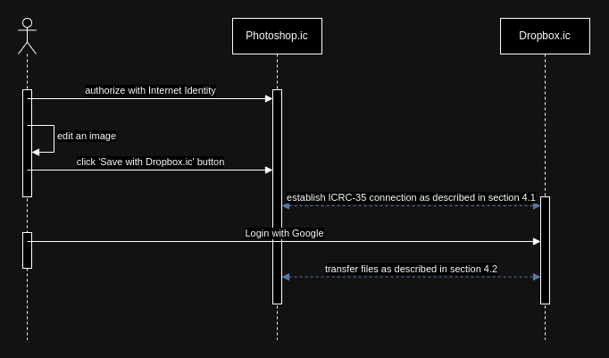
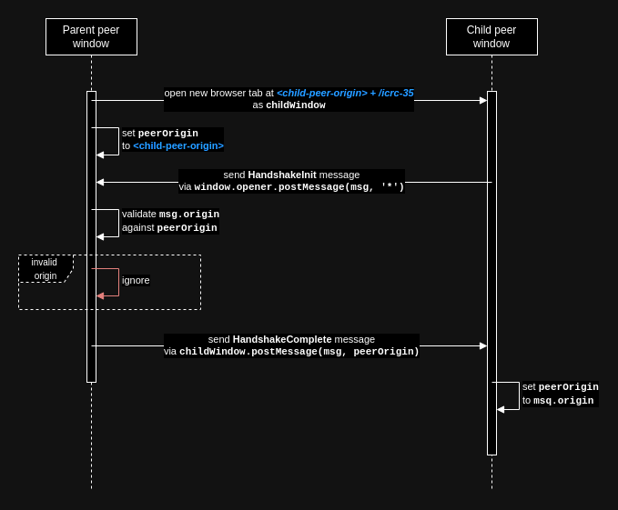
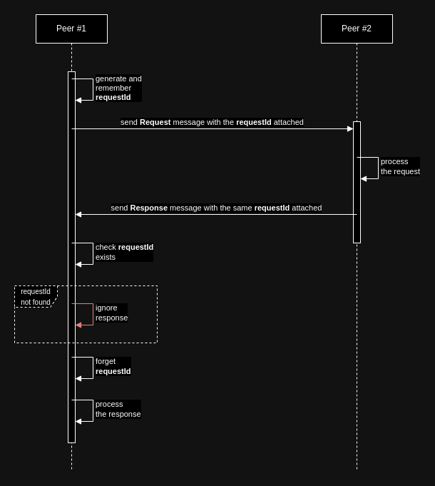

# ICRC-35 - Browser-Based Interoperability Framework

[](https://github.com/orgs/dfinity/projects/31)
[Reference Implementation](https://github.com/seniorjoinu/icrc35)

## 1 Scope

### 1.1 General

This specification defines a [postMessage API](https://developer.mozilla.org/en-US/docs/Web/API/Window/postMessage) based protocol for web-service interoperability. This protocol provides a flexible and efficient way for web-services to exchange messages with each other, allowing them to extend functionality of each other in a controlled way. In a more abstract perspective, this protocol introduces a new kind of APIs - `Webpage APIs`, which can be used by web-services to interact with each other. With this new kind of APIs, web-services don't integrate with each other, by calling each other's servers, but by calling each other's webpages.

The protocol can be used by any web-service, regardless of its internal design, used technologies or other integration techniques, on-chain and off-chain.

The protocol is secure, in a meaning that malicious parties are unable to interfere or audit messages. The protocol is extensible, in a meaning that other protocols can be developed on top of it. Also, the protocol is efficient, in a meaning that it allows web-services to exchange large quantities of data at high speed and process multiple concurrent transmissions simultaneosly.

### 1.2 Conventions

The key words "MUST”, “SHOULD", “MAY" and other related keywords are to be interpreted as described in [RFC2119](https://datatracker.ietf.org/doc/html/rfc2119). Words "integrate" and "interoperate" are used interchargeably.

Data structures listed in this document are described with [TypeScript syntax](https://www.typescriptlang.org/).

## 2 Terms, definitions and abbreviations

### 2.1 Terms and definitions

| Term | Definition |
|-|-|
| Web-service | A software component deployed on the Internet that provides some services for their users. |
| Service Provider | A web-service's integration model that means that the web-service is exposing its functionalities for other web-services to integrate with. An example of a service provider is a cloud file storage service - it may provide other services with cloud storage functionalities. A service provider MAY also be a service consumer. |
| Service Consumer | A web-service's integration model that means that the web-service is utilizing other web-service's functionalities, integrating with them. An example of a service consumer is a photo editing web-service that uses a cloud file storage service provider to enable its users to store edited photos. A service consumer MAY also be a service provider. |
| Peer | A web-service participating in the ICRC-35 protocol. |
| Web3 | A new paradigm in building web-services which promotes decentralization and digital ownership of assets, funds and information. |
| Dapp | A web-service built with Web3 paradigm in mind. |
| Signer | A service that holds users' keys, produces signatures and performs external calls on their behalf. |
| Scoped-identity signer | A signer, that provides users with scoped identities. Scoped identities are key pairs (or similar) strictly tied to a particular web-service, so no other web-service could interact with them. |
| Shared-identity signer | A signer, that provides users with shared identities. Shared identities are key pairs (or similar) which allow interactions with any web-service. |
| Browser window | Web browser window or tab. |

### 2.2 Abbreviations

| Abbreviation | Meaning |
|-|-|
| SP | Service Provider |
| SC | Service Consumer |
| JS | JavaScript language and/or virtual machine |
| IC | Internet Computer |
| II | Internet Identity |

## 3 Overview

Web-service intorperability on Web3 is hard. Users interact with such web-services through various signers, which are considered a necessity in order for two Web3 web-services to integrate with each other, but make the whole landscape worse.

Widely used shared-identity signers, like [MetaMask](https://metamask.io/), while allowing trivial interoperability techniques to work well for web-services, jeopardize safety of their users against signature-stealing attacks, leading to more than $370 millions [being stolen](https://www.chainalysis.com/blog/approval-phishing-cryptocurrency-scams-2023/) in 2023.

On the other hand, there are scoped-identity signers, like [Internet Identity](https://identity.ic0.app/). These signers, while providing their users with ultimate safety against various attack vectors and better overall privacy, make it very hard for web-services to integrate with each other.

Currently, the whole Web3 community is locked in a dilemma where in order to allow web-service interoperability, signers have to sacrifice users safety. Recently emerged [ICRC-25 and related](https://github.com/dfinity/wg-identity-authentication/blob/main/topics/signer_standards_overview.md) standards of the IC ecosystem, propose more safe scoped-identity signers to employ techniques from less safe shared-identity signers, in order to enable web-services on the IC to integrate with each other.

ICRC-35 (this specification) proposes a different solution, which could in short be expressed the following way: if signers cause problems for interoperability, let's design an interoperability protocol that does not rely on signers at all. Such a solution would allow web-services to integrate directly to each other, completely decoupling them from signers, and allowing users to freely use signers of their choice, switching between them depending on the web-service they're currently interacting with.



ICRC-35 is inspired by the integration technique used at Internet Identity. This specification generalizes and describes the technique, providing necessary basis for other applications to interop with each other the same way IC dapps currently interop with the II.

## 4 Protocol Overview

The protocol allows two (or more) browser windows to communicate with each other using `postMessage` browser API. During the protocol peers establish a secure connection and use this connection in order to exchange various messages with each other.

The protocol consists of two phases:

1. **Handshake Phase** - when the secure connection is established and peers authenticate each other.
2. **Interaction Phase** - when the actual message exchange between peers happens.

### 4.1 Handshake Phase

During this phase peers authenticate each other and create a reliable connection. The handshake is a three step process:

1. **Child peer window creation** - when a peer (usually, SC) opens a new browser window to be able to exchange messages with another peer (usually, SP).
2. **Handshake Initialization** - when the child peer window sends a "ready"-message to its parent peer window.
3. **Handshake Completion** - when the parent peer window replies back to the child peer.

Completion of these steps provides the following guarantees:

* Both peers maintain a shared connection and are able to detect its interruption, which may happen, for example, if a user closes one of the windows.
* Both peers know each other's origins and would ignore messages coming from other sources. Once the handshake is performed, each peer is protected against redirects done by malicious scripts or browser extensions.

#### 4.1.1 Flow

This sequence diagram specifies how exactly peers communicate in order to complete the handshake phase.



1. The parent peer MUST initiate the handshake by opening a new browser window, with an URL obtained by contatenating the child peer's origin and the `/icrc-35` pathname.
2. Since the parent peer knows the child peer's origin in advance, it SHOULD remember this origin and SHOULD ignore messages coming from any other source.
3. Once loaded, a script at child peer's `/icrc-35` pathname MUST send `HandshakeInit` message to the opener of its window.
4. Once the parent peer receives the `HandshakeInit` message, it MUST immediately reply to it with `HandshakeComplete` message.
5. Once the child peer receives the `HandshakeComplete` message, it MUST remember the origin of the parent peer and from this point ignore messages comming from other sources.

#### 4.1.2 Data Structures

```typescript
type HandshakeInitMessage = {
    domain: 'icrc-35';
    kind: 'HandshakeInit';
}

type HandshakeCompleteMessage = {
    domain: 'icrc-35';
    kind: 'HandshakeComplete';
}
```

#### 4.1.3 Example

**Parent peer origin**: `https://example-parent.com`
**Child peer origin**: `https://example-child.com`

1. The parent window opens a child window at `https://example-child.com/icrc-35`, and remembers `https://example-child.com` as `peerOrigin`.
2. The child sends the following message to `window.opener`:

    ```javascript
    {
        domain: 'icrc-35',
        kind: 'HandshakeInit'
    }
    ```

3. The parent receives this message, compares its source with the child's origin, and responds with the following message:

    ```javascript
    {
        domain: 'icrc-35',
        kind: 'HandshakeComplete'
    }
    ```

4. The child receives this message and remembers `https://example-parent.com` as `peerOrigin`.
5. The Handshake Phase is over, moving on to the Interaction Phase.

#### 4.1.4 Importance of handshake

The handshake phase can't be omitted from the protocol, if we want to guarantee peer authentication. A child peer's only cross-browser way to identify its parent is via `window.opener`, but this API is limited - it is impossible to read `location.origin` of that object from childs context. This means that it is impossible to know what is the origin of the parent and therefore impossible to guarantee safety of this communication.

The child window does not know what origin is the web-service that has opened it, but it can send messages to its opener. This allows us to introduce a secret-based authentication algorithm - if the parent can respond with the same secret, the child can distinguish parent's message among all others and retrieve the origin of that message - the origin of the parent.

### 4.2 Interaction Phase

During this phase peers exchange the actual business-data in order to integrate with each other. At this phase, there is no difference if a peer is a parent or a child - both peers are able to send and receive messages.

Usually, such an interaction would follow a request-response model: one peer (usually, SC) would send a request to another peer (usually, SP), the latter would perform some internal computations, possibly guiding the user through multiple screens, and then respond with a result.

Another less common way of communicating is fire-and-forget model: a peer would send a message (or a sequence of messages) to another peer, without waiting for the remote peer to respond.

The implementation MUST implement both: a request-response model and a fire-and-forget model on the protocol level. This allows a strong foundation for future standards based on ICRC-35.

During the interaction phase two concurrent processes are happening:

1. **Business data exchange** - the message exchange between peers.
2. **Connection maintenance** - ping-pong game that lets peers know if the connection was interrupted.

#### 4.2.1 Business data exchange

As was previosly mentioned, there are two models in which the exchange could happen: fire-and-forget and request-response. The implementation SHOULD allow these models to be freely mixed during the same communication session. It MAY be possible to send and process multiple messages concurrently (with respect to JS's execution model): a peer should be able to send a request and, before awaiting for the response, send a fire-and-forget message, for example.

Peers distinguish between different models by the shape of the sent/received message. Message payload MUST be sent between browser windows as-is: without any additional encoding or encryption. The maximum message size limit MAY be set by an individual implementation. Such an implementation MAY also make use of `Transferable` objects in order to provide better performance while sending heavy objects (for example, media content).

##### 4.2.1.1 Fire-and-forget model

```typescript
type CommonMessage = {
    domain: 'icrc-35';
    kind: 'Common';
    payload: any;
}
```

This model is intentionally designed to be as simple as possible, so it could be used as a base for subsequent protocols. Once a peer receives a message of this shape, it is not expected to send any kind of message back and can immediately continue with its own business-logic.

##### 4.2.1.2 Request-response model

This model works the following way:



The sequence diagram above is self-explanatory. An initiator peer MUST generate a `requestId` (UUID string) which is used by the other peer to mark the response, when it comes back. A peer SHOULD ignore any incoming response with an unkonwn `requestId`.

```typescript
type RequestId = string;  // UUID
type Route = string; // URI

type RequestMessage = {
    domain: 'icrc-35';
    kind: 'Request';
    requestId: RequestId;
    route: Route;
    payload: any;
}

type ResponseMessage = {
    domain: 'icrc-35';
    kind: 'Response';
    requestId: RequestId;
    payload: any;
}
```

Sending a request, the initiator peer MUST attach a `route` to it. A `route` is an URI string used to differentiate between requests. Routes are used the same way URLs are used in HTTP protocol - as a built-in way to navigate requests to their handlers on the responder side. The implementation MAY allow any valid URI to be used as a `route` for a request, but it is RECOMMENDED to use strings delimited by a colon, e.g. `<service-provider-prefix>:<method-1>:<method-2>:...:<method-n>` (similar to the [DID](https://www.w3.org/TR/did-core/#did-syntax) specification).

#### 4.2.2 Connection maintenance

If a peer does not receive any messages for a certain `interval` of time, it MUST send a special `Ping` message. When such a message is received a peer MUST respond to it with `Pong` message immediately. A peer which does not receive any `Pongs` for its sent `Pings` nor any other messages from its peer for some amount of time (called `timeout`), SHOULD consider its current connection `CLOSED`.

```typescript
type PingMessage = {
    domain: 'icrc-35';
    kind: 'Ping';
}

type PongMessage = {
    domain: 'icrc-35';
    kind: 'Pong';
}
```

The implementation MAY use any exact values of the `interval` and the `timeout`, but it is RECOMMENDED to set these values to `5 seconds` and `30 seconds` respectively.

#### 4.2.3 Disconnection

When not needed anymore, a connection SHOULD be closed by a peer explicitly. In order to mark such an event for the counterparty, a peer MUST send the following message:

```typescript
type ConnectionClosedMessage = {
    domain: 'icrc-35';
    kind: 'ConnectionClosed';
}
```

When such a message is received by a peer, it MUST consider its current connection `CLOSED`. Any messages, that were received after a peer considered its connection `CLOSED` SHOULD be ignored. The implementation SHOULD release all the resources used by the connection in order to prevent memory leaks.

There are only two ways to close a connection:

* **explicit disconnection**, as described in this section;
* **disconnection by timeout**, as described in section 4.2.4.

A `CLOSED` connection can be re-established, but that would require starting a new instance of ICRC-35. The implementation MAY automatically trigger explicit disconnection on `window.onbeforeunload` event.

#### 4.2.4 Example

Let's now go through a complete example of business data exchange between two peers. Let the first peer be `https://photoshop.ic` - which is an image editing web-service, and the second peer is `https://dropbox.ic` - which is a cloud file storage service.

##### 4.2.4.1 Prerequisites

1. Peers have established the connection, meaning they have passed through the Handshake Phase (section 4.1).
2. The user wants to save their creation from `https://photoshop.ic` to their personal file storage at `https://dropbox.ic`.
3. The user is already authenticated on both web-services (possibly via different authentication methods).

##### 4.2.4.2 Flow


1. `https://photoshop.ic` sends a `FileSaveInitRequest` message to `https://dropbox.ic` asking to save the user's file.
2. `https://dropbox.ic` redirects the user to a page that is responsible for guiding users through the file saving flow. This page renders the details of to-be-performed file transfer, asking the user to confirm it.
3. The user confirms the transfer.
4. `https://dropbox.ic` responds to previously sent `FileSaveInitRequest` with `true`.
5. `https://photoshop.ic` interprets this as an approval and starts the file transfer, by splitting it in chunks (if the file is too big, to be transferred with a single message) and sending these chunks as `FileSaveChunkMessage`.
6. When `https://dropbox.ic` receives chunks of a user's file, it persists these chunks to the user's personal on-chain storage.
7. Once the transfer is over, `https://photoshop.ic` sends an acknowledgement message to its peer. This message means that the transfer is over and no further cooperation is needed.
8. The connection gets closed, `https://dropbox.ic` closes its own window, and `https://photoshop.ic` shows the user a screen saying that the file was saved successfully.

##### 4.2.4.3 Data structures

```typescript
type FileSaveInitRequest = {
    files: FileDescriptor[];
}

type FileSaveChunkMessage = {
    fileName: string;
    chunk: Uint8Array;
}

type FileSaveAckRequest = undefined;

type FileDescriptor = {
    sizeBytes: number;
    chunks: number;
    name: string;
    mimeType: string;
}
```

## 5 Conclusion

ICRC-35 standard provides a flexible, simple and extensible way for web-services to interact with each other via the new abstraction - `Webpage APIs`. These new APIs provide a different set of features and guarantees, than the traditional APIs, which in future may unlock new incredible use-cases to be implemented easily.
