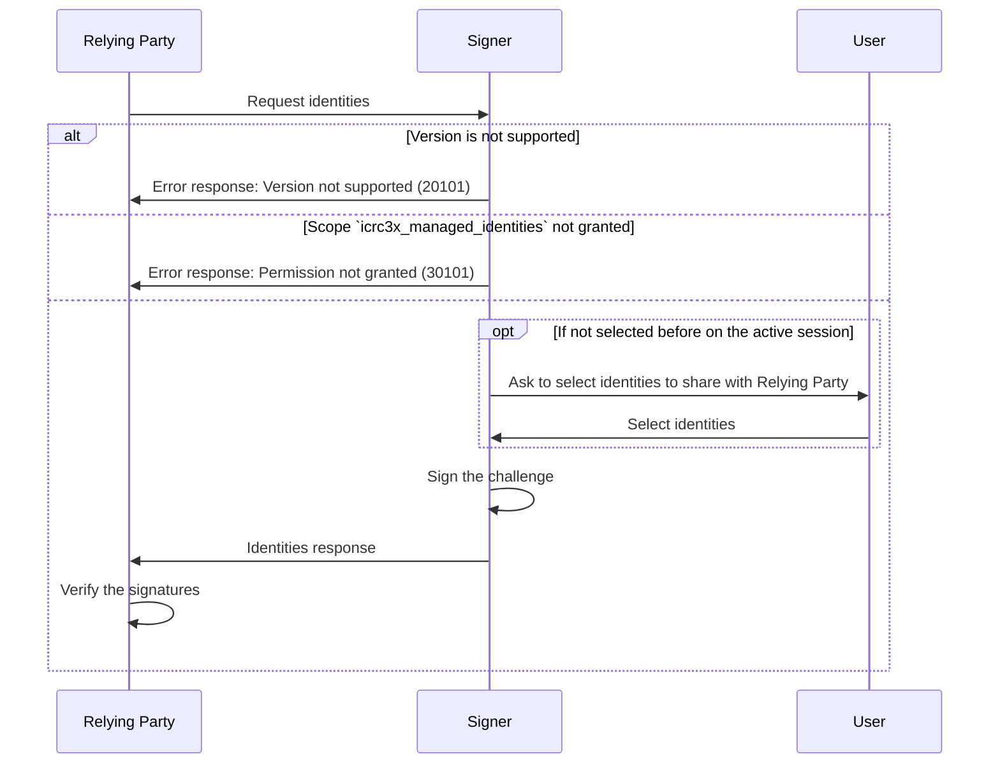

# ICRC-25: Signer Interaction Standard

| Status |
| :----: |
| Draft  |

<!-- TOC -->

- [ICRC-3x: Manage Idenities](#icrc-3x-managed-identities)
  - [Summary](#summary)
  - [Methods](#methods)
    - [`icrc3x_managed_identities`](#icrc3x_managed_identities)
      - [Prerequisites](#prerequisites-2)
      - [Request](#request-2)
      - [Response](#response-2)
      - [Errors](#errors-2)
      - [Message Processing](#message-processing-2)
      - [Example](#example-2)

## Summary

This standard defines a set of methods used to request information about the identities managed by the signer.

## Methods

### `icrc3x_managed_identities`

The purpose of the `icrc3x_managed_identities` message is for the relying party to receive information about the identities managed by the signer.

#### Prerequisites

* Active session with granted scope `icrc3x_managed_identities`.

#### Request

`version` (`text`): The version of the standard used. If the signer does not support the version of the request, it must send the `"VERSION_NOT_SUPPORTED"` error in response.

`challenge` (`blob`): A challenge used for the signer to sign in order to prove its access to the identity. The challenge should be an array of 32 cryptographically random bytes generated from a secure random source by the sender of the request.

#### Response

`version` (`text`): The version of the standard used. It must match the `version` from the request.

`identities`: A list of identities the user has selected to share with the relying party.
- `publicKey` (`blob`): The DER-encoded public key associated with the identity, derived in accordance with one of [the signature algorithms supported by the IC](https://internetcomputer.org/docs/current/references/ic-interface-spec/#signatures). The public key can be used to [derive a self-authenticating principal](https://internetcomputer.org/docs/current/references/ic-interface-spec/#principal).
- `signature` (`blob`): The signature produced by signing the concatenation of the domain separator `\x13ic-signer-challenge` (UTF-8 encoded) and the challenge with the private key associated with the identity.
- `delegation` (optional): An array of delegations (as defined by the [IC interface specification, authentication section](https://internetcomputer.org/docs/current/references/ic-interface-spec/#authentication)):
  - object with the following properties:
    - `pubkey` (`blob`): Public key as described in the [IC interface specification, signatures section](https://internetcomputer.org/docs/current/references/ic-interface-spec/#signatures).
    - `expiration` (`text`): Expiration of the delegation, in nanoseconds since 1970-01-01, as a base-10 string.
    - `targets` (`text` array): A list of target canister ids (textual representation) the delegation is restricted to making canister calls to. If the list is not present, the delegation applies to all canisters (i.e. it is not restricted).
  - `signature` (`blob`): Signature on the 32-byte representation-independent hash of the map contained in the delegation field as described in [IC interface specification, signatures section](https://internetcomputer.org/docs/current/references/ic-interface-spec/#signatures), using the 27 bytes `\x1Aic-request-auth-delegation` as the domain separator. 

#### Errors

While processing the request from the relying party, the signer can cancel it at any time by sending an [error](#errors) in response. In addition to the pre-defined JSON-RPC 2.0 errors ([-32600 to -32603 and -32700](https://www.jsonrpc.org/specification#error_object)), the following values are applicable:
- `10001 Unknown error`
- `20101 Version not supported`
- `30101 Permission not granted`

#### Message Processing

1. The relying party sends a `icrc3x_managed_identities` request to the signer.
2. Upon receiving the message, the signer first checks if it can process the message.
    - If the request version is not supported by the signer, the signer sends a response with an error back to the relying party.
    - If the relying party has not been granted the permission to request the action, the signer sends a response with an error back to the relying party.
3. Next, the signer lets the user select identities that will be included in the response.
    - If the user has previously selected identities for the same relying party on the same session, the signer may skip the user interaction.
4. The signer signs the challenge with the private keys associated with the selected identities and sends a successful response back to the relying party with the list of selected identities and the matching signatures.
5. After receiving a successful response, the relying party verifies that the signer has access to the private key associated with the provided identities:
    - Determine the public key for verifying the signature of the challenge for each identity:
      - If `delegation` is present and non-empty:
        - If the `delegation` array contains more than 20 elements, the relying party rejects the response.
        - The relying party validates that all delegations are not expired according to their respective `expiration` timestamp.
        - The relying party validates all `signature` values of all delegations in the `delegation` list. For the first delegation in the array, this signature must be valid with respect to the public key corresponding to the `publicKey` field of the identity, all subsequent delegations are signed with the key corresponding to the public key contained in the preceding delegation. The key to validate the challenge signature is the public key contained in the last delegation in the array.
      - Otherwise the key to validate the challenge signature with is the public key contained in the `publicKey` field of the identity.
    - The relying party retrieves the public key to verify the challenge from each identity according to the previous step, determines the `signature` scheme and verifies whether it was generated by signing the concatenation of the domain separator `\x13ic-signer-challenge` (UTF-8 encoded) and the `challenge` from the request with the private key associated with that public key.
        - If the signature verification succeeds for all `identities`, the relying party accepts the response.
        - If the signature verification fails for any `identities` value, the relying party rejects the response.



#### Example

Request
```json
{
    "id": 1,
    "jsonrpc": "2.0",
    "method": "icrc3x_managed_identities",
    "params": {
        "version": "1",
        "challenge": "UjwgsORvEzp98TmB1cAIseNOoD9+GLyN/1DzJ5+jxZM="
    }
}
```

Response
```json
{
    "id": 1,
    "jsonrpc": "2.0",
    "result": {
        "version": "1",
        "identities": [
            {
                "publicKey": "MFYwEAYHKoZIzj0CAQYFK4EEAAoDQgAEOTdHYwpFTr/oPXOfLQcteymk8AQE41VwPQ1W7Xpm0Zt1AY4+5aOnMAbAIjXEchxPuGbPWqPqwntXMPs3w4rOaA==",
                "signature": "bldf7qn7DC5NzTyX5kp4GpZHaEncE5/6n/Y8av3xjEwIVFAwmhyW0uM+WBXRTj4QbScot04dfaBXUOcSWF0IjQ=="
            }
        ]
    }
}
```