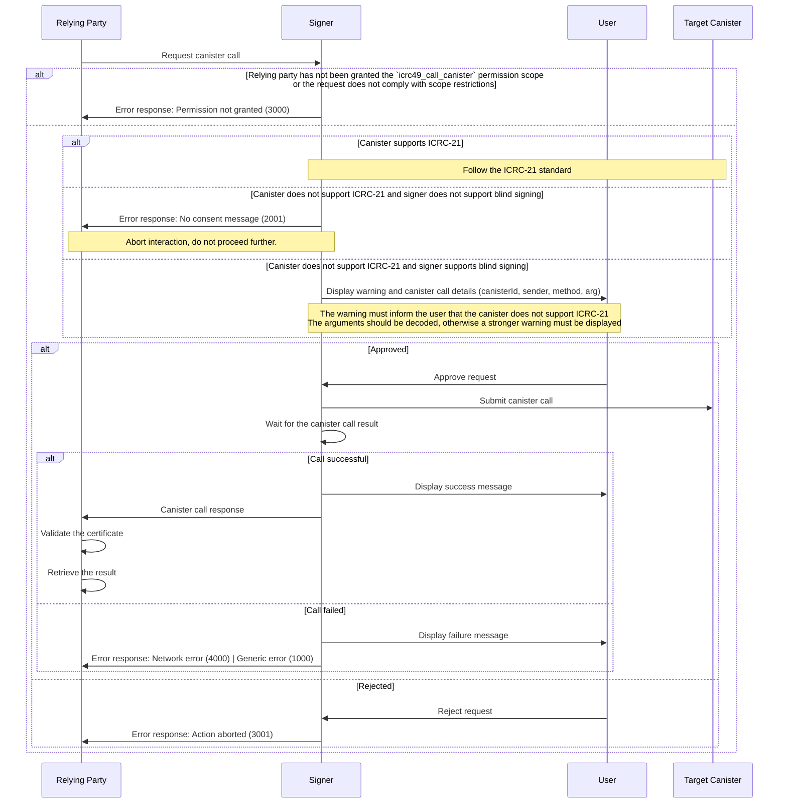

# ICRC-49: Call Canister

[](https://github.com/orgs/dfinity/projects/31)
[](./icrc_25_signer_interaction_standard.md)

<!-- TOC -->
* [ICRC-49: Call Canister](#icrc-49-call-canister)
  * [Summary](#summary)
  * [Method](#method)
  * [Scope (according to the ICRC-25 standard)](#scope-according-to-the-icrc-25-standard)
    * [Example Permission Request](#example-permission-request)
  * [`icrc25_supported_standards`](#icrc25_supported_standards)
  * [Request Params](#request-params)
    * [Example RPC Request](#example-rpc-request)
  * [Result](#result)
    * [Example RPC Response](#example-rpc-response)
  * [Message Processing](#message-processing)
  * [Errors](#errors)
<!-- TOC -->

## Summary

This Method can be used by the relying party to request calls to 3rd party canister executed by the signer using the requested identity. In order to prevent misuse of this method all `icrc49_call_canister` requests are subject to user approval.

## Method

**Name:** `icrc49_call_canister`

**Prerequisite:** Granted permission scope `icrc49_call_canister`.

## Scope (according to the [ICRC-25 standard](./icrc_25_signer_interaction_standard.md))

**Scope:** `icrc49_call_canister` 

### Example Permission Request
```json
{
    "id": 1,
    "jsonrpc": "2.0",
    "method": "icrc25_request_permissions",
    "params": {
        "version": "1",
        "scopes": [
            {
                "method": "icrc49_call_canister"
            }
        ]
    }
}
```

## `icrc25_supported_standards`

An ICRC-25 compliant signer must implement the [icrc25_supported_standards](./icrc_25_signer_interaction_standard.md#icrc25_supported_standards) method which returns the list of supported standards. Any signer implementing ICRC-49 must include a record with the name field equal to "ICRC-49" in that list.

## Request Params

**`canisterId` (`text`):** The id of the canister on which the call should be executed.

**`sender` (`text`):** The principal (textual representation) requested to execute the call.

**`method` (`text`):** The name of the call method to be executed.

**`arg` (`blob`):** The arguments for the call.

**`nonce` (`blob` optional):** Arbitrary data of length at most 32 bytes, typically randomly generated. This can be used to create distinct requests with otherwise identical fields.

### Example RPC Request

```json
{
    "id": 1,
    "jsonrpc": "2.0",
    "method": "icrc49_call_canister",
    "params": {
        "canisterId": "xhy27-fqaaa-aaaao-a2hlq-ca",
        "sender": "b7gqo-ulk5n-2kpo7-oalt7-p2kyl-o4j5l-kiuwo-eeybr-dab4l-ur6up-pqe",
        "method": "transfer",
        "arg": "RElETARte24AbAKzsNrDA2ithsqDBQFsA/vKAQKi3pTrBgHYo4yoDX0BAwEdV+ztKgq7E4l1ffuTuwEmw8AtYSjlrJ+WLO5ofQIAAMgB"
    }
}
```


## Result

**`contentMap` (`blob`):** The CBOR-encoded content map of the actual request as specified [here](https://internetcomputer.org/docs/current/references/ic-interface-spec/#http-call).

**`certificate` (`blob`):** The certificate returned by the `read_state` call as specified [here](https://internetcomputer.org/docs/current/references/ic-interface-spec/#certificate). The value is CBOR-encoded.

### Example RPC Response

```json
{
    "id": 1,
    "jsonrpc": "2.0",
    "result": {
        "contentMap": "2dn3p2NhcmdYTkRJREwEbXtuAGwCs7DawwNorYbKgwUBbAP7ygECot6U6wYB2KOMqA19AQMBHVfs7SoKuxOJdX37k7sBJsPALWEo5ayflizuaH0CAADIAWtjYW5pc3Rlcl9pZEoAAAAAAcDR1wEBbmluZ3Jlc3NfZXhwaXJ5GxeNX/65y4YAa21ldGhvZF9uYW1laHRyYW5zZmVyZW5vbmNlUFF4+hAimFhoqkdUcIchz0xscmVxdWVzdF90eXBlZGNhbGxmc2VuZGVyWB1q63Snu+4C5/fpWFu4nq1IpZxCYDEYA8XSPqPfAg==",
        "certificate": "2dn3omR0cmVlgwGDAYIEWCAPzKZJY/emKhi2GGtBrnHh4cdttATd4+9GtJrNCBepb4MBgwJOcmVxdWVzdF9zdGF0dXODAYIEWCCCgynUaonrKCCywghWCSk9BeDqMoI4yf15nxyU/5JZv4MBggRYIDG7WdzQ9sGWI1MpxizUzxubsEBuNkTT94UOZ9USbzNvgwGCBFggawwbTHxnPUzBAUhWBRjk0nzPs2fPpJlaIYtj5AvcX+ODAYIEWCDiFLyaWuMWjtVurCQcSgny/cqfM8S6qrdihVq7nPz1FoMCWCD/8jdeccvqHVYf06Hw7qPXIDNimC1Uyf47VsvgqKpPiIMBgwJFcmVwbHmCA1RESURMAWsCvIoBfcX+0gFxAQAABIMCRnN0YXR1c4IDR3JlcGxpZWSCBFgg7qZngcNt2+B/RuF44W3LRsKWXG6QQg2L6GdZgJ6Nb3+DAYIEWCAx3tU/mhHfX+wDzF003eSJYN8Nebou8rTeGyxr/rUa1YMCRHRpbWWCA0nw9+r88fjXxhdpc2lnbmF0dXJlWDCXNshvwWG1jGViP7ELePGHCThBw9mts45FxIy4gZATkUEsPeJ6y+cjbn2REmB0Soo="
    }
}
```

## Message Processing

1. The relying party sends a `icrc49_call_canister` request to the signer.
2. Upon receiving the request, the signer validates whether it can process the message.
    - If the relying party has not been granted the permission to request the action, the signer sends a response with an error back to the relying party.
        - The sender must make sure that the request complies with additional scope restrictions defined by the signer (if any), such as limitations on the target canister id or the sender principal, etc.
3. The signer tries to retrieve and verify the consent message according to the [ICRC-21](icrc_21_consent_msg.md) specification. If the target canister does not support ICRC-21 consent messages for the given canister call, the signer may proceed in one of following ways:
   * The signer rejects the request and sends a response with the error code 2001 back to the relying party. Step 4 is skipped.
   * The signer displays a warning, tries to decode the arguments by itself and displays raw canister call details. If the arguments cannot be decoded, a strong warning must be displayed.
      > **Note:** Signing canister calls without an ICRC-21 consent message is dangerous! Signing canister calls solely based on the decoded arguments might yield unexpected results. Strong technical knowledge is required to understand the consequences of such actions. Blind signing of canister calls (without even decoding the arguments) is not recommended and requires complete trust in the relying party.
       > 
       > Singing canister calls without an ICRC-21 consent message must be disabled by default. The signer must explain the dangers to the user and ask explicitly to enable this feature.
4. Next, the signer displays the transaction details to the user and prompts for approval:
    >    **Note:** User approval for the `icrc49_call_canister` method must never be skipped! The reason for this is that the canister call might not be idempotent and thus submitting a call more than once might have undesired consequences.
   - If the user approves the request:
       - The signer sends the call to the IC (in order to get certified results, all calls, including queries, should be sent as `update` calls), retrieves its [content map](https://internetcomputer.org/docs/current/references/ic-interface-spec/#http-call) and [calculates a request id](https://internetcomputer.org/docs/current/references/ic-interface-spec/#request-id) based on it.
           - The signer continues to call `read_state` for the calculated request id until [the status of the call](https://internetcomputer.org/docs/current/references/ic-interface-spec/#state-tree-request-status) indicates that the call has been processed (succesfully or not).
               - If the status of the call is `replied`, `rejected` or `done`, the signer retrieves the CBOR-encoded [certificate](https://internetcomputer.org/docs/current/references/ic-interface-spec/#certificate) from [the `read_state` response](https://internetcomputer.org/docs/current/references/ic-interface-spec/#http-read-state) and sends it together with the content map in response back to the relying party.
           - If the status of the HTTP response for submitting the call to the IC is _not_ `202 Accepted` (indicating the call failed), the signer sends a response with an error back to the relying party.
   - If the user rejects the request or if the signer fails to complete the requested action for any reason, the signer sends a response with an error back to the relying party.
5. The relying party receives a response from the signer and processes it as follows:
    - On successful response: the relying party verifies whether the call performed by the signer was genuine and retrieves the result:
        - The relying party retrieves the CBOR-encoded `contentMap` from the response, verifies that its values match the expectations and uses it to [calculate a request id](https://internetcomputer.org/docs/current/references/ic-interface-spec/#request-id).
        - The relying party retrieves the CBOR-encoded [`certificate`](https://internetcomputer.org/docs/current/references/ic-interface-spec/#certificate) from the response, decodes it and validates its authenticity with regard to [the root of trust](https://internetcomputer.org/docs/current/references/ic-interface-spec/#root-of-trust).
            - If the validation process fails, the relying party rejects the response.
        - The relying party extracts the [request status](https://internetcomputer.org/docs/current/references/ic-interface-spec/#state-tree-request-status) from the `certificate`'s state tree.
        - If the status of the call is `replied`:
            - The relying party retrieves the `reply` blob from the `certificate`'s state tree.
            - If the `reply` blob or the error information (comprised of the `reject_code`, `reject_message`) is not present, the relying party rejects the response. 
        - If the status of the call is `rejected`:
            - The relying party uses the calculated request id to retrieve `reject_code`, `reject_message` from the `certificate`'s state tree.
            - If the error information (comprised of the `reject_code`, `reject_message`) is not present, the relying party rejects the response.
        - If the status of the call is `done`:
            - The relying party now knows that the call was submitted to the IC and executed as requested. However, the result of the call is no longer available.
    - On error: The relying party may use the information returned to help investigate the causes for the error. The error information is only informative. The relying party must not trust the information returned by the signer and should not use it to make any decisions.



## Errors

See [ICRC-25](./icrc_25_signer_interaction_standard.md#errors-3) for a list of errors that can be returned by all methods.

This standard defines the following additional errors:

| Code | Message            | Meaning                                                                                                                      | Data |
|------|--------------------|------------------------------------------------------------------------------------------------------------------------------|------|
| 2001 | No consent message | The signer has rejected the request because the target canister does not support ICRC-21 consent messages for the given call | N/A  |