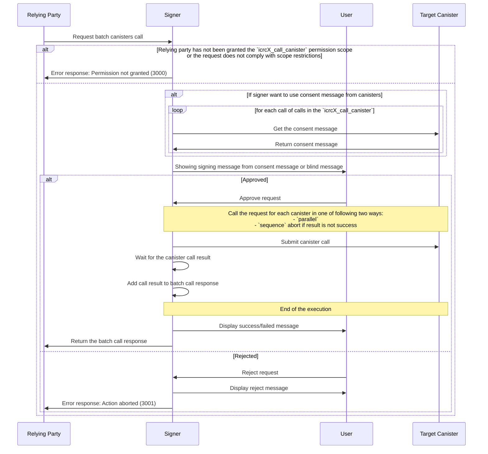

# ICRC-X: Call batch canisters

[](#)
[](./icrc_25_signer_interaction_standard.md)
[](./icrc_49_call_canister.md)

<!-- TOC -->

- [ICRC-X: Call batch canisters](#icrc-x-call-batch-canisters)
  - [Summary](#summary)
  - [Processing](#processing)
    - [Examples](#examples)
      - [Successful Batch Call](#successful-batch-call)
      - [Batch Call with Error](#batch-call-with-error)

## Summary

This Method can be used by the relying party to request batch call to 3rd party canister executed by the signer using the requested identity. In order to prevent misuse of this method all `icrcX_call_batch_canisters` requests are subject to user approval.

There is two main parameter for this standard

1. `mode` : The mode to execute transaction in sequence or in parallel
2. `requests` : An array of canister call requests

Unfortunately there is currently no mode to execute all transactions in the batch in one block. The transactions are handled as independent transactions that are executed in parallel or in sequence. However, ICRCX allows signer to receive approval for all transactions in the batch from the user with one approval action. 

## Processing
**How it works**
1. Relying party requests a ICRCX batch transaction request to the signer. The request can be either `parallel` mode or `sequence` mode (see more details below). 

2. The signer fetches consent messages and shows a warning to user to approve the batch transaction. 

3. The signer submits canister calls to target canisters:
- mode `parallel`: Execute all requests simultaneously, without waiting for any individual request to complete before starting the next. All transactions will be started. But it is not guaranteed that all transactions will succeed.
- mode `sequence`: 
  - Execute each request one after the other, ensuring that each request is completed before starting the next one. If any transaction fails, the execution of the batch will stop without executing remaining queued transactions. 
  - Evaluate the result of processing the request:
     1. If the result is a successful response, add the result to the batch response. Proceed with processing the next request in the batch.
     2. If the result is an error, add an error to the batch response and stop processing the batch. For any request in the batch that has not been processed yet, add an error response with code 10101 to the batch response.

4. The signer, once it has collected responses from all the transactions, displays a response message to the user, and forwards the response to the relying partner. 

5. The relying partner, if any of the transactions failed, implements error handling. The response of the individual transactions will be aggregated into the response of the batch call. If there are any errors in the response, it is up to the relying party to decide how to handle the error. 

**Flow**



### Examples

#### Successful Batch Call

Request

```json
{
  "id": 1,
  "jsonrpc": "2.0",
  "method": "icrcX_batch_call_canisters",
  "params": {
    "mode": "sequence",
    "sender": "b7gqo-ulk5n-2kpo7-oalt7-p2kyl-o4j5l-kiuwo-eeybr-dab4l-ur6up-pqe",
    "requests": [
      {
        "id": 1,
        "canisterId": "xhy27-fqaaa-aaaao-a2hlq-ca",
        "method": "transfer",
        "arg": "RElETARte24AbAKzsNrDA2ithsqDBQFsA/vKAQKi3pTrBgHYo4yoDX0BAwEdV+ztKgq7E4l1ffuTuwEmw8AtYSjlrJ+WLO5ofQIAAMgB"
      },
      {
        "id": 2,
        "canisterId": "xhy27-fqaaa-aaaao-a2hlq-ca",
        "method": "transfer",
        "arg": "RElETARte24AbAKzsNrDA2ithsqDBQFsA/vKAQKi3pTrBgHYo4yoDX0BAwEdV+ztKgq7E4l1ffuTuwEmw8AtYSjlrJ+WLO5ofQIAAMgB"
      }
    ]
  }
}
```

Response

```json
{
  "id": 1,
  "jsonrpc": "2.0",
  "result": {
    "responses": [
      {
        "id": 1,
        "result": {
          "Ok": "16509194"
        }
      },
      {
        "id": 2,
        "result": {
          "Ok": "16509195"
        }
      }
    ]
  }
}
```

#### Batch Call with Error

Request

```json
{
  "id": 1,
  "jsonrpc": "2.0",
  "method": "icrcX_batch_call_canisters",
  "params": {
    "mode": "",
    "sender": "b7gqo-ulk5n-2kpo7-oalt7-p2kyl-o4j5l-kiuwo-eeybr-dab4l-ur6up-pqe",
    "isAnonymous": false,
    "requests": [
      {
        "id": 1,
        "jsonrpc": "2.0",
        "method": "icrc49_call_canister",
        "params": {
          "canisterId": "xhy27-fqaaa-aaaao-a2hlq-ca",
          "method": "transfer",
          "arg": "RElETARte24AbAKzsNrDA2ithsqDBQFsA/vKAQKi3pTrBgHYo4yoDX0BAwEdV+ztKgq7E4l1ffuTuwEmw8AtYSjlrJ+WLO5ofQIAAMgB"
        }
      },
      {
        "id": 2,
        "jsonrpc": "2.0",
        "method": "icrc49_call_canister",
        "params": {
          "canisterId": "xhy27-fqaaa-aaaao-a2hlq-ca",
          "method": "transfer",
          "arg": "RElETARte24AbAKzsNrDA2ithsqDBQFsA/vKAQKi3pTrBgHYo4yoDX0BAwEdV+ztKgq7E4l1ffuTuwEmw8AtYSjlrJ+WLO5ofQIAAMgB"
        }
      },
      ,
      {
        "id": 3,
        "jsonrpc": "2.0",
        "method": "icrc49_call_canister",
        "params": {
          "canisterId": "xhy27-fqaaa-aaaao-a2hlq-ca",
          "method": "transfer",
          "arg": "RElETARte24AbAKzsNrDA2ithsqDBQFsA/vKAQKi3pTrBgHYo4yoDX0BAwEdV+ztKgq7E4l1ffuTuwEmw8AtYSjlrJ+WLO5ofQIAAMgB"
        }
      }
    ]
  }
}
```

Response

```json
{
  "id": 1,
  "jsonrpc": "2.0",
  "result": {
    "responses": [
      {
        "id": 1,
        "result": {
          "version": "1",
          "Ok": "16509194"
        }
      },
      {
        "id": 2,
        "result": {
          "Err": {
            "InsufficientFunds": {
              "balance": {
                "e8s": "0"
              }
            }
          }
        }
      },
      {
        "id": 3,
        "error": {
          "code": 1000,
          "message": "Network error: Unable to establish a connection to the server"
        }
      }
    ]
  }
}
```

## Errors

In addition to the errors defined in [ICRC-25](./icrc_25_signer_interaction_standard.md#errors-3) this standard defines the following errors:


| Code  | Message                                    | Meaning                                                                                          | Data                                                                                |
|-------|--------------------------------------------|--------------------------------------------------------------------------------------------------|-------------------------------------------------------------------------------------|
| 10101 | Not processed due to batch request failure | The message was not processed as one of the preceding request in the batch resulted in an error. | (optional) Error details: <ul> <li>`message` (`text`, optional): message</li> </ul> |
