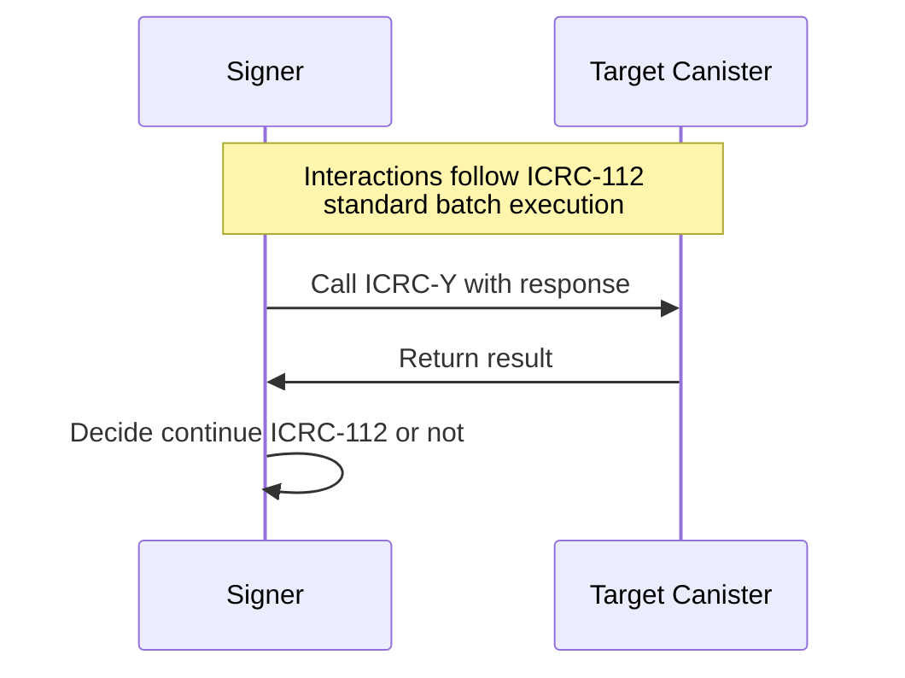

# ICRC-Y: Validate batch response

![APPROVED]

**Authors:** [Long Tran](https://github.com/baolongt)

<!-- TOC -->

- [ICRC-Y: Validate batch response](#icrc-y-validate-batch-response)
  - [Summary](#summary)
  - [Methods](#methods)
    - [icrcy_validate](#icrcy_validate)
    - [icrc10_supported_standards](#icrc10_supported_standards)
  - [Use-Cases](#use-cases)

## Summary

This standard is used for validating the response of batch transactions to ensure that all requests have been processed correctly.

## Methods

### icrcy_validate

This method received the response from previous canister call send it as blob.

Eg: Canister call response

```
// signer received payload
{
  "contentMap": "2dn3p2NhcmdYTkRscmVxdWVzdF90eXBlZGNhbGxmc2VuZGVyWB1q63Snu+4C5/fpWFu4nq1IpZxCYDEYA8XSPqPfAg==",
  "certificate": "..."
}
```

It can be `Ok` or `Err` in Rust and Motoko. In order to decide continue execute ICRC-112 or not. This validate canister have to parse the contentMap and return the boolean value of that request

**Candid**

```
icrcy_validate : (blob) -> bool
```

### icrc10_supported_standards

An implementation of ICRC-Y MUST implement the method icrc10_supported_standards as put forth in
[ICRC-10](https://github.com/dfinity/ICRC/ICRCs/ICRC-10).

The result of the call MUST always have at least the following entries:

```
// TODO: Fill detail url
```

## Use-Cases

- Validate the results of batch transactions to ensure all requests were processed successfully.
- Provide a mechanism to check the success or failure of each individual request within a batch.


