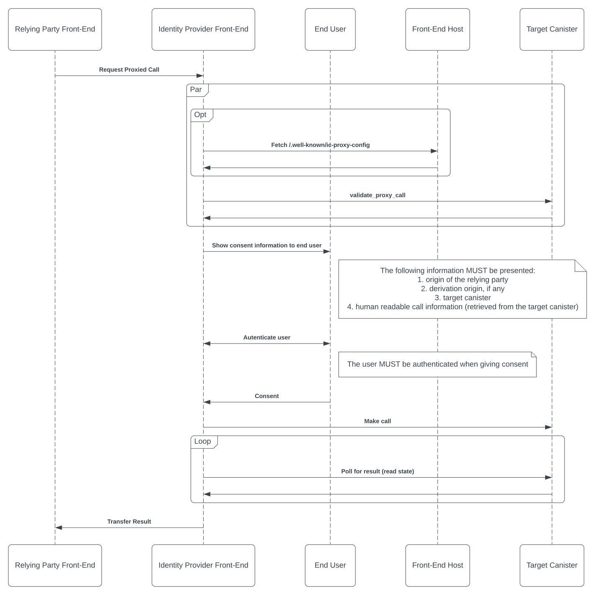

# Proxied Canister Calls

<!-- TOC -->
* [Proxied Canister Calls](#proxied-canister-calls)
  * [Summary](#summary)
  * [Assumptions](#assumptions)
  * [Protocol](#protocol)
    * [1: Relying Party Sends Proxy Call Request to IDP](#1--relying-party-sends-proxy-call-request-to-idp)
    * [2: IDP Validates Call and Collects Consent Information](#2--idp-validates-call-and-collects-consent-information)
    * [3: User Authentication and User Consent](#3--user-authentication-and-user-consent)
    * [4: IDP Calls Target Canister](#4--idp-calls-target-canister)
    * [5: IDP Sends Result to Relying Party](#5--idp-sends-result-to-relying-party)
  * [Proxied Call Consent Information Interface](#proxied-call-consent-information-interface)
  * [Validation of Derivation Origin](#validation-of-derivation-origin)
    * [JSON Schema](#json-schema)
    * [Example](#example)
  * [Appendix A: JSON-RPC over WindowPostMessages between Relying Party and IDP](#appendix-a--json-rpc-over-windowpostmessages-between-relying-party-and-idp)
    * [JSON-RPC Requests / Responses](#json-rpc-requests--responses)
      * [Request Proxied Call (Step 1)](#request-proxied-call--step-1-)
      * [Proxied Call Result (Step 5)](#proxied-call-result--step-5-)
<!-- TOC -->


## Summary
This specification describes a protocol for proxying canister calls through an identity provider (IDP) on the IC. This gives dapps on the IC the ability to send canister calls to other services on the users behalf if explicitly consented to by the end-user.

A common application of such a protocol would be transaction approval: I.e. send a transfer request to the service that holds the users assets.

The key words "MUST", "MUST NOT", "REQUIRED", "SHALL", "SHALL NOT",
"SHOULD", "SHOULD NOT", "RECOMMENDED", "MAY", and "OPTIONAL" in this
document are to be interpreted as described in [RFC2119](https://datatracker.ietf.org/doc/html/rfc2119).

## Assumptions
* The browser and the IDP are trusted by the end-user and the relying party.
* Relying parties and target canisters might be malicious.

## Protocol

### 1: Relying Party Sends Proxy Call Request to IDP
The IDP receives a request to proxy a canister call. The request MUST contain the following information:
* Target canister: The principal of the canister to call.
* Method name: Name of the canister method to call
* Arg: Argument to pass to the canister method
* If the IDP derives different principals for each front-end (i.e. NFID, Internet Identity) the derivation origin needs to be included as well

The request MUST be sent over an authenticated channel (e.g. WindowPostMessages). It is RECOMMENDED to use [JSON-RPC 2.0](https://www.jsonrpc.org/specification) for the interaction between the relying party and the IDP (see [Appendix A](#appendix-a--json-rpc-over-windowpostmessages-between-relying-party-and-idp)).
### 2: IDP Validates Call and Collects Consent Information
The IDP fetches the resources required to present the consents screen to the user:
* The IDP calls the target canister method `validate_proxy_call`. If the call is rejected or the result is not `valid`, then the validation fails.
* If the IDP derives different principals for each front-end the well-known asset `/.well-known/ic-proxy-config` on the front-end origin MUST be fetched to verify that the given principal is allowed to interact with the target canister using proxy calls.

If any of these validations fails, the protocol aborts with an error.
### 3: User Authentication and User Consent
The following consent information MUST be shown to the user:
* origin of the relying party
* derivation origin, if any
* target canister
* human-readable call consent information (retrieved from the target canister)

The user needs to be presented with options to accept or reject the call. Explicit user interaction (i.e. pressing a button) is required in this step. If the user owns multiple identities on the IDP they SHOULD have the option to select which one is used. The consent screen MAY also show the technical call details (i.e. method name and arguments).

The user MUST be authenticated when consenting to the canister call.

If the user rejects the call, the protocol aborts with an error.
### 4: IDP Calls Target Canister
The IDP calls the target canister and polls for the result.
### 5: IDP Sends Result to Relying Party
The IDP sends the call result to the relying party:
* body of the read state response that contains the call result.
* request id of the request that was made by the IDP.
* if the IDP uses principal derivation: principal derived from the relying party front-end origin that corresponds to the identity the user authenticated as to authorize the proxy call. This allows the relying party to determine if the user chose a different identity to execute the proxy call than the one used to sign in to the relying party front-end (if any).

The relying party MAY verify that the read state response.

## Proxied Call Consent Information Interface

Canisters must opt in to allow canister calls to them to be proxied. To opt in, a canister must implement the following Candid interface:

```
type consent_preferences = record {
    // Same semantics as HTTP Accept-Language header
    language: text;

};

type proxy_call_validation = record {
    // Method name of the call to be proxied.
    method: text;
    // Arguments of the call to be proxied.
    arg: blob;
    // User preferences with regards to the consent information presented to the end-user.
    consent_preferences: consent_preferences;
};

type consent_info = record {
    // Consent text describing in a human-readable format what the call will do.
    // The format is markdown.
    consent_text: text;
    // Same semantics as HTTP lang attribute
    language: text;
};

type error_info = record {
    // Machine parsable error. Can be chosen by the target canister, but should indicate the category
    error_code: nat;
    // Human readable technical description of the error intended for developers, not the end-user.
    description: text;
};

type proxy_call_validation_result = variant {
    // The call is valid,
    valid: record {
        consent_info: consent_info;
    };
    // The call is not allowed (i.e. because the method is not allowed to be proxied, the arguments exceed certain bounds, etc.)
    forbidden: error_info;
    // The call is malformed and would cause an error (i.e. the method does not exist, the arguments cannot be decoded, etc.).
    malformed_call: error_info;
};

service : {
    validate_proxy_call: (proxy_call_validation) -> (proxy_call_validation_result);
}
```

## Validation of Derivation Origin

If the IDP uses principal derivation based on the front-end origin, the target canister MUST be validated against that origin. This validation prevents the derived principal from being used in unintended interactions or being leaked to malicious canisters.

To validate a target canister against an origin, the asset `/.well-known/ic-proxy-config` must be fetched from that origin. The target canister is allowed to be called with a principal from this origin if one of the following conditions is true:
* the canister id is in the list of `allowedTargetCanisters` and one of the following conditions is true:
  * the method is listed in the `methods` list
  * the `methods` is absent.
* the list of `allowedTargetCanisters` contains the string `"*"` (which is a wild card matching all canisters) and one of the following conditions is true:
  * the method is listed in the `methods` list
  * the `methods` is absent.

> Note: In order to allow an IDP to read the path '/.well-known/ic-proxy-config', the CORS response header `Access-Control-Allow-Origin` must be set and allow the IDP origin.

### JSON Schema
```json
{
  "$schema": "https://json-schema.org/draft/2020-12/schema",
  "title": "Proxy Call Information",
  "description": "Information related to proxied canister calls.",
  "type": "object",
  "properties": {
    "allowedTargetCanisters": {
      "description": "List of allowed target canisters (with an optional allow list of callable methods) that for proxied canister calls using a principal derived from this origin.",
      "type": "array",
      "items": {
        "type": "object",
        "properties": {
          "canisterId": {
            "type": "string"
          },
          "methods": {
            "type": "array",
            "items": {
              "type": "string"
            },
            "minItems": 1,
            "uniqueItems": true
          }
        },
        "required": [
          "canisterId"
        ]
      },
      "minItems": 0,
      "uniqueItems": true
    }
  },
  "required": [
    "allowedTargetCanisters"
  ]
}
```

### Example

The following example allows only method `foo` on canister `a4gq6-oaaaa-aaaab-qaa4q-cai` and **all** methods on canister `a4gq6-oaaaa-aaaab-qaa4q-cai`:

```json
{
  "allowedTargetCanisters": [
    {
      "canisterId": "a4gq6-oaaaa-aaaab-qaa4q-cai",
      "methods": [
        "foo"
      ]
    },
    {
      "canisterId": "a4gq6-oaaaa-aaaab-qaa4q-cai"
    }
  ]
}
```

Allowing all canisters and all methods to be called:

```json
{
  "allowedTargetCanisters": [
    {
      "canisterId": "*"
    }
  ]
}
```

## Appendix A: JSON-RPC over WindowPostMessages between Relying Party and IDP

As described in [step 1](#1--relying-party-sends-proxy-call-request-to-idp) of the protocol, the request form the relying party to the IDP MUST be sent over an authenticated channel. One such channel is the `WindowPostMessage` browser API.

This allows the IDP front-end window to determine the origin of the relying party (which must be displayed on the consent screen, see [step 3](#3--user-authentication-and-user-consent)).

This sections specifies the types of the message payloads to be sent, if JSON-RPC 2.0 over the `WindowPostMessage` browser API is used to implement this protocol.

### JSON-RPC Requests / Responses

#### Request Proxied Call (Step 1)

* JSON-RPC `method`: "ic-proxy-call-request"
* JSON-RPC `params` type:
  ``` json
  interface IcProxyCallParams {
    // textual representation of the target canister principal
    targetCanister: string;
    methodName: string;
    arg: Uint8Array;
    derivationOrigin?: string;
  }
  ```

#### Proxied Call Result (Step 5)

* JSON-RPC `method`: "ic-proxy-call-result"
* JSON-RPC `result` type:
  ``` json
  interface IcProxyCallResult {
    // Response body of the read state request containing the call result, see https://internetcomputer.org/docs/current/references/ic-interface-spec/#http-read-state
    readStateResponseBody: Uint8Array;
    // Request id of the call that was made by the IDP front-end.
    // See https://internetcomputer.org/docs/current/references/ic-interface-spec/#request-id
    requestId: Uint8Array;
    // principal derived from the relying party origin for the identity used to make the proxy call 
    principal?: string;
  }
  ```
