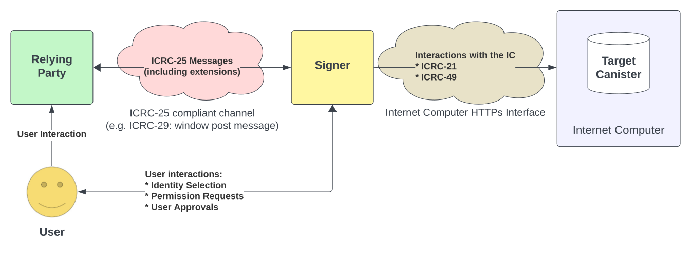

# IC Signer Standards: Overview

This document gives an overview over the ICRC standards related to signer interactions and transaction approval flows.
It explains the motivation behind the standards and how they relate to each other.

The following ICRC standards are relevant in this context:
* The [Internet Computer Interface Specification](https://internetcomputer.org/docs/current/references/ic-interface-spec/), specifically the [HTTPs interface](https://internetcomputer.org/docs/current/references/ic-interface-spec/#http-interface)
* [ICRC-21](https://github.com/dfinity/wg-identity-authentication/blob/main/topics/icrc_21_consent_msg.md): Canister Call Consent Messages
* [ICRC-25](https://github.com/dfinity/wg-identity-authentication/blob/main/topics/icrc_25_signer_interaction_standard.md): Signer Interaction Standard
* ICRC-27: ICRC-25 Extension for ICRC-1 ledger subaccounts
* [ICRC-29](https://github.com/dfinity/wg-identity-authentication/blob/main/topics/icrc_29_window_post_message_transport.md): PostMessage Transport Standard for ICRC-25
* [ICRC-31](https://github.com/dfinity/wg-identity-authentication/blob/main/topics/icrc_31_get_principals.md): Get Principals (ICRC-25 Extension)
* [ICRC-32](https://github.com/dfinity/wg-identity-authentication/blob/main/topics/icrc_32_sign_challenge.md): Sign Challenge (ICRC-25 Extension)
* [ICRC-33](https://github.com/dfinity/wg-identity-authentication/blob/main/topics/icrc_33_call_canister.md): Call Canister (ICRC-25 Extension)

The following diagram presents the interactions between the different components (see [terminology](#terminology)) and shows which standards cover the respective parts of the interactions:

## Terminology

### Signer 
A component that holds a private key and can sign messages. In addition, the signer needs to be able to interact
with the IC to send messages and receive responses.
It can be a hardware wallet, a mobile app, a browser extension, or any other component that can sign messages.

A signer is _not_ required to do any form of asset management, such as showing balances or manage staked funds.

### Relying Party
A service that interacts with a signer. It can do so by requesting
* information (see [ICRC-25](https://github.com/dfinity/wg-identity-authentication/blob/main/topics/icrc_25_signer_interaction_standard.md) & ICRC-27), such as the list of identities managed by the signer. Additional information can be shared if defined in ICRC-25 extensions, such as e.g. ICRC-1 subaccounts defined in ICRC-27.
* signatures for specific messages / transactions that are then submitted to the IC (see [ICRC-25](https://github.com/dfinity/wg-identity-authentication/blob/main/topics/icrc_25_signer_interaction_standard.md))
* a delegation to act on the signers' behalf.

This service can be a webapp (either hosted on-chain (dapp) or using the classical web 2.0 model), a mobile app, or any other service.

### Target Canister
The target canister is a canister hosted on the IC. The target canister is chosen by the relying party as the recipient
of a message that is signed by the signer.

For example, the target might be a canister that holds assets, such as the ICP ledger canister, and a relying party might
want to request a transfer of ICP to some specific account.

## Motivation

Currently, it is very cumbersome to manage assets in the IC ecosystem. The reason is, that there are no established standards
on how to interact with wallets / signers. On top of that, the privacy-preserving model of authorizing dapps by issuing
delegations (as used by Internet Identity and other identity providers) makes it challenging to manage assets that are shared
across many different services.

The standards referenced in this document aim to provide a lightweight framework for signers to interact with services
under a common, shared identity. The standards are split in different parts to allow projects to pick and chose the parts
that they need. Care was taken to make the standards extensible to open up the space to the community to define the
extensions they need and prove useful in practice.

If these standards are adopted, the vision is to foster a vibrant and diverse ecosystem of signers, dapps, and canisters that
can interact with each other, _without_ having to specifically integrate with any particular component (or even know
about each others existence prior to the interaction). To help with this, services maintained by DFINITY will be upgraded
to support these standards, when they are adopted.

## Trust Assumptions
This section explains the trust assumptions that are made by the standards. In the context of these standards, one party
trusting another party means that the trusting party relies on the trusted party to behave honestly and according to the
standards. In particular, if trust is misplaced then the trusting party cannot detect or prevent the malicious behaviour
by the trusted party.

For example, if a user were to try to manage their assets using a malicious signer, there is no way
for the user to prevent the signer from stealing their assets.

The trust assumptions are as follows:
* The signer is trusted by the user.
* The target canister is trusted by the user. Interactions with malicious canisters are not covered by the standards. In particular, interacting with a malicious canister can produce arbitrary outcomes regardless of how the calls were signed.
* The relying party is _not_ trusted by the user nor the signer and might be malicious.
* The signer is _not_ trusted by the relying party. The relying party must be able to detect malicious behaviour from a signer
  with respect to the relying party.
  This property is important for an open ecosystem where relying parties openly interact with any standard compliant signer.

## Use Cases

This section lists the use cases that are covered by the standards.

### Use Case 1: Sharing Information with a Relying Party

In this use case the relying party does not require signing canister calls, but only information about the identities (and potentially subaccounts) managed by the signer.

To exchange this information, the relying party establishes a connection with the signer and requests the information using the appropriate messages, such as `icrc31_get_principals` message as specified by [ICRC-31](https://github.com/dfinity/wg-identity-authentication/blob/main/topics/icrc_31_get_principals.md). The information that is shared this way is subject to user approval on the signer side.

Currently, the following information can be shared:
* The list of identities managed by the signer, as specified by [ICRC-31](https://github.com/dfinity/wg-identity-authentication/blob/main/topics/icrc_31_get_principals.md).
* The list of ICRC-1 subaccounts associated with the identities managed by the signer, as specified by ICRC-27

More extensions can be added in the future.

### Use Case 2: Relying Party Initiated Transaction Approval Flow

In this use case the relying party initiates canister calls (transactions) on behalf of an identity controlled by a singer.
The user can approve or reject the transaction on the signer UI. After user approval, the signer signs the call and submits it to the IC. Upon receiving the result of the canister call, the signer must forward the result to the relying party.

This flow (described in [ICRC-33](https://github.com/dfinity/wg-identity-authentication/blob/main/topics/icrc_33_call_canister.md)) is one of the main use cases for [ICRC-25](https://github.com/dfinity/wg-identity-authentication/blob/main/topics/icrc_25_signer_interaction_standard.md). It offers an alternative interaction model to the currently used session delegations.
In particular, it allows multiple relying parties to securely interact with the IC using the same signer controlled identity
without being restricted to a disjoint set of target canisters.

In the future, batch transactions could be a possible extensions to this flow.

## Signer Architecture

The signer architecture is not part of the standards. Any component that fulfills the following requirements can act as a signer:
- Ability to sign messages with an IC supported signature scheme
- Ability to verify messages signed with an IC supported signature scheme
- Ability to interact with the IC to send messages and receive responses
- Implementation of an appropriate transport channel to communicate with a relying party

User interaction is not mandated as developers should be able to build signers that don't interact directly with users.
However, the most common implementation is expected to be a signer that is interactive and displays transaction information
to the user and receives user input synchronously.

This section gives an overview over the different types that were
considered when designing the standards.

### Example Types of ICRC-25 Compliant Signers

#### Off-Chain Signers

This is a signer whose private keys to sign messages are stored off-chain.

Examples of such signers would be:
* a mobile app
* a browser extension
* a webapp that signs message using a WebAuthn credential

#### Canister Signers

A canister signer is a signer that uses IC canister signatures to sign messages. Such a canister signer requires an
off-chain component to interact with the relying party and to orchestrate the signing process. This component can be a
front-end hosted by the signer canister and run in the users' browser.

Note that while the canister is holding all the assets, it is not using the canister id directly to do so. Instead, the
self-authenticating principal derived from the canister signature public key is the owner of the assets.

This indirection is required because of the different trust models for external parties as opposed to canisters:
* A canister can trust the responses it receives from other canister because the execution is replicated
  * cross-subnet calls are validated by the receiving subnet
* An external party always communicates with a single, untrusted boundary node.
  Therefore, the responses are certified by the subnet to prove authenticity.

[ICRC-33](https://github.com/dfinity/wg-identity-authentication/blob/main/topics/icrc_33_call_canister.md) requires the certified response to be relayed to the relying party as the signer is not trusted by the relying
party.

The above approach also sidesteps another issues that arise from holding assets using a canister id principal:
calling untrusted canisters is generally unsafe as it can prevent upgrades of the calling canister.

#### Air-Gapped Signers

An air-gapped signer is a signer that is not connected to the internet. As [ICRC-33](https://github.com/dfinity/wg-identity-authentication/blob/main/topics/icrc_33_call_canister.md) requires signers to have a connection
to the IC, air-gapped signers are only supported by this extension standard if they provide a chain-connected component as well.

The chain-connected component must be trusted by the user.

## Supported Transports

The standards are written in a transport agnostic way (apart from ICRC-29) to allow for different transports to be used.
In particular, [ICRC-25](https://github.com/dfinity/wg-identity-authentication/blob/main/topics/icrc_25_signer_interaction_standard.md) was designed to make it possible to use it across the following transports:
* Browser Window.postMessage: because it is an easy to use transport that is available in all browsers
* Wallet Connect: because it is a widely used standard in the crypto space
* App switch on mobile devices: because it is a common pattern on mobile devices

However, this list is not exhaustive and other transports can be used as well as long as they meet the requirements specified in [ICRC-25](https://github.com/dfinity/wg-identity-authentication/blob/main/topics/icrc_25_signer_interaction_standard.md).
